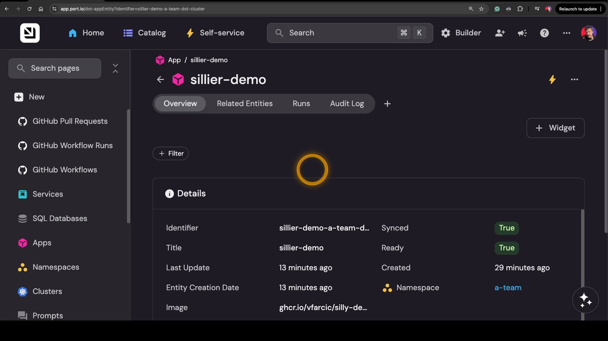
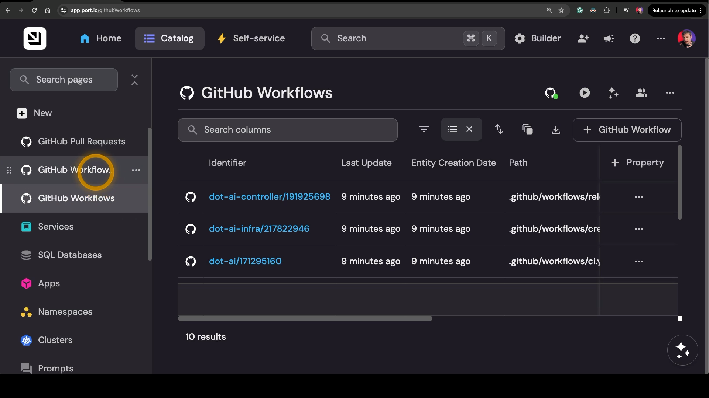
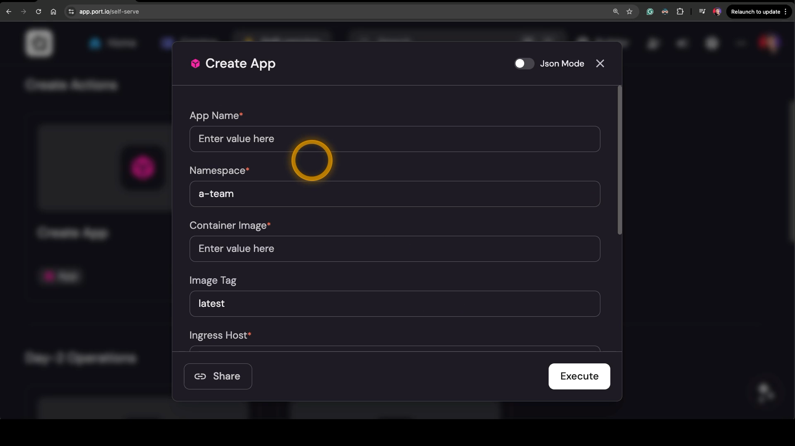

+++
title = 'Stop Setting Up Developer Portals Manually! (feat. Port MCP)'
date = 2025-02-05T14:30:00+00:00
draft = false
+++

Setting up a developer portal properly takes weeks. Blueprints, actions, workflows, GitOps integration, scorecards, relationships between entities. It's a massive undertaking, and most teams underestimate how much work it actually is.

I wanted to set up Port, my favorite commercial internal developer portal. If you're building an IDP, Port sits on top of it and gives you the UI layer. I've covered Port in depth before in [How To Build A UI For An Internal Developer Platform (IDP) With Port?](https://youtu.be/ro-h7tsp0qI) and [Mastering Developer Portals: Discover & Integrate API Schemas with Port](https://youtu.be/PV1sBiC85Yc), so I won't rehash what it does here.

Here's the situation. My Port account is completely empty. I destroyed everything so we can start fresh. I want to set up everything: blueprints, actions, workflows, GitOps integration, scorecards, the works. But I don't have weeks. I don't even have days.

Clicking through the web UI isn't an option. Writing endless JSON and figuring out dozens of API calls isn't either. Port is awesome, but it's not magic. It doesn't just materialize results out of thin air.

Or... maybe it does.

Let me show you. We'll start from the platform builder's perspective, then switch to how platform users can interact with it. 

<!--more-->



## Setup

> This demo is using Claude Code as the coding agent. With a few modification, it should work with any other coding agents like Cursor, GitHub Copilot, etc. If you do choose a different agent, you might have to change the location of slash commands (currently in the `.claude/commands` directory) and the MCP configuration (current in the `.mcp.json` file).

> Register in https://port.io.

> Please watch the [GitHub CLI (gh) - How to manage repositories more efficiently](https://youtu.be/BII6ZY2Rnlc) video if you are not familiar with GitHub CLI.

```sh
gh repo fork vfarcic/port-ai-demo --clone --remote

cd port-ai-demo

gh repo set-default
```

> Select the fork as the default repository

> Make sure that Docker is up-and-running. We'll use it to create a KinD cluster.

> Watch [Nix for Everyone: Unleash Devbox for Simplified Development](https://youtu.be/WiFLtcBvGMU) if you are not familiar with Devbox. Alternatively, you can skip Devbox and install all the tools listed in `devbox.json` yourself.

```sh
devbox shell
```

> Open https://app.port.io in a browser, click on `...` in the top-right menu, and select `Credentials`.

> Replace `[...]` with Client ID in the command that follows.

```sh
export PORT_CLIENT_ID=[...]
```

> Replace `[...]` with Client Secret in the command that follows.

```sh
export PORT_CLIENT_SECRET=[...]

./dot.nu setup

source .env

claude
```

## Port for Platform Engineers

I created a prompt called `port-setup` with instructions for what I want in Port. I'll show you the prompt itself later. For now, just watch what happens when I run it.

[user]
```text
/port-setup.md
```

I'll fast-forward through this since the whole process takes a few minutes.

*The output is as follows (trimmed for brevity).*

[agent]
```text
⏺ I'll help you set up Port integrations. Let me start by discovering your environment.

⏺ Bash(kubectl get namespace argocd...)
⏺ Bash(kubectl get namespace flux-system...)
⏺ Bash(kubectl get crd externalsecrets.external-secrets.io...)
⏺ Bash(which kubectl && which helm && which gh)
...
⏺ port-vscode-eu - List Blueprints (MCP)
⏺ port-vscode-eu - List Integrations (MCP)
⏺ port-vscode-eu - Get Integration (MCP)(integrationIdentifier: "36245736")
⏺ Bash(kubectl api-resources...)
⏺ Bash(kubectl get crds...)
⏺ Bash(kubectl get crd apps.devopstoolkit.live...)
...
⏺ Excellent! I now have a complete picture of your environment. Let me summarize and confirm before proceeding:

 Environment Summary

 | Component          | Details                                   |
 |--------------------|-------------------------------------------|
 | GitOps             | ArgoCD (apps synced from apps/ directory) |
 | Secrets            | Direct kubectl create secret (no ESO)     |
 | Manifest Directory | apps/                                     |
 | GitHub Repo        | devopsparadox/port-ai-demo                |
 | GitHub Integration | Already installed (ID: 36245736)          |
 | K8s Exporter       | Not yet installed                         |

 Custom CRDs Detected:
 - apps.devopstoolkit.live
 - sqls.devopstoolkit.live

Do you want to proceed with setting up the K8s Exporter with these blueprints?
```

It discovers my environment first, checking what GitOps tool I'm using, whether External Secrets Operator is installed, and what tools are available. It also calls Port's MCP to list existing blueprints and integrations, but so far that's just reconnaissance. The real MCP action is about to start.

[user]
```
Include cluster, namespace, apps.devopstoolkit.live, and sqls.devopstoolkit.live.
```

I told it which resources I want to track: clusters, namespaces, and my two custom CRDs for apps and databases.

*The output continues (trimmed for brevity).*

[agent]
```
⏺ Part 1: Kubernetes Exporter Setup

⏺ Bash(kubectl create namespace port-k8s-exporter...)
⏺ Bash(kubectl create secret generic port-credentials...)
⏺ port-vscode-eu - Create Blueprint (MCP)(identifier: "cluster"...)
⏺ port-vscode-eu - Create Blueprint (MCP)(identifier: "namespace"...)
⏺ port-vscode-eu - Create Blueprint (MCP)(identifier: "dot-app"...)
⏺ port-vscode-eu - Create Blueprint (MCP)(identifier: "dot-sql"...)
...
⏺ Write(apps/port-k8s-exporter.yaml)
⏺ port-vscode-eu - Create Entity (MCP)(blueprintIdentifier: "cluster"...)
⏺ Bash(git add... && git commit... && git push)
...
⏺ port-vscode-eu - List Entities (MCP)(blueprintIdentifier: "namespace"...)
⏺ port-vscode-eu - List Entities (MCP)(blueprintIdentifier: "dot-app"...)
⏺ port-vscode-eu - List Entities (MCP)(blueprintIdentifier: "dot-sql"...)

⏺ Part 1 Complete ✓
  - Namespaces: 6 entities
  - Apps: 2 entities
  - SQL Databases: 1 entity
```

It creates the blueprints I asked for using Port's `Create Blueprint` MCP tool. It deploys the Kubernetes exporter through ArgoCD and creates a cluster entity with the `Create Entity` tool.

Then it verifies everything synced correctly using the `List Entities` tool. All through the MCP.

*The output continues (trimmed for brevity).*

[agent]
```
⏺ Part 2: GitHub Integration

⏺ port-vscode-eu - Get Integration Kinds with Examples (MCP)(integrationIdentifier: "36245736")
⏺ port-vscode-eu - Get Integration (MCP)(integrationIdentifier: "101476463")
⏺ port-vscode-eu - Get Blueprint (MCP)(identifier: "githubPullRequest")
⏺ port-vscode-eu - Get Blueprint (MCP)(identifier: "githubWorkflow")
⏺ port-vscode-eu - Get Blueprint (MCP)(identifier: "githubWorkflowRun")
...
⏺ port-vscode-eu - Create Blueprint (MCP)(identifier: "service"...)
⏺ port-vscode-eu - Create Blueprint (MCP)(identifier: "githubWorkflow"...)
⏺ port-vscode-eu - Create Blueprint (MCP)(identifier: "githubWorkflowRun"...)
⏺ port-vscode-eu - Create Blueprint (MCP)(identifier: "githubPullRequest"...)
...
⏺ Bash(curl -s -X PATCH "https://api.getport.io/v1/integration/101476463"...)
...
⏺ port-vscode-eu - List Entities (MCP)(blueprintIdentifier: "githubWorkflow"...)
⏺ port-vscode-eu - List Entities (MCP)(blueprintIdentifier: "githubPullRequest"...)
⏺ port-vscode-eu - List Entities (MCP)(blueprintIdentifier: "githubWorkflowRun"...)

⏺ Part 2 Complete ✓
  - Workflows: 10 entities
  - Pull Requests: 5+ entities
  - Workflow Runs: 5+ entities
```

It checks existing integrations using `Get Integration` and `Get Integration Kinds with Examples`, then uses `Get Blueprint` to see which GitHub blueprints exist. Since they don't, it creates them with `Create Blueprint`.

Here's something interesting: there's no MCP tool to trigger a resync, so the agent falls back to calling Port's REST API directly with curl. It works, but it shows the MCP doesn't cover everything yet.

Finally, it verifies the sync with `List Entities`.

*The output continues (trimmed for brevity).*

[agent]
```
⏺ Part 3: Self-Service Actions for CRDs

⏺ Bash(gh secret set PORT_CLIENT_ID...)
⏺ Bash(gh secret set PORT_CLIENT_SECRET...)
⏺ Write(.github/workflows/manage-dot-app.yaml)
⏺ Write(.github/workflows/manage-dot-sql.yaml)
⏺ Bash(git add... && git commit... && git push)
...
⏺ port-vscode-eu - Create Action (MCP)(action: {"identifier":"create-dot-app"...})
⏺ port-vscode-eu - Create Action (MCP)(action: {"identifier":"update-dot-app"...})
⏺ port-vscode-eu - Create Action (MCP)(action: {"identifier":"delete-dot-app"...})
⏺ port-vscode-eu - Create Action (MCP)(action: {"identifier":"create-dot-sql"...})
⏺ port-vscode-eu - Create Action (MCP)(action: {"identifier":"update-dot-sql"...})
⏺ port-vscode-eu - Create Action (MCP)(action: {"identifier":"delete-dot-sql"...})

⏺ Setup Complete!

  Part 1: Kubernetes Exporter ✓
  Part 2: GitHub Integration ✓
  Part 3: Self-Service Actions ✓
```

For the self-service actions, it first creates GitHub workflows that will handle the actual resource creation.

Then it uses Port's `Create Action` tool to register six self-service actions: create, update, and delete for both apps and databases. Each action is wired to trigger the corresponding GitHub workflow.

That's the full setup, done through MCP calls.

Here's the proof. Everything we just created through AI is now in Port, ready for platform users to interact with through the web UI or any other interface.

The blueprints are there.

The apps and their details are in the catalog.



The databases are there too.

So are the namespaces.

GitHub workflows, workflow runs, and pull requests are all synced.



And the self-service actions are ready to use.



How did all that happen? How was all that created? Did AI all of a sudden become very smart and clairvoyant? Did I write thousands of lines of detailed instructions in the prompt? Nope.

Port folks understood the value they possess. All data flows into their portal and they have an extensive API. Those two, combined with taking AI seriously, resulted in agents that actually work.

We can access agents from their Web UI, from Slack, from n8n, and a few other places. I could not care less about those. I'm a software engineer. I don't write code and perform operations through a Web UI, nor through Slack, nor through any of those. I use terminals and IDEs, so it was natural for me to try it out from Claude Code.

What we just saw is only scratching the surface. Port's MCP has a lot more to offer...

[user]
```text
List all Port MCP tools.
```

[agent]
```text
⏺ Here are all the Port MCP tools available:

  Blueprints

  - mcp__port-vscode-eu__list_blueprints - Retrieve all blueprints in your organization
  - mcp__port-vscode-eu__get_blueprint - Get a specific blueprint by identifier
  - mcp__port-vscode-eu__create_blueprint - Create a new blueprint
  - mcp__port-vscode-eu__update_blueprint - Update an existing blueprint
  - mcp__port-vscode-eu__delete_blueprint - Delete a blueprint

  Entities

  - mcp__port-vscode-eu__list_entities - Search and retrieve entities with filtering, sorting, and pagination
  - mcp__port-vscode-eu__count_entities - Count entities matching filters without retrieving data
  - mcp__port-vscode-eu__get_entities_by_identifiers - Get specific entities by their identifiers
  - mcp__port-vscode-eu__create_entity - Create a new entity
  - mcp__port-vscode-eu__update_entity - Update an existing entity
  - mcp__port-vscode-eu__delete_entity - Delete an entity

  Scorecards

  - mcp__port-vscode-eu__get_scorecards - Retrieve all scorecards
  - mcp__port-vscode-eu__get_scorecard - Get a specific scorecard by identifier
  - mcp__port-vscode-eu__create_scorecard - Create a new scorecard
  - mcp__port-vscode-eu__update_scorecard - Update an existing scorecard
  - mcp__port-vscode-eu__delete_scorecard - Delete a scorecard

  Actions

  - mcp__port-vscode-eu__list_actions - Get all actions (self-service or automation)
  - mcp__port-vscode-eu__get_action - Get specific action details and input schema
  - mcp__port-vscode-eu__create_action - Create a new action
  - mcp__port-vscode-eu__update_action - Update an existing action
  - mcp__port-vscode-eu__delete_action - Delete an action
  - mcp__port-vscode-eu__run_action - Execute an action
  - mcp__port-vscode-eu__track_action_run - Track action execution status

  Integrations

  - mcp__port-vscode-eu__list_integrations - Retrieve all integrations
  - mcp__port-vscode-eu__get_integration - Get a single integration by identifier
  - mcp__port-vscode-eu__get_integration_sync_metrics - Fetch sync metrics for an integration
  - mcp__port-vscode-eu__get_integration_event_logs - Fetch event logs for an integration
  - mcp__port-vscode-eu__get_integration_kinds_with_examples - Get data types an integration ingests with examples
  - mcp__port-vscode-eu__test_integration_mapping - Test integration mapping against raw data

  User & Knowledge

  - mcp__port-vscode-eu__describe_user_details - Get current user info, organization, and team membership
  - mcp__port-vscode-eu__search_port_knowledge_sources - Semantic search over Port documentation

  Total: 27 tools
```

That's twenty-seven tools covering blueprints, entities, scorecards, actions, integrations, and more. Port's MCP lets us do almost everything we'd need.

The downside? There are too many tools, and many have longer descriptions than they should. As a result, Port's MCP occupies a big chunk of the context window.

Still, impressive coverage.

That was the platform engineer perspective. Now let's switch to platform users.

## Port for Platform Users

Users can interact with Port through the web UI, Slack, or any other interface. But a coding agent like Claude Code or Cursor combined with Port's MCP? That's a powerful combination.

Setting it up was easy. Let's see how beneficial it is to use.

[user]
```text
What is the status of the silly-demo app in Port?
```

[agent]
```text
⏺ Here's the status of the silly-demo app in Port:

  | Property  | Value                               |
  |-----------|-------------------------------------|
  | Status    | ✅ Ready                        |
  | Synced    | ✅ True                         |
  | Image     | ghcr.io/vfarcic/silly-demo          |
  | Tag       | v1.5.235                            |
  | Host      | https://silly-demo.devopstoolkit.ai |
  | Port      | 8080                                |
  | Scaling   | Enabled (min: 2, max: 5)            |
  | Namespace | a-team                              |
  | Cluster   | dot-cluster                         |
  | Created   | 2025-12-28T22:54:32Z                |

  The app is healthy - both ready and synced properties show True, indicating the application is running properly and synchronized with the desired state.
```

I asked about app status, and got the info instantly. No clicking through UIs, no navigating dashboards. Just ask and receive.

Now let's try creating something.

[user]
```text
Create a Database in Port. Include all the fields.
```

[agent]
```text
⏺ I found the SQL Database blueprint. It has the following fields that need values:

───────────────────────────────────────────────────────────────────────────────────────
←  ☐ Name  ☐ Provider  ☐ Size  ☐ Region  ✔ Submit  →

What should be the database identifier and title?

❯ 1. my-database
     Use 'my-database' as identifier and title
  2. production-db
     Use 'production-db' as identifier and title
  3. app-database
     Use 'app-database' as identifier and title
  4. Type something.

Enter to select · Tab/Arrow keys to navigate · Esc to cancel
```

The agent found the blueprint and is guiding me through each field interactively. It's like a form, but in my terminal.

If I fill it out, that would execute one of the Port actions we created earlier. That action triggers a GitHub Actions workflow, which creates a manifest in the repo. Argo CD then syncs it to the cluster. That whole chain was set up earlier.

From the user's perspective? Just ask to create a database, answer a few questions, and watch the magic happen.

> Press the `escape` key to cancel creation of a database.

> Press `ctrl+c` twice to exit Claude Code

## The Prompt Behind It

How did all this work so well? Here's the prompt I wrote for the Port setup.

```sh
cat .claude/commands/port-setup.md
```

The output is as follows (truncated for brevity).

~~~md
# Setup Port Integrations

Set up Port integrations to sync Kubernetes resources and GitHub Actions to Port.io.

## Prerequisites

Check the following and instruct the user to install/configure if missing:

- **kubectl** - installed and configured with cluster access
- **helm** - installed (for checking chart versions)
- **gh** - GitHub CLI installed and authenticated
- **Environment variables** set:
  - `PORT_CLIENT_ID`
  - `PORT_CLIENT_SECRET`

## General Guidelines

- **Always check latest versions** of third-party tools (Helm charts, GitHub Actions, etc.) before creating manifests. Use `helm search repo` or check the official documentation.
- **Consult Port MCP tools** when in doubt - use them to explore existing blueprints, entities, actions, and integrations.
- **Validate each step** before moving to the next - verify resources are created, synced, and working as expected.
- **User actions vs automated**: Some steps require user action (marked with "User action required") - present these as instructions, then **STOP and wait for user confirmation** before proceeding to the next step.

---

# Step 0: Discover Environment

Before starting, discover what tools are available and gather configuration:
...
~~~

The main gist? Use Port MCP to explore what's available and act accordingly. The MCP handles both discovery and operations.

It was a relatively small effort on my part. The glory goes to the MCP.

## Port MCP: The Good and Bad

Here's the takeaway. Capable models and coding agents need the right context to produce good results. We saw that in the simple prompt I wrote, but even more in all the context Port MCP provided. Give an LLM the right context, and it can instruct the agent to do the right things.

The end result is impressive. I got almost everything I needed, and it was almost 100% correct. Not perfect, but close.

I think Port gets it. They understand how to combine AI the right way with their product, which was already built in a way that makes it easy to put AI on top of. It's been a while since I've been this impressed with a non-AI company adopting AI this well. Port was awesome before. Now it's amazing.

That said, there are a few issues I hope Port will address soon. They don't make it bad, but fixing them would make it even better.

**Cons:**
- No intelligence
- Context size
- No auto-discovery
- Missing tools
- Custom prompts

Port's MCP has **no intelligence**. There's no agent with a proper system prompt or dynamic context. So getting good results requires understanding Port well enough to write effective prompts. I could do it because I know Port. A newcomer would struggle. If Port added that intelligence layer, even newbies could get great results out of the box.

The **context size** of Port MCP tools is too big.

There's **no auto-discovery**. You have to manually create blueprints for Kubernetes resources beyond the few baked in, and manually define relationships. It would be great if Port dynamically discovered these by examining `ownerReferences`.

There are **missing tools** like `update_integration`. Fortunately, AI can fall back to Port's API.

**Custom prompts** served through the MCP is a great idea. However, I did not show it in the demo because I feel that Port went the wrong way with prompts. We need to create blueprints, and actions, and GitHub Actions. AI gets easily confused. It's complicated for no good reason. Actually... The reason is obvious. Port tried to fit prompts into their existing data model so we have markdown that is transformed through GitHub Actions to Port's Json format, only to be transformed later on again inside the MCP. It's overengineered mainly to fit Port's data model rather than thinking "what is the best user experience and the easiest way to do it". It's a good idea with bad execution mainly because Port chose to stick prompts into their existing model. A good design would be "here's my git repo with prompts, serve them as they are."

**Pros:**
- Single source of truth
- API investment
- Dynamic
- Custom prompts

Port's data lake acts as a **single source of truth** for everything: knowledge base, operations, all of it.

Port's **API investment** paid off. I doubt many were using it directly, until now that agents are using it through the MCP. I just wish all API endpoints were available through the MCP. They hopefully will be soon.

The MCP is **dynamic**, adapting based on blueprints, actions, and what's configured.

The addition of **custom prompts** served through the MCP is a nice cherry on top of an already delicious cake. We can add our own prompts that will be served through Port's MCP. That solves a few problems. To begin with, there's no need to worry about each agent expecting prompts in a different directory, and then there is distribution which makes it easy to have those prompts in any project. Nevertheles, while the idea is good, the execution isn't. Hence, that feature is both in pros and cons. It's a good feature with bad design.

Overall... I'm impressed. But I see one big gap in Port's approach (apart from those I alerady mentioned).

The context lake is great. It contains all the data ingested into Port, and now all that data is accessible to AI. But that's only a fraction of the data that matters. Much more detailed and more valuable data sits in Kubernetes, in AWS, GCP, Azure, in GitHub, and elsewhere.

It would be insane to ingest all of it into Port. Kubernetes alone would be too much, hyperscalers would ground it to a halt. But... What if Port gave hints to agents? It knows where data comes from and it could provide that info to agents with additional instructions. Imagine the MCP returning something like "check this Kubernetes cluster and those resourecs for more info" or "look at this AWS account for details." Agents like Claude Code or Cursor could then connect the dots and provide much more accurate information. Connecting Port's context lake with actual runtime data would be a winner.

If Port did that, it wouldn't just be a portal for simple observability and operations, as it is now. It would be a portal to everything. That would give AI superpowers way beyond what it can do now.

Overal, if you're building an IDP and need a portal, give Port a try. And if you're already using Port, connect the MCP to your coding agent. It takes only a few minutes. It could be better, much better, but, when compared with other solutions, it is awesome.

## Destroy

```sh
claude
```

[user]
```text
/port-destroy.md
```

> Press `ctrl+c` twice to exist Claude Code.

```sh
./dot.nu destroy

exit
```

