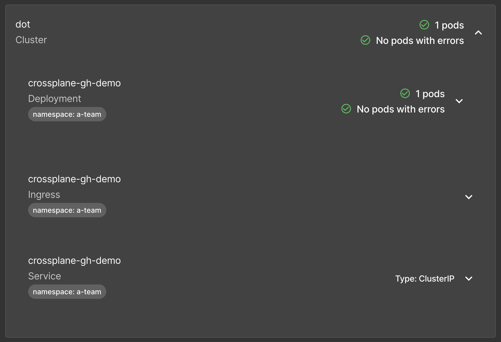

+++
title = 'Surviving Backstage with Roadie: A Developer Nightmare or Dream?'
date = 2024-09-09T15:00:00+00:00
draft = false
+++

Today I want to talk about **potentially the most important tool in your toolbox**. I want to talk about a tool that might **enable everyone** in your organization **to be more productive and self-sufficient**. Yet, the tool I want to talk about might win an award for the **least user-friendly**, **hardest to maintain**, and, generally speaking, a tool that might cause you to have **nightmares** and spend a small fortune on a psychologist.

It's a tool that I recognize as being **one of the most impactful tools** which, honestly, I do not like at all, yet most of those who use it swear by it.

Did you guess what that tool is?

<!--more-->



It's [Backstage](https://backstage.io/)!


"Why is it potentially the most important tool?", you might ask.

Well... It is **highly extensible front-end** that can serve as a portal to your internal system. It is one of the most contributed and most used projects in the CNCF landscape. Almost everyone is adopting it. It's ability to represent almost anything in a user interface that looks like **something teleported from 90s** is amazing.

Yet, I started the discourse by saying that it will give you nightmares and result in additional sessions with your psychologist. How can that be? How can a tool be both amazing and horrible at the same time?

Well... It's a project that **does not publish binaries**. There is **no container image**, there is **no Helm chart**, or any other installation method other than "**Here's source code** written in TypeScript. Do with it what you can, spend eternity reading the docs just to be able to run it somehow. Learn TypeScript if you don't know it already."

Once you figure out how to deploy it, you'll be faced with constant **maintenance issues**. If, for example, you're using your own image, which is a reasonable assumption since there is no official image, you'll have to rebuild it every time you decide to add a plugin and, given that almost everything is a plugin, you'll be doing that fairly often. You might find an unofficial Helm chart only to realize that you'll still need to build your own images while, at the same time, trying to figure out why the chart itself does not work and why default values happen to be useless.

Imagine being in a restaurant ordering a steak with a side of potatoes and a beer. Imagine that the restaurant you're in happen to be recommended by everyone and that it has five star reviews. Yet, after a while, your waiter invites you to the kitchen saying: "Here you go. There's the meet. Cut it and grill it. Take those potatoes, peel them, boil them, or fry them or do whatever you want to do with them. We are not opinionated. Also, here's yeast and other ingredients for the beer. Prepare everything, brew it, ferment it, bottle it. Once you're done, you can go back to your table and have a dinner. It might be great, or it might be the worst thing you ever tried. It's up to you. You're cooking and brewing. We're not opinionated. You're in control, even if that results in poisoning."

That's the experience you can expect with Backstage. It might end up being the best and the most important tool you ever used, or it might end up in a disaster. It's up to you. It all depends on the level of masochism you can endure. The bigger tollerance for pain, the more pleasure.


Yet, today I decided to take one of my projects and put Backstage on top of it. However, since I am not a masochist, I will not use Backstage directly but [Roadie](https://roadie.io). It is **Backstage as a service** that solves some, but not all, inherent problems with Backstage. Someone else is making sure it's running, plugins can be easily added, there are plugins otherwise not available to Backstage, and so on and so forth.

Now, that does not mean that you have to use Roadie as well. As a matter of fact, I challenge you to do everything I will do today directly in Backstage, and let me know how it went.

Here's the important note though. This is not a review of Backstage or Roadie. This is something completely different. This is me trying to add to Backstage or, to be more precise, Roadie, with everything my project needs and, by doing that, explore some of the benefits as well as challenges using Backstage (or Roadie).

With that being said, let's see what the project is.

## The Project

My requirements are relatively simple. I have to create repositories that contain everything developers need to work on specific types of applications. There should be source code of whichever language developer chooses, there should be workflows that build binaries and images, run tests, and do whatever else needs to be done. Each release of the application should be deployed to a cluster using Argo CD (or Flux). There should be an option to have a database attached to the application.

What I want from Backstage is to enable us to fill in fields that will generate all that and to visualize everything. A developer should be able to see the status of the application and the optional database together with all the relevant information. There should be a way to see and interact with pull requests and with workflows or pipeline runs.

There are probably a few other requirements I forgot. We'll get to those as we advance through our attempt to do what needs to be done.

## Setup

> Request a free [Roadie trial](https://roadie.io). Alternatively, you can use open source Backstage to accomplish the same result, but, in that case, some of the instructions might need to be tweaked.

> Watch the [GitHub CLI (gh) - How to manage repositories more efficiently](https://youtu.be/BII6ZY2Rnlc) video if you are not familiar with GitHub CLI.

```sh
gh repo fork vfarcic/crossplane-gh --clone --remote

cd crossplane-gh

gh repo set-default
```

> Select the fork as the default repository

> Make sure that Docker is up-and-running. We'll use it to create a KinD cluster.

> Watch [Nix for Everyone: Unleash Devbox for Simplified Development](https://youtu.be/WiFLtcBvGMU) if you are not familiar with Devbox. Alternatively, you can skip Devbox and install all the tools listed in `devbox.json` yourself.

```sh
devbox shell
```

> Replace `[...]` with `eks`, `gke`, or `aks` depending on which type of a Kubernetes cluster you'd like to use.

```sh
export CLUSTER_TYPE=[...]
```

> Replace `[...]` with `aws`, `google`, or `azure` depending on which hyperscaler you'd like to use.

```sh
export HYPERSCALER=[...]

chmod +x setup.sh

./setup.sh

source .env
```

## Backstage with Roadie in Action

I already have a repository with everything needed to do what needs to be done so the challenge is mostly focused on Backstage and Roadie.

The first step should be to add the current repository to Roadie's catalog.

Here's the catalog definition.

```sh
cat backstage/catalog-info.yaml
```

The output is as follows.

```yaml
apiVersion: backstage.io/v1alpha1
kind: Component
metadata:
  name: dot-github-devopsparadox
  description: Silly description of dot-github
  annotations:
    github.com/project-slug: devopsparadox/crossplane-gh
    backstage.io/kubernetes-id: dot
    backstage.io/kubernetes-namespace: git-repos
    backstage.io/kubernetes-label-selector: app.kubernetes.io/name=dot-github
spec:
  type: infra
  lifecycle: production
  owner: devopsparadox/crossplane-gh
  system: DevOpsCatalog
```

It should be self-explanatory. The `name` and the `description` and informative only. The key is in the `annotations` that specify the `project-slug` and the `id`, `namespace` and `label-selector` that will help Roadie associate it with resources in the cluster where it will be running.

Further on is the `spec` which also, more or less, serves only informative purpose.

Now, we could add that specific catalog from the UI. We won't do that. Instead, we'll instruct Roadie to automatically fetch service catalog and some other files we'll use later. As a matter of fact, Roadie does that automatically, but it assumes that those files are in repository root. Since, in this case, it is in the *backstage* directory, we'll have to tell Roadie that it should look for it there as well, no matter which repository we're using.

We'll do that by clicking `Administration` from the left-hand menu in Roadie and choosing `GitHub` from the `Integrations` section. Over there, we'll select `Manage App Installations` and add GitHub organization where we forked the repo.

Roadie should have added an entry in the `Automatically add and remove entities from your Catalog` section but, as I already metioned, that might not be enough since it assumes that the catalog definition is in the root of repositories while we need it to be in the `backstage` directory as well.

We'll fix that by clicking the `+` sign, selecting the organization, and adding `/*/blob/-/backstage/*.yaml` to the `Path matcher` field.

> 1. Click `Administration` from the left-hand menu in Roadie and choose `GitHub` from the `Integrations` section.
> 2. Open `Manage App Installations` and add GitHub organization where you forked the repo.
> 3. Click `+` in the `Automatically add and remove entities from your Catalog` section. Select the organization, add `/*/blob/-/backstage/*.yaml` to the `Path matcher` field, and click the `Save` button.


That's it, at least when the catalog in its most basic form is concerned. From now on, we should see a component from every repository that has *catalog-info.yaml* file either in the root or the *backstage* directory.

We can confirm that by opening `Catalog` from the left-hand menu and... Lo and behold! The `dot-github-*` component is already in the catalog.

Let's select it.

> 1. Open `Catalog` from the left-hand menu in Roadie and select `dot-github-*` component.


So far, we haven't accomplished much more than seeing some static information related to this repository. It contains information hard-coded in the *catalog-info.yaml* file. Let's spice it up a bit.

This is a manifest that I'd like to push to the Git repo.

```sh
cat examples/repo-$HYPERSCALER-backstage.yaml
```

The output is as follows.

> Some outputs in this post are specific to Google Cloud. If you follow along, you'll see outputs based on the hyperscaler you chose.

```yaml
---
apiVersion: devopstoolkitseries.com/v1alpha1
kind: GitHubClaim
metadata:
  name: crossplane-gh-demo
spec:
  id: crossplane-gh-demo
  parameters:
    public: true
    registry: ttl.sh
    app:
      language: go
      host: my-repo.acme.com
      namespace: a-team
    db:
      enabled: true
      provider: google
      version: "13"
    repo:
      user: devopsparadox
    gitops:
      enabled: true
      user: devopsparadox
      repo: crossplane-gh
    backstage:
      enabled: true
```

If that `GitHubClaim` is applied to the cluster, Crossplane will create  a `public` repo, source code for an application written in `go`, a corresponding `db`, and it should be synchronized into the cluster using `gitops` or, to be more specific, Argo CD. That public repo will also get a pull request, GitHub Actions workflows, and quite a few other things.

All that is possible through Crossplane which is not the subject of this video.

Now, we could write such YAML directly and push it to Git, but that might not be the best option for everyone. Some people like graphical user interfaces and might benefit from a form in Roadie that will allow them to fill in some fields and, upon pressing a button, generate such a manifest and push it to Git.

In other words, I want Roadie to do the same operations I would normally do without it.

To accomplish that, we need to create a Template. I already prepared one, so let's take a look at it.

```sh
cat backstage/catalog-template.yaml
```

The output is as follows.

```yaml
apiVersion: scaffolder.backstage.io/v1beta3
kind: Template
metadata:
  name: dot-github-template-devopsparadox
  title: dot-github-template-devopsparadox
  description: Create and Manage GitHub repositories
spec:
  owner: devopsparadox/crossplane-gh
  type: service
  parameters:
    - title: Service Definition
      required:
        - name
      properties:
        name:
          type: string
        public:
          type: string
          default: "true"
          enum: ["true", "false"]
        registry:
          type: string
          default: ttl.sh
        app:
          type: object
          properties:
            language:
              type: string
              default: go
              enum: ["go", "js"]
            host:
              type: string
              default: my-repo.acme.com
            namespace:
              type: string
              default: a-team
        db:
          type: object
          properties:
            enabled:
              type: string
              default: "true"
              enum: ["true", "false"]
            provider:
              type: string
              default: aws
              enum: ["aws", "azure", "google"]
            version:
              type: string
              default: "16.2"
        repo:
          type: object
          properties:
            user:
              type: string
              default: devopsparadox
        gitops:
          type: object
          properties:
            enabled:
              type: string
              default: "true"
              pattern: '^(true|false)*$'
            user:
              type: string
              default: devopsparadox
            repo:
              type: string
              default: crossplane-gh
  steps:
    - id: log-message
      name: Log Message
      action: debug:log
      input:
        message: 'Hello, ${{ parameters.gitops.user }}/${{ parameters.gitops.repo }}!'
    - id: fetch-template
      action: fetch:template
      name: Generate manifest
      input:
        url: ./backstage-templates
        targetPath: ./git-repos
        values:
          name: ${{ parameters.name }}
          public: ${{ parameters.public }}
          registry: ${{ parameters.registry }}
          app:
            language: ${{ parameters.app.language }}
            host: ${{ parameters.app.host }}
            namespace: ${{ parameters.app.namespace }}
          db:
            enabled: ${{ parameters.db.enabled }}
            provider: ${{ parameters.db.provider }}
            version: ${{ parameters.db.version }}
          repo:
            user: ${{ parameters.repo.user }}
          gitops:
            enabled: ${{ parameters.gitops.enabled }}
            user: ${{ parameters.gitops.user }}
            repo: ${{ parameters.gitops.repo }}
    - id: rename-manifest
      action: fs:rename
      name: Rename files
      input:
        files:
          - from: ./git-repos/manifest.yaml
            to: ./git-repos/${{ parameters.name }}.yaml
    - id: create-pull-request
      action: publish:github:pull-request
      name: Create a pull request
      input:
        repoUrl: github.com?repo=${{ parameters.gitops.repo }}&owner=${{ parameters.gitops.user }}
        branchName: init-${{ parameters.name }}
        title: "Init: ${{ parameters.name }} app manifest"
        description: This pull request creates or updates the ${{ parameters.name }} app manifest [skip ci]
```

The real action is happening in the `spec` section.

Over there, we have `parameters` and `steps`. Parameters are the definition of the form fields that should be available in Roadie while steps are actions that Roadie should execute when we submit the form.

Inside the `parameters` we are defining that there should be a `name` free-text string field, a `public` field that will be represented as a drop-down list with values `true` and `false`, the `registry` field with the default value `ttl.sh`, and so on and so forth.

I have two complaints with the *properties* section.

First, why isn't it based on the **OpenAPI Schema** spec? Why reinvent the wheel for something that is generating almost the same result as OpenAPI Schema, yet sufficiently different to prevent us from using OpenAPI Schema. As a matter of fact, I already have a very similar definition as that one since I created a Custom Resource Definition in my cluster. That CRD is based on OpenAPI Schema and, if Backstage would have done the same, I could reuse it instead of defining the same set of fields again.

The second complaint is that Backstage, as far as I know, cannot "discover" that schema. Since my Kubernetes cluster already has that CRD, Backstage could simply ask it for the schema and, if needed, convert it into its own format.

Now, to be clear, Backstage is flexible and one could, at least in theory, create a plugin that would discover schemas from APIs, be it Kubernetes or any other. It's doable, but it hasn't been done. That's a pity.

Then we have `steps`.

First we are writing a silly `Log Message`.

Then we are fetching  `template` files from the `backstage-templates` directory and putting them into `git-repos`. That's the location Argo CD is monitoring and waiting for new or updated manifests.

Before the template is moved to the `targetPath` it is transformed. If, for example, any of the files in that directory has a *\$\{\{ values.name \}\}* (`name`) it will be replaced with the value from the *name* (`${{ parameters.name }}`) field we specified in the *properties* section. The same goes for `public`, `registry`, `language`, and so on and so forth.

Next, there is the `rename` action that will rename the `manifest.yaml` template into the value of the `name` parameter. Assuming that a name one puts into the field is unique, that should also give us unique manifests.

Finally, `pull-request` will be created in the `gitops` repo.

Now, let's take a look at the `manifest.yaml` template referenced earlier.

```sh
cat backstage/backstage-templates/manifest.yaml
```

The output is as follows.

```yaml
---
apiVersion: devopstoolkitseries.com/v1alpha1
kind: GitHubClaim
metadata:
  name: ${{ values.name }}
spec:
  id: ${{ values.name }}
  parameters:
    public: ${{ values.public }}
    registry: ${{ values.registry }}
    app:
      language: ${{ values.app.language }}
      host: ${{ values.app.host }}
      namespace: ${{ values.app.namespace }}
    db:
      enabled: ${{ values.db.enabled }}
      provider: ${{ values.db.provider }}
      version: "${{ values.db.version }}"
    repo:
      user: ${{ values.repo.user }}
    gitops:
      enabled: ${{ values.gitops.enabled }}
      user: ${{ values.gitops.user }}
      repo: ${{ values.gitops.repo }}
    backstage:
      enabled: true
```

That's the same manifest as the one I said we should store in Git except that, this time, it has most of the values parametrized through `${{` and `}}`. That's all there is to it.

Let's add the template to Roadie... Actually, there is nothing to add. We already instructed Roadie to automatically add YAML files from the *backstage*  directory in any of the repos, so that template should also be available. That's one of the awesome features of Roadie. We do no need to manually add catalogs or templates. It finds them automatically from Git repos.

Since the template is already loaded to Roadie, we can proceed and use it.

We'll click the `CHOOSE` button in the `dot-github-template-*` template in Roadie.

Most of the fields already have sane defaults, so I'll focus only on those that might need to be changed. So, I'll type `crossplane-gh-demo` as the `name`, choose `google` as the `provider`, and type `13` as the version of PostgreSQL database server. All that's left is to click the `REVIEW` button, take a quick look whether everything looks okay, and finish with the `CREATE` button.

> 1. Open `Templates` from the left-hand menu in Roadie and click the `CHOOSE` button in the `dot-github-template-*` template.
> 2. Type `crossplane-gh-demo` as the `name`.
> 3. Choose the `provider`.
> 4. Type `16.2` as the version if the provider is `aws`, `13` if it's `google`, and `11` if it's `azure`.
> 5. Click the `REVIEW` button followed by `CREATE`.


That should have created the manifest based on our input and created a pull request. Right now, we cannot see that pull request in Roadie, but we can change that easily by adding the pull request plugin.

Let's go back to the `Catalog` and select `dot-github-*` component. Over there, we'll press the `+` sign to add a plugin. Since there are quite a few plugins available, we should probably search for it. I know that the one we're looking for is a GitHub plugin made by Roadie, so let's search for `github roadie` and... F\*\*k. That's a sh\*\*ty search. Shame on you Roadie for making the search mostly useless.

Let's change the strategy by simply searching for `github` and... There we go. The one we're looking for is called `Router`, so let's select that one and click the `CREATE AND RELOAD LAYOUT` button.

We should see the new tab `GITHUB PULL REQUESTS` with all the pull requests made in the associated repo. There's only one though, so the choice should be easy. We'll just click the PR `ID` and we can observe the files that were included in the pull request. That's the manifest that Roadie generated when we filled the form.

Let's do the only sensible thing one can do when reviewing a pull request; merge it without even taking a deeper look into it.

> 1. Open `Catalog` from the left-hand menu in Roadie and select `dot-github-*` component.
> 2. Click the `+` from the top menu.
> 3. Search for `github roadie`.
> 4. Search for `github`, select `Router`, and click the `CREATE AND RELOAD LAYOUT` button.
> 5. Select `GITHUB PULL REQUESTS` and click the PR `ID`.
> 6. Observe `Files changed` and merge the PR.


If everything works as expected, Argo CD should have detected the new manifest in the main branch and applied it to the cluster. Crossplane running in that cluster should have detected a new Claim and created managed resources. As a result, a new repository with source code, Kubernetes manifests, and a bunch of other fils should have been created in a separate branch and a PR based on that branch should be there as well.

*I won't go deeper into what's happening in the background and unrelated with Roadie and Backstage since that's not the subject of this video. If you're interested in what actually happened, please watch [Automate Everything: How One Manifest Powers Your Entire DevOps Pipeline](https://youtu.be/IEgXJEkjBZ0). It's a video based on the same project and goes into more details on how we can bootstrap new projects from Git repos all the way until an applicaiton and a databsase is running in production.*

What we will do is check the new repository and the pull request that was created in it. Normally, we should be able to see all that in Roadie but, since it is configured to look for specific files in the main branch, we cannot see it in Roadie, at least not until we merge the PR.

So, let's open the repository,...

```sh
gh repo view $GITHUB_OWNER/crossplane-gh-demo --web
```

...choose `Pull requests`, select the `Initial` PR, and follow the instructions in the description. I won't bore you with that part since, I'm sure, you can do the same on your own. Just do what the description says you should do.

> 1. Choose `Pull requests` from the top menu.
> 2. Select the `Initial` pull request.
> 3. Follow the instuctions in the description.

Now that we merged the PR to the mainline of the newly created repo and since, among other files, it contains *catalog-info.yaml*, Roadie should be able to auto-detect that repo and show us everything we should know about it.

So, let's open `Catalog` from the left-hand menu in Roadie and select `crossplane-gh-demo` component.

We can see mostly informative details about the component, which happens to be a repo. There's nothing new here.

> 1. Open `Catalog` from the left-hand menu in Roadie and select `crossplane-gh-demo` component.

What is new, at least within the context of this post, is the `CI/CD` link in the top menu. Actually, it was there all the time but we haven't used it. Let's see what we have in there.

We can see that two workflow runs were executed or are running right now. That's great since it helps us avoid going to GitHub itself to check the results of GitHub Actions. If we need more info about a specific workflow run, we can click on the `MESSAGE` and... Damn! That does not work, but, luckily, there is the `MORE INFO` button that can help us figure out what's wrong... Damn! That is pretty useless.

> 1. Select `CI/CD` from the top menu.
> 2. Click the `MESSAGE`.


*This is a message to Roadie... You have a great service. Do not let silly issues like that one change my mind. I know you can access my GitHub Actions since you are displaying the runs so it shouldn't be an issue with privileges and even if it is, I expect logs to point me into the right direction. "An unexpected error has occurred" message means nothing and showing which lines of code are producing errors is even more useless in a SaaS service where I don't have access to that code.*

So, as it is now, we can see workflow runs, but the links to actual runs do not work. I guess that's better than nothing.

Now that we saw that workflow runs were executed and assuming that Argo CD did its job and synchronized the manifest into the cluster and that Crossplane expanded it into application and database resources, we should be able to see what is running in my cluster. We could do that with *kubectl* or some other CLI or, even better, we can bring that information into Roadie. Since today's goal is to use Roadie and Backstage as the main interface for developers, we'll go with the latter option.

We can do that by adding the Kubernetes plugin to the catalog. To do that, first we need to configure Roadie to give it access to the cluster. We can do that by going back to `Administration` and choosing `Kubernetes` from the `Plugins` section. What comes next depends on the type of cluster one is running. In my case that's GKE in Google Cloud, so I'll just follow the instructions and, since that part is boring, fast-forward to the end where I `TEST DOT`, my cluster, `SAVE` the changes, `SAVE`, and `APPLY & RESTART`.

> 1. Click `Administration` from the left-hand menu in Roadie and choose `Kubernetes` from the `Plugins` section.
> 2. Configure your cluster using the instructions at https://roadie.io/docs/integrations/kubernetes/.


Now, that *APPLY & RESTART* button is just silly. I can't believe that someone designed a plugin-based system that needs to be restarted every time we add or modify a plugin. It's not 1999 any more. On the bright side, that's not fault of Roadie but Backstage itself. As a matter of fact, the *APPLY & RESTART* action is easier and faster than what we'd need to do if we're using Backstage directly. All in all, we have a silly design choice in Backstage and an excellent, yet not perfect, improvement done by Roadie.

Now that the Kubernetes plugin is configured, we can go back to the `Catalog` and select the `crossplane-gh-demo` component. Over there we can see the `KUBERNETES` tab added. If it's not there for you, add it just as you added the PR plugin.

> 1. Open `Catalog` from the left-hand menu in Roadie and select the `crossplane-gh-demo` component.
> 2. If the `KUBERNETES` tab is not already available, click the `+` from the top menu, search for `kubernetes` and click the `CREATE AND RELOAD LAYOUT` button.

Now we are faced with yet another silliness. The Kubernetes plugin has a few resource definitions hard-coded. We can visualize Pods, Deployments, and a few other resources but, as soon as we start using custom resources, we are getting blind. Whomever made that plugin seem not to be aware that there's more to Kubernetes than Pods, ReplicaSets, Deployments, Services, and Ingresses, that Kubernetes is dynamic, and, more importantly, that it should "discover" which resource definitions are available. It should just ask the cluster "what do you have?" That's one of the reasons why we use APIs. They are discoverable. Even if that's not an option, the plugin could ask me to specify myself which resources to observe.

That's, again, not Roadie's fault unless we start blaming them for not creating a better plugin that would replace the community plugin.

*Another message to Roadie folks... Kubernetes is widely used and it would be very beneficial if you'd create a better plugin to visualize Kubernetes resources.*

Okay... Let me ignore the sillyness of hard-coding which resources a Kubernetes cluster has and see what we'll get if we click the `KUBERNETES` tab that was just added.

Damn! That's just silly. Not only that the plugin hard-coded which resources are visualized but I can safely say that what is in front of me is the worst Kubernetes visualization I ever saw.



All in all, the Kubernetes plugin is almost useless. This is not Roadie's fault but simply issue with that and many other Backstage plugins. They are often half-baked and semi-useless.

So, if the Kubernetes plugin is of no use, we'd need to see what's going on in the cluster through CLIs and ignore Backstage.

For example, those are the resources Crossplane application claim created.

```sh
crossplane beta trace appclaim crossplane-gh-demo \
    --namespace a-team
```

The output is as follows.

```
NAME                                       SYNCED READY STATUS
AppClaim/crossplane-gh-demo (a-team)       True   False Waiting: Claim is waiting for composite resource to become Ready
└─ App/crossplane-gh-demo-jshr7            True   False Creating: Unready resources: crossplane-gh-demo
   ├─ Object/crossplane-gh-demo-deployment True   True  Available
   ├─ Object/crossplane-gh-demo-ingress    True   True  Available
   ├─ Object/crossplane-gh-demo-service    True   True  Available
   └─ ProviderConfig/crossplane-gh-demo    -      -
```

In turn, we can see what are underlying resources created from those Crossplane Managed resources.

```sh
kubectl --namespace a-team get all,ingresses
```

The output is as follows.

```
NAME                                   READY STATUS  RESTARTS AGE
pod/crossplane-gh-demo-dd69595c5-psq5d 1/1   Running 0        119s

NAME                       TYPE      CLUSTER-IP   EXTERNAL-IP PORT(S)  AGE
service/crossplane-gh-demo ClusterIP 10.96.72.189 <none>      8080/TCP 119s

NAME                               READY UP-TO-DATE AVAILABLE AGE
deployment.apps/crossplane-gh-demo 1/1   1          1         119s

NAME                                         DESIRED CURRENT READY AGE
replicaset.apps/crossplane-gh-demo-dd69595c5 1       1       1     119s

NAME                                         CLASS  HOSTS            ADDRESS PORTS AGE
ingress.networking.k8s.io/crossplane-gh-demo <none> my-repo.acme.com         80    119s
```

We also got a database claim, so let's confirm that it's working as expected.

```sh
crossplane beta trace sqlclaim crossplane-gh-demo-db \
    --namespace a-team
```

The output is as follows.

```
NAME                                           SYNCED READY STATUS
SQLClaim/crossplane-gh-demo-db (a-team)        True   True  Available
└─ SQL/crossplane-gh-demo-db-vscxp             True   True  Available
   ├─ ProviderConfig/crossplane-gh-demo-db-sql -      -       
   ├─ ProviderConfig/crossplane-gh-demo-db-sql -      -       
   ├─ Object/crossplane-gh-demo-db-secret      True   True  Available
   ├─ ProviderConfig/crossplane-gh-demo-db     -      -       
   ├─ DatabaseInstance/crossplane-gh-demo-db   True   True  Available
   └─ User/crossplane-gh-demo-db               True   True  Available
```

Those managed resources are managing resources in the chosen hyperscaler which, in my case, is Google Cloud.

What we saw so far only scratches the surface of what Backstage and Roadie can do. There's much more to it but, not enough time to explore it all. If you would like to know more about Backstage and/or Roadie, please let me know in the video comments.

For now, I have to say that Roadie is a pleasure to use. It is certainly much easier, more intuitive, and with less maintenance overhead than Backstage. I stronly recommend it.

Thank you for watching.
See you in the next one.
Cheers.

## Destroy

```sh
chmod +x destroy.sh

./destroy.sh
```

