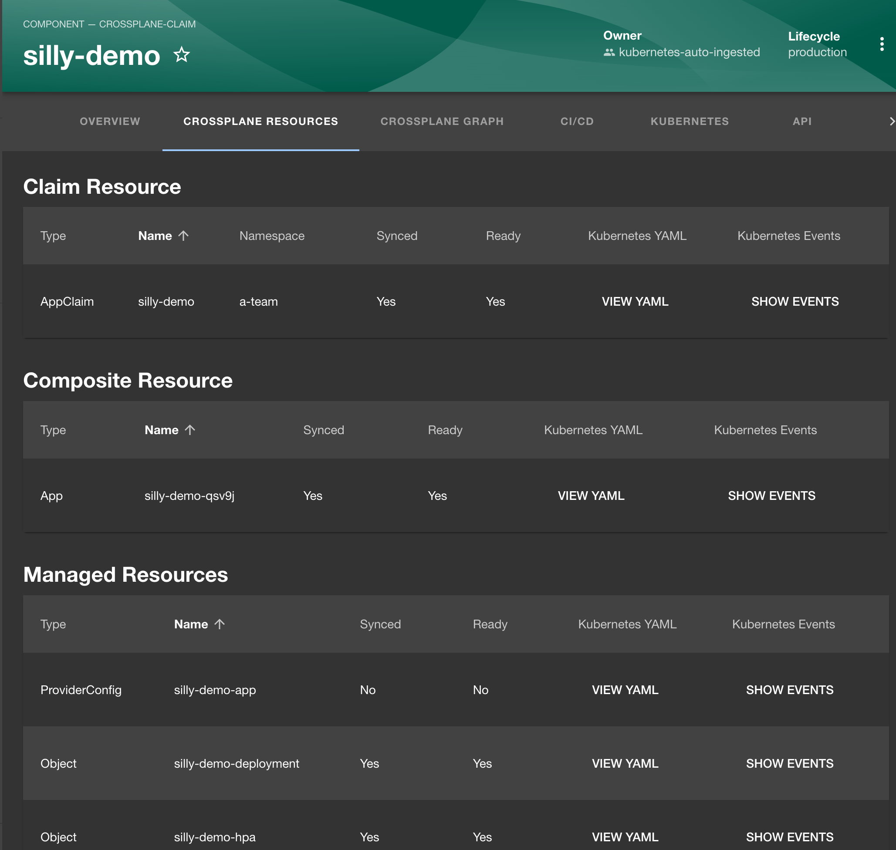

+++
title = 'Why I Changed My Mind About Backstage? A Brutally Honest Opinion'
date = 2025-02-03T15:00:00+00:00
draft = false
+++

I was **very negative towards Backstage**. Some of the architectural choices are, in my opinion, bad. The way to install plugins is just silly. The quality of most of the plugins is very low. The need to rebuild container image every time we make a change is something I thought we will never see again. And so on and so forth.

Now, however, my impressions about Backstage changed. Actually, that's not true. I still stand behind everything I said about it. What changed is the additional impression. Now **I think I get it.** Now I think I understand why Backstage makes sense, why it is one of the most contributed project and why it might make sense to adopt it even though it's bad.

<!--more-->



That additional impression can be attributed to Scott Rosenberg. He showed me what can be done relatively fast and that helped me see Backstage in the same light as Kubernetes. Even though both are very different, both might share the same trajectory. Backstage might be going down the same path and experiencing **the same phases as Kubernetes** did a while ago. 

Now, that might sound confusing. It makes no sense to compare Backstage to Kubernetes. They are different in every single way, yet, as we'll see later, they might share the same evolutionary trajectory. We'll get to that comparison later.

Right now, let's see how Scott made me see Backstage in a different light.

## Setup

```sh
git clone https://github.com/vfarcic/idp-full-demo

cd idp-full-demo

git pull

git fetch

git switch backstage
```

> Make sure that Docker is up-and-running. We'll use it to run Backstage as a Docker container.

> Watch [Nix for Everyone: Unleash Devbox for Simplified Development](https://youtu.be/WiFLtcBvGMU) if you are not familiar with Devbox. Alternatively, you can skip Devbox and install all the tools listed in `devbox.json` yourself.

```sh
devbox shell
```

> Watch [The Future of Shells with Nushell! Shell + Data + Programming Language](https://youtu.be/zoX_S6d-XU4) if you are not familiar with Nushell. Alternatively, you can inspect the `setup/kubernetes.nu` script and transform the instructions in it to Bash or ZShell if you prefer not to use that Nushell script.

```sh
chmod +x platform

platform setup backstage

source .env
```

## Backstage Setup and Configuration

Crossplane is my project so I had to check Scott's plugin.

> Open https://github.com/TeraSky-OSS/backstage-plugins in a browser.

Useless README... I should probably check the *plugins* directory... *crossplane-resources* is probably what I want... I should first install the *Kubernetes Ingestor* plugin, so let me check out that one first... I should add a few packages... Add them to the backend TypeScript index... Add a few things to the configuration... Go back to the *crossplane-resources* plugin... Add another package... Modify the app TypeScript index... A bit more configuration...

Got it!

After reading the docs in more detail, I got to work.

First, I had to set up all the prerequisites. Since I'm trying to make everything I do reproducible, I recorded everything in the Nushell script `platform`.

```sh
cat platform
```

The output is as follows (truncated for brevity).

```nu
#!/usr/bin/env nu
...
source scripts/backstage.nu
...
# Sets up the Backstage demo
def "main setup backstage" [] {

    rm --force .env

    let hyperscaler = main get hyperscaler
    
    let ingress_data = setup common --hyperscaler $hyperscaler

    let github_data = main get github

    (
        main apply argocd 
            --host_name $"argocd.($ingress_data.host)"
            --apply_apps false
            --ingress_class_name $ingress_data.class
    )

    kubectl apply --filename argocd/app.yaml

    main apply crossplane --db true --app true --github true

    open crossplane/app.yaml
        | upsert spec.parameters.image $"ghcr.io/vfarcic/silly-demo"
        | upsert spec.parameters.tag "1.4.342"
        | save crossplane/app.yaml --force

    (
        gh repo create $"($github_data.user)/idp-full-app"
            --public --add-readme
    )

    gh repo clone $"($github_data.user)/idp-full-app"

    open argocd/app.yaml
        | upsert spec.source.repoURL $"https://github.com/($github_data.user)/idp-full-app"
        | save argocd/app.yaml --force

}
...
```

*If you're watching my videos and following along my instructions, you should be familiar with Nushell, so I won't go into details.*

I already had custom commands for everything I need so creating `main setup backstage` one that prepares all the prerequisites took me only a few minutes. The `setup common` command creates a Kubernetes cluster in a hyperscaler of choice, applies Ingress, and creates a Namespace. From there on, I added Argo CD (`main apply argocd`) and Crossplane (`main apply crossplane`), a GitHub repository (`gh repo create`), and modified Argo CD Application to use that repo.

That's it. Given that I had most of what I need already available as custom commands, I just had to put them all together.

*Nushell is awesome. If you haven't seen it already, you might want to watch the [How to Create Custom CLIs for Internal Developer Platforms with Nushell](https://youtu.be/TgQZz2kGysk) video that explains why I'm using it to quickly assemble my CLIs.*

Once I executed that custom command, I got three potential Crossplane claims I planned to use to try out Scott's plugins.

```sh
kubectl get crds | grep devopstoolkit
``` 

The output is as follows.

```
appclaims.devopstoolkit.live     2024-12-28T20:39:27Z
apps.devopstoolkit.live          2024-12-28T20:39:27Z
githubclaims.devopstoolkit.live  2024-12-28T20:39:24Z
githubs.devopstoolkit.live       2024-12-28T20:39:23Z
sqlclaims.devopstoolkit.live     2024-12-28T20:40:44Z
sqls.devopstoolkit.live          2024-12-28T20:40:44Z
```

There's `appclaim` for managing applications, `githubclaim` for repositories, and `sqlclaim` for PostgreSQL database servers. That should be enough.

To set up Backstage and Scrott's plugins, I could have executed a few commands and edited a few files, but I insist in always having everything reproducible. So I put a bit extra effort and wrote a few new custom commands that will help me configure, build, and deploy Backstage with the plugin.

Here it goes.

```sh
cat scripts/backstage.nu
```

The output is as follows (truncated for brevity).

```nu
#!/usr/bin/env nu

def --env "main configure backstage" [] {
    
    print $"
When asked for a name for the Backstage app make sure to keep the default value (ansi yellow_bold)backstage(ansi reset)
Press any key to continue.
"
    input

    npx @backstage/create-app@latest

    cd backstage

    for package in [
        "@terasky/backstage-plugin-crossplane-common@1.0.1",
        "@terasky/backstage-plugin-crossplane-permissions-backend@1.0.1",
        "@terasky/backstage-plugin-kubernetes-ingestor@1.2.0",
        "@terasky/backstage-plugin-scaffolder-backend-module-terasky-utils@1.0.1"
    ] {
        yarn --cwd packages/backend add $package
    }

    for package in [
        @terasky/backstage-plugin-crossplane-resources-frontend@1.1.0
    ] {
        yarn --cwd packages/app add $package
    }

    open app-config.yaml
        | upsert backend.csp.upgrade-insecure-requests false
        | upsert kubernetesIngestor.components.enabled true
        | upsert kubernetesIngestor.components.taskRunner.frequency 10
        | upsert kubernetesIngestor.components.taskRunner.timeout 600
        | upsert kubernetesIngestor.components.excludedNamespaces []
        | upsert kubernetesIngestor.components.excludedNamespaces.0 "kube-public"
        | upsert kubernetesIngestor.components.excludedNamespaces.1 "kube-system"
        | upsert kubernetesIngestor.components.disableDefaultWorkloadTypes true
        | upsert kubernetesIngestor.components.onlyIngestAnnotatedResources false
        | upsert kubernetesIngestor.crossplane.claims.ingestAllClaims true
        | upsert kubernetesIngestor.crossplane.xrds.publishPhase.allowedTargets ["github.com"]
        | upsert kubernetesIngestor.crossplane.xrds.publishPhase.target "github.com"
        | upsert kubernetesIngestor.crossplane.xrds.publishPhase.target "github.com"
        | upsert kubernetesIngestor.crossplane.xrds.publishPhase.allowRepoSelection true
        | upsert kubernetesIngestor.crossplane.xrds.enabled true
        | upsert kubernetesIngestor.crossplane.xrds.taskRunner.frequency 10
        | upsert kubernetesIngestor.crossplane.xrds.taskRunner.timeout 600
        | upsert kubernetesIngestor.crossplane.xrds.ingestAllXRDs true
        | upsert kubernetes {}
        | upsert kubernetes.frontend.podDelete.enabled true
        | upsert kubernetes.serviceLocatorMethod.type "multiTenant"
        | upsert kubernetes.clusterLocatorMethods [{}]
        | upsert kubernetes.clusterLocatorMethods.0.type "config"
        | upsert kubernetes.clusterLocatorMethods.0.clusters [{}]
        | upsert kubernetes.clusterLocatorMethods.0.clusters.0.url "${KUBE_URL}"
        | upsert kubernetes.clusterLocatorMethods.0.clusters.0.name "kind"
        | upsert kubernetes.clusterLocatorMethods.0.clusters.0.authProvider "serviceAccount"
        | upsert kubernetes.clusterLocatorMethods.0.clusters.0.skipTLSVerify true
        | upsert kubernetes.clusterLocatorMethods.0.clusters.0.skipMetricsLookup true
        | upsert kubernetes.clusterLocatorMethods.0.clusters.0.serviceAccountToken "${KUBE_SA_TOKEN}"
        | upsert kubernetes.clusterLocatorMethods.0.clusters.0.caData "${KUBE_CA_DATA}"
        | save app-config.yaml --force

    {
        app: {
            baseUrl: "${BACKSTAGE_HOST}"
        }
        backend: {
            baseUrl: "${BACKSTAGE_HOST}"
            database: {
                client: "pg"
                connection: {
                    host: "${DB_HOST}"
                    port: 5432
                    user: "${user}"
                    password: "${password}"
                }
            }
        }
    } | to yaml | save app-config.production.yaml --force

    open packages/app/src/components/catalog/EntityPage.tsx
        | (
            str replace
            `} from '@backstage/plugin-kubernetes';`
            `} from '@backstage/plugin-kubernetes';

import { CrossplaneAllResourcesTable, CrossplaneResourceGraph, isCrossplaneAvailable } from '@terasky/backstage-plugin-crossplane-resources-frontend';`
        ) | (
            str replace
            `const serviceEntityPage = (
  <EntityLayout>
    <EntityLayout.Route path="/" title="Overview">
      {overviewContent}
    </EntityLayout.Route>`
            `const serviceEntityPage = (
  <EntityLayout>
    <EntityLayout.Route path="/" title="Overview">
      {overviewContent}
    </EntityLayout.Route>

    <EntityLayout.Route if={isCrossplaneAvailable} path="/crossplane-resources" title="Crossplane Resources">
      <CrossplaneAllResourcesTable />
    </EntityLayout.Route>
    <EntityLayout.Route if={isCrossplaneAvailable} path="/crossplane-graph" title="Crossplane Graph">
      <CrossplaneResourceGraph />
    </EntityLayout.Route>`
        ) | (
            str replace
            `const componentPage = (
  <EntitySwitch>`
            `const componentPage = (
  <EntitySwitch>
    <EntitySwitch.Case if={isComponentType('crossplane-claim')}>
      {serviceEntityPage}
    </EntitySwitch.Case>`
        ) | save packages/app/src/components/catalog/EntityPage.tsx --force

    open packages/backend/src/index.ts
        | (
            str replace
            `backend.start();`
            `backend.add(import('@terasky/backstage-plugin-crossplane-permissions-backend'));
backend.add(import('@terasky/backstage-plugin-kubernetes-ingestor'));
backend.add(import('@terasky/backstage-plugin-scaffolder-backend-module-terasky-utils'));

backend.start();`
        ) | save packages/backend/src/index.ts --force

    cd ..

    get cluster data --create_secret

    $"export NODE_OPTIONS=--no-node-snapshot\n" | save --append .env

}
...
```

The `main configure backstage` command essentially follows the instruction to setup Backstage and add Scott's plugins.

It creates a new Backstage app (`npx @backstage/create-app@latest`) and enters into the directory with the source code (`cd backstage`).

From there on it's my interpretation of the READMEs of the plugins.

Add a few backend (`yarn --cwd packages/backend add $package`) and one app (`yarn --cwd packages/app add $package`) package... Easy!

Add quite a few entries to `app-config.yaml`... A bit tedious, but still easy.

Completely replace `app-config.production.yaml` with the information about PostgreSQL server... Still easy.

Changes to TypeScript files (`packages/app/src/components/catalog/EntityPage.tsx` and `packages/backend/src/index.ts`)... Horrible! Still, TypeScript is not supposed to be updated through scripts, so I cannot blame that on anyone. I can only keep being dissapointed on Backstage forcing us to modify TypeScript as a way to install plugins.

Execute `get cluster data` to retrieve cluster data but, before doing that, create *Namespace*, a *ServiceAccount*, a *Secret*, and a *ClusterRoleBinding* (`--create_secret`) so that Scott's plugins can connect to the cluster...

That's it. I acknowledge that most of you probably don't want to bother scripting everything. Still, I believe that having everything scripted is worth the effort since all I have to do now is execute `platform configure backstage` and wait for a few moments.

```sh
platform configure backstage
```

Voila! Backstage has been configured from scratch and set up to use Scott's plugins.

All I have to do now to run it locally is to `source` the environment variables,...

```sh
source .env
```

...enter into the directory with the source code,...

```sh
cd backstage
```

...and execute `yarn dev` to run it locally.

```sh
yarn dev
```

Let's see what Scott cooked.

If asked, `ENTER` as a guest, click the `Create` button, and... there we go. It converted schemas from Kubernetes Custom Resource Definitions (CRDs) to Backstage templates. That's what i was looking for. Now I don't have to waste time writing Backstage templates by hand while knowing that they are, more or less, the same as CRD schemas. If this works, it will be a huge time saver. We can finally stop writing the same definitions in slightly different formats.

Now I can `CHOOSE` any of those and just fill in the fields that match the schema in the cluster. That's awesome!


> Close the browser tab with Backstage.

For now, I will supress the urge to explore the plugin in detail. Instead, I'll make a leap of faith by assuming that it's working, and move on to the next phase.

> Press `ctrl+c` to stop Backstage.

```sh
cd ..
```

## Backstage Build

Now that it looks like it's working, without me really checking it in detail, I switched to the second phase by writing this custom command.

```sh
cat scripts/backstage.nu
```

The output is as follows (truncated for brevity).

```nu
...
def --env "main build backstage" [
    tag: string
    --image = "ghcr.io/vfarcic/idp-full-backstage"
    --github_org = "vfarcic"
] {

    docker login $image

    cd backstage

    yarn install --immutable

    yarn tsc

    yarn build:backend

    (
        docker buildx build
            --file packages/backend/Dockerfile
            --tag $"($image):($tag)"
            --platform linux/amd64
            .
    )

    docker image push $"($image):($tag)"

    cd ..

    open charts/backstage/Chart.yaml
        | upsert version $tag
        | upsert appVersion $tag
        | save charts/backstage/Chart.yaml --force

    open charts/backstage/values.yaml
        | upsert image.repository $image
        | upsert image.tag $tag
        | save charts/backstage/values.yaml --force

    helm package charts/backstage

    helm push $"backstage-($tag).tgz" $"oci://ghcr.io/($image)"

    start $"https://github.com/users/($github_org)/packages/container/package/idp-full-backstage"

    print $"
Click (ansi yellow_bold)Package settings(ansi reset).
Click the (ansi yellow_bold)Change visibility(ansi reset) button, select (ansi yellow_bold)Public(ansi reset), type (ansi yellow_bold)idp-full-backstage(ansi reset) to confirm, and click the (ansi yellow_bold)I understand the consequences, change package visibility(ansi reset) button.
Press any key to continue.
"
    input

    start $"https://github.com/users/($github_org)/packages/container/package/idp-full-backstage%2Fbackstage"

    print $"
Click (ansi yellow_bold)Package settings(ansi reset).
Click the (ansi yellow_bold)Change visibility(ansi reset) button, select (ansi yellow_bold)Public(ansi reset), type (ansi yellow_bold)idp-full-backstage/backstage(ansi reset) to confirm, and click the (ansi yellow_bold)I understand the consequences, change package visibility(ansi reset) button.
Press any key to continue.
"
    input

    rm $"backstage-($tag).tgz"

}
...
```

That's a simple one. First, `login` to the image registry, then move to the `backstage` directory, and then execute a few `yarn` commands that will prepare everything needed to build an image.

From there on, it's a simple `docker` `build` and `docker` `push` commands.

Now that the image is there, I modify the `Chart.yaml` and `values.yaml` files with the `tag` and the `image` that was just built, `package` it all up, and `push` that package to the registry.

That's it, when Helm chart is concerned. It's now ready to be used.

The only thing left is to make the image and the chart repository public since there's nothing to hide here. I did that by opening (`start`) GitHub in a browser and doing it manually. I could not find a way to automate that part.

That was it. Unlike the setup part, this was an easy one that did not take more than 10 minutes to write.

Now we can execute `platform build backstage` and let it run.

```sh
platform build backstage "0.0.1" \
    --image "ghcr.io/$GITHUB_USER/idp-full-backstage"
```

There's only one phase left to do. We should figure out how to run that Backstage chart with Scott's plugin baked into it.

## Deploy Backstage

There are three things we might need to do to run Backstage with that plugin. We need a Kubernetes Secret with the information how to connect to the cluster and GitHub, we need to deploy a PostgreSQL server, and we need to apply the chart we just built.

Just as before, I wrote a custom command for that as well.

```sh
cat scripts/backstage.nu
```

The output is as follows (truncated for brevity).

```nu
...
def --env "main apply backstage" [
    tag: string
    --kubeconfig = "kubeconfig-dot.yaml"
    --ingress_host = "backstage.127.0.0.1.nip.io"
    --github_token = "FIXME"
] {

    let cluster_data = (
        get cluster data  --create_secret $create_secret
    )

    {
        apiVersion: "v1"
        kind: "Secret"
        metadata: {
            name: "backstage-config"
            namespace: "backstage"
        }
        type: "Opaque"
        data: {
            KUBE_URL: ($cluster_data.kube_url | encode base64)
            KUBE_SA_TOKEN: $cluster_data.token_encoded
            KUBE_CA_DATA: ($cluster_data.kube_ca_data | encode base64)
            GITHUB_TOKEN: ($github_token | encode base64)
        }
    }
        | to yaml
        | kubectl --namespace backstage apply --filename -

    (
        helm upgrade --install cnpg cloudnative-pg
            --repo https://cloudnative-pg.github.io/charts
            --namespace cnpg-system --create-namespace --wait
    )

    (
        helm upgrade --install backstage
            oci://ghcr.io/vfarcic/idp-full-backstage/backstage
            --namespace backstage --create-namespace
            --set $"ingress.host=($ingress_host)"
            --version $tag --wait
    )

    start $"http://($ingress_host)"

}
...
```

This is a simple one as well. Define the `Secret` and `apply` it to the cluster, install `cloudnative-pg`, followed by the `backstage` chart built by the previous command.

All it takes now is to execute `platform apply backstage` and...

```sh
platform apply backstage "0.0.1" \
    --ingress_host "backstage.$INGRESS_HOST" \
    --github_token $GITHUB_TOKEN
```

Voila! It works! Or, at least, Backstage itself is up and running.

Doing all that is, arguably, silly. I could have done all that much faster without trying to script everything. Still, I think that investment to have everything reproducible and, at the same time, documented, is almost always worth the extra effort. Also, while I can blame myself for insisting to script everything, Backstage can be blamed as well for forcing us to deal with TypeScript, and build new images, and everything else it makes us do instead of just allowing us to install plugins by changing YAML or through some button in the UI or through any other method adopted by (almost) all other tools that support plugins. Even Jenkins that was designed decades ago has it much easier than Backstage.

Nevertheless, after an hour or two, I was ready to check out Scott's plugin. That's the one that made me say: "**Now I get it!**". That's the one that made me look at Backstage in a different light. That's the reason for this post and the discussion I'm leading to, right after we take a quick look at it.

## Explore the Crossplane Plugin

Let's see the plugin that "changed me" in action.

We'll `ENTER` as a guest, click the `CREATE` button, and `CHOOSE` *AppClaim*.


That is the form like any other form in Backstage. However, unlike the typical ones that are made by you defining Component YAML, pushing it to Git, and telling Backstage how to find it, it was "discovered". The plugin went to the cluster, asked it for schemas of all Custom Resource Definitions, and converted Kubernetes into Backstage schemas. That deviates from the "standard" Backstage logic. Instead of having static definitions, it discovers what can be done by talking to the API of the platform. Schemas are discoverable and this plugin understands that.

Let's see it in action by typing `silly-demo` as the name *Name*, `a-team` as the *Namespace*, typing `admin` as *Owner*, and clicking the `Next` button.


The next screen is a bit of a mess. It does not know how to group fields. We'll ignore that, for now and start by typing `silly-demo` as the ID.

The next in line is the *host*. Since we're using *nip.io*, let's go back to the terminal to output the Ingress host first.

```sh
echo "silly-demo.$INGRESS_HOST"
```

The output is as follows.

```
silly-demo.52.86.139.86.nip.io
```

Copy that output and paste it as *host*, type `ghcr.io/vfarcic/silly-demo` as the *image*, `contour` as *ingressClassName*, `a-team` as *namespace*, `8080` as *port*, select `enabled` in *scaling*, type `2` as *min*, `1.4.342` as *tag*, and click the `Next` button.


There's nothing to do in the *Crossplane Configuration Details* so we'll click the `Next` button.


The screen in front of us is where we define information needed to push the manifest it will generate to Git. It will not apply it directly to the cluster, and that's a good thing. Instead, it will push "stuff" to Git assuming that there is Argo CD or Flux that will synchronize it to the cluster. In other words, it's based on **GitOps principles**.

So, type your GitHub user or organization as *Owner*, `idp-full-app` as *Repository*, select `custom` *manifestLayout*, type `/apps` *basePath*, and click the `Review` button.


Over here, we can double check whether the values are correct and, if they are, click the `Create` button.


That's it. We got user-friendly forms that are auto-generated based on whatever is in our platform. Once we submitted the form, it generated Custom Resource, pushed it to Git, and that's it. It's simple, as it should be. There was almost nothing for us to do to make it happen, except install and configure the plugins.

We can double-check that it truly worked by opening the GitHub repository

```sh
gh repo view $GITHUB_USER/idp-full-app --web
```

If we take a look at the `Pull request` tab we can see that `Create AppClaim Resource silly-demo` was created. Let's go inside it and take a closer look at `Files changed`.


That YAML is not necessarily the one I would create manually. Some of the fields are not necessary either because they have default values or because they are not enabled, hence not used. Still, that's what we get when we work with auto-generated code. There's always some clutter, so, I guess, it's okay.

Let's merge that PR by selecting the `Conversation` tab, and clicking the `Merge pull request`, `Confirm merge` and `Delete branch` buttons.

This is where Argo CD should kick in. It should detect the changes to that repository and synchronize them into the cluster. Let's confirm that's what happened.

```sh
echo "http://argocd.$INGRESS_HOST"
```

Open the URL from the output of the previous command in a browser, use `admin` as the *Username* and `admin123` as the *Password*, enter inside the `app` Application and,...


There we go. Argo CD synchronized that `appclaim` into the cluster. From there on, Crossplane created a Composite Resource `app` which, in turn, composed a few `object` resources.

Let's go back to Backstage to see whether it ingested the data from the resources synced by Argo CD and composed by Crossplane.

> Select `Home` from the left-hand menu.

We can see that `silly-demo` is in the list of components. Backstage found it or, to be more precise, one of the plugins we installed saw and ingested all Kubernetes resources.

So, if we select the `silly-demo` component...


We get dissapointed with the same boring overview we see in all Backstage components. The interesting part are the two new tabs at the top.

The first one is `CROSSPLANE RESOURCES`, so let's select it.



That is the list of all the ingested resources composed from that claim. We can see the `YAML` definition of each of them and we can `SHOW EVENTS`.

Let's switch to the `CROSSPLANE GRAPH` tab.


That's, essentially, the same information as what we saw in the *CROSSPLANE RESOURCES* tab but, this time, organized as a graph where we could see the resources in a tree-like structure. We can click on any of them to get additional information.

Now, to be clear, those plugins are in their infancy and there is a lot of work needed to be done to make them great. Still, what makes them very interesting is that they, unlike typical Backstage components, are based the principles that reflect what we're doing today.

## How Does It Work?


We have a platform which, in this case, is based on a Kubernetes cluster. Inside that platform we installed [CNPG](https://youtu.be/Ny9RxM6H6Hg) since Backstage itself needs a dedicated database for any serious usage. We also installed [Crossplane](https://youtube.com/playlist?list=PLyicRj904Z99i8U5JaNW5X3AyBvfQz-16) that enables us to create our own CRDs and controllers and, finally, Backstage itself which is connected to the PostgreSQL database.

Further on, we connected Argo CD with one of the Git repos.

We also extended Kubernetes API with a few custom CRDs created through Crossplane.

That was the setup. From there on, a user can open a browser and go to Backstage. Among other things, the Kubernetes Ingestor plugin talks to Kubernetes API to discover schemas of CRDs and converts it into Backstage Components which result in forms with fields, and buttons, and whatever else forms have. When a user fills in one of those auto-generated forms and submits it, manifest is created and pushed to Git.

Argo CD, on the other hand, is completely unaware of Backstage. All it does is watch for changes in files stored in Git and, when it detects a drift, synchronizes them into the cluster. In this case, those result in new Custom Resources being created or existing ones updated in the cluster. Since those CRs are Crossplane Claims, Crossplane detects tham and composes resources.

Backstage Ingestor, on the other hand, is decoupled from all that. It has no idea that there is Argo CD in the cluster. Instead, it pulls information about the resources in the cluster and ingests them into Backstage. As a result, we can see the Claims and all the related resources as a list or as a graph and we can explore YAML definitions, events, and so on and so forth.

All that is a very similar flow I was advocating a while ago. [Port](https://youtu.be/PV1sBiC85Yc) was the first to implement it and now we have something similar in Backstage as well.

Those are the plugins that opened my eyes and helped me see Backstage in a very different light and even be mildly excited about it.

## Backstage Is Not (Only) What I Thought It Is

Many of you might not have been around when Kubernetes was first announced. You might not have "played" with the first release of Kubernetes. You might not have tried to set it up using the first iteration of *kubeadm*. If you are one of those people, you almost certainly remember the pain it caused. You might have wondered, as I did, why on Earth would anyone want to use Kubernetes at that time. Mesos was much more complete and was proven to work well on large scale. There were "serious" companies using it. Docker Swarm was much more user friendly. We could learn it and set it up in no time. There were others now largely forgotten like, for example, Tupperware.

Backstage is or, maybe was, in my opinion, in a similar state as Kubernetes. It is arguably the worst solution one could choose to build a platform portal. Just as Mesos, Swarm, and a few others were, back then, better choices than Kubernetes, Port and a few other portals are better choices than Backstage. That might not be true for everyone, but it is, I believe, true for majority.

Yet, Kubernetes grew into the de-facto standard. As a matter of fact, it is likely the only choice we have today. Mesos is dead and Docker Swarm is on life-support where even its creator, Docker itself, gave up on it.

What made Kubernetes succeed and crush every other tool in the same category? I think there are two main differences that resulted in the success we can all witness today.

First, it was doneted to CNCF right away. Actually, one can argue that CNCF was formed around Kubernetes. That part is important since that made other companies invest in it rather than in other solutions. Why? Because that was the safest bet. It's very risky to invest time and money into a project that is owned by someone else. If, for example, VMWare or Microsoft or RedHat invested in Docker Swarm, Docker (the company) could pull the rug under them. Docker owned Swarm until it sold it to Mirantis. As a result, when companies saw the need to build solutions on top of orchestrators, they choose Kubernetes and that resulted in its exponential expansion that no other similar tool could match. Eventually, eveyone adopted Kubernetes because every vendor built solutions on top of it and every provider started offering it as a managed service.

Backstage is the only project in that category that is in CNCF. It is not owned by Spotify but by the foundation. As a result, quite a few software vendors are investing havily into it. RedHat, VMWare, Syntasso, Splunk, Snyk, and many many others. Other projects might not be able to match that, just as Swarm and Mesos could not match the contributions to Kubernetes.

The second important difference is extensibility. Docker Swarm was close to impossible to extend. It was not designed to be extensible. It was designed to be user-friendly. Kubernetes went the other way around. It was not designed to be user-friendly. As a matter of fact, Kubernetes, in its early days, was a definition of unfriendliness. It was horrible. However, it was extensible. It placed its bets on others extending it into unknown directions. That was a similar story as the one told by Jenkins. It become undisputable king of workflows through plugins. Jenkins today shows signs of old age but back in the day there was no doubt. Jenkins was the undisputable ruler of a category.

Backstage is similar. Backstage itself can be described as a plugin engine. It does not do much by itself. Instead, it assumes that the value is provided through plugins. Its future depends on it. People will adopt it or disacrd it based on the experience they get through third-party plugins or building their own.

Kubernetes bet on extensibility was solidified when Custom Resource Definitions or CRDs were introduced.

Early on, during the first couple of years, the solutions based on CRDs and controllers were mostly horrible. Back then, it was hard to see why would anyone adopt third-party solutions based on CRDs or build their own. Fast forward a couple of years, and we can see that CRDs and controllers are the main reason why companies use Kubernetes. We got Argo CD and Flux for GitOps. We got Crossplane and, recently, kro that allow us to build our own CRDs and controllers. We got Kyverno for policies. There is an endless flow of tools that either extend or enable us to extend Kubernetes API through CRDs and controllers.

I feel that we might be in a similar situation with Backstage. Most of its plugins are bad and mostly useless. That's to be expected since, early creators of plugins did not invest much into them. A company or an individual would spend a couple of hours on building a plugin, publish it, and forget about it. Now we are at the pivotal point with Backstage. While core contributors keep improving Backstage itself, we need to see more serious plugins. We need to see plugins with commitments. We need to see plugins that are thought through. We need to see plugins that go beyond simple scenarios and that show us that Backstage can be much more than it currently is.

Are Scott's plugins that I featured in this video it? They are not. They are done by one man. They lack documentation, they are not polished, they suffer performance issues, they produce forms that not organized well, and so on and so forth.

*This is a message to Scott. Sorry for throwing you under the bus here. I think that what you're doing is great, but I also think that there is a lot of work pending to make those plugins truly great. Some of that work might even have to be done on Backstage itself.*

All in all, I do NOT think that Backstage is the best solution for building platform portals today. I still believe that Port and other projects or services are better. However, I am not sure any more that you should adopt any of them. That might sound contradictory. Right?

Here's the thing. Whenever we adopt a tool or a project, there are a couple of questions we should ask. For example, we should see whether that tool is the right tool for the job. That's where Backstage fails for majority of us. It is the right tool for the job only for those who can invest heavily into it. Having Backstage means having at least one, probably a few engineers dedicated to it. That's not something majority of companies can afford. So, if that's the only question you're asking, you might want to look elsewhere. However, there is a different question that might be more important.

**Does this tool have a future?** Is it here to stay? Should I invest into it and, if I do, will I be forced to throw away that investment.

I think that it is too soon to say that Backstage is the one. But, if I would be placing bets based on existing projects, tools, and services, I would have to go with Backstage. It is in a foundation, in CNCF, making it a safe bet for those wanting to invest in it, especially other software vendors. It is extensible making it capable to go into many different and unexpected directions, just as Scott's plugins did.

All that made me think of Kubernetes and compare it to Backstage. Even though they are solving very different problems, they share some of the qualities that made Kubernetes what it is today. I still don't think that Backstage is the best solution today, but it might be the safest choice if we're looking into making a long term investment.

Just as EKS, AKS, and GKE removed some of the pain related to managing Kubernetes, [Roadie](https://youtu.be/LIhnicLyzsk) is removing some of the pain of managing Backstage. Just as CRDs and controllers are taking Kubernetes into unexpected directions and enabling collaboration, Backstage plugins might be doing the same.

Who knows. One of these days I might fully switch to it just as I switched from Mesos and Docker Swarm to Kubernetes. Time will tell. For now, all I can say is that **now I get what it might become**. We are yet to see whether it will.


## Destroy

```sh
platform destroy backstage

exit
```

