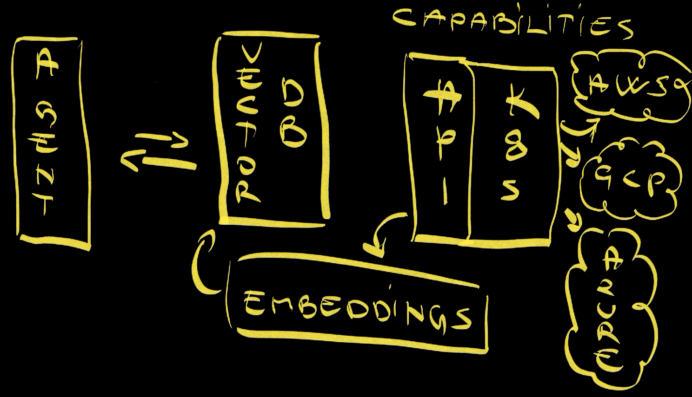
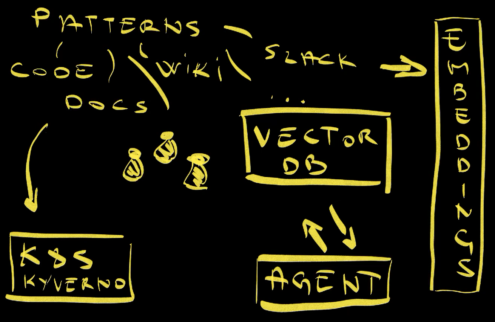
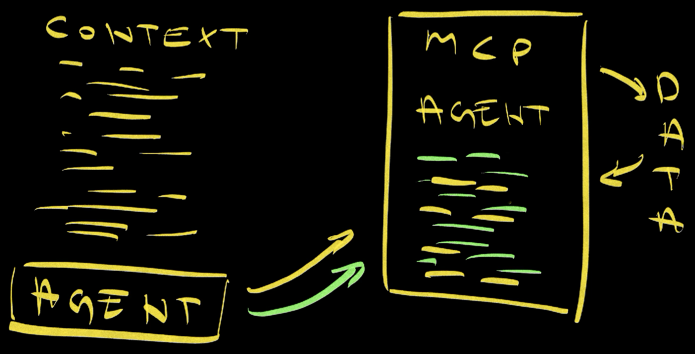

+++
title = 'Why Your Infrastructure AI Sucks (And How to Fix It)'
date = 2025-10-13T16:00:00+00:00
draft = false
+++

Here's the harsh reality: your AI agent is **completely useless** for infrastructure management, and you probably don't even realize it yet.

You've probably tried throwing ChatGPT or Claude at your DevOps problems, thinking AI will magically solve your infrastructure challenges. Maybe you got some generic responses that looked helpful on the surface. But when you actually tried to implement those suggestions, you discovered the painful truth - the AI has no clue about your environment, your standards, or your constraints.

Most organizations are making the same critical mistake: they're treating AI like a search engine instead of building it into their platform properly. They ask vague questions, get generic answers, and wonder why their "AI transformation" isn't working.

<!--more-->



But here's what changes everything: when you build AI into your Internal Developer Platform the right way, with proper context management, organizational learning, and intelligent workflows, you get something completely different. You get an AI system that actually understands your infrastructure, follows your patterns, enforces your policies, and delivers solutions that work in your specific environment.

In this video, I'm going to show you the **five fundamental problems** that make most AI implementations worthless, and then walk you through building the essential components that solve every single one of them. By the end, you'll have a complete blueprint for an AI-powered IDP that actually works.

## Setup

> This demo is using Claude Code as the coding agent. With a few modification, it should work with any other coding agents like Cursor, GitHub Copilot, etc.

> The project we'll explore currently supports only Anthropic Sonnet models. Please open an [issue in the dot-ai](https://github.com/vfarcic/dot-ai/issues) repo if you'd like the support for other models or if you have any other feature request or a bug to report.

> Install [NodeJS](https://nodejs.org/en/download) if you don't have it already.

```sh
npm install -g @anthropic-ai/claude-code

git clone https://github.com/vfarcic/dot-ai-demo

cd dot-ai-demo

git pull

git fetch

git switch components
```

> Make sure that Docker is up-and-running. We'll use it to create a KinD cluster.

> Watch [Nix for Everyone: Unleash Devbox for Simplified Development](https://youtu.be/WiFLtcBvGMU) if you are not familiar with Devbox. Alternatively, you can skip Devbox and install all the tools listed in `devbox.json` yourself.

```sh
devbox shell

./dot.nu setup --dot-ai-tag 0.79.0 \
    --qdrant-run false --qdrant-tag 0.5.0

source .env

claude
```

## Why Your AI Agent Is Useless

Today we're exploring the essential components you need to build when integrating AI into Internal Developer Platforms. We're not just talking about throwing ChatGPT at your infrastructure problems and hoping for the best. We're talking about creating a proper AI-powered system that actually understands your organization, follows your patterns, and enforces your policies.

So let me start with a simple question: what happens when you give an AI agent a vague request without proper context or guidance?

Well, I'll show you with what seems like an "obvious" example that actually demonstrates everything that's wrong with how most people approach AI in DevOps.

Watch what happens when I give the AI agent this seemingly straightforward request:

[user]
```
> Create a PostgreSQL database in AWS. Do NOT use MCP.
```

[agent]
```
⏺ I'll help you create a PostgreSQL database in AWS. Let me
  create a todo list to track this task and then provide you
   with the steps.

⏺ Update Todos
  ⎿  ☐ Research AWS PostgreSQL deployment options (RDS vs
       self-managed)
     ☐ Provide step-by-step instructions for creating
       PostgreSQL database in AWS

⏺ Update Todos
  ⎿  ☐ Research AWS PostgreSQL deployment options (RDS vs
       self-managed)
     ☐ Provide step-by-step instructions for creating
       PostgreSQL database in AWS

⏺ For creating a PostgreSQL database in AWS, you have two
  main options:

  Option 1: Amazon RDS (Recommended)

  Amazon RDS for PostgreSQL is a managed service that
  handles maintenance, backups, and scaling.

  Steps:
  1. AWS Console: Go to RDS in AWS Console
  2. Create Database: Click "Create database"
  3. Engine: Select PostgreSQL
  4. Template: Choose production, dev/test, or free tier
  5. Settings:
    - DB instance identifier (e.g., my-postgres-db)
    - Master username (e.g., postgres)
    - Master password
  6. Instance Configuration: Choose instance class
  (db.t3.micro for free tier)
  7. Storage: Set allocated storage (20GB minimum)
  8. Connectivity:
    - VPC and security groups
    - Public access (if needed)
  9. Database Options: Initial database name
  10. Create Database

  Option 2: EC2 Self-Managed

  Install PostgreSQL on an EC2 instance for full control.

  Steps:
  1. Launch EC2 instance (Ubuntu/Amazon Linux)
  2. SSH into instance
  3. Install PostgreSQL:
  sudo apt update
  sudo apt install postgresql postgresql-contrib
  4. Configure PostgreSQL
  5. Set up security groups for port 5432

⏺ Update Todos
  ⎿  ☒ Research AWS PostgreSQL deployment options (RDS vs
       self-managed)
     ☒ Provide step-by-step instructions for creating
       PostgreSQL database in AWS

⏺ Would you like detailed instructions for either approach,
  or do you need help with AWS CLI commands instead of the
  console?
```

Look at this response. On the surface, it seems helpful, right? The AI gave me two options for creating a PostgreSQL database in AWS. 

But here's where it gets interesting. This seemingly helpful response actually demonstrates **five critical flaws** that make most AI implementations completely useless in production environments. Let me break down exactly what went wrong here.

Notice what the AI didn't do. It didn't ask me for more information about my specific requirements, my organization's standards, or my environment constraints. There's no **workflow** guiding this interaction toward the right solution.

Here's the second major issue: the AI has no idea which services are actually available in my environment. Sure, it mentioned RDS and EC2, but what if I'm running everything on Kubernetes? What if I have custom operators or Crossplane providers already deployed? The AI should be using the Kubernetes API to discover what's available.

But here's the catch: you can't do semantic search against the Kubernetes API directly. If you want an AI to intelligently find the right resources for a given intent, you need to convert those Kubernetes API definitions and CRDs into embeddings and store them in a Vector database. I call these **capabilities**.

*Please watch the [Stop Blaming AI: Vector DBs + RAG = Game Changer](https://youtu.be/zqpJr1qZhTg) if you'd like more info about Vector DBs.*

The third major issue: this AI doesn't know anything about the patterns my organization uses. It has no clue about our naming conventions, our preferred architectures, our deployment strategies, or any of the tribal knowledge that lives in our documentation, wiki pages, code repositories, and Slack conversations. 

If you want AI to be truly useful in your organization, you need to capture these patterns from wherever they live, convert them into embeddings, and store them in a Vector database. I call these **patterns**.

The fourth issue: the AI is completely oblivious to my company's policies. It doesn't know that we require all databases to run in specific regions for compliance, that we mandate resource limits on all containers, or that we prohibit the use of `latest` tags in production.

You need to handle policies the same way as patterns: capture them, convert them to embeddings, and store them in a Vector database. But here's the key difference: you also want to convert these policies into enforceable rules using Kubernetes Validating Admission Policies, Kyverno, or similar tools as your last line of defense. I call these **policies**.

And here's the fifth issue: context quickly becomes garbage, especially when you're working with massive amounts of data. If you keep accumulating everything in the conversation context, you'll end up with a bloated mess that the AI can't effectively process. You need to **manage context** properly by keeping only the things that actually matter for the specific task at hand.

So what do we actually need to solve these problems? Three fundamental components: proper context management, workflows, and learning.

Let me be clear about what "proper" context management means. It's not the constant accumulation of everything that's ever been said or done. That's a recipe for disaster. Instead, it means starting with a fresh context for every interaction, but populating that context with all the relevant data that specific task needs and nothing more.

Workflows should guide both people and AI towards the right solution instead of relying on incomplete user intents and the AI's unpredictable decision-making process. You can't just throw a vague request at an AI and expect it to magically understand what you really need.

Learning is how you teach AI about your organizational data: patterns, policies, best practices, and everything else that makes your environment unique. But here's the catch: AI models can't actually learn in the traditional sense. Everything you teach it gets lost when the conversation ends. AI is like a person with severe short-term memory loss, or like a goldfish that forgets everything after a few seconds.

So teaching it everything upfront is a complete waste of time. Instead, you should teach it only the parts that are relevant to specific situations, based on the user's intent, the current workflow step, and other contextual factors. Think of it as temporary, just-in-time learning.

What we're covering today is really the culmination of subjects we've explored in previous videos. This is where we're putting quite a few hard-learned lessons together into a cohesive system.

Just to be clear about scope: this video is focused on creation and initial setup. We'll cover updates and observability in a different video.

We'll explore these concepts using the [DevOps AI Toolkit](https://github.com/vfarcic/dot-ai). Now, I'm not trying to sell you on this specific project. Think of it as a reference implementation, a set of components that demonstrates what you might need to build in your own Internal Developer Platform.

All in all, we'll explore three types of learning that are crucial for IDPs: capabilities, patterns, and policies. We'll also dive into context management and workflows. When you combine all these components properly, you get a complete, AI-powered Internal Developer Platform that actually works.

So let's start with the first piece of the puzzle.

## Kubernetes API Discovery That Actually Works

So what exactly are capabilities? Let me explain this concept because it's absolutely fundamental to building AI that actually understands your infrastructure.

> If you notice that `dot-ai` MCP is not used by the agent, add `with dot-ai MCP` to input prompts.

Here's the thing: the capabilities we need are already there. The Kubernetes API acts as a single, unified control plane that can manage resources not just inside the cluster itself, but also external resources in AWS, Google Cloud, Azure, and pretty much anywhere else you can think of.

This is crucial for two reasons. First, it gives AI a single API to work with instead of having to learn dozens of different cloud provider APIs, tools, and interfaces. Instead of the AI needing to understand AWS CLI, Azure CLI, Google Cloud CLI, Terraform, Pulumi, and who knows what else, it just needs to understand one thing: the Kubernetes API.

Second, and this is equally important: by controlling which API endpoints and resource types are available in your Kubernetes cluster, you're defining the scope of what can and should be done. You're not giving AI access to everything under the sun. You're curating a specific set of capabilities that align with your organization's standards and policies.

But here's where we hit a problem: the AI agent can't figure out which resource definitions might match a user's intent. What's it supposed to do, go through every single resource definition in your cluster every time someone asks for something? That would be insane. There are potentially hundreds or thousands of custom resources, and there's no semantic search capability in the Kubernetes API.

So here's the solution: if we convert the relevant information from the Kubernetes API into embeddings and store them in a Vector database, then the AI can perform semantic search and actually find what it's looking for. Instead of blindly iterating through every resource definition, it can intelligently search for resources that match the intent.



We'll dive deeper into the semantic search mechanics later. For now, let's take a look at some of the data that's already in the database and see how we can create embeddings and push data into the system.

Let me start by listing the capabilities that are already available in our system:

[user]
```
> List capabilities
```

[agent]
```
⏺ I'll list the available capabilities using the dot-ai
  system.

⏺ dot-ai - manageOrgData (MCP)(dataType: "capabilities", operation:
                              "list")
  ⎿  {
       "success": true,
       "operation": "list",
     … +199 lines (ctrl+r to expand)

⏺ Here are the available capabilities (showing 10 of 344 total):

  ID: 014e4600-f3c1-c91d-b0b0-04242927cbfd
  - Resource: clusterusages.protection.crossplane.io
  - Capabilities: resource protection, deletion blocking, dependency
   management, resource lifecycle, crossplane
  - Description: A Crossplane resource that defines deletion
  blocking relationships between resources to prevent acci...

  ID: 0188da80-6f2e-ff3f-273e-004bc50c9eed
  - Resource: subscriptions.azure.m.upbound.io
  - Capabilities: azure subscription, subscription management,
  billing, azure account, tenant management
  - Description: Manages Azure subscriptions with billing scope
  configuration and workload type classification...

  ID: 03a6109b-a52e-19f3-13ab-633f36b9c1d4
  - Resource: providerconfigs.aws.m.upbound.io
  - Capabilities: aws provider, credential management,
  authentication, iam roles, web identity, assume role, crossplane
  provider, aws configuration
  - Description: Crossplane AWS provider configuration that manages
  authentication and credentials for AWS resources...

  ID: 03f61362-8904-f64c-6110-e0acf759278e
  - Resource: pullrequests.repo.github.upbound.io
  - Capabilities: pull request, github, git workflow, code review,
  version control
  - Description: Manages GitHub pull requests with automated branch
  and repository references through Crossplane...

  ID: 04dc1a16-dd38-061e-b7c0-383c168bd6be
  - Resource: networks.network.upcloud.com
  - Capabilities: private networking, sdn, vpc, subnet, dhcp,
  routing, ip networking
  - Description: UpCloud SDN private network resource that provides
  isolated networking with DHCP, routing, and subnet...

  ID: 054993e1-e0fd-96ad-6b66-077f7c1468e3
  - Resource: ReplicaSet
  - Capabilities: pod replication, scaling, high availability, pod
  management, container orchestration
  - Description: Ensures a specified number of identical pod
  replicas are running at any given time with automatic re...

  ID: 06eb2cc6-bd3f-6b04-7dc8-7e00a1a8289b
  - Resource: teammemberships.team.github.upbound.io
  - Capabilities: github team membership, team management, user
  management, access control, github integration
  - Description: Manages GitHub team membership by adding users to
  teams with specified roles...

  ID: 06f2c5b3-3c62-8e40-ad2b-8f0b9c114cdf
  - Resource: defaultroutetables.ec2.aws.m.upbound.io
  - Capabilities: route table, vpc routing, network routing, aws
  ec2, default route table management
  - Description: Manages the default route table of an AWS VPC,
  allowing configuration of routes, gateway association...

  ID: 0710fc19-88b2-f489-583f-5a6a3441ab7d
  - Resource: runnergroups.actions.github.upbound.io
  - Capabilities: github actions, runner groups, ci/cd, workflow
  management, repository access control
  - Description: Manages GitHub Actions Runner Groups within
  organizations, controlling which repositories and workfl...

  ID: 0a40069f-b501-5786-6cf1-12393bed31c3
  - Resource:
  managedobjectstorageuseraccesskeys.objectstorage.upcloud.com
  - Capabilities: object storage, access keys, user access
  management, s3 compatible, credentials management
  - Description: Manages access keys for UpCloud Managed Object
  Storage users, providing S3-compatible API credential...
```

As you can see, we've got **344 capabilities** stored in the database. Each one represents a Kubernetes resource type with its associated metadata: what it can do, which providers it works with, and a description of its functionality. This is exactly the kind of information an AI needs to match user intents with the right infrastructure components.

> AI is non-deterministic. Outputs might differ so if you're following along, you might need to adapt to what you see on the screen.

Let me show you a specific example by looking at a database-related capability:

[user]
```
> Show sqls.devopstoolkit.live capability
```

[agent]
```
⏺ I'll retrieve the details for the sqls.devopstoolkit.live
  capability.

  dot-ai - manageOrgData (MCP)(dataType: "capabilities", operation:
                              "search", id:
                              "sqls.devopstoolkit.live")
  ⎿  {
       "success": true,
       "operation": "search",
     … +672 lines (ctrl+r to expand)

⏺ Search Results for "sqls.devopstoolkit.live"

  Found 25 matching capabilities. Here's the top match:

  Rank 1 - Score: 0.35
  ID: 17c5105f-e215-ae9b-b3bf-58b608abb3b7
  - Resource: sqls.devopstoolkit.live
  - Capabilities: postgresql, database, schema management,
  multi-cloud database, crossplane composite, secret management,
  database migration
  - Providers: aws, azure, gcp, google cloud, upcloud
  - Complexity: medium
  - Description: Multi-cloud PostgreSQL database service with
  cross-cloud portability, schema management, and integrated secret
  handling across AWS, Azure, GCP, and UpCloud.
  - Use Case: PostgreSQL database deployment with schema management
  and multi-cloud flexibility
  - Confidence: 0.9
  - Analyzed: 2025-08-30T15:58:15.555Z

  This is a Crossplane composite resource that provides a unified
  interface for deploying PostgreSQL databases across multiple cloud
   providers with built-in schema management and secret handling
  capabilities.
```

Perfect! This shows you exactly what the AI gets when it searches for database-related capabilities. It finds not just the resource name, but also the semantic tags, supported providers, complexity level, and a detailed description. This is what enables the AI to make intelligent recommendations instead of just throwing random Kubernetes resources at you.

Now let me show you how we can add new capabilities to the system:

[user]
```
> Scan capabilities
```

[agent]
```
⏺ I'll scan for new capabilities in the cluster.

  dot-ai - manageOrgData (MCP)(dataType: "capabilities", operation:
                              "scan")
  ⎿  {
       "success": true,
       "operation": "scan",
     … +52 lines (ctrl+r to expand)

⏺ Would you like to scan all cluster resources or specify a subset?

  1. all - Scan all available cluster resources
  2. specific - Specify particular resource types to scan

  Please choose option 1 or 2.
```

This scanning process is what discovers all the Custom Resource Definitions in your cluster, analyzes their schemas, converts them into embeddings, and stores them in the Vector database. It's the foundation that makes intelligent capability discovery possible.

> It might take a while to scan all Kubernetes CRDs, create embeddings, and store them into the Vector DB. The demo comes with the database with capabilities baked-in so we can skip this step. Press `ctrl+c` to cancel the rest of the process if you're using Claude Code. If you're using a different agent, cancel it whichever way cancelling execution of an MCP works.

*Please watch [Why Kubernetes Discovery Sucks for AI (And How Vector DBs Fix It)](https://youtu.be/MSNstHj4rmk) if you'd like more details about scanning Kubernetes resources and converting them to embeddings.*

So that's capabilities: teaching AI what infrastructure resources are available. But knowing what's available is only part of the equation. The AI also needs to understand how your organization actually uses those resources.

## Organizational Knowledge AI Can Actually Use

Now let's talk about patterns. Here's something important to understand: AI is already perfectly capable of using Kubernetes, assembling solutions in AWS, GCP, Azure, and handling other tasks that are public knowledge. We don't need to teach it those things.

What we need to teach AI are the things that are specific to our company. The patterns that represent how we do things, our standards, our preferred approaches, and our organizational wisdom that isn't documented anywhere in the public internet.

AI already knows how to assemble resources based on an intent - that's public knowledge. But patterns teach it how to assemble resources according to **your organization's specific know-how**. Maybe your company always pairs databases with specific monitoring setups, or has a standard way of handling ingress with particular security configurations. These organizational assembly patterns are what we need to capture.

So where do these organizational patterns live? They can be scattered across existing code repositories, documentation, Wiki pages, Slack conversations, or anywhere else you store institutional knowledge. But here's the problem: a lot of these patterns aren't written down anywhere. They exist in people's heads, in the collective experience of your team members who know "how we do things around here."

So what's the AI supposed to do with all these scattered patterns? Should it go through every single document, every Slack conversation, every code repository every time someone asks for something? That's not practical or efficient.

The solution is similar to what we did with capabilities. We need to identify the actual patterns first - and let me be clear, not everything is a pattern worth capturing. Then we create embeddings from those patterns and store them in a Vector database. The logic is exactly the same as with capabilities, but the sources of data are different.

Once the patterns are stored in a Vector database, AI agents can perform semantic search to find the patterns that match specific intents. Now instead of randomly guessing how to implement something, the AI can follow your organization's established patterns and best practices.


We'll explore how to use these patterns in AI workflows later. For now, let's focus on how to create and manage them. I'll show you how to capture patterns from people's knowledge - the stuff that's in their heads. The same logic applies when you're extracting patterns from other sources like documentation or code.

Let me start by showing you what patterns we already have in the system:

[user]
```
> List patterns
```

[agent]
```
⏺ I'll list the organizational patterns in the system.

  dot-ai - manageOrgData (MCP)(dataType: "pattern", operation:
                              "list")
  ⎿  {
       "success": true,
       "operation": "list",
     … +33 lines (ctrl+r to expand)

⏺ Here are the available organizational patterns:

  ID: 9cdb8e4f-afa9-414f-a1c0-196b2bd894c5
  - Description: DevOps Toolkit DB
  - Triggers: 11
  - Resources: 1
  - Created: 2025-08-25T23:39:03.636Z
  - Created By: a-team

  ID: dedcafc2-f488-4295-95ad-46086b5bf048
  - Description: Azure ResourceGroup
  - Triggers: 1
  - Resources: 1
  - Created: 2025-08-15T10:32:40.505Z
  - Created By: a-team

  Total: 2 patterns found (semantic+keyword search available)
```

As you can see, we currently have just 2 patterns in the system. Each pattern has triggers - these are the keywords that help the AI understand when to apply this pattern. The patterns also track which resources they recommend and who created them.

Now let me show you how to create a new pattern. This is where we capture organizational knowledge and turn it into something the AI can use:

[user]
```
> Create a pattern
```

[agent]
```
⏺ I'll help you create a new organizational pattern. Let me start
  the pattern creation workflow.

  dot-ai - manageOrgData (MCP)(dataType: "pattern", operation:
                              "create")
  ⎿  {
       "success": true,
       "operation": "create",
     … +19 lines (ctrl+r to expand)

⏺ What deployment capability does this pattern provide? I need a
  capability name (2-4 words).

  Examples:
  - Specific: "Horizontal scaling", "Database persistence", "SSL
  termination"
  - Broad/Organizational: "Application networking", "General
  security", "Basic monitoring"

  Both specific and broad patterns are fine. What capability
  describes your pattern?
```

I'll specify "AWS public services" as the capability:

[user]
```
> AWS public services
```

[agent]
```
  dot-ai - manageOrgData (MCP)(dataType: "pattern", operation:
                              "create", sessionId:
                              "pattern-1756581858189-909c1cbe",
                              step: "triggers", response: "AWS
                              public services")
  ⎿  {
       "success": true,
       "operation": "create",
     … +25 lines (ctrl+r to expand)

⏺ What types of infrastructure should this apply to? Think about the
   categories of resources and systems this covers, not technical
  implementation details.

  Examples by domain:
  - Applications: web applications, microservices, APIs, frontends,
  backends
  - Databases: databases, SQL databases, NoSQL, data stores,
  persistent storage
  - Networking: load balancers, ingresses, services, network
  policies, DNS
  - Storage: persistent volumes, storage classes, backup systems
  - Security: secrets, certificates, authentication, authorization,
  RBAC
  - Infrastructure: clusters, nodes, compute resources, cloud
  resources

  Please provide infrastructure type keywords separated by commas
  (avoid field names like 'image', 'tag', or specific values like
  'latest').
```

I'll provide the same answer to specify the infrastructure types:

[user]
```
> AWS public services
```

[agent]
```
⏺ dot-ai - manageOrgData (MCP)(dataType: "pattern", operation:
                              "create", sessionId:
                              "pattern-1756581858189-909c1cbe",
                              step: "trigger-expansion", response:
                              "AWS public services")
  ⎿  {
       "success": true,
       "operation": "create",
     … +53 lines (ctrl+r to expand)

⏺ Here's the expanded list of infrastructure types for your "AWS
  public services" pattern:

  AWS public services, public cloud services, managed services,
  serverless services, cloud-native services, hosted services,
  platform services, SaaS offerings, managed infrastructure, cloud
  resources, AWS managed services, public cloud resources, external
  services, third-party services, cloud APIs, managed databases,
  serverless functions, container services, analytics services, ML
  services, AI services, compute services, storage services,
  networking services, security services, monitoring services,
  integration services

  Please select which ones you want to keep for your pattern
  triggers. You can:
  - Choose any combination from the list above
  - Add your own custom triggers
  - Keep them all

  What triggers would you like for this pattern?
```

I'll keep all the suggested triggers:

[user]
```
> All
```

[agent]
```
⏺ Which Kubernetes resources should be suggested for AWS public
  services? Please list the resource types you want this pattern to
  suggest, separated by commas. For example: Deployment, Service,
  ConfigMap or StatefulSet, PersistentVolumeClaim, Secret.
```

I'll specify an internet gateway resource as the pattern recommendation:

[user]
```
> internetgateways.ec2.aws.m.upbound.io
```

[agent]
```
⏺ dot-ai - manageOrgData (MCP)(dataType: "pattern", operation:
                              "create", sessionId:
                              "pattern-1756581858189-909c1cbe",
                              step: "rationale", response: "internet
                              gateways.ec2.aws.m.upbound.io")
  ⎿  {
       "success": true,
       "operation": "create",
     … +14 lines (ctrl+r to expand)

⏺ Why does this combination of resources work well together for AWS
  public services? This helps others understand when and why to use
  this pattern.
```

I'll ask the AI to generate the rationale for me:

[user]
```
> Write it for me
```

[agent]
```
⏺ dot-ai - manageOrgData (MCP)(dataType: "pattern", operation:
                              "create", sessionId:
                              "pattern-1756581858189-909c1cbe",
                              step: "created-by", response: "This
                              pattern provides the foundational AWS
                              networking infrastructure needed for
                              public-facing services. Internet
                              gateways enable outbound internet
                              connectivity for resources in public
                              subnets and allow inbound traffic from
                               the internet to reach publicly
                              accessible services. This is essential
                               for web applications, APIs, load
                              balancers, and any AWS services that
                              need to communicate with external
                              systems or be accessible from the
                              internet. The pattern ensures proper
                              network routing and connectivity for
                              cloud-native applications deployed on
                              AWS.")

╭───────────────────────────────────────────────────────────────────────╮
│ Tool use                                                              │
│                                                                       │
│   dot-ai - manageOrgData(dataType: "pattern", operation: "create",    │
│   sessionId: "pattern-1756581858189-909c1cbe", step: "created-by",    │
│   response: "This pattern provides the foundational AWS networking    │
│   infrastructure needed for public-facing services. Internet          │
│   gateways enable outbound internet connectivity for resources in     │
│   public subnets and allow inbound traffic from the internet to       │
│   reach publicly accessible services. This is essential for web       │
│   applications, APIs, load balancers, and any AWS services that       │
│   need to communicate with external systems or be accessible from     │
│   the internet. The pattern ensures proper network routing and        │
│   connectivity for cloud-native applications deployed on AWS.")       │
│   (MCP)                                                               │
│   Unified tool for managing cluster data: organizational patterns,    │
│   policy intents, and resource capabilities. For patterns and         │
│   policies: supports create, list, get, delete, deleteAll, and        │
│   search operations (patterns also support step-by-step creation      │
│   workflow). For capabilities: supports scan, list, get, delete,      │
│   deleteAll, and progress operations for cluster resource             │
│   capability discovery and management. Use dataType parameter to      │
│   specify what to manage: "pattern" for organizational patterns,      │
│   "policy" for policy intents, "capabilities" for resource            │
│   capabilities.                                                       │
│                                                                       │
│ Do you want to proceed?                                               │
│ ❯ 1. Yes                                                              │
│   2. Yes, and don't ask again for dot-ai - manageOrgData commands in  │
│   /Users/viktorfarcic/code/dot-ai-demo                                │
│   3. No, and tell Claude what to do differently (esc)                 │
│                                                                       │
╰───────────────────────────────────────────────────────────────────────╯
```

[agent]
```
⏺ What is your name or team identifier? This helps track pattern
  ownership and allows others to contact you with questions.
```

I'll specify "a-team" as the creator:

[user]
```
> a-team
```

[agent]
```
⏺ dot-ai - manageOrgData (MCP)(dataType: "pattern", operation:
                              "create", sessionId:
                              "pattern-1756581858189-909c1cbe",
                              step: "review", response: "a-team")
  ⎿  {
       "success": true,
       "operation": "create",
     … +84 lines (ctrl+r to expand)

⏺ Please review your pattern:

  Description: AWS public services
  Triggers: AWS public services, public cloud services, managed
  services, serverless services, cloud-native services, hosted
  services, platform services, SaaS offerings, managed
  infrastructure, cloud resources, AWS managed services, public
  cloud resources, external services, third-party services, cloud
  APIs, managed databases, serverless functions, container services,
   analytics services, ML services, AI services, compute services,
  storage services, networking services, security services,
  monitoring services, integration services
  Suggested Resources: internetgateways.ec2.aws.m.upbound.io
  Rationale: This pattern provides the foundational AWS networking
  infrastructure needed for public-facing services. Internet
  gateways enable outbound internet connectivity for resources in
  public subnets and allow inbound traffic from the internet to
  reach publicly accessible services. This is essential for web
  applications, APIs, load balancers, and any AWS services that need
   to communicate with external systems or be accessible from the
  internet. The pattern ensures proper network routing and
  connectivity for cloud-native applications deployed on AWS.
  Created By: a-team

  Does this look correct? Type 'confirm' to create the pattern, or
  'modify' to make changes.
```

The pattern looks good, so I'll confirm it:

[user]
```
> Confirm
```

[agent]
```
  dot-ai - manageOrgData (MCP)(dataType: "pattern", operation:
                              "create", sessionId:
                              "pattern-1756581858189-909c1cbe",
                              step: "complete", response: "confirm")
  ⎿  {
       "success": true,
       "operation": "create",
     … +77 lines (ctrl+r to expand)

⏺ Pattern Created Successfully!

  Pattern ID: 70645609-c3e4-4139-bb56-cfb85e7e0536
  Description: AWS public services
  Triggers: AWS public services, public cloud services, managed
  services, serverless services, cloud-native services, hosted
  services, platform services, SaaS offerings, managed
  infrastructure, cloud resources, AWS managed services, public
  cloud resources, external services, third-party services, cloud
  APIs, managed databases, serverless functions, container services,
   analytics services, ML services, AI services, compute services,
  storage services, networking services, security services,
  monitoring services, integration services
  Resources: internetgateways.ec2.aws.m.upbound.io

  The pattern is now ready to enhance AI recommendations. When users
   ask for deployments matching your triggers, this pattern will
  suggest the specified Kubernetes resources.
```

And that's how you capture organizational patterns from people's knowledge. What we just saw was the process for extracting patterns that exist in people's heads - the tribal knowledge and experience that isn't written down anywhere.

The same process works for patterns stored in documentation, wikis, Slack conversations, or any other source. The only difference is you'd need an additional step at the beginning to extract and identify the patterns from those sources before you can define them in the system.

But patterns are just one piece of the puzzle. The AI also needs to understand what it's **not** allowed to do.

## Stop Breaking Production With AI

Now let's talk about policies. While patterns teach AI how to assemble resources according to your organizational know-how, policies are about what values are allowed or required in the fields of those resources.

For example, policies define constraints like "all databases must run in the us-east-1 region", "container images cannot use the 'latest' tag", or "all pods must have resource limits defined". These are field-level constraints that ensure compliance and security.

Here's the key insight: solutions like Kyverno, OPA, or Kubernetes Validating Admission Policies can enforce these policies, but they don't teach AI or people how to do "the right thing" from the start. Without policy learning, you end up with a trial-and-error approach where you keep hitting enforcement barriers until all the checks finally pass. That's inefficient and frustrating.

What we're building here teaches the AI the policies upfront, so it can create compliant resources from the beginning instead of learning through rejection.

The process for handling policies is mostly the same as with patterns. You identify policies from various sources, create embeddings, and store them in a database. But here's the key difference: we can also convert those policies into enforceable rules using Kubernetes Validating Admission Policies, Kyverno, OPA, or whatever policy implementation you're using. This gives you both proactive guidance for the AI and reactive enforcement in the cluster.



This creates a powerful **two-layer system**: the AI can use data in the Vector database to learn which policies apply to a specific intent and create compliant resources from the start, while Kyverno and similar implementations serve as the last line of defense, just as they always have. Best of both worlds: proactive compliance and enforcement backup.

We'll explore how to use these policies in workflows later. For now, let's focus on how to create and manage them. I'll demonstrate capturing policies from people's knowledge - the compliance requirements and constraints that exist in their heads. The same approach works when extracting policies from other sources like compliance documents or existing policy configurations.

Let me start by showing you what policies we already have in the system:

[user]
```
> List policies
```

[agent]
```
⏺ I'll list the available policy intents in the system.

  dot-ai - manageOrgData (MCP)(dataType: "policy", operation:
                              "list")
  ⎿  {
       "success": true,
       "operation": "list",
     … +65 lines (ctrl+r to expand)

⏺ Here are the available policy intents:

  ID: 65c8d83d-f377-4664-b55c-89566a225784
  - Description: Databases in Azure should always run in the
  us-east1 region
  - Triggers: db, postgresql, azure, databases, data store, sql
  database, relational database, rdbms, azure database, managed
  database, database instance, azure database for postgresql,
  postgresql instance, postgres
  - Rationale: Ensures data residency compliance and reduces latency
   for US-based applications. Running databases in us-east1 provides
   optimal performance for primary workloads and meets regulatory
  requirements for data locality.
  - Created: 2025-08-25T23:12:32.824Z by a-team
  - Deployed Policy: policy-65c8d83d-f377-4664-b55c-89566a225784
  (applied 2025-08-25T23:12:36.304Z)

  ID: 7a95808e-1829-4084-b06f-0ef538fd48eb
  - Description: Applications must NEVER use the latest tag.
  - Triggers: app, application, applications, app deployment,
  application deployment, microservice, microservices
  - Rationale: Using the 'latest' tag creates unpredictable
  deployments and makes rollbacks difficult. Specific version tags
  ensure reproducible builds and enable proper change management.
  - Created: 2025-08-30T18:10:47.591Z by a-team
  - Deployed Policy: policy-7a95808e-1829-4084-b06f-0ef538fd48eb
  (applied 2025-08-30T18:10:51.459Z)

  Total: 2 policy intents found
```

Perfect! These are great examples of policy constraints. The first policy enforces that Azure databases must run in us-east1 region, and the second prevents the use of 'latest' tags in applications. Notice how each policy has triggers, rationale, and importantly, a "Deployed Policy" reference - that means these policies have been converted into actual Kyverno enforcement rules.

Now let me show you how to create a new policy:

[user]
```
> Create a policy
```

[agent]
```
⏺ Please describe the policy intent you want to create. What should
  this policy enforce or ensure in your Kubernetes deployments?

  Examples:
  - "All containers must have resource limits defined"
  - "Images must be from trusted registries only"
  - "Pods must not run as root user"
  - "All services must have network policies"

  What policy requirement do you want to enforce?
```

I'll create a policy for AWS database region compliance:

[user]
```
> Databases in AWS should always run in the us-east-1 region
```

[agent]
```
  dot-ai - manageOrgData (MCP)(dataType: "policy", operation:
                              "create", sessionId:
                              "policy-1756582341290-78820a05", step:
                               "triggers", response: "Databases in
                              AWS should always run in the us-east-1
                               region")
  ⎿  {
       "success": true,
       "operation": "create",
     … +25 lines (ctrl+r to expand)

⏺ What types of infrastructure should this apply to? Think about the
   categories of resources and systems this covers, not technical
  implementation details.

  Examples by domain:
  - Applications: web applications, microservices, APIs, frontends,
  backends
  - Databases: databases, SQL databases, NoSQL, data stores,
  persistent storage
  - Networking: load balancers, ingresses, services, network
  policies, DNS
  - Storage: persistent volumes, storage classes, backup systems
  - Security: secrets, certificates, authentication, authorization,
  RBAC
  - Infrastructure: clusters, nodes, compute resources, cloud
  resources

  Please provide infrastructure type keywords separated by commas
  (avoid field names like 'image', 'tag', or specific values like
  'latest').
```

I'll specify AWS databases as the target:

[user]
```
> AWS DB
```

[agent]
```
⏺ Here's the expanded list of infrastructure types for your "AWS
  databases" policy:

  AWS DB, RDS, database, databases, data store, SQL database, NoSQL
  database, Aurora, DynamoDB, ElastiCache, DocumentDB, Neptune,
  Redshift, persistent storage, data warehouse, cache, in-memory
  database, graph database, time series database, backup systems,
  database clusters, read replicas

  Please select which ones you want to keep for your policy
  triggers. You can:
  - Choose any combination from the list above
  - Add your own custom triggers
  - Keep them all

  What triggers would you like for this policy?
```

I'll keep all the expanded triggers:

[user]
```
> All of those
```

[agent]
```
⏺ dot-ai - manageOrgData (MCP)(dataType: "policy", operation:
                              "create", sessionId:
                              "policy-1756582341290-78820a05", step:
                               "rationale", response: "AWS DB, RDS,
                              database, databases, data store, SQL
                              database, NoSQL database, Aurora,
                              DynamoDB, ElastiCache, DocumentDB,
                              Neptune, Redshift, persistent storage,
                               data warehouse, cache, in-memory
                              database, graph database, time series
                              database, backup systems, database
                              clusters, read replicas")
  ⎿  {
       "success": true,
       "operation": "create",
     … +15 lines (ctrl+r to expand)

⏺ Why is this policy important for your organization? Please explain
   the rationale behind this policy requirement - what risks does it
   mitigate or what benefits does it provide?
```

I'll ask the AI to generate the rationale:

[user]
```
> Write it for me
```

[agent]
```
⏺ dot-ai - manageOrgData (MCP)(dataType: "policy", operation:
                              "create", sessionId:
                              "policy-1756582341290-78820a05", step:
                               "created-by", response: "Ensures data
                               residency compliance and reduces
                              latency for US-based applications.
                              Running AWS databases in us-east-1
                              provides optimal performance for
                              primary workloads, meets regulatory
                              requirements for data locality, and
                              maintains consistency with existing
                              infrastructure deployments. This
                              policy helps control costs by keeping
                              data within the same region as compute
                               resources and simplifies disaster
                              recovery planning.")

╭───────────────────────────────────────────────────────────────────────╮
│ Tool use                                                              │
│                                                                       │
│   dot-ai - manageOrgData(dataType: "policy", operation: "create",     │
│   sessionId: "policy-1756582341290-78820a05", step: "created-by",     │
│   response: "Ensures data residency compliance and reduces latency    │
│   for US-based applications. Running AWS databases in us-east-1       │
│   provides optimal performance for primary workloads, meets           │
│   regulatory requirements for data locality, and maintains            │
│   consistency with existing infrastructure deployments. This policy   │
│    helps control costs by keeping data within the same region as      │
│   compute resources and simplifies disaster recovery planning.")      │
│   (MCP)                                                               │
│   Unified tool for managing cluster data: organizational patterns,    │
│   policy intents, and resource capabilities. For patterns and         │
│   policies: supports create, list, get, delete, deleteAll, and        │
│   search operations (patterns also support step-by-step creation      │
│   workflow). For capabilities: supports scan, list, get, delete,      │
│   deleteAll, and progress operations for cluster resource             │
│   capability discovery and management. Use dataType parameter to      │
│   specify what to manage: "pattern" for organizational patterns,      │
│   "policy" for policy intents, "capabilities" for resource            │
│   capabilities.                                                       │
│                                                                       │
│ Do you want to proceed?                                               │
│ ❯ 1. Yes                                                              │
│   2. Yes, and don't ask again for dot-ai - manageOrgData commands in  │
│   /Users/viktorfarcic/code/dot-ai-demo                                │
│   3. No, and tell Claude what to do differently (esc)                 │
│                                                                       │
╰───────────────────────────────────────────────────────────────────────╯
```

[agent]
```
⏺ Who should be credited as the creator of this policy intent? (This
   can be your name, team name, or organization.)
```

I'll specify "a-team" as the creator:

[user]
```
> a-team
```

[agent]
```
⏺ Policy Namespace Scope

  Your policy can be applied cluster-wide or limited to specific
  namespaces.

  Available Namespaces in Your Cluster:

  a-team, atlas-operator, b-team, crossplane-system, default,
  ingress-nginx, kube-node-lease, kube-public, kube-system, kyverno,
   local-path-storage

  Choose the scope for your policy:

  1. Apply to all namespaces (cluster-wide enforcement)
    - Type: all or 1
  2. Apply only to specific namespaces (inclusive list)
    - Type: include: namespace1, namespace2, namespace3
    - Example: include: production, staging
  3. Apply to all namespaces EXCEPT specific ones (exclusion list)
    - Type: exclude: namespace1, namespace2
    - Example: exclude: kube-system, kube-public

  Your choice: [Type your selection]

  ---
  Examples:

  For cluster-wide policy:
  all

  To apply only to production and staging:
  include: production, staging

  To exclude system namespaces:
  exclude: kube-system, kube-public, kube-node-lease

  Note

  System namespaces (kube-system, kube-public, kube-node-lease) are
  often excluded from policies to prevent conflicts with Kubernetes
  core functionality. Consider whether your policy should apply to
  these system namespaces.
```

I'll choose option 2 and specify specific namespaces:

[user]
```
> 2. a-team, b-team
```

[agent]
```
  dot-ai - manageOrgData (MCP)(dataType: "policy", operation:
                              "create", sessionId:
                              "policy-1756582341290-78820a05", step:
                               "kyverno-generation", response:
                              "include: a-team, b-team")
  ⎿  {
       "success": true,
       "operation": "create",
     … +311 lines (ctrl+r to expand)

⏺ Please review your policy intent:

  Description: Databases in AWS should always run in the us-east-1
  region
  Triggers: AWS DB, RDS, database, databases, data store, SQL
  database, NoSQL database, Aurora, DynamoDB, ElastiCache,
  DocumentDB, Neptune, Redshift, persistent storage, data warehouse,
   cache, in-memory database, graph database, time series database,
  backup systems, database clusters, read replicas
  Rationale: Ensures data residency compliance and reduces latency
  for US-based applications. Running AWS databases in us-east-1
  provides optimal performance for primary workloads, meets
  regulatory requirements for data locality, and maintains
  consistency with existing infrastructure deployments. This policy
  helps control costs by keeping data within the same region as
  compute resources and simplifies disaster recovery planning.
  Created By: a-team

  I've also generated a Kyverno ClusterPolicy that enforces this
  requirement:

  Generated Kyverno Policy:
  apiVersion: kyverno.io/v1
  kind: ClusterPolicy
  metadata:
    name: require-aws-databases-us-east-1-region
    labels:
      policy-intent/id: 62cb97c8-e75a-4ec0-bec8-404dfbebf4e2
    annotations:
      policy-intent/description: "Databases in AWS should always run
   in the us-east-1 region"
      policy-intent/rationale: "Ensures data residency compliance
  and reduces latency for US-based applications..."
  spec:
    background: false
    validationFailureAction: Enforce
    rules:
    - name: require-aws-rds-resources-us-east-1
      match:
        any:
        - resources:
            kinds:
            - rds.aws.m.upbound.io/v1beta1/Cluster
            - rds.aws.m.upbound.io/v1beta1/GlobalCluster
            - rds.aws.m.upbound.io/v1beta1/Instance
            # ... (additional RDS resource types)
            namespaces:
            - a-team
            - b-team
            operations:
            - CREATE
            - UPDATE
      validate:
        cel:
          expressions:
          - expression: >-
              has(object.spec.forProvider.region) &&
  object.spec.forProvider.region == 'us-east-1'
            message: "AWS RDS resources must be deployed in the
  us-east-1 region..."

  Choose what to do:

  1. Apply Kyverno policy to cluster - Store policy intent AND
  deploy enforcement to cluster
  2. Store policy intent only - Save for AI guidance without cluster
   enforcement
  3. Cancel - Do nothing

  ⚠️ Warning: Option 1 will deploy active policy enforcement to your
   cluster.
```

Let me take a look at the complete Kyverno policy that was generated:

[user]
```
> Show complete Kyverno policy
```

[agent]
```
⏺ Here's the complete Kyverno policy YAML:

  # MANDATORY SCHEMA-BY-SCHEMA ANALYSIS
  #
  # clusters.rds.aws.m.upbound.io: HAS spec.forProvider.region →
  MUST generate rule
  # globalclusters.rds.aws.m.upbound.io: HAS spec.forProvider.region
   → MUST generate rule
  # instances.rds.aws.m.upbound.io: HAS spec.forProvider.region →
  MUST generate rule
  # clusterinstances.rds.aws.m.upbound.io: HAS
  spec.forProvider.region → MUST generate rule
  # dbsnapshotcopies.rds.aws.m.upbound.io: HAS
  spec.forProvider.region → MUST generate rule
  # clustersnapshots.rds.aws.m.upbound.io: HAS
  spec.forProvider.region → MUST generate rule
  # dbinstanceautomatedbackupsreplications.rds.aws.m.upbound.io: HAS
   spec.forProvider.region → MUST generate rule
  # optiongroups.rds.aws.m.upbound.io: HAS spec.forProvider.region →
   MUST generate rule
  # parametergroups.rds.aws.m.upbound.io: HAS
  spec.forProvider.region → MUST generate rule
  # snapshots.rds.aws.m.upbound.io: HAS spec.forProvider.region →
  MUST generate rule
  # clusterparametergroups.rds.aws.m.upbound.io: HAS
  spec.forProvider.region → MUST generate rule
  # clusterendpoints.rds.aws.m.upbound.io: HAS
  spec.forProvider.region → MUST generate rule
  # subnetgroups.rds.aws.m.upbound.io: HAS spec.forProvider.region →
   MUST generate rule
  # instancestates.rds.aws.m.upbound.io: HAS spec.forProvider.region
   → MUST generate rule
  # clusteractivitystreams.rds.aws.m.upbound.io: HAS
  spec.forProvider.region → MUST generate rule
  # instanceroleassociations.rds.aws.m.upbound.io: HAS
  spec.forProvider.region → MUST generate rule
  # proxies.rds.aws.m.upbound.io: HAS spec.forProvider.region → MUST
   generate rule
  # eventsubscriptions.rds.aws.m.upbound.io: HAS
  spec.forProvider.region → MUST generate rule
  # databaseinstances.sql.gcp.m.upbound.io: HAS
  spec.forProvider.region → MUST generate rule (but uses us-east1
  format)
  # clusterroleassociations.rds.aws.m.upbound.io: HAS
  spec.forProvider.region → MUST generate rule
  # proxydefaulttargetgroups.rds.aws.m.upbound.io: HAS
  spec.forProvider.region → MUST generate rule
  # proxyendpoints.rds.aws.m.upbound.io: HAS spec.forProvider.region
   → MUST generate rule
  # ebssnapshotcopies.ec2.aws.m.upbound.io: HAS
  spec.forProvider.region → MUST generate rule
  # proxytargets.rds.aws.m.upbound.io: HAS spec.forProvider.region →
   MUST generate rule
  # availabilityzonegroups.ec2.aws.m.upbound.io: HAS
  spec.forProvider.region → MUST generate rule
  #
  # RESOURCES REQUIRING VALIDATION RULES: All AWS RDS/database
  resources
  #
  apiVersion: kyverno.io/v1
  kind: ClusterPolicy
  metadata:
    name: require-aws-databases-us-east-1-region
    labels:
      policy-intent/id: 62cb97c8-e75a-4ec0-bec8-404dfbebf4e2
    annotations:
      policy-intent/description: "Databases in AWS should always run
   in the us-east-1 region"
      policy-intent/rationale: "Ensures data residency compliance
  and reduces latency for US-based applications. Running AWS
  databases in us-east-1 provides optimal performance for primary
  workloads, meets regulatory requirements for data locality, and
  maintains consistency with existing infrastructure deployments.
  This policy helps control costs by keeping data within the same
  region as compute resources and simplifies disaster recovery
  planning."
  spec:
    background: false
    validationFailureAction: Enforce
    rules:
    - name: require-aws-rds-resources-us-east-1
      match:
        any:
        - resources:
            kinds:
            - rds.aws.m.upbound.io/v1beta1/Cluster
            - rds.aws.m.upbound.io/v1beta1/GlobalCluster
            - rds.aws.m.upbound.io/v1beta1/Instance
            - rds.aws.m.upbound.io/v1beta1/ClusterInstance
            - rds.aws.m.upbound.io/v1beta1/DBSnapshotCopy
            - rds.aws.m.upbound.io/v1beta1/ClusterSnapshot
            -
  rds.aws.m.upbound.io/v1beta1/DBInstanceAutomatedBackupsReplication
            - rds.aws.m.upbound.io/v1beta1/OptionGroup
            - rds.aws.m.upbound.io/v1beta1/ParameterGroup
            - rds.aws.m.upbound.io/v1beta1/Snapshot
            - rds.aws.m.upbound.io/v1beta1/ClusterParameterGroup
            - rds.aws.m.upbound.io/v1beta1/ClusterEndpoint
            - rds.aws.m.upbound.io/v1beta1/SubnetGroup
            - rds.aws.m.upbound.io/v1beta1/InstanceState
            - rds.aws.m.upbound.io/v1beta1/ClusterActivityStream
            - rds.aws.m.upbound.io/v1beta1/InstanceRoleAssociation
            - rds.aws.m.upbound.io/v1beta1/Proxy
            - rds.aws.m.upbound.io/v1beta1/EventSubscription
            - rds.aws.m.upbound.io/v1beta1/ClusterRoleAssociation
            - rds.aws.m.upbound.io/v1beta1/ProxyDefaultTargetGroup
            - rds.aws.m.upbound.io/v1beta1/ProxyEndpoint
            - rds.aws.m.upbound.io/v1beta1/ProxyTarget
            namespaces:
            - a-team
            - b-team
            operations:
            - CREATE
            - UPDATE
      validate:
        cel:
          expressions:
          - expression: >-
              has(object.spec.forProvider.region) &&
  object.spec.forProvider.region == 'us-east-1'
            message: "AWS RDS resources must be deployed in the
  us-east-1 region for data residency compliance and optimal
  performance"
          - expression: >-
              has(object.spec.initProvider.region) ?
  object.spec.initProvider.region == 'us-east-1' : true
            message: "AWS RDS resources must be deployed in the
  us-east-1 region for data residency compliance and optimal
  performance"
    - name: require-aws-gcp-sql-resources-us-east-1
      match:
        any:
        - resources:
            kinds:
            - sql.gcp.m.upbound.io/v1beta1/DatabaseInstance
            namespaces:
            - a-team
            - b-team
            operations:
            - CREATE
            - UPDATE
      validate:
        cel:
          expressions:
          - expression: >-
              has(object.spec.forProvider.region) &&
  object.spec.forProvider.region == 'us-east1'
            message: "GCP SQL database instances must be deployed in
   the us-east1 region for data residency compliance and optimal
  performance"
          - expression: >-
              has(object.spec.initProvider.region) ?
  object.spec.initProvider.region == 'us-east1' : true
            message: "GCP SQL database instances must be deployed in
   the us-east1 region for data residency compliance and optimal
  performance"
    - name: require-aws-ec2-resources-us-east-1
      match:
        any:
        - resources:
            kinds:
            - ec2.aws.m.upbound.io/v1beta1/EBSSnapshotCopy
            - ec2.aws.m.upbound.io/v1beta1/AvailabilityZoneGroup
            namespaces:
            - a-team
            - b-team
            operations:
            - CREATE
            - UPDATE
      validate:
        cel:
          expressions:
          - expression: >-
              has(object.spec.forProvider.region) &&
  object.spec.forProvider.region == 'us-east-1'
            message: "AWS EC2 resources must be deployed in the
  us-east-1 region for data residency compliance and optimal
  performance"
          - expression: >-
              has(object.spec.initProvider.region) ?
  object.spec.initProvider.region == 'us-east-1' : true
            message: "AWS EC2 resources must be deployed in the
  us-east-1 region for data residency compliance and optimal
  performance"

  Choose what to do:

  1. Apply Kyverno policy to cluster - Store policy intent AND
  deploy enforcement to cluster
  2. Store policy intent only - Save for AI guidance without cluster
   enforcement
  3. Cancel - Do nothing

  ⚠️ Warning: Option 1 will deploy active policy enforcement to your
   cluster.
```

This is impressive - the system generated a complete Kyverno policy with rules for multiple AWS services and database types. Even if something was wrong and we only got 80% of the policy correct, that would still be incredibly helpful. We could save it, update it ourselves or with another agent, and then apply it.

For this demo, I'll apply the policy to the cluster:

[user]
```
> Apply Kyverno policy to cluster
```

[agent]
```
  dot-ai - manageOrgData (MCP)(dataType: "policy", operation:
                              "create", sessionId:
                              "policy-1756582341290-78820a05", step:
                               "complete", response:
                              "apply-to-cluster")
  ⎿  {
       "success": true,
       "operation": "create",
     … +226 lines (ctrl+r to expand)

⏺ Policy Applied to Cluster Successfully!

  Policy ID: 62cb97c8-e75a-4ec0-bec8-404dfbebf4e2
  Description: Databases in AWS should always run in the us-east-1
  region
  Deployed Policy: policy-62cb97c8-e75a-4ec0-bec8-404dfbebf4e2
  Kyverno File: /app/tmp/sessions/policy-sessions/62cb97c8-e75a-4ec0
  -bec8-404dfbebf4e2-kyverno.yaml

  Apply Output:
  clusterpolicy.kyverno.io/require-aws-databases-us-east-1-region
  created

  The policy intent has been stored in the database and the Kyverno
  policy has been successfully applied to your cluster. This policy
  will now enforce that all AWS database resources in the a-team and
   b-team namespaces must be deployed in the us-east-1 region.
```

And that's the power of policy learning. We've captured organizational compliance requirements from people's knowledge, stored them in a searchable format for AI guidance, and automatically generated enforceable Kyverno policies for cluster-level enforcement. Now the AI knows to create databases in the us-east-1 region from the start, and if something slips through, Kyverno will catch it.

The same process works for extracting policies from compliance documents, existing policy configurations, or any other source where your organizational constraints are documented.

So we've covered capabilities, patterns, and policies. But there's still one crucial piece missing: managing all this information efficiently.

## The Context Window Disaster Nobody Talks About

Here's a critical problem that can make or break your AI-powered infrastructure: context management. What exactly is context, and why does it matter so much?

We're dealing with massive amounts of data: hundreds of Kubernetes resources, each with potentially enormous schemas, plus all our patterns, policies, user intents, and everything else. If you keep piling all of this into your AI's context (0), it quickly becomes garbage. And that garbage gets compacted into even bigger garbage until the whole system becomes completely useless.

This is a fundamental problem with how most people approach AI in infrastructure. They dump everything into the context and wonder why performance degrades, costs skyrocket, and responses become increasingly inaccurate.

But wait until you see the elegant solution that completely eliminates this problem.

Here's the solution: instead of building on top of previous context, each interaction in this MCP system starts with a completely **fresh context**. The agent inside the MCP gets exactly the relevant information it needs for the specific task at hand, no matter when that information was originally fetched or created. 

No accumulated garbage. No bloated context windows. No degraded performance. Just clean, relevant data for each interaction.

And here's a crucial optimization: use code, not agents, to fetch information in predictable situations. When you know exactly what data you need and where to get it, don't waste time and money asking an AI to fetch it. Direct code execution is faster, less expensive, more reliable, and completely deterministic.



Let me show you what this looks like in practice. Here's an actual prompt template used in the system:

```md
# Solution Assembly and Ranking Prompt

You are a Kubernetes expert. Given this user intent, available resources, and organizational patterns, create and rank complete solutions that address the user's needs.

## User Intent
{intent}

## Available Resources
{resources}

## Organizational Patterns
{patterns}

## Instructions

## 🏆 PATTERN PRIORITIZATION (HIGHEST PRIORITY)

**Pattern-Aware Resource Selection:**
- **Pattern resources are included** in the Available Resources list below with source marked as "organizational-pattern"
- **Golden Path Priority** - Pattern resources represent approved organizational standards and should rank higher than alternatives
- **Higher-Level Abstractions** - Pattern resources often provide better user experience than low-level cloud provider resources

**SOLUTION ASSEMBLY APPROACH:**

1. **Analyze Available Resources**: Review capabilities, providers, complexity, and use cases
2. **Apply Pattern Logic**: Read pattern rationales to understand when they apply
3. **Create Complete Solutions**: Assemble resources into working combinations
4. **Rank by Effectiveness**: Score based on capability match, pattern compliance, and user intent

**CRITICAL: Pattern Conditional Logic**
- **Read each pattern's "Rationale" field carefully** - it specifies WHEN the pattern applies
- **Apply patterns conditionally** - only include pattern resources when their technical conditions are met
- **Resource compatibility analysis**: Before including pattern resources in a solution, verify the pattern's rationale matches the resources you're selecting
- **API group dependencies**: If a pattern rationale mentions specific API groups (e.g., "solutions using X.api"), only apply that pattern when the solution actually uses resources from those API groups
- **Multi-provider abstractions**: Higher-level abstractions that work across providers should not automatically trigger provider-specific auxiliary patterns unless technically required
- **Pattern compliance increases solution score** - solutions following organizational patterns should rank higher, but only when patterns are correctly applied based on technical compatibility

Create multiple alternative solutions. Consider:
- **🥇 FIRST: Pattern-based solutions** - Complete solutions using organizational patterns when applicable
- **🥈 SECOND: Technology-focused solutions** - Solutions optimized for specific technologies or providers  
- **🥉 THIRD: Complexity variations** - Simple vs comprehensive approaches
- Direct relevance to the user's needs (applications, infrastructure, operators, networking, storage)  
- Common Kubernetes patterns and best practices
- Resource relationships and combinations
- Production deployment patterns
- Complex multi-component solutions
- **Custom Resource Definitions (CRDs)** that might provide higher-level abstractions or simpler alternatives
- Platform-specific resources (e.g., Crossplane, Knative, Istio, ArgoCD) that could simplify the deployment
- **Infrastructure components**: networking (Ingress, Service, NetworkPolicy), storage (PVC, StorageClass), security (RBAC, ServiceAccount)
- **Database operators**: PostgreSQL, MongoDB, MySQL, Redis operators that provide managed database services
- **Monitoring and observability**: Prometheus, Grafana, AlertManager, logging operators
- **Operator patterns**: Look for operators that provide simplified management of complex infrastructure
- **CRD Selection Priority**: If you see multiple CRDs from the same group with similar purposes (like "App" and "AppClaim"), include the namespace-scoped ones (marked as "Namespaced: true") rather than cluster-scoped ones, as they're more appropriate for application deployments

**Generate 2-5 different solutions** that genuinely address the user intent. Prioritize relevance over quantity - it's better to provide 2-3 high-quality, relevant solutions than to include irrelevant alternatives just to reach a target number.

## Response Format

Respond with ONLY a JSON object containing an array of complete solutions. Each solution should include resources, description, scoring, and pattern compliance:

**CRITICAL**: For each resource in your solutions, you MUST include the `resourceName` field. This field contains the correct plural, lowercase resource name used for kubectl explain calls. Extract this from the Available Resources list - each resource shows its `resourceName` field that you should copy exactly.

{
  "solutions": [
    {
      "type": "combination",
      "resources": [
        {
          "kind": "Deployment",
          "apiVersion": "apps/v1",
          "group": "apps",
          "resourceName": "deployments.apps"
        },
        {
          "kind": "Service",
          "apiVersion": "v1",
          "group": "",
          "resourceName": "services"
        }
      ],
      "score": 95,
      "description": "Complete web application deployment with networking",
      "reasons": ["High capability match for web applications", "Includes essential networking"],
      "patternInfluences": [
        {
          "patternId": "web-app-pattern-123",
          "description": "Web application deployment pattern",
          "influence": "high",
          "matchedTriggers": ["web application", "frontend"]
        }
      ],
      "usedPatterns": true
    }
  ]
}

IMPORTANT: Your response must be ONLY the JSON object, nothing else.

## Selection Philosophy

- **Be inclusive** - It's better to analyze too many than miss important ones
- **Think holistically** - Consider complete solutions, not just individual components
- **Consider dependencies** - If you select one resource, include its typical dependencies
- **Include supporting resources** - ConfigMaps, Secrets, ServiceAccounts often needed
- **Evaluate custom resources** - CRDs often provide simpler, higher-level interfaces than raw Kubernetes resources
- **Prefer namespace-scoped CRDs** - When multiple similar CRDs exist from the same group (e.g., "App" vs "AppClaim"), prefer namespace-scoped ones as they're more user-friendly and require fewer permissions
- **Don't assume user knowledge** - Users may not know about available platforms/operators in their cluster
- **Use exact identifiers** - Include full apiVersion and group to avoid ambiguity
```

This is the context for a single step in the workflow. Think about it: we might have accumulated thousands, tens of thousands, or even hundreds of thousands of tokens in previous interactions, but all of that is gone. Wiped clean.

Instead, this template has placeholders that get replaced with only the relevant data needed for this specific step. `{intent}` becomes the enhanced user intent, `{resources}` gets populated with the specific list of Kubernetes resources and schemas that might be involved in assembling a solution, and `{patterns}` gets replaced with the relevant patterns found through semantic search in the Vector database - not all patterns, just the ones that matter for this particular request.

The prompt outputs clean JSON that can be used, along with other data, in subsequent workflow steps. Whatever else the AI might have generated gets discarded immediately. No bloat, no accumulation, no context pollution.

This approach keeps the system fast, cost-effective, and accurate throughout even the most complex multi-step workflows.

## Smart Conversations That Get Results

Now let's talk about workflows. What exactly are workflows in the context of AI-powered infrastructure management?

Workflows are structured, semi-predictable sequences of steps designed to accomplish something complex. They break down big tasks into manageable pieces, guide users through decision points, and ensure all necessary information is gathered before taking action.

In our example, a workflow is a combination of fetching information from various sources and analyzing that information with AI. Each step in the workflow can involve data gathering, AI analysis, or both. We might fetch information from users to enhance their intent, pull relevant patterns and policies from the Vector database, get current schemas from Kubernetes clusters, gather operational data, and source information from anywhere else that's relevant. Then AI analyzes all this collected data to make intelligent decisions about the next step.

We've already seen workflows in action when we were managing capabilities, patterns, and policies. But this next workflow is more important because it guides users toward the right solution while leveraging all the capabilities, patterns, and policies we've created.

Now here's where everything comes together. Watch what happens when I make the same PostgreSQL request from the beginning, but this time with all our components working together:

[user]
```
> Create a PostgreSQL database in AWS.
```

[agent]
```
⏺ I'll help you create a PostgreSQL database in AWS using
  Kubernetes. Let me use the dot-ai recommendation tool to get the
  best approach for deploying PostgreSQL.

⏺ dot-ai - recommend (MCP)(intent: "create PostgreSQL database in
                          AWS")
  ⎿  {
       "status": "clarification_available",
       "intent": "create PostgreSQL database in AWS",
     … +172 lines (ctrl+r to expand)

⏺ I can help you create a PostgreSQL database in AWS! To provide the
   best recommendations, I need to clarify a few key details about
  your requirements:

  Primary Questions:
  1. Deployment Type: Do you want PostgreSQL deployed as containers
  on Kubernetes (like EKS), or are you looking for a managed AWS
  service like RDS?
  2. Environment: What environment is this for - development,
  staging, or production?
  3. Performance: What are your expected performance requirements
  (concurrent connections, query volume, data size)?
  4. Availability: Do you need high availability with automatic
  failover, or is a single instance acceptable?

  Additional Considerations:
  - Data sensitivity and compliance requirements
  - Network accessibility (internal only vs external access)
  - Storage requirements and expected growth
  - PostgreSQL version preferences
  - Applications that will connect to the database
  - Monitoring and alerting needs
  - Budget constraints
  - Timeline requirements

  Could you provide details on these key points so I can give you
  the most appropriate solution for your PostgreSQL database setup
  in AWS?
```

Notice what just happened. Instead of immediately suggesting a random PostgreSQL solution, the workflow intelligently recognized that my vague request needed clarification. It asked targeted questions to understand my specific requirements, deployment preferences, and constraints. This is the workflow guiding the conversation toward a better outcome.

The output from the MCP server contains, among other things, information about what should be the next step in the workflow - which MCP tool it should call next.

Now I'll provide the clarification it requested:

[user]
```
> It should be managed PostgreSQL DB in AWS (RDS), there should be DB schema management, and it should be publicly accessible.
```

[agent]
```
⏺ I'll help you create a managed PostgreSQL database in AWS RDS with
   schema management and public accessibility. Let me get specific
  recommendations for this setup.

  dot-ai - recommend (MCP)(intent: "create managed PostgreSQL RDS
                          database in AWS with schema management and
                           public accessibility", final: true)
  ⎿  {
       "intent": "create managed PostgreSQL RDS database in AWS with
     schema management and public accessibility",
     … +249 lines (ctrl+r to expand)

⏺ I found 4 solutions for creating a managed PostgreSQL RDS database
   in AWS with schema management and public accessibility. Here are
  your options:

  Solution Options:

  1. DevOps Toolkit Managed PostgreSQL (Score: 95) ⭐ Uses
  Organizational Patterns

  - Resources: SQLS (devopstoolkit.live/v1beta1)
  - Benefits: Complete PostgreSQL solution with built-in schema
  management, integrated secret management, and multi-cloud
  portability
  - Pattern Used: DevOps Toolkit DB pattern for simplified database
  deployments

  2. AWS RDS with Crossplane Schema Management (Score: 90) Uses
  Organizational Patterns

  - Resources: RDS Instance, Schema, ProviderConfig, InternetGateway
  - Benefits: Direct AWS RDS control with dedicated schema
  management and role-based access
  - Pattern Used: AWS public services pattern

  3. High-Availability Aurora PostgreSQL (Score: 88) Uses
  Organizational Patterns

  - Resources: Aurora Cluster, ClusterInstance, AtlasSchema,
  InternetGateway
  - Benefits: Enterprise-grade solution with advanced schema
  versioning, high availability, and scalability
  - Pattern Used: AWS public services pattern with serverless
  scaling

  4. Comprehensive RDS with Full Lifecycle Management (Score: 85)

  - Resources: RDS Instance, Database, Role, Grant
  - Benefits: Complete database administration with role-based
  access control and fine-grained security
  - Pattern Used: None (custom implementation)

  Which solution would you prefer? Please let me know the number
  (1-4) of your choice, and I'll proceed with the configuration.
```

This is brilliant! The AI analyzed my refined requirements and presented me with multiple solutions. Notice how it found organizational patterns and ranked them higher (scores 95, 90, 88 vs 85). I can choose a "golden path" in the form of DevOps Toolkit Managed PostgreSQL or go with a custom solution. The AI gives me options, but it's up to me to choose which one fits my needs.

I'll select the top-ranked organizational pattern:

[user]
```
> 1
```

[agent]
```
  dot-ai - chooseSolution (MCP)(solutionId:
                               "sol_2025-08-30T195545_4aeee04d77be")
  ⎿  {
       "status": "stage_questions",
       "solutionId": "sol_2025-08-30T195545_4aeee04d77be",
     … +74 lines (ctrl+r to expand)

⏺ Perfect! I've selected the DevOps Toolkit Managed PostgreSQL
  solution. Now I need some required configuration details:

  Required Configuration:

  1. Database Name: What name would you like for your PostgreSQL
  database? (lowercase letters, numbers, and hyphens only)
  2. Namespace: Which namespace should the database be deployed to?
    - Options: a-team, atlas-operator, b-team, crossplane-system,
  default, ingress-nginx, kube-node-lease, kube-public, kube-system,
   kyverno, local-path-storage
  3. Size: What size database do you need?
    - Options: small, medium, large
  4. Region: ⚠️ Policy requirement: Databases in AWS should run in
  us-east-1 region
    - Options: us-east-1, us-west-2, eu-west-1, ap-southeast-1

  Please provide your choices for these required settings.
```

Perfect! Notice how the workflow is already enforcing the policy we created earlier. It's telling me that databases in AWS should run in us-east-1 region - that's our policy in action, guiding the user toward compliant choices.

[user]
```
> 1. my-db, 2. a-team, 3. small, 4. us-east-1
```

[agent]
```
⏺ Great! Now for the basic configuration options:

  Basic Configuration (Optional):

  1. Databases: Which databases should be created in your PostgreSQL
   instance?
    - Options: app, users, inventory, analytics, logs
    - You can select multiple databases
  2. PostgreSQL Version: Which version would you prefer?
    - Options: 15 (recommended), 14, 13, 12
  3. Secret Management: Do you want to enable automated secret
  management for database credentials?
    - Recommended for production environments

  You can provide your choices for these settings, or say "skip" to
  proceed to advanced configuration.
```

I'll specify basic configuration options:

[user]
```
> 1. db-01, db-02; 2. 15; 3. No
```

[agent]
```
⏺ Perfect! Now for the advanced configuration options:

  Advanced Configuration (Optional):

  1. Crossplane Composition: Do you want to use a specific
  composition for your database?
    - Leave empty for default composition
  2. Composition Updates: How should composition updates be handled?
    - Options: Automatic, Manual
  3. External Secret Store: Which external secret store should be
  used for credential management?
    - e.g., vault-store, aws-secrets-manager
  4. Secret Pull Cluster: Should secrets be pulled to a specific
  cluster?
  5. Secret Pull Namespace: Which namespace should receive the
  pulled secrets?
    - Options: a-team, atlas-operator, b-team, etc.
  6. UpCloud Network: If using UpCloud, what network address should
  be configured?
    - e.g., 192.168.1.0/24
  7. Schema Definitions: Do you have specific SQL schemas to
  initialize with your databases?
    - Provide SQL statements for database initialization

  You can provide your choices for these settings, or say "skip" to
  proceed to the final open configuration stage.
```

Here's an interesting observation: the question about which Crossplane Composition to use is an example of a potentially missing policy. We should probably create one that instructs the system which Compositions to use for AWS, which ones for Google, and so on. But that's a task for another day.

For now, let me ask the AI to generate a sample schema:

[user]
```
> 7. Write a sample schema for me.
```

[agent]
```
  dot-ai - answerQuestion (MCP)(solutionId:
                               "sol_2025-08-30T195545_4aeee04d77be",
                                stage: "advanced", answers:
                               {"schema-definitions":"-- Sample
                               schema for db-01\nCREATE SCHEMA IF
                               NOT EXISTS app;\n\nCREATE TABLE
                               app.users (\n    id SERIAL PRIMARY
                               KEY,\n    username VARCHAR(50) UNIQUE
                                NOT NULL,\n    email VARCHAR(100)
                               UNIQUE NOT NULL,\n    created_at
                               TIMESTAMP DEFAULT
                               CURRENT_TIMESTAMP\n);\n\nCREATE TABLE
                                app.products (\n    id SERIAL
                               PRIMARY KEY,\n    name VARCHAR(100)
                               NOT NULL,\n    description TEXT,\n
                                price DECIMAL(10,2) NOT NULL,\n
                               created_at TIMESTAMP DEFAULT
                               CURRENT_TIMESTAMP\n);\n\n-- Sample
                               schema for db-02\nCREATE SCHEMA IF
                               NOT EXISTS analytics;\n\nCREATE TABLE
                                analytics.events (\n    id SERIAL
                               PRIMARY KEY,\n    event_type
                               VARCHAR(50) NOT NULL,\n    user_id
                               INTEGER,\n    event_data JSONB,\n
                               timestamp TIMESTAMP DEFAULT
                               CURRENT_TIMESTAMP\n);"})
  ⎿  {
       "status": "stage_questions",
       "solutionId": "sol_2025-08-30T195545_4aeee04d77be",
     … +107 lines (ctrl+r to expand)

⏺ Perfect! I've added a sample schema for your databases. The schema
   includes:

  For db-01:
  - app schema with users and products tables
  - Users table with id, username, email, and timestamps
  - Products table with id, name, description, price, and timestamps

  For db-02:
  - analytics schema with an events table
  - Events table for tracking user activities with JSONB data
  storage

  Now, would you like to configure the remaining advanced settings,
  or say "skip" to proceed to the final open configuration stage?

  Remaining Advanced Options:
  1. Crossplane composition (leave empty for default)
  2. Composition updates (Automatic/Manual)
  3. External secret store
  4. Secret pull cluster
  5. Secret pull namespace
  6. UpCloud network address
```

I'll skip the advanced configuration:

[user]
```
> skip
```

[agent]
```
  dot-ai - answerQuestion (MCP)(solutionId:
                               "sol_2025-08-30T195545_4aeee04d77be",
                                stage: "advanced", answers: {})
  ⎿  {
       "status": "stage_questions",
       "solutionId": "sol_2025-08-30T195545_4aeee04d77be",
     … +37 lines (ctrl+r to expand)

⏺ Final Configuration Stage - Open Requirements:

  Is there anything else about your PostgreSQL requirements or
  constraints that would help us provide better recommendations?

  Examples:
  - Specific performance requirements
  - Backup needs
  - Network security constraints
  - Compliance requirements
  - Connection limits
  - Monitoring preferences

  You can provide any additional requirements, or say "N/A" if you
  have no additional requirements to proceed with generating the
  manifests.
```

I don't have additional requirements:

[user]
```
> N/A
```

[agent]
```
 dot-ai - answerQuestion (MCP)(solutionId:
                               "sol_2025-08-30T195545_4aeee04d77be",
                                stage: "open", answers:
                               {"open":"N/A"})
  ⎿  {
       "status": "ready_for_manifest_generation",
       "solutionId": "sol_2025-08-30T195545_4aeee04d77be",
     … +53 lines (ctrl+r to expand)

⏺ Perfect! Configuration is complete. Now I'll generate the
  Kubernetes manifests for your PostgreSQL database.

⏺ dot-ai - generateManifests (MCP)(solutionId: "sol_2025-08-30T19554
                                  5_4aeee04d77be")

╭───────────────────────────────────────────────────────────────────────╮
│ Tool use                                                              │
│                                                                       │
│   dot-ai - generateManifests(solutionId:                              │
│   "sol_2025-08-30T195545_4aeee04d77be") (MCP)                         │
│   Generate final Kubernetes manifests from fully configured           │
│   solution (ONLY after completing ALL stages: required, basic,        │
│   advanced, and open)                                                 │
│                                                                       │
│ Do you want to proceed?                                               │
│ ❯ 1. Yes                                                              │
│  2. Yes, and don't ask again for dot-ai - generateManifests commands  │
│  in /Users/viktorfarcic/code/dot-ai-demo                              │
│   3. No, and tell Claude what to do differently (esc)                 │
│                                                                       │
╰───────────────────────────────────────────────────────────────────────╯
```

[agent]
```
⏺ Excellent! Your PostgreSQL database manifests have been generated
  successfully. Here's what was created:

  Generated Resources:

  Primary Resource: SQL Database

  - Name: my-db
  - Namespace: a-team
  - Type: DevOps Toolkit SQL resource
  - Size: small
  - Region: us-east-1
  - PostgreSQL Version: 15

  Database Configuration:

  - Databases: db-01, db-02
  - Schema Management: Built-in with sample schemas
  - Secret Management: Disabled (as requested)
  - Public Accessibility: Enabled

  Sample Schemas Included:

  - db-01: app schema with users and products tables
  - db-02: analytics schema with events table

  The manifests are ready for deployment. Would you like me to
  deploy them to your cluster now, or would you prefer to review
  them first?

  To deploy, I can run: kubectl apply with the generated manifests.
```

This is the culmination of everything we've built! The agentic MCP has assembled the solution by combining the workflow (guided user interaction), capabilities (available Kubernetes resources), patterns (organizational best practices), and policies (compliance requirements like the us-east-1 region rule). It did the right thing because it got all the information it needed through the structured workflow. 

Of course, it might not have done the right thing if we had missed providing sufficient patterns and policies - the quality of the AI's decisions directly depends on the organizational knowledge we've fed into the system.

Now I could save these manifests for GitOps, review them first, or do something else entirely with the assembled solution. It's up to me to choose whether to let the agentic MCP deploy directly or handle the deployment through my organization's preferred process. For this demo, I'll let it deploy directly:

[user]
```
> Deploy them
```

[agent]
```
  dot-ai - deployManifests (MCP)(solutionId: "sol_2025-08-30T195545_
                                4aeee04d77be")
  ⎿  {
       "success": true,
       "solutionId": "sol_2025-08-30T195545_4aeee04d77be",
     … +41 lines (ctrl+r to expand)

⏺ 🎉 Deployment Successful!

  Your PostgreSQL database has been deployed successfully to the
  a-team namespace. Here's what was created:

  Deployed Resources:

  - ✅ ConfigMaps: Created for deployment tracking
  - ✅ SQL Database: my-db resource deployed
  - ✅ All system components: Ready and operational

  Database Details:

  - Name: my-db
  - Location: AWS RDS in us-east-1
  - Databases: db-01, db-02
  - Version: PostgreSQL 15
  - Size: Small
  - Public Access: Enabled
  - Schema Management: Built-in with sample schemas

  The database is now provisioning in AWS. You can monitor its
  status with:
  kubectl get sql my-db -n a-team

  The DevOps Toolkit will handle the AWS RDS provisioning, schema
  creation, and make the database publicly accessible as requested.
```

## Your Complete AI-Powered IDP Blueprint

We've built something that most organizations only dream about: an AI system that actually understands your infrastructure and works within your constraints.

Here are the **five essential components** that make this possible:

**Capabilities** teach your AI what infrastructure resources are actually available in your environment. No more generic suggestions that don't match your setup.

**Patterns** encode your organizational wisdom - the tribal knowledge that transforms AI from giving generic solutions to following your specific standards.

**Policies** ensure compliance from the start instead of learning through rejection. Your AI creates compliant resources immediately.

**Context Management** keeps your system fast and accurate by starting each interaction with fresh context instead of accumulating garbage.

**Workflows** guide intelligent conversations toward the right solutions instead of relying on vague requests and unpredictable responses.

The result? AI that deploys infrastructure correctly the first time, follows your patterns, respects your policies, and actually works in your organization.

Most of your work will be in creating patterns and policies. The technical infrastructure is straightforward, but capturing your organizational knowledge and compliance requirements? That's where you'll spend your time.

If you choose to experiment with the [DevOps AI Toolkit](https://github.com/vfarcic/dot-ai) or build your own system, remember that this is an iterative process. Generate recommendations, inspect them carefully, identify gaps in your patterns and policies, add what's missing, and repeat. We saw a perfect example of this earlier with the composition selector - the AI didn't know which Crossplane compositions to use for different cloud providers because we hadn't created that policy yet.

The system is only as good as the organizational knowledge you feed into it. But when you get it right, you'll have AI that truly understands how your organization does infrastructure.

## Destroy

> Press `ctrl+c` twice to exit Claude Code

```sh
./dot.nu destroy

exit
```

