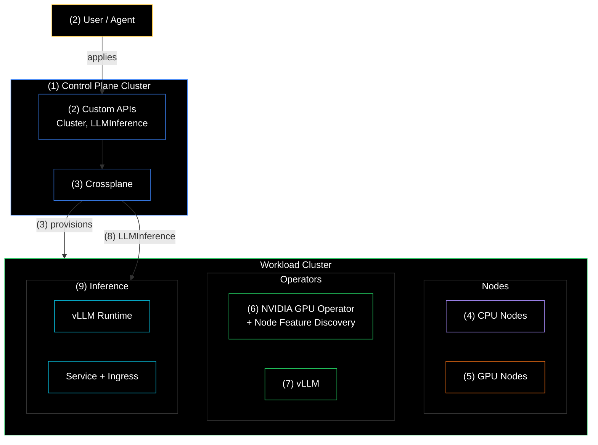

+++
title = "Building Inference-as-a-Service on Kubernetes"
date = 2026-03-23T15:00:00+00:00
draft = false
+++


Every prompt you send to ChatGPT, Claude, or Gemini runs on someone else's GPUs. Your data, your code, your company's secrets, all flowing through infrastructure you don't control. For most people, that's fine. But if you're in healthcare, finance, government, or anywhere that compliance actually matters, "fine" isn't good enough.

Here's the thing. Running AI models on your own infrastructure sounds like it should be straightforward. It's not. GPUs are brutally expensive. Get the setup wrong and you're burning hundreds of thousands of dollars on mistakes. Get it right, and you have **Inference-as-a-Service** that any team in your company can use, with your data never leaving your network.

In this video, we're going to build exactly that. A self-hosted inference platform on Kubernetes, from cluster provisioning to serving your first model. By the end, you'll have a working setup where anyone in your organization can deploy a model with a single custom resource. No GPU expertise required.

<!--more-->



## Setup

> The demo works only in AWS. Please open an [issue](https://github.com/vfarcic/crossplane-inference/issues) if you'd like the support for other hyperscalers.

> Make sure that Docker is up-and-running. We'll use it to create a KinD cluster.

> Watch [Nix for Everyone: Unleash Devbox for Simplified Development](https://youtu.be/WiFLtcBvGMU) if you are not familiar with Devbox. Alternatively, you can skip Devbox and install all the tools listed in `devbox.json` yourself.

```sh
git clone https://github.com/vfarcic/crossplane-inference

cd crossplane-inference

git pull

git fetch

git switch demo/inference

devbox shell

./dot.nu setup

source .env
```

## Self-Hosted AI Inference Explained

So, what is inference? In the AI world, there are two fundamental phases. There's **training**, where you feed massive datasets into a neural network and, over weeks or months, using thousands of GPUs, the model learns patterns and becomes capable of performing tasks. Training foundation models from scratch is out of reach for the vast majority of companies. It costs tens to hundreds of millions of dollars, requires specialized ML research teams, and takes months of GPU time. That's somebody else's problem. Then there's **fine-tuning**, where you take an existing model and adapt it to your specific domain or data. That's much more accessible, even doable on a single GPU, and many companies are already doing it. We won't go into fine-tuning in this video though.


What we're here to talk about is **inference**. Inference is the process of actually using a trained model. Every time you send a prompt to **ChatGPT**, **Claude**, **Gemini**, or any other LLM and get a response back, that's inference. The model isn't learning anything new from your prompt. It's running its frozen weights through a forward pass to generate output, one token at a time. Think of it this way. Training is teaching the student. Inference is the student taking the exam.

From an infrastructure perspective, inference is the part that matters to us today. Training is a batch job that a specialized ML team runs occasionally. Inference is a production service that runs all day, every day, serves real users, and needs everything we care about as DevOps engineers. Uptime, latency, scaling, cost control. And it needs GPUs available on demand, every single time someone makes a request.

Now, why would you want to self-host inference instead of just calling an API?


To answer that, we need to talk about open-weight models, and who's actually building them. If you want to run a model yourself, you need the weights to be publicly available. And right now, China dominates open-weight models. **Alibaba**'s **Qwen** family has been the most downloaded model on **Hugging Face** since October 2025. **DeepSeek** shook the entire industry when **R1** dropped in January 2025. **Zhipu AI**'s **GLM-5** is currently topping open-weight leaderboards. Then there's **Kimi**, **MiniMax**, **Yi**, **Baichuan**, and a bunch of others. Chinese open-weight models now account for roughly **thirty percent** of global AI usage, up from about one percent in late 2024.


What about the rest of the world? Europe has **Mistral**, and that's essentially it. One company. The EU has **five percent** of global AI computing power compared to **seventy-four percent** in the US. The investment gap is massive, and the regulatory burden from the AI Act isn't helping.


The US? Most American AI companies focus on proprietary, closed models. That's where the money is. **OpenAI**, **Anthropic**, **Google**, they sell API access. **Meta** is the big exception with the **LLaMA** series, but **LLaMA 4** was a disappointment. The benchmark results turned out to be fudged, and independent testing showed it underperforming its predecessor. **Google** has **Gemma 3**, **Microsoft** has **Phi-4**, and **OpenAI** finally released open weights with **GPT-OSS** in August 2025. But compared to the sheer volume and variety coming out of China, the US open-weight ecosystem is smaller.


So that raises the obvious question. Can you trust Chinese models? Probably not, at least not blindly. **NIST** found that **DeepSeek** models refuse to answer questions about topics sensitive to the Chinese government. That censorship is baked into the weights. It doesn't go away just because you're running it on your own hardware. On top of that, security researchers found that **DeepSeek** complied with up to **a hundred percent** of overtly malicious requests using common jailbreaking techniques, compared to **five to twelve percent** for US models. That's not great.

Can you make it relatively safe by self-hosting? Probably yes. Self-hosting means no data leaves your network. Your prompts aren't being sent to servers in China. You control the environment, the access, and the guardrails you put around it. It doesn't fix the censorship baked into the weights, and it doesn't fix weak safety guardrails, but it eliminates the data exposure risk. And for many organizations, that's the part that matters most.


Now, let me be clear about something. For most use cases, it's cheaper to just call an API. Use OpenAI, use Anthropic, use Google. GPUs in hyperscalers are expensive. Buying your own GPUs is expensive too, and there's a long waiting list. The technology is changing fast, so making big hardware investments might not be the smartest move right now. I won't go into the details of the cost comparison here. Watch [Why Self-Hosting AI Models Is a Bad Idea](https://youtu.be/pWtDTkfNaUU) for that.

But it might still make sense to self-host inference. Your company policies might require it. You might be in healthcare, finance, or government, where regulations demand that data never leaves your controlled environment. Your company might be big enough that the scale makes self-hosting cheaper than paying per token. You might need low latency and can't afford network round-trips to external APIs. You might have fine-tuned models that are your intellectual property, and you don't want those weights sitting on someone else's infrastructure. Or you might simply be tired of rate limits and want your throughput bounded by your own hardware, not someone else's capacity planning.

So, where do you run self-hosted inference?


There is really only one reasonable answer. **Kubernetes** with GPU nodes. Inference needs GPU scheduling, and Kubernetes has first-class support for it through device plugins, the **NVIDIA GPU Operator**, and node feature discovery. You get declarative GPU management, the same way you manage everything else. You get autoscaling based on GPU utilization metrics. You get multi-tenancy with namespaces, RBAC, and resource quotas so different teams can share GPU infrastructure without stepping on each other. You get portability, so the same manifests run on **EKS**, **GKE**, **AKS**, or on-prem.

Could you run it on VMs or bare metal? Sure, but you'd be reinventing everything Kubernetes already gives you. No orchestration, no standardized GPU sharing, no autoscaling, no multi-tenancy. The entire inference ecosystem, NVIDIA GPU Operator, vLLM, KAI Scheduler, DCGM for monitoring, all of it is built for Kubernetes. There are no VM equivalents.


Now, how do we provide those clusters to people in our company? We build an internal developer platform. We need a way to let teams request GPU-enabled Kubernetes clusters without having to understand all the underlying complexity. And since we've already agreed that Kubernetes is the foundation, we need something that works natively within that world. That's where **Crossplane** comes in. It has providers for all the major hyperscalers, and even if you're running on-prem without a native Crossplane provider, it can manage any Kubernetes resources, including **Cluster API**, which means it works pretty much everywhere. It lets us define custom APIs that hide the complexity behind simple, declarative resources. And it's a graduated **CNCF** project, so it's not going anywhere.

Now, you might be thinking that sounds too complicated. Kubernetes? Complex. Crossplane? Not something you figure out in a few hours. vLLM? NVIDIA operators? A bunch of other moving parts? Not a walk in the park. And the need to make it all specific to your organization's needs? Bigger than ever. If you're looking for a simpler solution, thinking you'll just solve it with virtual machines or buy a bunch of Mac Studios, don't. Just don't.


Inference is not something to be taken lightly. This is not your typical Node.js app where you solve problems by overprovisioning and it costs you a few extra bucks a month. This shit is expensive. GPUs are expensive. Do it wrong and you'll experience a lot of pain. You could be responsible for hundreds of thousands or even millions of dollars in wasted cost from mistakes you'll make along the way.


So, how are we going to do this?

We'll set up a Kubernetes cluster with GPU nodes. We'll install NVIDIA operators, vLLM, and whatever else that cluster needs to serve models. Once it's all running, we'll do inference. We'll build it in a way that works in almost any Kubernetes cluster, anywhere, whether that's one of the hyperscalers or on-prem. The end result is Inference-as-a-Service that you can offer to whoever needs it in your company.

Now, we're starting with the basics. This video focuses on a minimal, yet fully operational solution that works from the start. The goal is to get you familiar with self-hosted inference and the core building blocks. In upcoming videos, we'll tackle the more advanced stuff like disaggregated inference, multi-cluster patterns, KV-cache routing, Gateway API, autoscaling, and more.

Let's start by spinning up a Kubernetes cluster with everything we need.

## GPU Kubernetes Cluster Setup

Here's what a cluster definition looks like from the user's perspective.

```sh
cat examples/cluster-aws-small.yaml
```

```yaml
apiVersion: devopstoolkit.ai/v2
kind: Cluster
metadata:
  name: inference-small
spec:
  crossplane:
    compositionSelector:
      matchLabels:
        provider: aws
        cluster: eks
  parameters:
    nodeSize: small
    minNodeCount: 2
    gpu:
      enabled: true
      nodeSize: small
    apps:
      traefik:
        enabled: true
      nvidia:
        enabled: true
      vllm:
        enabled: true
```

That's a custom API. Someone on the platform team, someone who understands infrastructure, built a Crossplane Composition that defines everything that happens behind the scenes. The provisioning, the GPU node groups, the operator installations, the networking, all of it. Users don't see any of that. They just fill in a few fields and create an instance of the service. Pick a provider, set a node size, enable GPUs, choose which apps to install. That's all they need to know.

Let's apply it.

```sh
kubectl --namespace inference apply \
    --filename examples/cluster-aws-small.yaml
```

> It might take up to 30 minutes to set it all up in AWS. We need to wait...

Now we wait. Behind the scenes, Crossplane is creating an EKS cluster, setting up CPU and GPU node groups, installing NVIDIA operators, deploying vLLM, configuring Traefik, and wiring it all together. This takes a while.

```sh
kubectl --namespace inference \
    wait cluster.devopstoolkit.ai inference-small \
    --for=condition=Ready --timeout=1800s
```

And there we go. We now have a Kubernetes cluster with both CPU nodes for regular workloads and GPU nodes for inference.


We need to update our kubeconfig so we can talk to the new cluster.

```sh
aws eks update-kubeconfig --name inference-small \
    --region us-east-1 --kubeconfig gpu-kubeconfig.yaml
```


Next, we'll grab the ingress host so we can reach services running inside the cluster.

```sh
export INGRESS_HOST=$(./dot.nu get ingress --provider aws \
    --output host --kubeconfig gpu-kubeconfig.yaml | tail -1)
```

Let's take a look at what got installed by listing the Custom Resource Definitions.

```sh
kubectl get crds --kubeconfig gpu-kubeconfig.yaml
```

The output is as follows (truncated for brevity).

```text
NAME                                            CREATED AT
cacheservers.production-stack.vllm.ai           2026-02-20T18:17:02Z
clusterpolicies.nvidia.com                      2026-02-20T18:17:05Z
gatewayclasses.gateway.networking.k8s.io        2026-02-20T18:18:05Z
gateways.gateway.networking.k8s.io              2026-02-20T18:18:05Z
ingressroutes.traefik.io                        2026-02-20T18:18:12Z
loraadapters.production-stack.vllm.ai           2026-02-20T18:17:02Z
...
nodefeaturegroups.nfd.k8s-sigs.io               2026-02-20T18:17:07Z
nodefeaturerules.nfd.k8s-sigs.io                2026-02-20T18:17:07Z
nvidiadrivers.nvidia.com                        2026-02-20T18:17:06Z
...
vllmrouters.production-stack.vllm.ai            2026-02-20T18:17:02Z
vllmruntimes.production-stack.vllm.ai           2026-02-20T18:17:02Z
```

We can see that, among others, NVIDIA CRDs like `clusterpolicies.nvidia.com` and `nvidiadrivers.nvidia.com` are in there, along with vLLM resources like `vllmrouters.production-stack.vllm.ai` and `vllmruntimes.production-stack.vllm.ai`. Traefik, Gateway API, Node Feature Discovery. It's all there. The user is in full control of what the cluster should be, without having to understand how any of it actually gets created. That's the whole point of building services and exposing them through custom APIs, with Crossplane being how we make that happen.

Now that we have a GPU-enabled cluster ready to go, let's put it to work. Let's deploy a model and run some inference.

## Deploy and Serve LLMs

Just like the cluster itself, deploying a model follows the same pattern. There's a custom API that hides all the complexity. Let's take a look at what a model deployment looks like.

```sh
cat examples/llm-qwen.yaml
```

```yaml
apiVersion: inference.devopstoolkit.ai/v1alpha1
kind: LLMInference
metadata:
  name: qwen
spec:
  model: Qwen/Qwen2.5-1.5B-Instruct
  gpu: 1
  ingressHost: qwen.127.0.0.1.nip.io
  providerConfigName: inference-small
  targetNamespace: dev
```

That's it. An `LLMInference` resource. We specify which `model` we want, in this case `Qwen/Qwen2.5-1.5B-Instruct`. We tell it how many GPUs to use. We set the `ingressHost` so we can reach it from outside the cluster. The `providerConfigName` points to the cluster we just created, and `targetNamespace` is where the model will actually run. That's all a user needs to fill in. Everything else, the vLLM runtime configuration, the service, the ingress route, is handled by the Crossplane Composition behind the scenes.

Let's apply it and wait for it to become ready.

Now, the command looks a bit weird because this is a demo. We're using `sed` to swap in the actual ingress host since we don't have a real domain tied to this throwaway cluster. In a real environment, you'd just have the domain baked into the manifest and apply it directly with `kubectl apply`. No piping, no substitution. Just a straight apply.

```sh
cat examples/llm-qwen.yaml \
    | sed "s/127.0.0.1.nip.io/$INGRESS_HOST/" \
    | kubectl apply --namespace inference --filename -

kubectl wait llminference qwen --namespace inference \
    --for=condition=Ready --timeout=900s
```

Now, this takes a while. The container image for even a small model is massive. `Qwen2.5-1.5B-Instruct` is one of the smallest models you'd actually want to use, and the image is still huge. Pulling it, loading the weights into GPU memory, and getting the runtime ready all takes time. That's just the reality of working with LLMs. They're big.

Let's poll until the model endpoint is live.

```sh
WAIT=0
while ! curl -s http://qwen.$INGRESS_HOST/v1/models | grep -q Qwen; do
    echo "Model is not yet ready, waiting..."
    sleep 30
    WAIT=$((WAIT+30))
    [ $WAIT -ge 1800 ] && echo "Timed out waiting for model (30m)" && exit 1
done
echo 'Model is ready!'
```

Now let's send it a request. vLLM exposes the **OpenAI-compatible API** out of the box. That means any tool, any SDK, any piece of code that works with OpenAI's API works with this. You don't need to change a single line. Just point it at your own endpoint instead of `api.openai.com`. So we'll hit `/v1/chat/completions` with a simple prompt.

```sh
curl -s http://qwen.$INGRESS_HOST/v1/chat/completions \
    -H "Content-Type: application/json" \
    -d '{
      "model": "Qwen/Qwen2.5-1.5B-Instruct",
      "messages": [{"role": "user", "content": "Explain Kubernetes"}]
    }' | jq .
```

Here's what we got.

```json
{
  "id": "chatcmpl-93fc43c1af9e82d5",
  "object": "chat.completion",
  "created": 1771621922,
  "model": "Qwen/Qwen2.5-1.5B-Instruct",
  "choices": [
    {
      "index": 0,
      "message": {
        "role": "assistant",
        "content": "Kubernetes (often referred to as k8s) is an open-source container orchestration platform developed and maintained by the Cloud Native Computing Foundation (CNCF). It's designed to manage containerized applications across multiple hosts, providing automated deployment, scaling, and management of containerized applications.\n\nKey features of Kubernetes include:\n\n1. Automated Deployment: Kubernetes can automatically deploy containers onto nodes in your cluster using templates or manifests you provide.\n\n2. Scalability: It allows you to easily scale up or down your application based on demand.\n\n3. Self-healing: Kubernetes will automatically restart containers that fail or become unhealthy.\n\n4. Service Discovery: It enables easy communication between different services within your cluster.\n\n5. Networking: Kubernetes provides network policies to control how pods communicate with each other.\n\n6. Resource Management: It helps you optimize resource usage by allocating resources efficiently among your pods.\n\n7. Rolling Updates: Allows for gradual updates to your application without downtime.\n\n8. Rollbacks: Provides mechanisms to roll back changes if something goes wrong during upgrades.\n\n9. Monitoring and Logging: Integrates with popular monitoring tools like Prometheus and integrates well with logging solutions like ELK Stack.\n\n10. Security: Includes built-in security measures such as pod security policies and service account access controls.\n\nKubernetes has gained significant popularity due to its ability to simplify the process of deploying and managing complex cloud-native applications at scale. It supports various platforms including AWS, Google Cloud, Azure, and local development environments.",
        "refusal": null,
        "annotations": null,
        "audio": null,
        "function_call": null,
        "tool_calls": [],
        "reasoning": null,
        "reasoning_content": null
      },
      "logprobs": null,
      "finish_reason": "stop",
      "stop_reason": null,
      "token_ids": null
    }
  ],
  "service_tier": null,
  "system_fingerprint": null,
  "usage": {
    "prompt_tokens": 32,
    "total_tokens": 328,
    "completion_tokens": 296,
    "prompt_tokens_details": null
  },
  "prompt_logprobs": null,
  "prompt_token_ids": null,
  "kv_transfer_params": null
}
```

And there it is. We just ran inference on our own infrastructure. Your prompts, your data, nothing leaves your network. From here, you can connect any OpenAI-compatible tool to this endpoint. Point Cursor at it, hook up OpenCode, build a custom agent, embed it into your apps. Whatever you need. It's a standard API, so anything that speaks OpenAI works out of the box.

That's Inference-as-a-Service. One custom resource, and any team in your company can deploy a model and start using it. The platform team builds the Composition once, and everyone else just fills in a few fields. If you want to dig into how those Crossplane Compositions are built, the links are in the description.


Now, we've seen it work, but we haven't really looked at what's going on under the hood. Let's take a step back and look at the full architecture.

## Inference Platform Architecture


(1) Everything starts with the control plane cluster. That's where Crossplane lives, along with all the custom API definitions. (2) When a user, or an agentic system for that matter, applies a `Cluster` resource, (3) Crossplane picks it up and provisions a full Kubernetes cluster. That cluster gets (4) CPU nodes for regular workloads and (5) GPU nodes for inference. As part of the same Composition, (6) the NVIDIA GPU Operator and Node Feature Discovery get installed so the cluster knows how to manage its GPUs, and (7) vLLM gets deployed so the cluster is ready to serve models. Then, when someone applies an (8) `LLMInference` resource to the control plane, (9) Crossplane reaches into the target cluster and creates the vLLM runtime, the service, and the ingress route. The model gets pulled, loaded into GPU memory, and starts serving requests. The beauty of this is that these are just Kubernetes resources. You can apply them with `kubectl`, manage them through GitOps with Argo CD or Flux, or do whatever else you're already doing with Kubernetes. And since they're standard custom resources, AI agents can use them too. An LLM with the right tools can provision clusters and deploy models the exact same way we just did, through the same declarative resources.



That's the full picture. Now you might be wondering whether Crossplane Compositions are worth the effort for something this simple. And honestly, even for this basic setup, they're already pulling their weight. Users don't need to know how EKS node groups work, how to configure the NVIDIA GPU Operator, or how to wire up vLLM. They fill in a few fields and get a working inference endpoint. That alone is valuable.

But here's the thing. We're not even close to done. What we built today is the minimum viable version. Production-ready inference needs a lot more. Disaggregated prefill and decode for better GPU utilization. KV-cache routing so repeated prompts don't waste compute. Gateway API for proper traffic management. Autoscaling based on GPU metrics and queue depth. Multi-cluster patterns for high availability. That's where Crossplane Compositions become not just useful but essential. The complexity behind those features is massive, and there's no way you'd want every team in your company figuring that out on their own.

We'll tackle all of that in upcoming videos. This is the foundation. Everything else builds on top of it.

## Destroy

```sh
./dot.nu destroy aws

exit
```
