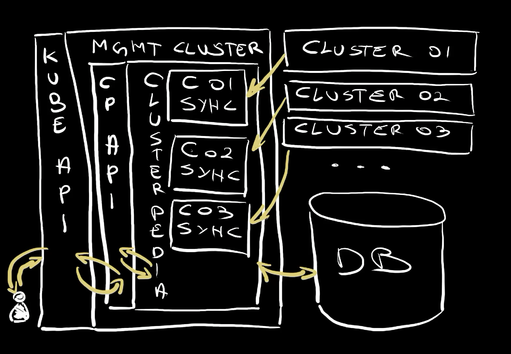

+++
title = 'Single Pane of Glass for Kubernetes Clusters with Clusterpedia'
date = 2024-05-06T16:00:00+00:00
draft = false
+++

For a while now, we have tools that promise that we can manage a **fleet of Kubernetes clusters** as one, yet they all failed to do just that. They all failed to provide a single pane of glass for all the clusters in a fleet. All the tools I know eventually show us what is happening in a single cluster and, honestly, I don't need tools for that. I can easily see what's going on in a cluster with kubectl or any, literally any, Kubernetes dashboard. What I'm missing, and what all the tools I tried so far fail to deliver, is a **single pane of glass** for all my Kubernetes clusters.
<!--more-->



Let's say that I have ten clusters and I would like to see what's going on in all of them. As it is now, I would need to go to each of them separately and query each for information I need. Observability tools like Grafana, Prometheus, Jaeger, Loki, and others help a lot, but they are focused on metrics, traces, logs, and other data, and that's great, but that's not what I'm talking about today. GitOps tools like Argo CD could give me such a view, but they are limited in terms of query capabilities.

What I would really like is to use kubectl but treat all my clusters as one big entity. I would like to have a single pane of glass. I would like to be able to say "**give me all the deployments in all namespaces in all my clusters**" and, bada bim, bada bum, all the deployments are shown.

Actually, that's exactly what I'm going to get by executing this kubectl get deployments command.

> Do not try to execute the command that follows. It is only a preview of what we'll set up later.

```sh
kubectl --cluster clusterpedia get deployments --all-namespaces
```

The output is as follows (truncated for brevity).

```
NAMESPACE         CLUSTER NAME                                                         READY UP-TO-DATE AVAILABLE AGE
crossplane-system dot-02  crossplane-contrib-function-go-templating-eff9a0400879       1/1   1          1         17m
a-team            dot-01  silly-demo                                                   2/2   2          2         23m
crossplane-system dot-01  crossplane                                                   1/1   1          1         22m
...
crossplane-system dot-02  crossplane-contrib-function-patch-and-transform-97397f24bd9f 1/1   1          1         17m
crossplane-system dot-02  crossplane-contrib-provider-sql-a2c547580f15                 1/1   1          1         17m
crossplane-system dot-02  crossplane-provider-kubernetes-83c72134f895                  1/1   1          1         18m
crossplane-system dot-02  crossplane-rbac-manager                                      1/1   1          1         18m
a-team            dot-02  how-about-this                                               0/2   2          0         22m
a-team            dot-02  silly-demo                                                   2/2   2          2         23m
a-team            dot-02  something-else                                               2/2   2          2         23m
...
kube-system       dot-03  konnectivity-agent                                           2/2   2          2         26m
kube-system       dot-03  metrics-server                                               2/2   2          2         26m
a-team            dot-03  silly-demo                                                   2/2   2          2         23m
...
```

Look at that. Isn't that impressive?

I executed a kubectl command as I normally do but the output shows Deployments from three different clusters. There's `dot-01`, `dot-02`, and `dot-03`. Now, not only that I got all the information I need, but it was lightning fast. Whichever whitchcraft ritual was performed for me to get that information, it is obvious that kubectl did not go to each of the clusters to get the data. That would take longer that it took. There's something else going on here and that something else is a project called [Clusterpedia](https://clusterpedia.io/).

Clusterpedia, as you can guess from the name, is inspired by Wikipedia. It's supposed to act as encyclopedia that contains information from all your clusters. We can use that information to search, filter, sort, and organize data. Unlike some other solutions that, typically, fall into service catalog category, Clusterpedia is compatible with Kubernetes OpenAPI. That means that from the use perspective, it feels like all those clusters are one big cluster and we can use kubectl or any other tool designed to use Kubernetes API. It looks and feels like it is one big cluster, which is amazing since, more often than not, we tend to have many clusters for technical, performance, or security reasons. Yet, with Clusterpedia, we can work on all of them as if they are one big cluster. It's almost as if each cluster would be a separate namespace except that they are "real" physical clusters. It's truly a single pane of glass.

It's awesome, so let's take a look at it.

## Setup

```sh
git clone https://github.com/vfarcic/clusterpedia-demo

cd clusterpedia-demo
```

*Watch https://youtu.be/WiFLtcBvGMU if you are not familiar with Devbox. Alternatively, you can skip Devbox and install all the tools listed in `devbox.json` yourself.*

```sh
devbox shell

chmod +x setup.sh

./setup.sh

source .env
```

## Clusterpedia Setup

Right now, I have three clusters running some resources and a fourth cluster where I installed Clusterpedia. It's just there, not doing much. I did not configure it yet since I wanted to show you how we can let it know which clusters exist in our fleet and which resources should be observable through it.

As a proof that nothing is yet configured, I can execute get pediacluster which should retrieve the list of all the clusters Clusterpedia is aware of.

```sh
kubectl get pediacluster
```

The output is as follows.

```
No resources found
```

As you can see, Clusterpedia knows nothing about my clusters. We'll change that soon. For now, I want to show you a definition of ClusterSyncResources.

```sh
cat cluster-sync-resources.yaml
```

The output is as follows.

```yaml
apiVersion: cluster.clusterpedia.io/v1alpha2
kind: ClusterSyncResources
metadata:
  name: common
spec:
  syncResources:
    - group: "apps"
      resources:
        - deployments
    - group: ""
      resources:
        - services
    - group: "networking.k8s.io"
      resources:
        - ingresses
    - group: "devopstoolkitseries.com"
      resources:
        - "*"
```

`ClusterSyncResources` defines which resources should be synced into Clusterpedia. In this specific case, I decided that `deployments`, `services`, and `ingresses` should be synchronized. Also, I defined that any resource (`*`) that belongs to the `devopstoolkitseries.com` group should be synced as well.

Let's apply it.

```sh
kubectl apply --filename cluster-sync-resources.yaml
```

The output is as follows.

```
clustersyncresources.cluster.clusterpedia.io/common created
```

Now, that resource does nothing by itself. It's only a definition of sync resources that can be referenced in PediaClusters. It is meant to avoid duplication in cases when we want some, if not all, clusters to have the same list of resources that should be synced.

Let's move into the "real deal" and take a look at a PediaCluster definition.

```sh
cat pediaclusters/dot-01.yaml
```

The output is as follows.

```
apiVersion: cluster.clusterpedia.io/v1alpha2
kind: PediaCluster
metadata:
  name: dot-01
spec:
  kubeconfig: ...
  syncResourcesRefName: common
  syncResources: []
```

That definition references one of my clusters. That reference is accomplished through the `kubeconfig` I would normally use to connect to that cluster. It enables Clusterpedia to communicate with that cluster and gather information about specific resources. Which resources it will fetch depends on us. In this specific case, I specificed that it should use the ClusterSyncResources we saw earlier (`common`).

I could also specify `syncResources` specific to that cluster but, in this case, I chose to add none (`[]`).

Let's take a look at the specification of the second cluster.

```sh
cat pediaclusters/dot-02.yaml
```

The output is as follows.

```yaml
apiVersion: cluster.clusterpedia.io/v1alpha2
kind: PediaCluster
metadata:
  name: dot-02
spec:
  kubeconfig: ...
  syncResourcesRefName: common
  syncResources:
    - group: "apps"
      resources:
        - "*"
    - group: ""
      resources:
        - "*"
    - group: "networking.k8s.io"
      resources:
        - "*"
    - group: "azure.upbound.io"
      resources:
        - "*"
    - group: "dbforpostgresql.azure.upbound.io"
      resources:
        - "*"
```

In this case, apart from the resources specified in the `common` manifest, I'm also saying that it should add all resources (`*`) from the `apps` group and all resources (`*`) that do not have any group specified (`""`). That would be resources like Pods. Then there are all resources (`*`) that belong to the `networking.k8s.io`. `azure.upbound.io`, and `dbforpostgresql.azure.upbound.io` groups.

Essentially, I'm saying that ClusterPedia should sync additional resources beyond those specified in the common list of resources.

Then there is the manifest for the third cluster.

```sh
cat pediaclusters/dot-03.yaml
```

The output is as follows.

```yaml
apiVersion: cluster.clusterpedia.io/v1alpha2
kind: PediaCluster
metadata:
  name: dot-03
spec:
  kubeconfig: ...
  syncResourcesRefName: common
  syncResources:
    - group: "apps"
      resources:
        - "*"
    - group: ""
      resources:
        - "*"
    - group: "networking.k8s.io"
      resources:
        - "*"
    - group: "azure.upbound.io"
      resources:
        - "*"
    - group: "dbforpostgresql.azure.upbound.io"
      resources:
        - "*"
```

Apart from the different `name` and `kubeconfig`, this third cluster follows the same rules as the second, so there's not much to say about it.

Let's apply those PediaCluster resources,...

```sh
kubectl apply --filename pediaclusters
```

...and execute get pediacluster again.

```sh
kubectl get pediacluster
```

The output is as follows (truncated for brevity).

```
NAME   READY VERSION APISERVER
dot-01 True  v1.28.5 https://dot-01-dot-...azmk8s.io:443
dot-02 True  v1.28.5 https://dot-02-dot-...azmk8s.io:443
dot-03 True  v1.28.5 https://dot-03-dot-...azmk8s.io:443
```

We can see that, this time, Clusterpedia knows that there are three clusters from which it should sync resources.

Now, the important note here is that everything is based on Kubernetes custom resources. As a result, we do no need any "special" tools but simply use `kubectl` to query resources.

We're almost there. We're almost ready to use Clusterpedia as a single pane of glass for all our clusters. The only thing missing is to update our kube config.

Right now, if I return all the clusters defined in my Kube Config...

```sh
kubectl config get-clusters
```

The output is as follows.

```
NAME
dot-00
```

...there is only one. That's the "management" cluster, the one where Clusterpedia is running. There is not information about any other cluster I have.

For Clusterpedia to work correctly, Kube Config should be updated with the information about all the clusters we can observe. Now, this is a good news / bad news type of situation.

There is a way to add all the clusters automatically. That's good news. The bad news is that we need to execute a nasty hack to do that. I would have expected something more "elegant" than "run this script from a Git repo", yet that's what it is and I'll be brave and execute it.

```sh
curl -sfL \
    https://raw.githubusercontent.com/clusterpedia-io/clusterpedia/v0.7.0/hack/gen-clusterconfigs.sh \
    | sh -
```

The output is as follows.

```
Current Context: dot-00
Current Cluster: dot-00
        Server: https://dot-00-dot-202404110102-7f9f9b-zhw4pj6f.hcp.eastus.azmk8s.io:443
        TLS Server Name: 
        Insecure Skip TLS Verify: 
        Certificate Authority: 
        Certificate Authority Data: ***

Cluster "clusterpedia" set.
Cluster "dot-01" set.
Cluster "dot-02" set.
Cluster "dot-03" set.
```

If I retrieve all the clusters from my Kube Config...

```sh
kubectl config get-clusters
```

The output is as follows.

```
NAME
clusterpedia
dot-00
dot-01
dot-02
dot-03
```

...we can see that new ones were added (`dot-01`, `dot-02`, `dot-03`) and that there is also a mysterios `clusterpedia` cluster.

Now, none of those clusters are pointing to the actual clusters but, rather, to "special" API endpoints in the management cluster, the one where Clusterpedia is running. I still do not have access to real clusters but only a convenient way to query information from specific clusters if I choose to do so.

Let's see how that looks like by, for example, executing `kubectl`, specifying that it should retrieve information from the cluster `dot-01` and that we're interested in the list of all `api-resoruces` available in that cluster.

```sh
kubectl --cluster dot-01 api-resources
```

The output is as follows.

```
NAME        SHORTNAMES APIVERSION                       NAMESPACED KIND
services    svc        v1                               true       Service
deployments deploy     apps/v1                          true       Deployment
sqlclaims              devopstoolkitseries.com/v1alpha1 true       SQLClaim
sqls                   devopstoolkitseries.com/v1alpha1 false      SQL
ingresses   ing        networking.k8s.io/v1             true       Ingress
```

It seems that only a few resource types are available. I can guarantee that cluster supports much more than `services`, `deployments`, `sqlclaims`, `sqls`, and `ingresses`. Heck, according to that information, that cluster cannot even run Pods.

That's actually a proof that we are not querying the actual cluster but information Clusterpedia gathered from that cluster. Those are resource types we specified Clusterpedia should gather from that cluster. We can see only what we told Clusterpedia we are interested in.

Similarly, if we execute a similar command that will retrieve api-resources from the dot-02 cluster...

```sh
kubectl --cluster dot-02 api-resources
```

The output is as follows (truncated for brevity).

```
NAME                          SHORTNAMES APIVERSION                               NAMESPACED KIND
configmaps                    cm         v1                                       true       ConfigMap
endpoints                     ep         v1                                       true       Endpoints
events                        ev         v1                                       true       Event
limitranges                   limits     v1                                       true       LimitRange
...
controllerrevisions                      apps/v1                                  true       ControllerRevision
daemonsets                    ds         apps/v1                                  true       DaemonSet
deployments                   deploy     apps/v1                                  true       Deployment
...
providerconfigs                          azure.upbound.io/v1beta1                 false      ProviderConfig
providerconfigusages                     azure.upbound.io/v1beta1                 false      ProviderConfigUsage
resourcegroups                           azure.upbound.io/v1beta1                 false      ResourceGroup
...
activedirectoryadministrators            dbforpostgresql.azure.upbound.io/v1beta1 false      ActiveDirectoryAdministrator
configurations                           dbforpostgresql.azure.upbound.io/v1beta1 false      Configuration
databases                                dbforpostgresql.azure.upbound.io/v1beta1 false      Database
...
sqlclaims                                devopstoolkitseries.com/v1alpha1         true       SQLClaim
sqls                                     devopstoolkitseries.com/v1alpha1         false      SQL
ingressclasses                           networking.k8s.io/v1                     false      IngressClass
ingresses                     ing        networking.k8s.io/v1                     true       Ingress
networkpolicies               netpol     networking.k8s.io/v1                     true       NetworkPolicy
```

We can see that the list of resources Clusterpedia is retrieving from that cluster is much longer. That was to be expected since for that second cluster we specified additional resources to sync.

Finally, there is the "special" cluster called `clusterpedia` so let's see what that one sees as available API resources.

```sh
kubectl --cluster clusterpedia api-resources
```

The output is as follows (truncated for brevity).

```
NAME                          SHORTNAMES APIVERSION                               NAMESPACED KIND
configmaps                    cm         v1                                       true       ConfigMap
endpoints                     ep         v1                                       true       Endpoints
events                        ev         v1                                       true       Event
...
controllerrevisions                      apps/v1                                  true       ControllerRevision
daemonsets                    ds         apps/v1                                  true       DaemonSet
deployments                   deploy     apps/v1                                  true       Deployment
...
providerconfigs                          azure.upbound.io/v1beta1                 false      ProviderConfig
providerconfigusages                     azure.upbound.io/v1beta1                 false      ProviderConfigUsage
resourcegroups                           azure.upbound.io/v1beta1                 false      ResourceGroup
...
activedirectoryadministrators            dbforpostgresql.azure.upbound.io/v1beta1 false      ActiveDirectoryAdministrator
configurations                           dbforpostgresql.azure.upbound.io/v1beta1 false      Configuration
databases                                dbforpostgresql.azure.upbound.io/v1beta1 false      Database
...
sqlclaims                                devopstoolkitseries.com/v1alpha1         true       SQLClaim
sqls                                     devopstoolkitseries.com/v1alpha1         false      SQL
ingressclasses                           networking.k8s.io/v1                     false      IngressClass
ingresses                     ing        networking.k8s.io/v1                     true       Ingress
networkpolicies               netpol     networking.k8s.io/v1                     true       NetworkPolicy
```

That one represents a global resource information that is a union of resource types across all the clusters.

Now that we saw which resource types Clusterpedia is aware of, let's do some quering.

## Clusterpedia Search, Filtering, and Sorting

Let's say that we would like to retrieve all deployments from all the namespaces in all the clusters. We can do that by executing `kubectl`, specifying `clusterpedia` as the cluster, and saying give me all `deployments` from `--all-namespaces`.

```sh
kubectl --cluster clusterpedia get deployments --all-namespaces
```

The output is as follows (truncated for brevity).

```
NAMESPACE   CLUSTER NAME               READY UP-TO-DATE AVAILABLE AGE
...
kube-system dot-02  konnectivity-agent 2/2   2          2         32m
kube-system dot-02  metrics-server     2/2   2          2         32m
kube-system dot-03  konnectivity-agent 2/2   2          2         28m
kube-system dot-03  metrics-server     2/2   2          2         28m
a-team      dot-03  silly-demo         2/2   2          2         24m
kube-system dot-03  coredns            2/2   2          2         28m
kube-system dot-03  coredns-autoscaler 1/1   1          1         28m
kube-system dot-01  konnectivity-agent 2/2   2          2         40m
```

That's brilliant. That's exactly what I expected when I looked for a "single pane of glass" type of a solution. I can see the deployments from `dot-01`, `dot-02`, and `dot-03` clusters and we did not have to do anything special. We used kubectl as we would normally do. The only difference is that we instructed it to use clusterpedia cluster which is not really a cluster but, rather, a "special" endpoint in the management cluster, the one where Clusterpedia was installed.

Now, let's say that I am interested in Pods instead of Deployments.

The command follows the same logic. Go to the cluster `clusterpedia` and retrieve all `pod` from `--all-namespaces`. 

```sh
kubectl --cluster clusterpedia get pods --all-namespaces
```

The output is as follows (truncated for brevity).

```
NAMESPACE   CLUSTER NAME                            READY STATUS  RESTARTS AGE
...
kube-system dot-02  csi-azuredisk-node-5hg9h        3/3   Running 0        32m
kube-system dot-02  kube-proxy-6qgwz                1/1   Running 0        32m
kube-system dot-02  metrics-server-7fd45bf99d-5f5zw 2/2   Running 0        31m
kube-system dot-02  metrics-server-7fd45bf99d-5lw6x 2/2   Running 0        31m
a-team      dot-03  silly-demo-7796698d8d-pl9l8     1/1   Running 0        25m
kube-system dot-03  azure-ip-masq-agent-6jwrs       1/1   Running 0        28m
...
```

There is something suspicious in the output. There are Pods from clusters `dot-02` and `dot-03` but not a single one from dot-01. Does that mean that there are not Pods in that cluster? Well... No... That means that we did not instruct Clusterpedia to fetch Pods from that cluster. If you take another look into PediaCluster resource we used earlier, you'll see that Pods are not in the list of resources it should sync from that cluster. That could be for security reasons (maybe we do not want anyone looking at the single pane of glass to see pods) or any other reason.

The point is that only resources we specify are "discovered" by Clusterpedia and, in case of the dot-01 cluster Pods are not one of those.

Any other kubectl command related to observability should work as well. We can, for example, ask the API to search all clusters (`clusterpedia`), look only inside `a-team` Namespace, and retrieve all `deployments`.

```sh
kubectl --cluster clusterpedia --namespace a-team get deployments
```

The output is as follows.

```
CLUSTER NAME           READY UP-TO-DATE AVAILABLE AGE
dot-02  how-about-this 0/2   2          0         25m
dot-03  silly-demo     2/2   2          2         26m
dot-02  silly-demo     2/2   2          2         26m
dot-01  silly-demo     2/2   2          2         26m
dot-02  something-else 2/2   2          2         26m
```

We can see all the Deployments from the a-team Namespace across all the clusters. We can even see that there is something wrong with `how-about-this` Deployment in the `dot-02` cluster by observing that `0` out of `2` Pods are running.

What we saw so far is great, but that's only the tip of the iceberg. We can do much much more by leveraging Clusterpedia`s search functionality. The resources it syncs from clusters into its internal database are enriched with "special" labels which we can use as selectors when retrieving resources.

For example, let's say that we are interested only in Deployments with names equal to silly-demo. We could get those with the same command as before augmented with `--selector` that filters resources so that only those with the label `names` set to `sily-demo` are retrieved.

```sh
kubectl --cluster clusterpedia --namespace a-team \
    get deployments \
    --selector "search.clusterpedia.io/names=silly-demo"
```

The output is as follows.

```
CLUSTER NAME       READY UP-TO-DATE AVAILABLE AGE
dot-03  silly-demo 2/2   2          2         27m
dot-02  silly-demo 2/2   2          2         27m
dot-01  silly-demo 2/2   2          2         27m
```

Pum! Those are all Deployments with the name silly-demo in the a-team namespace in any of the clusters.

There are many many other ways to search using the selector. For example, we can use the `fuzzy-name` label to search for any Deployment with the name that contains the word `something`.

```sh
kubectl --cluster clusterpedia --namespace a-team \
    get deployments \
    --selector "internalstorage.clusterpedia.io/fuzzy-name=something"
```

The output is as follows.

```
CLUSTER NAME           READY UP-TO-DATE AVAILABLE AGE
dot-02  something-else 2/2   2          2         27m
```

We can also say "give me all the Pods in the a-team Namespace and filter the results by the field `phase` set to `Running`.

```sh
kubectl --cluster clusterpedia --namespace a-team \
    get pods --field-selector="status.phase=Running"
```

The output is as follows.

```
CLUSTER NAME                           READY STATUS  RESTARTS AGE
dot-03  silly-demo-7796698d8d-89zq8    1/1   Running 0        34m
dot-03  silly-demo-7796698d8d-pl9l8    1/1   Running 0        34m
dot-02  silly-demo-7796698d8d-qlzps    1/1   Running 0        35m
dot-02  silly-demo-7796698d8d-t8t75    1/1   Running 0        35m
dot-02  something-else-fb6bd48c8-2zvrt 1/1   Running 0        34m
dot-02  something-else-fb6bd48c8-7mfnb 1/1   Running 0        34m
```

Pum! Those are all the Pods that are currently running, except for the Pods in the dot-01 cluster since we choose not to include those.

How about the opposite. We can use `notin` operator to specify all the Pods with the phase that is not set to `Running`.

```sh
kubectl --cluster clusterpedia --namespace a-team \
    get pods --field-selector="status.phase notin (Running)"
```

The output is as follows.

```
CLUSTER NAME                            READY STATUS  RESTARTS AGE
dot-02  how-about-this-6c449f8d4b-9fftl 0/1   Pending 0        40m
dot-02  how-about-this-6c449f8d4b-bkdr9 0/1   Pending 0        40m
```

Those are all the Pods in the a-team Namespace that are not currently running.

What else... We can also use the `clusters` label with the `in` operator to say "give me all the Deployments in the a-team Namespaces that are running in clusters `dot-01` and `dot-02`".

```sh
kubectl --cluster clusterpedia --namespace a-team \
    get deployments \
    --selector "search.clusterpedia.io/clusters in (dot-01,dot-02)"
```

The output is as follows.

```
CLUSTER NAME           READY UP-TO-DATE AVAILABLE AGE
dot-02  how-about-this 0/2   2          0         40m
dot-02  silly-demo     2/2   2          2         41m
dot-01  silly-demo     2/2   2          2         41m
dot-02  something-else 2/2   2          2         40m
```

There we go.

Here's a good one. It's not only that we can see the current state of resources in any of the clusters, but we can also go back in time. We can, for example, ask Clusterpedia for all `deployments` that were created `before` certain date.

```sh
kubectl --cluster clusterpedia get deployments --all-namespaces \
    --selector "search.clusterpedia.io/before=2024-01-01"
```

The output is as follows.

```
No resources found
```

That did not produce any results since I created those clusters after first of January 2024. If those were running before that date and Clusterpedia was collecting information we would be able to see which deployments we had at that time.

Similarly, we can do the opposite and ask it to give us all `deployments` from `--all-namespaces` that were active `since` a specific date.

```sh
kubectl --cluster clusterpedia get deployments --all-namespaces \
    --selector "search.clusterpedia.io/since=2024-01-01"
```

The output is as follows (truncated for brevity).

```
NAMESPACE         CLUSTER NAME                                       READY UP-TO-DATE AVAILABLE AGE
...
kube-system       dot-01  coredns-autoscaler                         1/1   1          1         57m
kube-system       dot-01  konnectivity-agent                         2/2   2          2         57m
kube-system       dot-01  metrics-server                             2/2   2          2         57m
...
crossplane-system dot-02  upbound-provider-family-azure-cd0e3c0ff96b 1/1   1          1         36m
crossplane-system dot-02  upbound-provider-family-gcp-e484219aceb5   1/1   1          1         35m
crossplane-system dot-02  upbound-provider-gcp-sql-480917e7b87a      1/1   1          1         35m
...
a-team            dot-03  silly-demo                                 2/2   2          2         41m
kube-system       dot-03  coredns                                    2/2   2          2         45m
kube-system       dot-03  coredns-autoscaler                         1/1   1          1         45m
```

There we go. Those are all Deployments in all Namespaces since January first 2024.

Now, those output might be sometimes chaotic so we might want to order them. We can do that through the `orderby` label by saying "order it first by `cluster` and then by `namespace`.

```sh
kubectl --cluster clusterpedia get deployments --all-namespaces \
    --selector "search.clusterpedia.io/since=2024-01-01" \
    --selector "search.clusterpedia.io/orderby in (cluster, namespace)"
```

The output is as follows (truncated for brevity).

```
NAMESPACE         CLUSTER NAME                   READY UP-TO-DATE AVAILABLE AGE
a-team            dot-01  silly-demo             2/2   2          2         42m
crossplane-system dot-01  crossplane             1/1   1          1         42m
crossplane-system dot-01  crossplane-contrib-... 1/1   1          1         41m
,,,
kube-system       dot-03  coredns-autoscaler     1/1   1          1         45m
kube-system       dot-03  konnectivity-agent     2/2   2          2         45m
kube-system       dot-03  metrics-server         2/2   2          2         45m
```

There we go. This now makes more sense or, to be more precise, this output with everything sorted by `CLUSTER` and then `NAMESPACE` might be easier to digest.

By the way, if you go to the documentation you shoul be able to see all the different things with the search. I strongly recommend spending some time styding it.

Now, to be clear, Clusterpedia is not limited only to resource types baked into Kubernetes like those we explored so far. It can fetch and organize any type of resources meaning that custom resource are available as well.

For example, I can retrieve all `sqlclaims` which are custom resources based on a custom resource definition I created through Crossplane.

```sh
kubectl --cluster clusterpedia --namespace a-team get sqlclaims
```

The output is as follows.

```
CLUSTER NAME     CREATED AT
dot-01  my-db-01 2024-04-10T23:30:02Z
dot-02  my-db-02 2024-04-10T23:31:52Z
```

Now, unlike resource types baked into Kubernetes, custom resources are a hit and miss. As we can see, they are there, but Clusterpedia did not preserve all the information. If I would have executed the same command against one of the actual clusters where those resources are running the output would contain a few additional fields. By default, Clusterpedia knows only about the `CLUSTER`, the `NAME`, and when it was `CREATED`. That's a shame. I would have expected it to fetch the schema of the CRD associated with that resource and deduce which fields should be stored in its internal database.

That can be fixed by giving Clusterpedia additional information about those resource definition but doing that is tedios and, frankly too much work unless we're talking about only a few CRDs.

Finally, the important thing to note is that Clusterpedia is all about observability, not synchronization. We cannot use it to apply new resources, to edit existing ones or to `delete` them.

```sh
kubectl --cluster dot-01 --namespace a-team \
    delete sqlclaim my-db-01
```

The output is as follows.

```
Error from server (MethodNotAllowed): the server does not allow this method on the requested resource
```

Some might find that to be a problem but I believe that's the right decision. We have plenty of tool that can be used to manage resources in a single cluster or across a fleet of clusters. What we do not have is a single pane of glass that provides visibility into all the resources across clusters. That's what Clusterpedia does and there is no good reason, as far as I'm concerned, to go beyond that.

Now that we explored Clusterpedia from the user's perspective, let's take a quick look at its architecture.

## Clusterpedia Architecture



We have a number of clusters. One (cluster 01), two (cluster 02), three (cluster 03), etc (...). Those are clusters where we apply Kubernetes resources that do something, be it for applications running in containers, Crossplane resources that manage external resources, KubeVirt resources that manage virtual machines, or anything else. It does not matter what's in those clusters. What does matter is that there is more than one Kubernetes cluster and that we would like to observe them through a single pane of glass.

Further on, we have a management cluster that might also serve to run workloads or anything else. It is a Kubernetes cluster like any other. What makes it special is that it will serve as a single pane of glass through Clusterpedia.

Finally, we have a database that serves as Clusterpedia storage (DB) in a similar way as etcd serves as storage for Kubernetes state.

With all that set up, we instructed Clusterpedia how to synchronize resources from those clusters (C01 sync, C02 sync, C03 sync). From there on, those cluster synchronizers started pulling data for resources that match specified resource types and storing that data in the database (DB).

Further on, Clusterpedia exposes an API (CP Api) that is compatible with Kuberentes API (Kube API).

When we send requests to Kube API, those requests are actually handled by Clusterpedia API which gets data from Clusterpedia itself and returns responses to us.

The whole process is pretty similar to how Kubernetes works except that data is not stored in etcd of each cluster but in a central database. As a result, we get much richer search and filtering capabilities and historical data. Queries are much faster in part because the database is not etcd but PostgreSQL or MySQL and because all the data is in one central location.

Now that we saw Clusterpedia in action and we had a quick walkthrough through its architecture, we can finish the discussion with pros and cons.

## Clusterpedia Pros and Cons

Cons:
- No CR info
- Internal database

There are very few negative things I can say about Clusterpedia. It's awesome and I strongly recommend it. But, if I would have to pick a few bad things to say about it, the inability to show info related to a **CR** is a big one. As I mentioned before, we could instruct it to fetch and present more info but that's more work than I feel we should put into it.

Another potentially big problem is related to duplication. If each cluster stores all the info in its own etcd, copying that info into Clusterpedia's **internal database** is a waste. That might not be such a big issue right away but, when working on a larger scale and dealing with many resource types, we might experience a more visible performance penalty. Clusterpedia is, more or less, efficient. Still, having two instead of one internal storage (etcd in each cluster plus Clusterpedia's DB) might prove to be a bit too much. Now, I am fully aware that Clusterpedia could not be querying etcds directly. That would be slow, especially since etcd is one of the biggest bottlencks in Kubernetes even without Clusterpedia. So, the decision to keep a separate database is a good one. Nevertheless, a better one would be to get rid of etcd altogether. That, however, would be a subject of a completely different video.

Pros:
- Single pane of glass
- Search, filtering, and ordering
- Kubernetes API

As for the pros... The most important one is that Clusterpedia is the first time I saw a **single pane of glass** that works on that level. Sure, we have way to provide a single pane of glass for metrics, logs, traces, and other types of data, but not in terms of having a Kubernetes-native single pane of glass that exposes everything as Kubernetes API so that we can use familiar tools like kubectl to observe what's going on. While there might be other similar solutions, this is the first one I discovered that makes a fleet of Kubernetes clusters feel like a single cluster.

On top of that we have **search, filtering, and ordering** which might not be the most powerful but are excellent nevertheless since they are exposed through familiar mechanisms like label selectors.

Finally, the fact that Clusterpedia functionality is exposed as **Kubernetes API** or, to be more precise, in a format compatible with Kubernetes API, we can leverage the same tools as we normally do. Today, I showed how we can leverage it with kubectl, but there are many other ways, essentially any way that would normally work with the "standard" Kubernetes API. We could, for example, write code that does something on the fleet level by using the same libraries we would normally use to interact with Kubernetes API.

That's it.

## Destroy

```sh
chmod +x destroy.sh

./destroy.sh

exit
```
