+++
title = 'Deploy AI Agents and MCPs to K8s: Is kagent and kmcp Worth It?'
date = 2025-12-01T15:00:00+00:00
draft = false
+++

What if you could manage AI agents with kubectl? **kagent** lets you define AI agents as custom resources, give them tools, and run them in your cluster. **kmcp** deploys MCP servers to Kubernetes using simple manifests. Both promise to bring AI agents into the cloud-native world you already know.

The idea sounds compelling. Create agents with YAML, connect them to MCP servers, let them talk to each other through the A2A protocol. All running in Kubernetes, managed like any other resource. It's the kind of integration that platform engineers dream about.

But there's a gap between promise and reality. We're going to deploy both tools to a Kubernetes cluster, create agents, connect them to MCP servers, and see what actually happens when you try to use them. We'll find out if this is the future of AI in Kubernetes, or if we're solving problems that don't need solving.

<!--more-->



## Setup

> The demo is based on Anthropic Haiku model (the cheaper one). Nevertheless, the project we're using works with all the commonly used models in case you want to explore it deeper. We'll also need OpenAPI key for vector DB embedding. The model we're using is extremely cheap so that will not present almost any cost.

> This demo is using Claude Code as the coding agent. With a few modification, it should work with any other coding agent like Cursor, GitHub Copilot, etc.

> Install [NodeJS](https://nodejs.org/en/download) if you don't have it already.

```sh
npm install -g @anthropic-ai/claude-code

git clone https://github.com/vfarcic/kagent-demo

cd kagent-demo
```

> Make sure that Docker is up-and-running. We'll use it to create a KinD cluster.

> Watch [Nix for Everyone: Unleash Devbox for Simplified Development](https://youtu.be/WiFLtcBvGMU) if you are not familiar with Devbox. Alternatively, you can skip Devbox and install all the tools listed in `devbox.json` yourself.

```sh
devbox shell

chmod +x dot.nu

./dot.nu setup

source .env
```

> Open http://kagent.127.0.0.1.nip.io in a browser.

## Kubernetes AI Agents with kagent

What is **kagent**?

It's a Kubernetes-native framework for building AI agents. The idea is that you define agents as Kubernetes custom resources. You create an `Agent` CR with a system prompt, specify which tools it can use, pick an LLM, and kagent runs it in your cluster. It supports all the usual providers like OpenAI, Anthropic, Google Vertex AI, Azure OpenAI, and local models through Ollama.

Now, kagent supports two types of agents. You can create **declarative agents** through YAML manifests or the kagent UI. Just describe what the agent should do, give it MCP tools, and you're done. Or you can bring your own agents built with other frameworks like LangChain or CrewAI. kagent itself is built on Microsoft's AutoGen.

Here's something interesting. All agents automatically expose the A2A protocol. That's Google's Agent-to-Agent communication standard from 2025. This lets different agents talk to each other regardless of how they were built. MCP handles tools, A2A handles agent collaboration.

That's the promise, at least. Run AI agents in Kubernetes, manage them like any other resource, and have them work together through open standards. Let's see how this actually works.

> Cancel the guided tour if that's the first thing that appeared in kagent GUI (it randomly sometimes does and sometimes doesn't).

> Select `+ Create` from the top menu followed with `New Agent`.

> Type `my-first-k8s-agent` as the *Agent Name*, select `kagent` as the *Agent Namespace*, `This agent can interact with the Kubernetes API to get information about the cluster` as the *Description*, and `You're a friendly and helpful agent who uses Kubernetes tools to answer users' questions about the cluster` as *Instructions (System Prompt)*, and select `claude-haiku-4-5-2025-1001` as the *Model*.

You'll see a form with the basic agent configuration. The agent name, namespace, type set to Declarative, a description for your reference, and the system prompt that tells the agent how to behave.

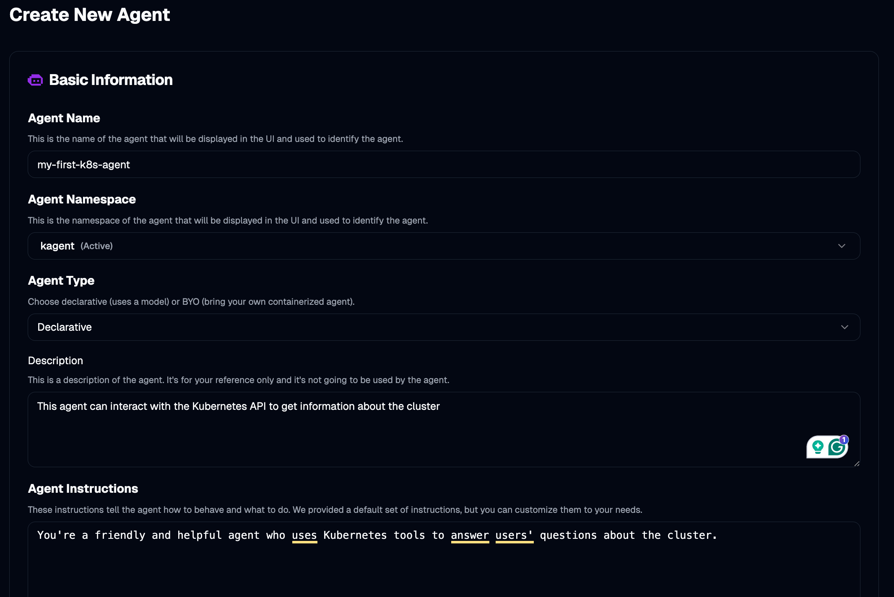

Below that, you select which model to use and which tools to give the agent. We're using Claude Haiku since it's cheap for demos. Right now no tools are selected, which means this agent can respond to questions but can't use any tools to interact with external systems.

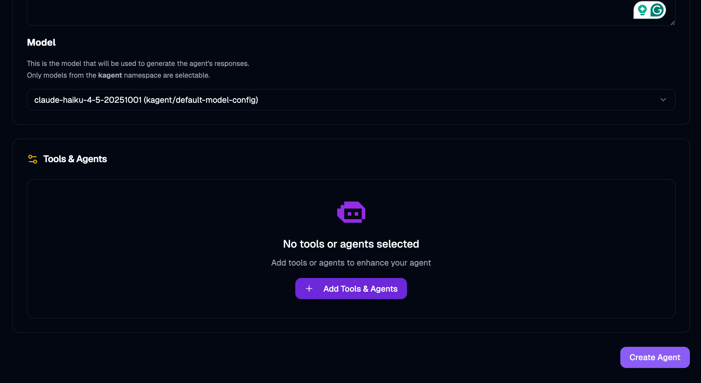

> Click the `+ Add Tools & Agents` button, select `k8s_get_available_api_resources`, `k8s_get_resources`, and `k8s_get_resource_yaml` tools, and click the `Save Selection` button.

What tools can this agent use? kagent comes with built-in MCP tools for Kubernetes, Prometheus, Grafana, Istio, Cilium, Helm, Argo, and more. You can also add any MCP server to extend the available tools, which we'll explore later. For now, we're selecting three basic Kubernetes tools to get information about API resources and retrieve YAML manifests.

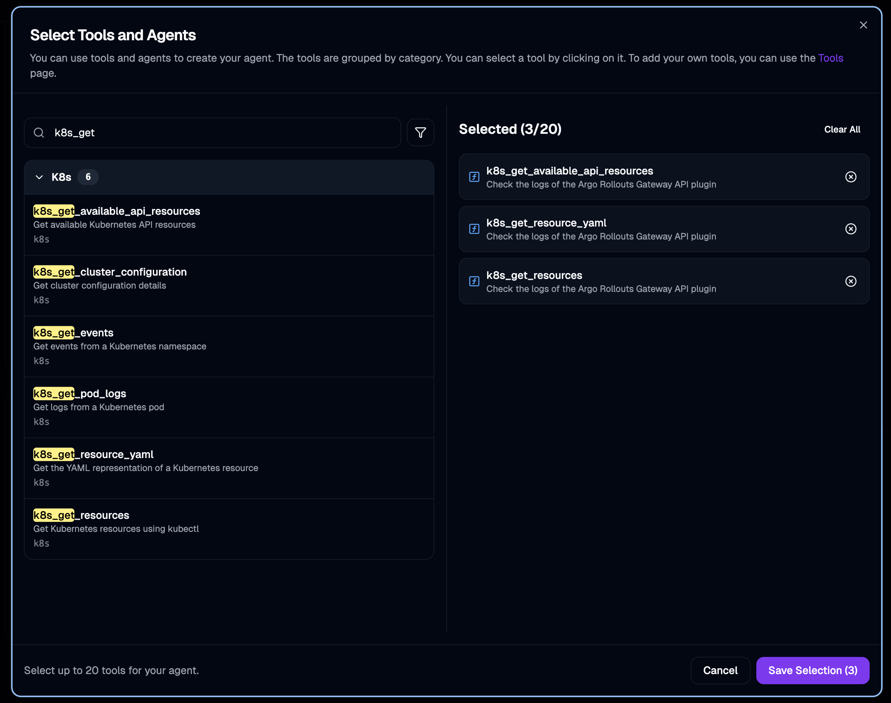

> Click the `Create Agent` button.

Once created, we're back at the agents list where we can see our new agent alongside several pre-built ones that come with kagent. There are agents for Argo, Cilium, Helm, Istio, Kubernetes, observability, and more. These give you a starting point if you don't want to build your own from scratch.

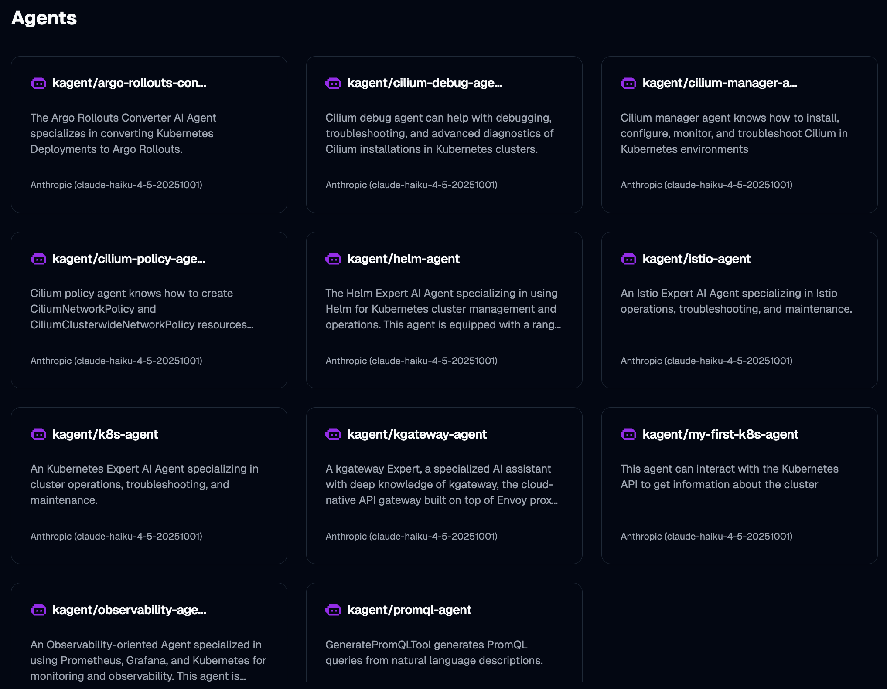

> Select `my-first-k8s-agent`

> Type `Show all available Kubernetes APIs` and press the `Send` button.

Now we can interact with the agent through a chat interface. You type questions in natural language, and the agent decides which tools to use to answer. We're asking it to show all available Kubernetes APIs.

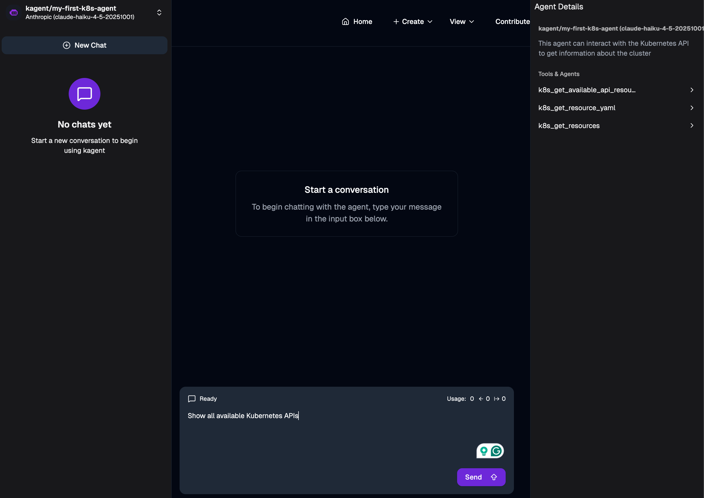

The agent responds by calling the `k8s_get_available_api_resources` tool and returns a formatted list of all the APIs in the cluster. Core APIs, admission and registration APIs, apps and workloads, everything. This is exactly what you'd expect from an agent with access to Kubernetes tools.

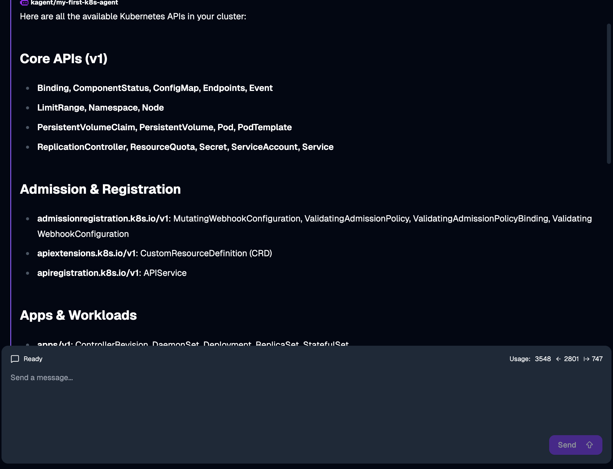

> Type `Create a Deployment with nginx` and press the `Send` button.

Let's try something more ambitious. Can the agent actually create resources in Kubernetes?

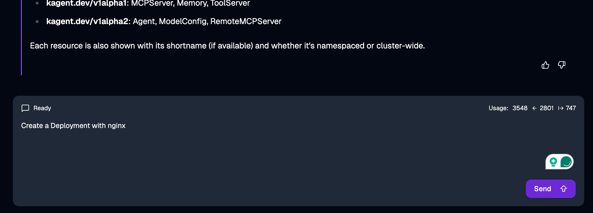

Well, not quite. The agent asks for more details about the deployment, but then admits it doesn't have a tool to create resources directly. It can only show you the YAML and guide you through using `kubectl apply`.

Now, this is actually an important security feature. We deliberately chose read-only tools when creating this agent. That means it can retrieve information about the cluster but can't modify anything. This is how you control what agents are allowed to do. You don't give an agent full access and hope it doesn't screw things up. You explicitly define which tools it can use. Want an agent that can create resources? Add tools with write permissions. Want read-only observability? Give it only query tools. The administrator controls what's safe, not the agent itself.


So what did we just build? A declarative agent is essentially the simplest AI agent you can imagine. It's a system prompt, a list of tools, and an LLM, all running in Kubernetes. That's it. The question is, is that useful?

Look, there are some genuinely good things here. It's as easy as it gets. Fill out a form, select some tools, and you have an agent running. No code, no complex setup. And you can select exactly which tools from an MCP server the agent can use, rather than giving it access to everything. Not all coding agents support this level of granularity yet, though that'll probably change soon.

But here's the problem. The UX is terrible. I cannot imagine anyone willingly choosing to interact with agents through this kagent web interface when they could use Claude Code, Cursor, or any modern coding agent. The kagent UI is missing too many features we've come to expect. File access, code editing, proper context management. All the things that make coding agents useful. My guess is that the only people using the kagent UI to talk to AI are those being forced to by their company.

What I really wanted was the ability to connect kagent agents to a "real" coding agent like Claude Code or Cursor. That would be interesting. Use kagent to run specialized agents in Kubernetes, but interact with them through the tools we already use. Now, to be clear, it's not that we cannot use kagent with existing coding agents. We can, but not directly. kagent agents expose the A2A protocol, and most coding agents don't support A2A yet. Claude Code certainly doesn't. So you need something like the A2A-MCP Bridge to translate between the protocols.

Using a bridge feels silly though. It would be relatively trivial for kagent to expose MCP directly instead of forcing everyone through A2A. That's what I did with [DevOps AI Toolkit](https://github.com/vfarcic/dot-ai), just expose MCP and be done with it. But if you really want to use kagent agents from your coding agent, the bridge is your best bet right now.

Now, kagent does support bringing your own agents through the A2A protocol. If you've built an agent with LangChain, CrewAI, or some other framework, you can expose it via A2A and kagent will treat it as just another agent. This is the "BYO agent" model. Your agent runs wherever you want, as long as it speaks A2A, kagent can talk to it. But again, this only helps if you're interacting through kagent's UI or if you have other kagent agents calling yours. It doesn't solve the problem of using kagent agents from Claude Code or Cursor without the bridge.

Here's my take. Building agents that expose the A2A protocol is not the way to go. It makes more sense to expose agents through the MCP protocol, like [DevOps AI Toolkit](https://github.com/vfarcic/dot-ai) does. MCP is the protocol that all coding agents understand. You're unlikely to change your main coding agent. So why build for A2A when everyone uses MCP?

And here's what's more important. Do you actually need agents connected to agents? Claude Code already has subagents, slash commands, skills, and other features. Coding agents have evolved significantly since kagent came along. Many of the problems kagent is trying to solve might already be solved in whichever coding agent you chose as your primary tool. The real advantage of kagent is that it lets us run agents remotely in Kubernetes. But that doesn't mean you won't have a local agent that needs to talk to those remote agents. And if you do, you're back to needing that A2A-MCP Bridge.

## Integrating External MCP Servers

So far we've looked at kagent's basic declarative agents. Now let's see a more interesting example. Let's integrate kagent with an external MCP server and see how that works.

Now, assuming you're already experienced with Kubernetes, and you must be otherwise you wouldn't even touch kagent, you're likely not managing resources through a Web UI. You know better. So let's switch to kubectl and work the way Kubernetes users actually work.

First, let me show you the situation we're dealing with. There's a pod in the `a-team` namespace that's having trouble.

```sh
 kubectl --namespace a-team get pods
```

```
NAME                       READY   STATUS             RESTARTS       AGE
test-app-996475b7d-mfnnz   0/1     CrashLoopBackOff   8 (5m5s ago)   22m
```

It's in `CrashLoopBackOff`, which means something is wrong and we need to figure out what. This is a perfect scenario for an agent with troubleshooting capabilities.

I already have an MCP server that, among other things, can remediate issues. It's essentially an agent wrapped in the MCP protocol, and I've already deployed it to the cluster. Now I want to connect it to kagent so I can interact with it through kagent's interface. Let's see how that works.

To connect an external MCP server to kagent, we define a `RemoteMCPServer` resource.

```sh
cat examples/dot-ai-mcp-server.yaml
```

```yaml
apiVersion: kagent.dev/v1alpha2
kind: RemoteMCPServer
metadata:
  name: dot-ai
  namespace: kagent
spec:
  description: Remote MCP server providing Kubernetes management tools
  url: http://dot-ai-mcp.dot-ai.svc.cluster.local:3456
  protocol: STREAMABLE_HTTP
```

Pretty straightforward. We're pointing kagent to the `dot-ai` MCP server running. The URL points to the service. We specify the protocol as `STREAMABLE_HTTP`. Once we apply this, kagent will be able to use tools from this MCP server.

Let's apply it.

```sh
kubectl --namespace kagent apply --filename examples/dot-ai-mcp-server.yaml
```

Now we need to create an agent that can use tools from that MCP server. Let's look at the agent definition.

```sh
cat examples/dot-ai-agent.yaml
```

```yaml
apiVersion: kagent.dev/v1alpha2
kind: Agent
metadata:
  name: dot-ai-agent
  namespace: kagent
spec:
  description: |
    An AI agent that provides comprehensive Kubernetes operations including:
    - Deploying and managing applications with AI recommendations
    - Analyzing and remediating cluster issues
    - Managing organizational patterns and policies
    - Setting up and auditing projects
    - System health diagnostics
  type: Declarative
  declarative:
    modelConfig: default-model-config
    systemMessage: |
      You are a Kubernetes operations AI agent equipped with comprehensive tools for cluster management.
      Your capabilities include:
      - Deploying applications, infrastructure, and services with AI-powered recommendations
      - Analyzing and remediating Kubernetes issues with root cause identification
      - Managing organizational patterns, policy intents, and resource capabilities
      - Setting up and auditing projects with automated file generation
      - Providing system health diagnostics and monitoring
      Use these tools to help users effectively manage their Kubernetes environments.
    tools:
      - mcpServer:
          apiGroup: kagent.dev
          kind: RemoteMCPServer
          name: dot-ai
          toolNames:
            - recommend
            - version
            - manageOrgData
            - remediate
            - projectSetup
        type: McpServer
    a2aConfig:
      skills:
        - id: deploy-application
          name: deploy-application
          description: Deploy, create, setup, or install applications and infrastructure on Kubernetes with AI recommendations
          inputModes:
            - text
          outputModes:
            - text
          examples:
            - "Deploy a PostgreSQL database"
            - "Install nginx ingress controller"
            - "Setup Redis cache"
          tags:
            - kubernetes
            - deployment
            - infrastructure
        - id: troubleshoot-issues
          name: troubleshoot-issues
          description: Analyze and remediate Kubernetes issues with root cause identification and actionable steps
          inputModes:
            - text
          outputModes:
            - text
          examples:
            - "Why is my pod crashing?"
            - "Investigate networking issues"
            - "Fix deployment failures"
          tags:
            - kubernetes
            - troubleshooting
            - remediation
        - id: manage-policies
          name: manage-policies
          description: Manage organizational patterns, policy intents, and resource capabilities in the cluster
          inputModes:
            - text
          outputModes:
            - text
          examples:
            - "List all policies"
            - "Create organizational pattern"
            - "Scan cluster capabilities"
          tags:
            - kubernetes
            - policies
            - governance
        - id: project-setup
          name: project-setup
          description: Setup projects, audit repositories, and generate repository files
          inputModes:
            - text
          outputModes:
            - text
          examples:
            - "Setup new project"
            - "Audit repository"
            - "Generate README"
          tags:
            - project
            - repository
            - setup
        - id: health-check
          name: health-check
          description: Get comprehensive system health and diagnostics information
          inputModes:
            - text
          outputModes:
            - text
          examples:
            - "Check system health"
            - "Get diagnostics"
          tags:
            - monitoring
            - diagnostics
            - health
```

This is a declarative agent that uses tools from the `dot-ai` MCP server we just registered. The key part is in the `tools` section where we reference the `RemoteMCPServer` by name and select which specific tools the agent can use. We're giving it access to `recommend`, `version`, `manageOrgData`, `remediate`, and `projectSetup` tools.

There's also an `a2aConfig` section that defines skills for the A2A protocol. This describes what capabilities this agent exposes to other agents or A2A clients. It's metadata that helps other systems understand what this agent can do.

Let's create the agent.

```sh
kubectl --namespace kagent apply --filename examples/dot-ai-agent.yaml
```

> Go back to kagent Web UI, and select `View`, followed by `My Agents` from the top menu.

Back in the agents list, we can now see our `dot-ai-agent` alongside all the other agents. It's highlighted here in the middle, showing it provides comprehensive Kubernetes operations including deploying applications, remediating issues, and managing policies.

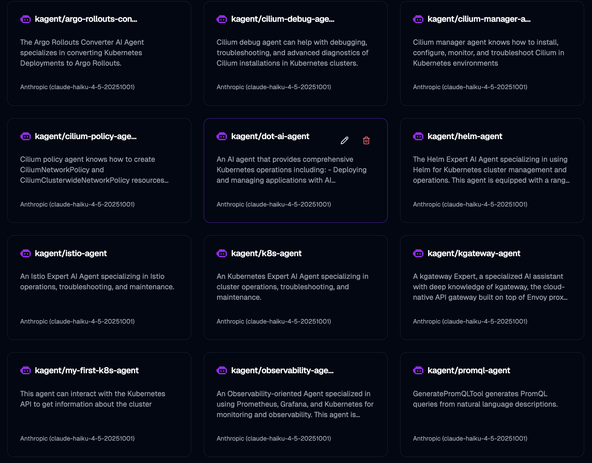

> Select `dot-ai-agent` from the kagent Web UI.

> Type `There is something wrong with my application in the a-team Namespace` and press the `Send` button.

Now let's test the real capability of this agent. Can it figure out what's wrong with that crashing pod and fix it using the MCP server we just connected? We're asking the agent in plain English about the problem.

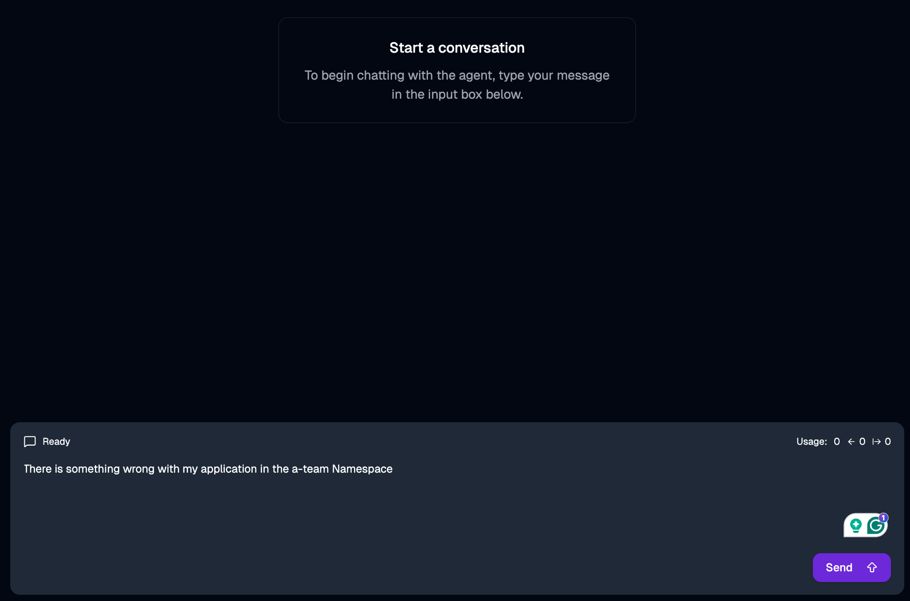

The agent uses the `remediate` tool from the dot-ai MCP server and analyzes the problem. It identifies that the container is failing during memory allocation and recommends increasing the memory limit to 256Mi. It shows us the exact `kubectl` command it wants to run and asks how we'd like to proceed.

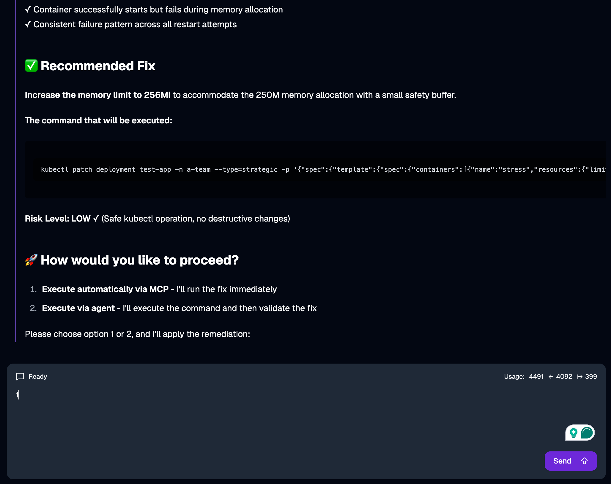

Here's a problem though. The agent called the MCP tool whether we wanted it or not. There's no way to enforce user confirmation before calling MCP tools in kagent. The agent just calls them automatically, and then the tool itself decides whether to ask for permission. kagent doesn't provide a built-in approval mechanism. This is another UX issue. In Claude Code or Cursor, you can require approval before tools are called. Here, the agent decides on its own.

After we respond with option `1`, the agent shows us that it's ready to apply the fix. It displays the `kubectl` command again, confirms the risk level is low, and asks us to choose how to proceed.

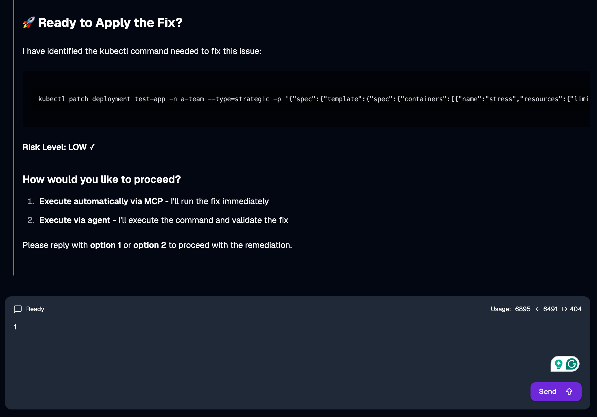

The remediation completed successfully. The memory constraint was fixed, the command was executed, and validation confirms the new pod is running. This actually worked pretty well. I was lucky.

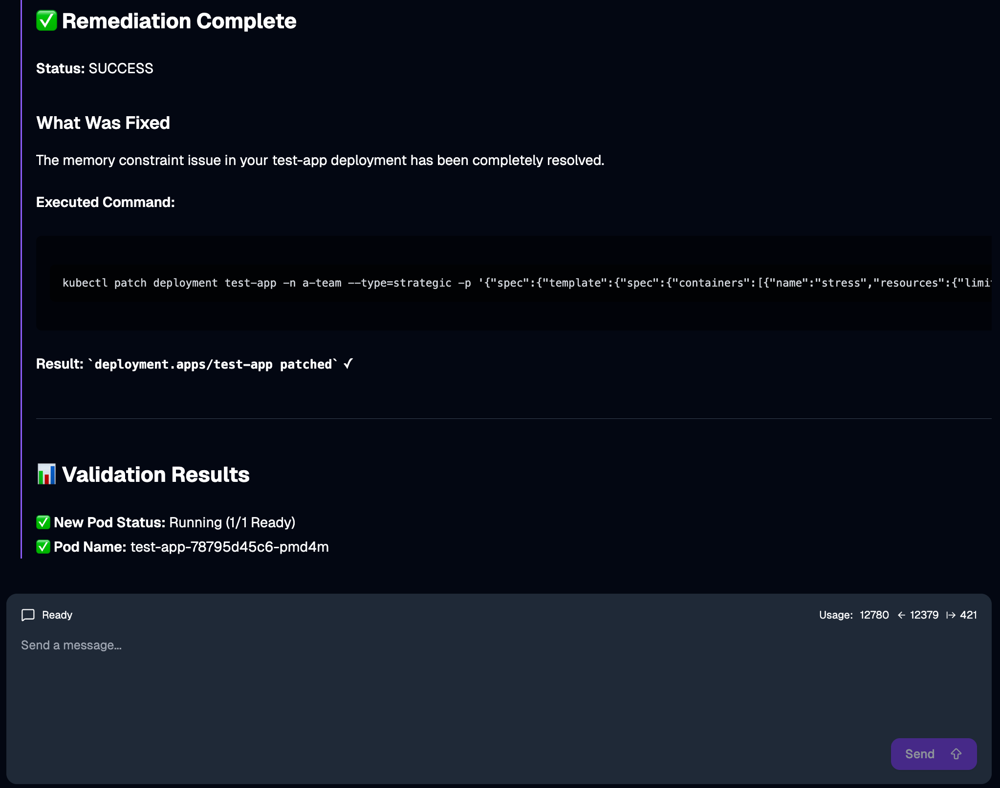

If you follow along with this demo, it might work or it might not. kagent has been unreliable with tool execution. I'm not sure why, but scenarios that always work flawlessly in Claude Code randomly fail in kagent. The agent makes mistakes calling tools when they're anything but very simple. Your mileage may vary.

## Deploying MCP Servers with kmcp

Now let's talk about **kmcp**, which is a separate project from kagent with different goals.

kmcp is a Kubernetes controller that lets you deploy MCP servers to Kubernetes using a custom `MCPServer` resource. It also includes CLI tools for developing MCP servers locally, but I don't think that's how MCP development should be done.

Think about it this way. You wouldn't start developing a backend service by thinking about Kubernetes first. You shouldn't start MCP development with Kubernetes either. Sure, you should consider certain Kubernetes capabilities like resiliency and scaling when designing your application. But the actual work of deploying to Kubernetes comes later. And Kubernetes might not be the only place where MCP servers run. It's certainly my choice for production, but it's not the only option. That would be unnecessary tight coupling.

All in all, I already developed an MCP server without kmcp. It works everywhere, including running locally. Now I want to run it in a Kubernetes cluster. Can I do that with kmcp? Is it a good choice? Let's see.

Here's the kmcp manifest for deploying my dot-ai MCP server to Kubernetes.

```sh
cat examples/dot-ai-kmcp.yaml
```

```yaml
apiVersion: rbac.authorization.k8s.io/v1
kind: ClusterRole
metadata:
  name: dot-ai-kmcp
  namespace: dot-ai
  labels:
    app: dot-ai-kmcp
rules:
- apiGroups: ["*"]
  resources: ["*"]
  verbs: ["get", "list", "watch"]
- apiGroups: ["*"]
  resources: ["*"]
  verbs: ["create", "update", "patch", "delete"]
- nonResourceURLs: ["*"]
  verbs: ["get"]
---
apiVersion: rbac.authorization.k8s.io/v1
kind: ClusterRoleBinding
metadata:
  name: dot-ai-kmcp
  labels:
    app: dot-ai-kmcp
roleRef:
  apiGroup: rbac.authorization.k8s.io
  kind: ClusterRole
  name: dot-ai-kmcp
subjects:
- kind: ServiceAccount
  name: dot-ai-kmcp
  namespace: dot-ai
---
apiVersion: kagent.dev/v1alpha1
kind: MCPServer
metadata:
  name: dot-ai-kmcp
spec:
  transportType: http
  httpTransport:
    targetPort: 3456
  deployment:
    image: ghcr.io/vfarcic/dot-ai:latest
    port: 3456
    env:
      TRANSPORT_TYPE: "http"
      PORT: "3456"
      HOST: "0.0.0.0"
      SESSION_MODE: "stateless"
      QDRANT_URL: "http://dot-ai-mcp-qdrant.dot-ai.svc.cluster.local:6333"
      KUBERNETES_IN_CLUSTER: "true"
    secretRefs:
      - name: dot-ai-kmcp-secrets
---
apiVersion: networking.k8s.io/v1
kind: Ingress
metadata:
  name: dot-ai-kmcp
spec:
  ingressClassName: nginx
  rules:
  - host: dot-ai-kmcp.127.0.0.1.nip.io
    http:
      paths:
      - path: /
        pathType: Prefix
        backend:
          service:
            name: dot-ai-kmcp
            port:
              number: 3456
```

This manifest includes a few things. RBAC resources giving the MCP server permissions to interact with Kubernetes. The `MCPServer` custom resource that tells kmcp how to deploy the server. An `Ingress` to expose it externally. The `MCPServer` resource specifies the container `image`, environment variables, secrets, and other info MCP might need. kmcp's controller will read this and create the necessary Deployment and Service automatically.

Here's the first issue I have with kmcp. Using the MCPServer resource is often not enough. There's almost always more. In this case, `ClusterRole`, `ClusterRoleBinding`, and `Ingress`. It also needs Qdrant, which I already deployed. But if I hadn't, that would need to be included as well. As a result, I would still probably wrap it all up as a Helm chart. And if I'm doing that, I'm not sure I would need kmcp instead of simply defining that part as a Deployment and a Service. I might be wrong though. Let's apply it and see.

```sh
kubectl --namespace dot-ai apply --filename examples/dot-ai-kmcp.yaml
```

> Open http://kagent.127.0.0.1.nip.io/servers in a browser.

If we look at kagent's MCP Servers page, we can see the `dot-ai-kmcp` server showing up with all its available tools listed: `manageOrgData`, `projectSetup`, `recommend`, `remediate`, and `version`. kmcp successfully deployed the MCP server and made it available.


Now the interesting part. Can we use this kmcp-deployed MCP server from Claude Code? Let's create an MCP configuration file that points to the exposed Ingress URL.

```sh
cat .mcp-kmcp.json
```

```json
{
  "mcpServers": {
    "dot-ai": {
      "type": "http",
      "url": "http://dot-ai-kmcp.127.0.0.1.nip.io"
    }
  }
}
```

Simple enough. Now let's start Claude Code with this configuration and see if we can interact with the MCP server running in Kubernetes.

```sh
claude --mcp-config .mcp-kmcp.json
```

Let's test if Claude Code can actually call the MCP server. We'll ask it to show the dot-ai status.

[user]
```text
Show dot-ai status
```

[agent]
```text
⏺ The dot-ai system is healthy and operational. Here's the status:

  System Information

  - Version: 0.127.0
  - Overall Status: healthy
  - Timestamp: 2025-11-01T00:16:23.550Z

  Kubernetes

  - Connected: ✓
  - Cluster Version: v1.34.0
  - Context: in-cluster
  - Endpoint: https://10.96.0.1:443

  AI & Embedding

  - AI Provider: Anthropic (claude-sonnet-4-5-20250929)
  - Embedding Provider: OpenAI (text-embedding-3-small, 1536 dimensions)
  - Status: Connected ✓

  Vector Database (Qdrant)

  - Connected: ✓
  - URL: http://dot-ai-mcp-qdrant.dot-ai.svc.cluster.local:6333
  - Collections:
    - patterns: not initialized
    - policies: not initialized
    - capabilities: not initialized

  Capabilities

  - Capability scanning: ready
  - Semantic + keyword search: available
  - AI recommendations: available
  - Kubernetes integration: available
  - Stored capabilities: 0

  Policy Generation

  - Kyverno: Not installed
  - Policy Generation: Not ready (Kyverno CRDs not found)

  Tracing

  - Enabled: No

  The system is ready for capability scanning, semantic search, and AI-powered recommendations. To use policy generation features, Kyverno would
  need to be installed in the cluster.
```

It works! Claude Code successfully connected to the MCP server running in Kubernetes and called the `version` tool to get comprehensive system status. The MCP server is responding with detailed information about the system health, Kubernetes connection, AI providers, vector database, and capabilities. So kmcp can deploy an MCP server to Kubernetes and make it accessible to external clients like Claude Code. That works.

Now, is kmcp useful? I'm not sure. I already mentioned that I don't think the development tools are that valuable. Kubernetes doesn't matter for development. It matters later, for deployment. And Kubernetes is likely only one of the deployment options, not the only one.

For third-party MCPs, if we want to deploy an MCP server to Kubernetes and it doesn't already come with a Helm chart, kmcp sounds like a reasonable option. It's better than manually creating all the Kubernetes resources ourselves.

But here's the thing. I expect MCP providers to get their act together and start publishing official Helm charts. Once that happens, I'm not sure what the point of kmcp is. For example, [DevOps AI Toolkit](https://github.com/vfarcic/dot-ai) has a Helm chart that deploys Qdrant along with the MCP server. This kmcp manifest doesn't handle dependencies. On top of that, I'm not sure how likely it is to see MCP providers adding and supporting kmcp as one of their "official" deployment options.

If you're building your own MCPs, do it well. Be serious about it. Create a Helm chart with everything you might need. You're using Kubernetes, or at least your company is. You must be familiar with all of this. An MCP is, at the end of the day, a backend that exposes an API like any other.

Now, to be fair, it would be close to impossible for kmcp to predict everything one might need. Ingress, Role, RoleBinding, dependencies like databases. All the things that real applications need. But that only proves the point that having something like kmcp might not be a good idea. If you need more than what the `MCPServer` resource provides, you're back to writing manifests anyway. And if you're doing that, why not just use standard Kubernetes resources or a Helm chart?

Alright. We've seen both kagent and kmcp in action. Let's talk about pros and cons and try to figure out whether you should be using one of those, or both.

## Should You Use kagent and kmcp?

I want to like kagent and kmcp projects, but I'm failing to find what their use-case really is. Does it sound great that one can create an agent in a few minutes? It does, but only until we realize that infinitely better agents already exist. Claude Code, Cursor, and others just work. Once the novelty is gone, we will realize that we should either take agents seriously or not create our own agents. If we want our own agents, we should take that seriously. Roll up your sleeves and do it. There are plenty of frameworks like LangChain, Anthropic SDK, Vercel SDK, and plenty of others. We are software engineers. We can build something better than a generic agent with a custom system prompt. Right?

Let's start with the problems.

To begin with, kagent has a **terrible interface**. Given the option to use Claude Code, Cursor, or almost any other agent, I cannot imagine anyone choosing kagent. It's like going back to ChatGPT in a browser except that kagent can use MCP tools.

Even if you could tolerate the interface, there's the reliability problem. kagent has **unreliable tool execution**. I'm not sure why, but scenarios that always work flawlessly in Claude Code randomly fail in kagent. The agent makes mistakes calling tools when they're anything but very simple.

Then there's the question of what declarative agents actually are. They're **just custom system prompts**, a list of tools, and an LLM. That's it. Nothing special, nothing you couldn't build yourself in an hour with any agent framework.

The ability to connect specialized agents sounds interesting, but **agent connections aren't special**. It's not much different from using Claude Code skills, which work with separate context, or subagents, though they're not triggered from text. The correct approach is probably MCP servers with agents inside them.

What I really wanted was the ability to **connect kagent agents to coding agents** like Claude Code or Cursor. That would be the use-case I would be truly interested in. I haven't found that option in the docs.

There's also **no user confirmation** when executing an MCP tool. The agent just calls them automatically, and then the tool itself decides whether to ask for permission. kagent doesn't provide a built-in approval mechanism. This is yet another example of poor UX.

Another issue is the **wrong protocol choice**. Building agents that expose the A2A protocol is not the way to go. All coding agents like Claude Code, Cursor, and others support MCP, while only a handful support A2A. If the goal is to extend coding agents that actually work, you have to adopt MCP. Now, I know that's not how people see it. Many see MCP as a protocol for tools and A2A as a protocol for agents. My point is that those are just protocols and I don't see anything wrong using MCP protocol to connect an agent with a server that could be acting as an agent.

On the kmcp side, the **MCPServer CRD is too limited**. Using the MCPServer resource is often not enough. There's almost always more like ClusterRole, ClusterRoleBinding, Ingress, and dependencies. I would still probably wrap it all up as a Helm chart. If you need more than what the MCPServer resource provides, you're back to writing manifests anyway.

Finally, and this is important, coding agents have evolved significantly since kagent came along. Many of the **problems** are **already solved** in whichever coding agent you chose as your primary tool.

Now let's talk about the good things.

kagent comes with several **pre-built agents** for Argo, Cilium, Helm, Istio, Kubernetes, observability, and more. These give you a starting point if you don't want to build your own from scratch. Though I'm not sure how useful those are in practice. Wouldn't it be easier and better to simply provide those as slash commands? Nevertheless, I'll mark that one as a plus.

It has **multi-provider support**. It supports all the usual LLM providers like OpenAI, Anthropic, Google Vertex AI, Azure OpenAI, and local models through Ollama. That's good flexibility.

**kmcp works**. It does what it promises. It successfully deploys MCP servers to Kubernetes and makes them accessible to external clients like Claude Code. We saw that work in the demo.

kagent also supports **bringing your own agents** built with other frameworks through the A2A protocol. Though I'm not sure how useful that is since A2A is not widely supported in coding agents like Claude Code, and I already stated that using kagent directly is horrible UX.

**Granular tool selection** is useful. The ability to select which specific MCP tools can be used is valuable. Some coding agents already support that and it'll probably soon be added to Claude Code. So it's not a huge plus or special, but let's be generous and consider it a plus.

It's not UI-only. Having **Kubernetes CRDs** is amazing. I would go as far as to say that operations should be done without UI. Who does operations with UI in Kubernetes? I don't see the point in using the UI for talking to agents. Use Claude Code or Cursor. That makes kagent pointless unless we connect to kagent agents through something like the A2A-MCP Bridge. kmcp might be useful in some scenarios.

If you absolutely need **remote agents** instead of using Claude Code locally, kagent provides that option.

The bottom line is this. If you're already using Claude Code, Cursor, or any modern coding agent, kagent probably doesn't solve problems you have. The UX isn't competitive, the A2A protocol choice limits integration, and the problems it's solving are being solved better elsewhere. kmcp might be useful for deploying third-party MCP servers to Kubernetes if they don't provide Helm charts, but that's a temporary gap that will likely close. For building your own MCP servers, you're better off creating proper Helm charts with everything you need rather than relying on kmcp's limited MCPServer resource.

As for me, I'm not dropping Claude Code in favor of kagent. The only way I would be convinced to use kagent is if I could connect it to Claude Code or another coding agent that actually works, and I reject the idea of doing that through the A2A-MCP Bridge.

## Destroy

> Press `ctrl+c` twice to exit Claude Code.

```sh
./dot.nu destroy
```

