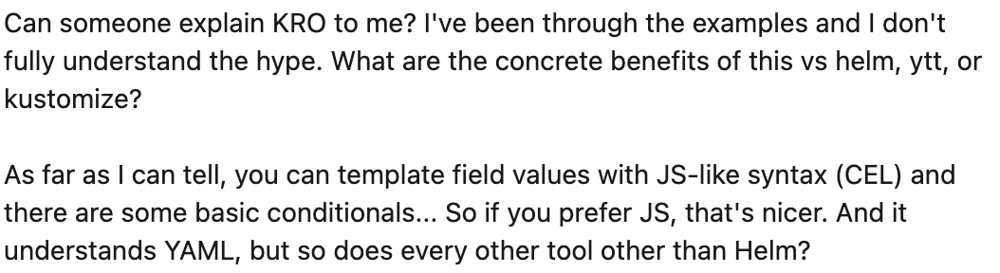

+++
title = 'Kro vs Helm: Is It Time to Ditch Helm Charts?'
date = 2025-04-28T16:00:00+00:00
draft = false
+++



During recent months I saw a lot of conversation and questions sparked by the release of kro, like the one in the picture. Many of them are related to comparison with Helm. Some people think that kro is, more or less, doing **the same** work as Helm. Others think that it is a **different syntax** that accomplishes the same result as Helm. Some are asking whether kro is a **replacement** for Helm.

There's hardly a day that I don't see a blog post or a Slack conversation or a question in Reddit around that subject.

I want to answer those questions today.

<!--more-->



I will show that some of those are completely mistaken while others are right. kro is very different from Helm and is based on **very different ideas** while, at the same time, it can, replace Helm, if we choose that path.

I feel that those questions and doubts are a repetition of the same conversations we had, and still have, in relation to differences between Instracture-as-Code tools like **Terraform** and **Pulumi** on one hand, and control plane tools like **Cluster API** and **Crossplane**. The major difference is that those same questions that were focused on infrastructure are now focused on **applications**.

That being said, this is a much wider conversation. It is a conversation about the differences between **client and server side operations**. It is about **templates vs. operators**. It is also about Kubernetes **Pods vs. Deployments**, no matter how strange that might sounds. It is about **our own vs. third-party Custom Resources**. It is about some tools not understanding the change brought to us with the introduction of **Custom Resource Definitions and controllers** some seven years ago and the evolution of tooling that help us create and manage those. Ultimately, it is about the **evolution of Kubernetes** itself and whether we should embrace it.

Today's post is a bit strange. It will sound, at times, that I lost my mind. You will likely think that I lost it and that I should have a conversation with psychologist. We'll see about that later.

Now, the important note is that I will be using Helm and kro today. However, everything I say about those can be applied to many other tools. Almost everything I say about Helm can be equally applied to Kustomize, or Timoni, or ytt, or KCL, or any other similar tool that does client-side templating or overlaying. Similarly, everything you'll hear about kro equally applies to Cluster API, Crossplane, KubeVela, or any other tools that help us manage resources through Kubernetes Custom Resources Definitions and controllers.

By the end of this post, you should have a clear or, at least, a clearer picture of the **differences between Helm and kro and other similar tools**. We'll see how they differ, which one you should use, and whether they are mutually exclusive.

## Setup

```sh
git clone https://github.com/vfarcic/kro-vs-helm

cd kro-vs-helm
```

> Make sure that Docker is up-and-running. We'll use it to create a KinD cluster.

> Watch [Nix for Everyone: Unleash Devbox for Simplified Development](https://youtu.be/WiFLtcBvGMU) if you are not familiar with Devbox. Alternatively, you can skip Devbox and install all the tools listed in `devbox.json` yourself.

```sh
devbox shell
```

> Watch [The Future of Shells with Nushell! Shell + Data + Programming Language](https://youtu.be/zoX_S6d-XU4) if you are not familiar with Nushell. Alternatively, you can inspect the `dot.nu` script and transform the instructions in it to Bash or ZShell if you prefer not to use that Nushell script.

```sh
chmod +x dot.nu

./dot.nu setup

source .env
```

## Lower vs. Higher Level Controllers

It all starts with a Kubernetes cluster which, in my case, is running in [UpCloud](https://upcloud.com).

I'm using UpCloud more and more since it's easy to use and it is cheap. It providers Kubernetes-as-a-Service, Database-as-a-Service, and others. You can manage whatever you need through their Web UI, CLI, Terraform, Ansible (if you're desperate), and Crossplane, my favorite. If you haven't used it already, I invite you to check it up. You can use [this signup link](https://signup.upcloud.com/?promo=devopstoolkit) to get 50€ ($55) of free credits so it won't cost you anything to try it out.

Nevertheless, today we're not talking about UpCloud. We're talking about different ways we should manage resources in Kubernetes clusters.

What does matter, for today's topic, is that I would like to deploy an application into that cluster. How should I do that? Should I create **a Helm chart?** If I do, **what should be inside that chart?** Should it contain **low-level resources like Pods?** Should I resort to **something else?** **Should I use templates with Helm?** **Are there better alternatives?**

I have so many questions!

*Actually, I don't have many questions. I am just imagining that I forgot everything I know and that I am acting as a newbee trying to make some decisions.*

Let's say that we would like to have a single replica of an application. We can do that with the following manifest.

```sh
cat k8s/pod-01.yaml
```

The output is as follows.

```yaml
---
apiVersion: v1
kind: Pod
metadata:
  name: silly-demo-01
spec:
  containers:
  - image: ghcr.io/vfarcic/silly-demo:v1.5.38
    livenessProbe:
      failureThreshold: 10
      httpGet:
        path: /
        port: 8080
    name: main
    ports:
    - containerPort: 8080
    readinessProbe:
      failureThreshold: 10
      httpGet:
        path: /
        port: 8080
    resources:
      limits:
        memory: '256Mi'
      requests:
        cpu: '125m'
        memory: '128Mi'
```

That's a definition of a `Pod` which will contain a single container based on the `silly-demo` `image`.

Now, if you have any experience with Kubernetes, you probably think that I lost my mind. Almost no one creates Pods directly. We have Deployments and StatefulSets and other types of resources that do a much better job at that.

I can safely say that I am not insane. My mother had me checked.

*Bear with me. I'm trying to make a point which will, hopefully, become apparent soon. So, if you are familiar with Kubernetes, ignore everything you know for a few minutes. Imagine that neither you nor I know any better than to create Pods.*

Now, if we would like to have that application up and running all we'd have to do is to `apply` that manifest.

```sh
kubectl --namespace a-team apply --filename k8s/pod-01.yaml
```

That was easy. Right?

Now, let's say that we would like to have a second replica of that application, so the question is: "How do we increase the number of replicas?"

How about having a definition of a second Pod?

```sh
cat k8s/pod-02.yaml
```

The output is as follows (truncated for brevity).

```yaml
---
apiVersion: v1
kind: Pod
metadata:
  name: silly-demo-02
spec:
  containers:
  - image: ghcr.io/vfarcic/silly-demo:v1.5.38
    ...
```

That one is a copy of the other Pod. The only difference is that this one is named `silly-demo-02`. Everything else is the same since replicas of an app are, most of the time, the same.

Let's apply it,...

```sh
kubectl --namespace a-team apply --filename k8s/pod-02.yaml
```

...and take a look at the Pods

```sh
kubectl --namespace a-team get pods
```

```
NAME            READY   STATUS    RESTARTS   AGE
silly-demo-01   1/1     Running   0          37s
silly-demo-02   1/1     Running   0          18s
```

Now we have two replicas.

*At this point you probably do not believe that I am not insane. Why would I deploy two Pods separately? Bear with me. I know that what I'm doing is silly and that no one should be doing it. I want to make a point and you'll have to bear with my "insanity" for a while longer.*

Now, let's say that we want to scale up our application by adding a third replica?

That's simple. We just add another Pod that is the same as the others but with a different name. There's no need to look at the manifest. Let's just apply it,...

```sh
kubectl --namespace a-team apply --filename k8s/pod-03.yaml
```

...and take a look at all of them.

```sh
kubectl --namespace a-team get pods
```

The output is as follows.

```
NAME            READY   STATUS    RESTARTS   AGE
silly-demo-01   1/1     Running   0          85s
silly-demo-02   1/1     Running   0          66s
silly-demo-03   1/1     Running   0          14s
```

We scaled our application to three replicas.

Now, let's say that the usage of our application dropped and we would like to scale it down so that the app does not waste resources.

That's easy. We just delete one of those three Pods.

```sh
kubectl --namespace a-team delete --filename k8s/pod-03.yaml
```

Now we're back to two replicas of the application.

How about deploying a new release?

We don't want to replace all those Pods at once since that might result in downtime. Instead, we might want to do some sort of rolling updates by changing the `image` one Pod at a time.

Here's a modified version of the manifest of the first Pod.

```sh
cat k8s/pod-01-new.yaml
```

The output is as follows (truncated for brevity).

```yaml
---
apiVersion: v1
kind: Pod
metadata:
  name: silly-demo-01
spec:
  containers:
  - image: ghcr.io/vfarcic/silly-demo:v1.5.39
    ...
```

The only change is in the `image` value of the first and the only container in that Pod.

Let's apply it,...

```sh
kubectl --namespace a-team apply --filename k8s/pod-01-new.yaml
```

...and take a look at the Pods.

```sh
kubectl --namespace a-team get pods
```

The output is as follows.

```
NAME            READY   STATUS    RESTARTS      AGE
silly-demo-01   1/1     Running   1 (18s ago)   2m59s
silly-demo-02   1/1     Running   0             2m40s
```

We can see that `silly-demo-01` restarted once (`1`). That was necessary since we cannot change the image of a running container so the old Pod was shut down and started again with the new image.

Next we should repite the same process for the other Pod and, once we're done, we'll have the new releases rolled out to all the replicas of the app.

*As a sign that I am not insane I will skip this sharade and get straigh to the point... right after we delete the silly mess I created.

```sh
kubectl --namespace a-team delete --filename k8s/pod-01-new.yaml

kubectl --namespace a-team delete --filename k8s/pod-02.yaml
```

Okay. We're done with charades and I promised that I'm doing all that not because I'm insane but because I want to make a point.

Why was it silly of me to manage replicas of my application by applying Pods directly? The answer is simple. We have **higher-level Resource Definitions and controllers** that can manage Pods for us. That would be, for example, Kubernetes Deployment.

Do we all agree on that one? Do we all agree that operations like management of lower-level resources like Pods should be delegated to a Resource Definition and a controller that is specialized at performing such operations?

I can safely say that a Kubernetes Deployment or a StatefulSet or something similar is a much better choice that managing Pods directly and performing such management from a laptop. Using Deployments to manage ReplicaSets which manage Pods is, in vast majority of cases, a better choice than working with Pods directly.

Now, a Deployment consists of two parts. There is a Resource Definition and a controller. Resource Definitions extend Kubernetes API so that we can send a request to, let's say, apply a Deployment. Controllers, on the other hand, are processes that watch the events in the API and when someone, or something, does anything with a resource kind they're watching, they do whatever needs to be done.

If we created a Deployment instead of all those Pods, a single resource would manage them and it would do a much better job at doing that. If we would say that we want a Deployment with three replicas, it would ensure that three replicas are running forever and ever. If we would say that we want to upgrade those replicas, it would perform rolling updates. And so on and so forth.

All in all, a Deployment is, most of the time, a better choice than managing Pods ourselves. If we all agree with that statement, we can also say that using higher-level Resource Definitions and controllers is better than working on a lower level, as long as those higher level resources are doing what we need them to do. Managing resources on the server-side, like inside a cluster, is better than managing resources on the client-side, like a laptop.

All good so far? Are we all in agreement?

Now, many of you will say "Great! I agree. Let's put a Deployment into a Helm chart since that gives us the benefit of templating and, even more important, of value extrapolations.

*By the way, do not yell at me if you prefer a solution other than Helm. I do not like it myself. I think it is the worst solution of its kind. I'm using it today only because it is the most commonly used tool and format. If you prefer something else like Kustomize, or ytt, or KCL, or cdk8s, or Timoni, be my guest. The point I'm about to make later applies to all of those.*

I already prepared a simple chart that will help us using the Deployment instead of managing Pods individually.

Here's the `values.yaml` file.

```sh
cat helm/deployment/values.yaml
```

The output is as follows.

```yaml
image:
  repository: ghcr.io/vfarcic/silly-demo
  tag: v1.5.38
replicas: 2
```

Those values are equivalent to what we did so far. We can use them to change the `image` and the number of `replicas`.

Here's the template of the `deployment.yaml` itself.

```sh
cat helm/deployment/templates/deployment.yaml
```

The output is as follows.

```yaml
---
apiVersion: apps/v1
kind: Deployment
metadata:
  name: {{ $.Release.Name }}
  labels:
    app.kubernetes.io/name: {{ $.Release.Name }}
spec:
  replicas: {{ $.Values.replicas }}
  selector:
    matchLabels:
      app.kubernetes.io/name: {{ $.Release.Name }}
  template:
    metadata:
      labels:
        app.kubernetes.io/name: {{ $.Release.Name }}
    spec:
      containers:
      - name: main
        image: "{{ $.Values.image.repository }}:{{ $.Values.image.tag }}"
        ports:
        - containerPort: 8080
        resources:
          limits:
            cpu: 500m
            memory: 512Mi
          requests:
            cpu: 250m
            memory: 256Mi
        livenessProbe:
          httpGet:
            path: /
            port: 8080
        readinessProbe:
          httpGet:
            path: /
            port: 8080
```

That's a simple one. There is a `Deployment` with parts of it, like the `name`, the `replicas`, and the `image` being values. When we execute *helm install* or *helm upgrade*, Helm will, among other things, do variable extrapolation and, effectively, replace those with the actual values currently defined in *values.yaml*.

So far so good. If you have at least basic understanding of Helm, you did not learn anything new. That's okay. I'm trying to make a point that will, hopefully, reveal something new, and I'm not there yet.

Let's deploy our vastly improved version of the application by executing `helm upgrade --install`,...

```sh
helm upgrade --install silly-demo helm/deployment \
    --namespace a-team
```

...and take a look at what we got.

```sh
kubectl --namespace a-team get all
```

The output is as follows.

```
NAME                              READY   STATUS    RESTARTS   AGE
pod/silly-demo-676c96878d-2lrm8   1/1     Running   0          18s
pod/silly-demo-676c96878d-m8mz2   1/1     Running   0          18s

NAME                         READY   UP-TO-DATE   AVAILABLE   AGE
deployment.apps/silly-demo   2/2     2            2           18s

NAME                                    DESIRED   CURRENT   READY   AGE
replicaset.apps/silly-demo-676c96878d   2         2         2       18s
```

We applied a `deployment` which, in turn, created a `replicaset` which manages Pods (`pod`).

To be sure that we are on the same page, let's try the same operations we did with Pods, but, this time, with a Deployment defined as a template inside a Helm chart.

If we would like to scale the number of replicas, all we'd have to do is change the value of *replicas*.

Here's an example.

```sh
cat helm/deployment/values-up.yaml
```

The output is as follows.

```yaml
image:
  repository: ghcr.io/vfarcic/silly-demo
  tag: v1.5.38
replicas: 3
```

The only difference is that, this time, the value of `replicas` is set to `3` while the previous version had it set to *2*.

Let's apply that chart and start watching the changes to the Pods right away.

```sh
helm upgrade --install silly-demo helm/deployment \
    --namespace a-team --values helm/deployment/values-up.yaml \
    && kubectl --namespace a-team get pods --watch
```

The output is as follows.

```
Release "silly-demo" has been upgraded. Happy Helming!
NAME: silly-demo
LAST DEPLOYED: Sun Mar 16 15:06:51 2025
NAMESPACE: a-team
STATUS: deployed
REVISION: 2
TEST SUITE: None
NAME                          READY   STATUS              RESTARTS   AGE
silly-demo-676c96878d-2lrm8   1/1     Running             0          56s
silly-demo-676c96878d-khxwq   0/1     ContainerCreating   0          0s
silly-demo-676c96878d-m8mz2   1/1     Running             0          56s
silly-demo-676c96878d-khxwq   0/1     Running             0          1s
silly-demo-676c96878d-khxwq   1/1     Running             0          1s
```

We can see that it created a new Pod, then shut down one of the old Pods, and then continued with the same process with the second Pod.

> Press `ctrl+c` to stop watching Pods.

If we would like to scale down to two replicas, all we'd have to do is to apply the same chart with the earlier version of the values.

```sh
helm upgrade --install silly-demo helm/deployment \
    --namespace a-team --values helm/deployment/values.yaml \
    && kubectl --namespace a-team get pods --watch
```

The output is as follows.

```
Release "silly-demo" has been upgraded. Happy Helming!
NAME: silly-demo
LAST DEPLOYED: Sun Mar 16 15:07:50 2025
NAMESPACE: a-team
STATUS: deployed
REVISION: 3
TEST SUITE: None
NAME                          READY   STATUS        RESTARTS   AGE
silly-demo-676c96878d-2lrm8   1/1     Running       0          115s
silly-demo-676c96878d-khxwq   1/1     Terminating   0          59s
silly-demo-676c96878d-m8mz2   1/1     Running       0          115s
silly-demo-676c96878d-khxwq   0/1     Terminating   0          59s
silly-demo-676c96878d-khxwq   0/1     Terminating   0          60s
silly-demo-676c96878d-khxwq   0/1     Terminating   0          60s
```

This time, the Deployment detected that we want to have two replicas and that there are three of them running, so it modified the ReplicaSet which, in turn, removed one of the Pods and now we have only two.

*That's brilliant, yet something you already know. Remember, I am not insane. My mother had me tested. I'm trying to make a point and I'm half-way through.*

We could also change the image tag and apply the chart again. By doing that, we would update the Deployment which would create a new ReplicaSet with zero replicas. From there on, it would start scaling up the new ReplicaSet and scaling down the old one until the new release is rolled out. That would be rolling updates process in action that is baked into Deployment.

> Press `ctrl+c` to stop watching Pods.

Now we can jump into questions.

Do we agree that using a higher-level Resource Definition and a controller like a **Deployment is better than** using lower-level resources like **Pods?** I'm sure that I speak for everyone when I say "yes".

Do we agree that there was probably **no need to have a Helm chart if all we have is a Deployment?** We could have just as well replaced some values in the deployment directly instead of fiddling with values.yaml file.

Take a look at this.

```sh
cat k8s/deployment.yaml
```

The output is as follows.

```yaml
apiVersion: apps/v1
kind: Deployment
metadata:
  name: silly-demo
  labels:
    app.kubernetes.io/name: silly-demo
spec:
  replicas: 2
  selector:
    matchLabels:
      app.kubernetes.io/name: silly-demo
  template:
    metadata:
      labels:
        app.kubernetes.io/name: silly-demo
    spec:
      containers:
      - image: ghcr.io/vfarcic/silly-demo:v1.5.38
        livenessProbe:
          failureThreshold: 10
          httpGet:
            path: /
            port: 8080
        name: main
        ports:
        - containerPort: 8080
        readinessProbe:
          failureThreshold: 10
          httpGet:
            path: /
            port: 8080
        resources:
          limits:
            memory: '256Mi'
          requests:
            cpu: '125m'
            memory: '128Mi'
```

That's a relatively simple definition that we could have used directly without a Helm chart. Just as we changed *values.yaml* file in case of Helm, we could have changed `replicas` or `image` fields in that Deployment directly. We did not get much, if any, value from using Helm with such a simple example. That leads me to the next question.

Do we agree that a **Deployment is not all we need?** We should probably add a Service, and an Ingress, and we might have a secret and a volume mount, and that we might have service mesh, and whatever else we need.

Once we realize that we might need to combine a bunch of resources Helm charts come in handy. They help us treat resources themselves as implementation detail and expose parts that matter, those that change, as *values.yaml*.

All that leads me to say that all **resources baked into Kubernetes as low-level**. Some, like Pods, are lower than others, like Deployment. Still, none of them alone give us what we need. There is no such thing as Application, or a Database, or any other type of resource that gives us a something concrete and self-sufficient. That's why people love Helm. It allows us to have something meaningful. We can have a Helm chart that contains everything we might need to run a backend application, or a frotend application, or a database, or anything else. In those cases, *values.yaml* becomes the interface and files in the *templates* directory are, for many, an implementation detail. Helm, and similar tools and formats, are great since they provide solutions that enable us to to work with Kubernetes as if it has resources that are meaningful instead of being low-level.

I believe that last sentence is wrong or, to be more precise, ignores some other details. We'll get to that.

Anyway... For now, I hope that we are all in agreement.

For now, let's move into a more complex scenario.

## Kubernetes Custom Resources

Let's explore a slightly more complex set of manifests by taking a look at ways to deploy a PostgreSQL database server into a Kubernetes cluster.

One approach we can take is to simply install a Helm chart like the one provided by Bitnami.

Now, it is important for the rest of the story to understand how Helm works. It is, essentially, a **templating engine**.

Commands like *helm install* or *helm upgrade* do not send a chart to Kubernetes API. The API does not understand what a Helm chart is. Instead, Helm executes a process equivalent to *helm template* to convert the template into "raw" YAML and then sends it all to the API.

There's more going on there but, in a nutshel, that is what it does.

Here's what, for example, Helm would generate and send to Kubernetes API if we'd like to run a PostgreSQL through the Bitnami chart.

```sh
helm template my-db \
    oci://registry-1.docker.io/bitnamicharts/postgresql
```

The output is as follows (truncated for brevity).

```yaml
---
# Source: postgresql/templates/primary/networkpolicy.yaml
kind: NetworkPolicy
apiVersion: networking.k8s.io/v1
...
apiVersion: policy/v1
kind: PodDisruptionBudget
...
apiVersion: v1
kind: ServiceAccount
...
apiVersion: v1
kind: Secret
...
apiVersion: v1
kind: Service
...
apiVersion: v1
kind: Service
...
apiVersion: apps/v1
kind: StatefulSet
...
```

Those are the resources that would be sent to Kubernetes API if we executed *helm install*. That is, in a way, equivalent to managing application by applying Pods instead of working with Deployments. Those are, in the case of a database, low-level resources. The main thing we're getting with that chart is that those resources are hidden from us, and that's okay. The problem, as I'll argue later, is that they are hiding in a wrong place.

Here's a better way to manage a PostgreSQL database server in Kubernetes.

```sh
cat k8s/cnpg.yaml
```

The output is as follows.

```yaml
apiVersion: postgresql.cnpg.io/v1
kind: Cluster
metadata:
  labels:
    app.kubernetes.io/name: silly-demo-db
  name: silly-demo-db
spec:
  instances: 1
  storage:
    size: 1Gi
```

That's simple, isn't it? It is, arguably, just as simple and just as intuitive as if we focused only on the values file in case of the Bitnami chart we saw earlier. The major difference is that we are now looking at Cloud-Native PostgreSQL or CNPG which is a Custom Resource Definition and a controller. It is, conceptually, the same as the Deployment we argued for earlier.

That CRD extended Kubernetes API so that it now accepts resources based on a specific schema and that there is a controller that will manage all the low-level resources required to run the database. More importantly, that controller will take care of operations. It will do backups and restores, it will scale up and down, it will ensure the desired state, and so on and so for.

CNPG and other similar solutions are arguably much better choices than running a database server only through Kubernetes resources baked in. I doubt that many would argue in favor of using something like that Bitnami Helm chart over a "proper" PostgreSQL operator. If we do argue, that would be whether to run databases in Kubernetes and, if we do, which operator to choose. Bitnami and similar Helm charts are not options in those arguments any more, at least not among those running databases seriously.

Both CNPG and Deployment are resource definitions and controllers that are designed to manage Kubernetes lower-level resources from inside a Kubernetes cluster.

There are two major differences though. First, and the most obvious one, is that CNPG is even higher level than Deployment. While Deployment is managing only ReplicaSets which manage Pods, CNPG manages much more. There are also Pods but also Services, and Roles, and Secrets, and PodDisruptionBugets, and backups and restores, and many other things.

The second difference is that Deployment is a Resource Definition and a controller that are baked into Kubernetes, while CNPG is a Custom Resource Definition and controller that need to be installed in a cluster. It would be silly for Kubernetes to come with everything baked in and we are supposed to extend it to fit our needs.

...and now we're back to the similar situation as with the Deployment. We have a single resource that defines everything we need to run a database and the controllers inside the cluster are doing the heavy lifting of managing everything that needs to be managed.

Here's the question. Is it the same using that Bitnami chart and CNPG? It's not. CNPG is better from the operational perspective and it is easier to use and define from the user's perspective. CNPG resources are, in a way, equivalent to Helm values file except that CNPG has a discoverable schema while the values file is just a file.

If we would like to "discover" how to operate that chart, we can execute `helm show values`.

```sh
helm show values \
    oci://registry-1.docker.io/bitnamicharts/postgresql
```

The output is as follows (truncated for brevity).

``` yaml
...
global:
  ## @param global.imageRegistry Global Docker image registry
  ##
  imageRegistry: ""
  ## @param global.imagePullSecrets Global Docker registry secret names as an array
  ## e.g.
  ## imagePullSecrets:
  ##   - myRegistryKeySecretName
  ##
  imagePullSecrets: []
  ## @param global.defaultStorageClass Global default StorageClass for Persistent Volume(s)
## @param global.storageClass DEPRECATED: use global.defaultStorageClass instead
  ##
  defaultStorageClass: ""
  storageClass: ""
  ...
```

That's not a "real" schema but a list of values we can provide to the templating engine and that chart.

Kuberentetes API, on the other hand, has a "real" schema and validations of that schema. We can get it for any resource definition in the cluster, including, in this case, for CNPG `clusters.postgresql.cnpg.io`.

```sh
kubectl explain clusters.postgresql.cnpg.io --recursive
```

The output is as follows (truncated for brevity).

```
GROUP:      postgresql.cnpg.io
KIND:       Cluster
VERSION:    v1

DESCRIPTION:
    Cluster is the Schema for the PostgreSQL API
    
FIELDS:
  apiVersion	<string>
  kind	<string>
  metadata	<ObjectMeta> -required-
    ...
    name	<string>
    namespace	<string>
    ...
  spec	<Object> -required-
    affinity	<Object>
      additionalPodAffinity	<Object>
        preferredDuringSchedulingIgnoredDuringExecution	<[]Object>
          podAffinityTerm	<Object> -required-
            labelSelector	<Object>
              matchExpressions	<[]Object>
                key	<string> -required-
                operator	<string> -required-
                values	<[]string>
              matchLabels	<map[string]string>
            matchLabelKeys	<[]string>
            mismatchLabelKeys	<[]string>
            namespaceSelector	<Object>
              matchExpressions	<[]Object>
                key	<string> -required-
                operator	<string> -required-
                values	<[]string>
              matchLabels	<map[string]string>
            namespaces	<[]string>
            topologyKey	<string> -required-
          weight	<integer> -required-
        ...
```

If we'd want to, we could retrieve descriptions, additional info, or anything else related to that definition and it works no matter whether we use Helm, Kustomize, KCL, or anything else. That is a proper schema enforced by the API.

Similarly, it would be very difficult to implement a solution for policies since, in case of Helm, we would be dealing with a bunch of low-level resources that are not unique to that chart. For example, it would be difficult to define a rule that is applied to Pods only if they come from a specific Chart since Pods are used all over. On the other hand, with the introduction of CNPG, we could easily create a policy that is applied only on the CNPG *Cluster* resources.

There are many other differences, but it all boils down to Helm being a templating engine that sends raw YAML to Kubernetes API while CNPG extends that API. Similarly, Helm is doing something only when we execute a command while a controller, like the one installed through CNPG, is providing in-cluster operations running continuously.

Let's apply that chart so that we see a few more differences.

```sh
helm upgrade --install silly-demo-db \
    oci://registry-1.docker.io/bitnamicharts/postgresql \
    --namespace a-team
```

We'll apply CNPG resource as well.

```sh
kubectl --namespace a-team apply --filename k8s/cnpg.yaml
```

Now, let's say that we would like to list all the databases running in the *a-team* Namespace.

We cannot do that with Helm since we never created a database. We just applied a bunch of resources that together compose everything a database might need.

The best we can do is to `list` all Helm charts in the `a-team` Namespace.

```sh
helm list --namespace a-team
```

The output is as follows.

```
NAME         	NAMESPACE	REVISION	UPDATED                             	STATUS  	CHART                  	APP VERSION
silly-demo   	a-team   	4       	2025-03-16 15:08:35.092436 +0100 CET	deployed	silly-demo-helm-v1.5.38 
silly-demo-db	a-team   	1       	2025-03-16 15:11:03.12007 +0100 CET 	deployed	postgresql-16.5.0      	17.4.0
```

With Helm we got the list of all charts that were applied to that Namespace and would need to use some kind of a silly filter to retrieve only those coming from the `postgresql` chart.

With CNPG, it does not matter whether we use Helm or anything else. We extended the API and now we can `get` all `clusters`.

```sh
kubectl --namespace a-team get clusters.postgresql.cnpg.io
```

The output is as follows.

```
NAME            AGE   INSTANCES   READY   STATUS                     PRIMARY
silly-demo-db   43s   1           1       Cluster in healthy state   silly-demo-db-1
```

Not only that we could easily retrieve all PostgreSQL clusters, but the output is specific to it. We can see how many `INSTANCES` are running, whether it is `READY`, what the `STATUS` is, and which database is `PRIMARY`. We cannot do that with Helm since it treats all charts equally.

Now, let's say that we would like to find out which resources were composed by that database server.

In case of Helm, we cannot, at least not easily, ask it for all related resources and their statuses. What we can do is, for example, ask it to `get` the `manifest` of `silly-demo-db`.

```sh
helm get manifest silly-demo-db --namespace a-team
```

The output is as follows (truncated for brevity).

```yaml
---
# Source: postgresql/templates/primary/networkpolicy.yaml
kind: NetworkPolicy
apiVersion: networking.k8s.io/v1
metadata:
  name: silly-demo-db-postgresql
  namespace: "a-team"
  labels:
    app.kubernetes.io/instance: silly-demo-db
    app.kubernetes.io/managed-by: Helm
    app.kubernetes.io/name: postgresql
    app.kubernetes.io/version: 17.4.0
    helm.sh/chart: postgresql-16.5.0
    app.kubernetes.io/component: primary
spec:
  podSelector:
    matchLabels:
      app.kubernetes.io/instance: silly-demo-db
      app.kubernetes.io/name: postgresql
      app.kubernetes.io/component: primary
  policyTypes:
    - Ingress
    - Egress
  egress:
    - {}
  ingress:
    - ports:
        - port: 5432
---
# Source: postgresql/templates/primary/pdb.yaml
apiVersion: policy/v1
kind: PodDisruptionBudget
...
```

Now, that does not give us the status of those resources or any other runtime information but only the resources that were created by that chart. From here on, we would need to look for a Helm-specific addon or something similar to get the runtime information.

With CNPG, it does not matter how we applied it. It is a Kubernetes resource and any tool that works with Kubernetes can be used. So, for example, we can use `kubectl` `tree` plugin to display a tree-like relation between a specific resource and resources it composed.

```sh
kubectl tree --namespace a-team \
    clusters.postgresql.cnpg.io silly-demo-db
```

The output is as follows.

```
NAMESPACE  NAME                                         READY  REASON          AGE
a-team     Cluster/silly-demo-db                        True   ClusterIsReady  2m 
a-team     ├─PersistentVolumeClaim/silly-demo-db-1      -                      2m 
a-team     ├─Pod/silly-demo-db-1                        True                   98s
a-team     ├─PodDisruptionBudget/silly-demo-db-primary  -                      2m 
a-team     ├─Role/silly-demo-db                         -                      2m 
a-team     ├─RoleBinding/silly-demo-db                  -                      2m 
a-team     ├─Secret/silly-demo-db-app                   -                      2m 
a-team     ├─Secret/silly-demo-db-ca                    -                      2m 
a-team     ├─Secret/silly-demo-db-replication           -                      2m 
a-team     ├─Secret/silly-demo-db-server                -                      2m 
a-team     ├─Service/silly-demo-db-r                    -                      2m 
a-team     │ └─EndpointSlice/silly-demo-db-r-slg6g      -                      2m 
a-team     ├─Service/silly-demo-db-ro                   -                      2m 
a-team     │ └─EndpointSlice/silly-demo-db-ro-7vt7z     -                      2m 
a-team     ├─Service/silly-demo-db-rw                   -                      2m 
a-team     │ └─EndpointSlice/silly-demo-db-rw-fbf47     -                      2m 
a-team     └─ServiceAccount/silly-demo-db               -                      2m 
```

Now we can easily see that the `Cluster` created a `PersistentVolumeClaim`, and a `Pod`, and other resources. We can see their statuses, when they are available, the `AGE`, and so on and so forth.

We could not use *kubectl-tree* to retrieve all child resources of the Helm chart we installed simply because there is no parent resource, like in case of CNPG, that created them all. We could retrieve all the resources from that chart by filtering through labels, or through some Helm plugin, or through some dark magic and sorcery. It's possible, but not as simple.

Hopefully, I managed to convince you that CNPG is a better choice than a Bitnami Helm chart.

Assuming that we still agree that using a Deployment is better than managing individual Pods, we agreed that using higher-level Resource Definitions and controllers is the way to go.

Similarly, if I did convince you that CNPG or a similar operator is better than, let's say, PostgreSQL Helm chart released by Bitnami, I convinced you that using Custom Resource Definitions or CRDs and controllers is the way to go.

In both of those cases we can wrap it all up into a Helm chart, but we don't have to since they are so short and simple that they can stay as "pure" YAML. That part is up to you.

Now that we are in agreement that RDs and third party CRDs and controllers are the way to go, the logical question is whether, when your "stuff" is concerned, we should keep defining Helm charts or create our own CRDs and controllers.

Assuming that we agreed about everything so far, it would be hard not to choose your own CRDs and controllers over, let's say, Helm, as long as defining them is not hard or time demanding.

I don't see how you would dissagree with that last statement if you agreed with previous ones. On the other hand, if you do dissagree with most of what I claimed, you think not only that CNPG is not the way to go, but that CRDs and controllers like Argo CD, Kyverno, Istio, and others are not a good idea. Today, we might be discussing whether Argo CD is better than Flux, but not whether they should be CRDs and controllers.

## Create Your Own CRDs and Controllers

This is the moment when kro jumps in. It allows us to easily create CRDs and controllers that will do what we need them to do and in the way we want them to do it. More specifically, it allows us to compose resources based on Custom Resources we apply.

*Now, to be clear, today I am not advocating in favor of kro. I don't think it is a good solution. Crossplane is years ahead of kro and I strongly suggest adopting it instead of kro. The main reason why I'm using kro today is in the Helm vs. kro debate going on during the last couple of months.*

So, we established that we cannot apply a chart to the Kubernetes cluster so Helm is an engine that converts a template into YAML and applies it to the cluster. Helm is not doing anything with the resources inside the cluster except when we execute a command. It is not operating those resources.

We also established that using CRDs and controllers is better than using low-level resources baked into Kubernetes and that it does not matter whether we define Custom Resources based on those CRDs as YAML or wrap them into a Helm chart that will convert a template into that same YAML.

All in all, using Custom Resource Definitions and Custom Resources is the way to go and the only thing left to discuss is whether we should use them only with third-party apps or we should create our own as well.

Creating CRDs was always easy. All we had to do is write a few lines of YAML. Writing controllers was challenging, but that changed with the emergence of tools like KubeVela, Crossplane, and others. One such tool is kro.

We can divide kro manifests into two groups. There are *ResourceGroups* or *ResourceGraphDefinitions* that are typically written by people who want to define Something-as-a-Service. That can be the same people who were writing Helm charts.

> kro is a very young project that is changing all the time. As a result of those changes, the instructions in this post might not be valid any more.

Here's an example.

```sh
cat k8s/kro.yaml
```

The output is as follows.

```yaml
apiVersion: kro.run/v1alpha1
kind: ResourceGroup
metadata:
  name: application
spec:
  schema:
    apiVersion: v1alpha1
    kind: Application
    spec:
      name: string
      image: string
      tag: string
      port: integer | default=8080
      ingress:
        enabled: boolean | default=false
        host: string | default="devopstoolkit.live"
      db:
        enabled: boolean | default=false
  resources:
    - id: deployment
      template:
        apiVersion: apps/v1
        kind: Deployment
        metadata:
          labels:
            app.kubernetes.io/name: ${schema.spec.name}
          name: ${schema.spec.name}
        spec:
          replicas: 2
          selector:
            matchLabels:
              app.kubernetes.io/name: ${schema.spec.name}
          template:
            metadata:
              labels:
                app.kubernetes.io/name: ${schema.spec.name}
            spec:
              containers:
              - name: ${schema.spec.name}
                image: ${schema.spec.image}:${schema.spec.tag}
                livenessProbe:
                  httpGet:
                    path: /
                    port: ${schema.spec.port}
                ports:
                - containerPort: ${schema.spec.port}
                readinessProbe:
                  httpGet:
                    path: /
                    port: ${schema.spec.port}
                resources:
                  limits:
                    cpu: 500m
                    memory: 512Mi
                  requests:
                    cpu: 250m
                    memory: 256Mi
    - id: service
      template:
        apiVersion: v1
        kind: Service
        metadata:
          labels:
            app.kubernetes.io/name: ${schema.spec.name}
          name: ${schema.spec.name}
        spec:
          ports:
          - name: http
            port: ${schema.spec.port}
            protocol: TCP
            targetPort: ${schema.spec.port}
          selector:
            app.kubernetes.io/name: ${schema.spec.name}
          type: ClusterIP
    - id: ingress
      includeWhen:
        - ${schema.spec.ingress.enabled}
      template:
        apiVersion: networking.k8s.io/v1
        kind: Ingress
        metadata:
          labels:
            app.kubernetes.io/name: ${schema.spec.name}
          name: ${schema.spec.name}
        spec:
          ingressClassName: nginx
          rules:
          - host: ${schema.spec.ingress.host}
            http:
              paths:
              - backend:
                  service:
                    name: ${schema.spec.name}
                    port:
                      number: ${schema.spec.port}
                path: /
                pathType: ImplementationSpecific
```

Now, I won't go into details of that definition mainly because this is not a kro tutorial.

If you're not familiar with kro please watch the [Is This the End of Crossplane? Compose Kubernetes Resources with kro](https://youtu.be/8zQtpcxmdhs) video where I went through kro and sprinkled it all with a bit of criticism.

The only thing we should note is that the `schema` section will create a CRD and `resources` will tell kro controller how to compose resources.

Let's apply it.

```sh
kubectl --namespace kro apply --filename k8s/kro.yaml
```

Next, let's switch to being a user who simply wants to deploy an application. That user would define something like the manifest that follows.

```sh
cat k8s/app.yaml
```

The output is as follows.

```yaml
apiVersion: kro.run/v1alpha1
kind: Application
metadata:
  name: better-silly-demo
spec:
  name: better-silly-demo
  image: ghcr.io/vfarcic/silly-demo
  tag: "v1.5.39"
  ingress:
    enabled: true
    host: silly-demo.devopstoolkit.live
```

Over there, we have a Custom Resource `Application`. It could have been *DB*, or *Cluster*, or anything else. It all depends on which CRDs we created with kro through *ResourceGroups*.

That `Application` defines the `image`, the `tag`, and a few other things. It is, in a way, similar to what we would define through Helm values file except that this is now an endpoint, a CRD in Kubernetes API with all the benefits that gives us and users do not need to deal with templates, or charts, or anything else. That is a Kubernetes manifest just as any other.

Let's apply it...

```sh
kubectl --namespace a-team apply --filename k8s/app.yaml
```

...and see what we got.

```sh
kubectl --namespace a-team get all,ingresses
```

The output is as follows.

```
NAME                                     READY   STATUS    RESTARTS   AGE
pod/better-silly-demo-6b9849999c-5clx9   1/1     Running   0          87s
pod/better-silly-demo-6b9849999c-l9cpb   1/1     Running   0          87s
pod/silly-demo-676c96878d-8kr4j          1/1     Running   0          24m
pod/silly-demo-676c96878d-kphx2          1/1     Running   0          24m
pod/silly-demo-db-1                      1/1     Running   0          21m
pod/silly-demo-db-postgresql-0           1/1     Running   0          22m

NAME                                  TYPE        CLUSTER-IP     EXTERNAL-IP   PORT(S)    AGE
service/better-silly-demo             ClusterIP   10.96.244.89   <none>        8080/TCP   81s
service/silly-demo-db-postgresql      ClusterIP   10.96.77.171   <none>        5432/TCP   22m
service/silly-demo-db-postgresql-hl   ClusterIP   None           <none>        5432/TCP   22m
service/silly-demo-db-r               ClusterIP   10.96.72.221   <none>        5432/TCP   22m
service/silly-demo-db-ro              ClusterIP   10.96.31.10    <none>        5432/TCP   22m
service/silly-demo-db-rw              ClusterIP   10.96.128.63   <none>        5432/TCP   22m

NAME                                READY   UP-TO-DATE   AVAILABLE   AGE
deployment.apps/better-silly-demo   2/2     2            2           87s
deployment.apps/silly-demo          2/2     2            2           24m

NAME                                           DESIRED   CURRENT   READY   AGE
replicaset.apps/better-silly-demo-6b9849999c   2         2         2       87s
replicaset.apps/silly-demo-676c96878d          2         2         2       24m

NAME                                        READY   AGE
statefulset.apps/silly-demo-db-postgresql   1/1     22m

NAME                                          CLASS   HOSTS                           ADDRESS   PORTS   AGE
ingress.networking.k8s.io/better-silly-demo   nginx   silly-demo.devopstoolkit.live             80      84s
```

Some of those resources are from the Helm chart and from CNPG while others are from the kro ResourceGroup. We can distinguish them through the names. Those from kro are called *better-silly-demo*, and we can see that the `deployment`, the `service`, and the `ingress`.

All in all, we defined a new CRD *Application* and a controller that is instructed to manage a few resources whenever someone creates a Custom Resource. There is nothing one needs to do to create those CRs except to define a resource in the same way one would define a Deployment, a Pod, or anything else in Kubernetes.

We already established that using Deployments is better than using Pods directly, and that using third-party operators like CNPG is better than dealing with third-party Helm charts like the one from Bitnami, and that it would be beneficial to use CRDs and controllers for our stuff if it was easy.

We just saw that it was indeed easy. Defining, in this case, kro *ResourceGroup* was just as easy or even easier to define than a Helm chart so it would be hard to complain that setup complexity is the deal breaker.

## Wrap-Up

Let's reiterate.

Creating CRDs is just as easy as creating the default Helm values file and for users it is better to define high-level resources based on existing API and schema in Kubernetes than to create variations of Helm values file. Kubernetes Custom Resources are, in a way, equivalent to custom Helm values file, but just as easy and better.

Creating Kubernetes Controllers is just as easy as creating Helm templates. The major difference is that templates are on a laptop or wherever we're executing Helm commands from while controllers are inside a cluster. Those two are, in a way, similar in what they do. Both compose resources, with controllers working continuously and performing whichever operations they should perform while templates compose resources only when invoked.

In the past, the barrier to entry into controllers was high. Now they are just as easy as creating Helm charts. They provide many benefits, and we did not even go through the majority of them. At this point, I believe that almost everyone is familiar with Kubernetes so any benefits one might attach to any Kubernetes controller that is baked into Kubernetes, like, for example, Deployment, equally applies to Custom Controllers. A person that does not see the benefits of Custom Controllers will not see the benefits of, lets say, Deployments since both are based on the same principles and ideas.

So, move your Helm charts to CRDs and controllers. There is no excuse not to do it since it is fairly easy. We saw a simple example with kro, but there are many other solutions. I prefer Crossplane and can easily argue why it is the best currently available solution, but that is besides the point. The first step is not to pick one of those tools but to acknowledge that CRDs and controllers are the way to go.

Finally, I must say that Helm still plays an important role. Almost all third-party apps are available as Helm charts. If we need Argo CD, we'll set it up through Helm. If we need Istio, it's also a Helm chart. If we need Prometheus, it is a Helm chart as well.

However, more and more, those charts are used only to set up CRDs and controllers, not to operate those tools nor to create instances of whatever those are offering.

CNPG is a good example. I installed it through a Helm chart which, in turn, applied a few CRDs and a controller. When it comes to creating actual database servers with CNPG, I did not use a Helm chart but applied Custom Resources.

Helm is here to stay, for a while longer, but not in the capacity you might be using it. We are now in the **era of Custom Resource Definitions, controllers, and custom resources**. They are replacing Helm and similar tools, but they are also very different in what they do and how they do it.

## Destroy

```sh
./dot.nu destroy $PROVIDER

exit
```

