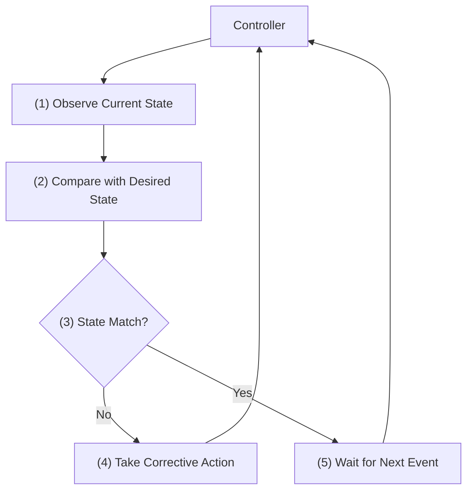
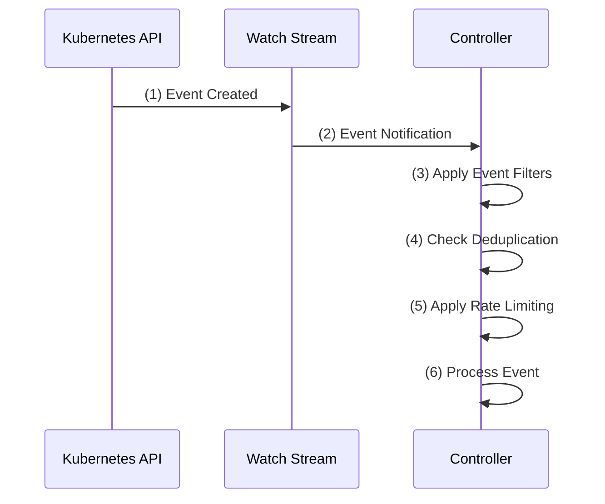
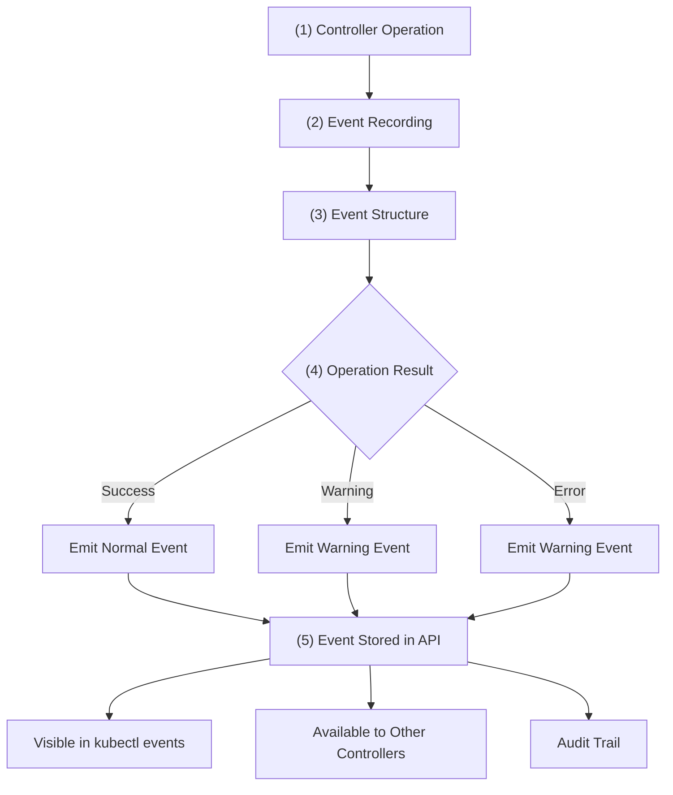
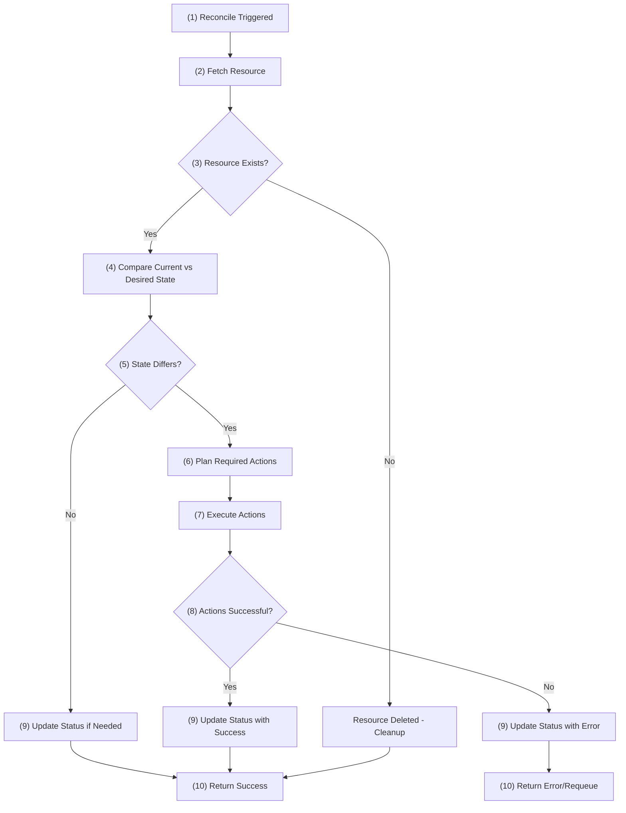
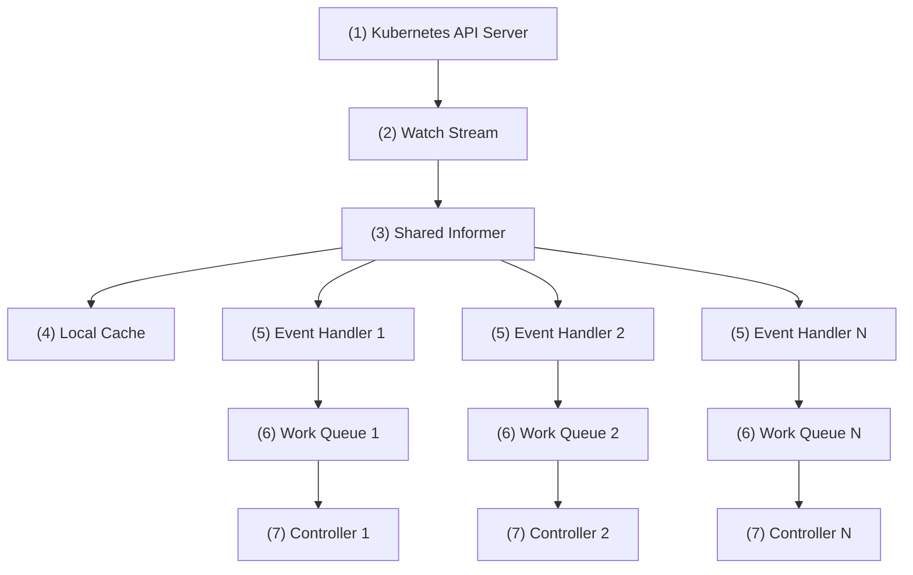
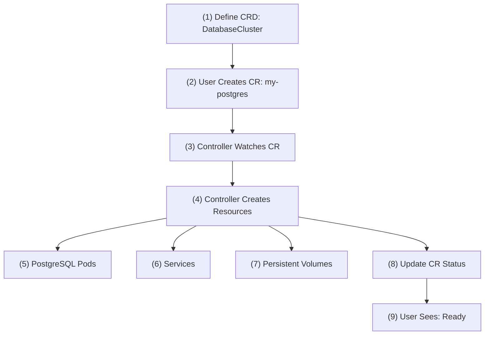
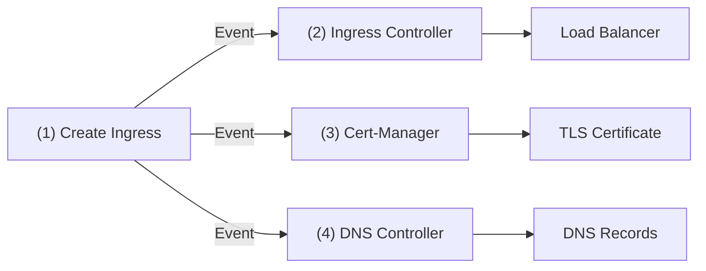
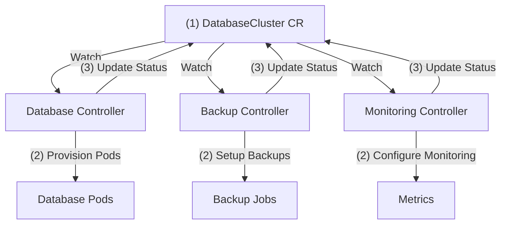
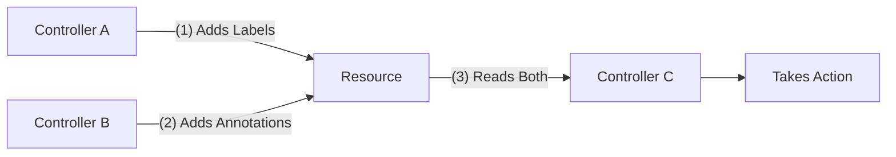

+++
title = 'Kubernetes Controllers Deep Dive: How They Really Work'
date = 2025-10-06T15:00:00+00:00
draft = false
+++

Here's something that might surprise you: **most people using Kubernetes don't actually understand how it works**. They know how to write YAML files and run `kubectl apply`, but when things go wrong - and they always do - they're completely lost. Why? Because they don't understand controllers.

Controllers are the beating heart of Kubernetes. They're what make your pods automatically restart when they crash, what scale your applications up and down, and what make custom resources feel like native parts of the platform. Without understanding controllers, you're just throwing YAML at the wall and hoping it sticks.

In this video, we're going deep into how controllers actually work - not just the basic concept, but the real mechanics. We'll explore how they consume and emit events, how they coordinate with each other, and why understanding this will make you infinitely better at building and debugging Kubernetes systems. Whether you're just using Kubernetes or building your own controllers, this knowledge will transform how you think about the platform.

<!--more-->



## Kubernetes Control Loops Explained

So what exactly is a Kubernetes controller? At its heart, a **controller** is a piece of software that implements a continuous control loop. It's constantly watching what's happening in your cluster, comparing that reality with what you've declared you want, and then taking whatever actions are necessary to bridge that gap. Think of it like a thermostat in your house - it monitors the temperature, compares it to what you've set, and turns the heating or cooling on or off to maintain your desired temperature.

This brings us to the fundamental principle that makes Kubernetes so powerful. You have **declarative configuration** - where you describe what you want your system to look like, not how to get there. Then you combine that with **reactive reconciliation** - controllers that automatically respond to changes and drift. When you put these two concepts together, you get something pretty damn cool: **self-healing systems**. Your applications don't just run; they actively maintain themselves in the state you've declared, even when things go wrong.

But how does this actually work? The magic happens in what we call the **control loop**, and it's beautifully simple. The controller (1) **observes** the current state of the resources it's responsible for. Then it (2) **compares** that current state with the desired state you've declared. At this point, it (3) asks a simple question: do they match? If the states don't match, the controller (4) **takes corrective action** to close that gap. But if everything is already in the desired state, it (5) simply waits for the next event or change to occur. Either way, the process loops back to the beginning and starts over (6). It's an endless cycle of observing, comparing, deciding, and acting when necessary.

Now here's a critical requirement that trips up a lot of people when they're writing their own controllers: **idempotency**. This means that your controller must be able to run the same operation multiple times without screwing things up. Think about it - if your controller crashes and restarts, or if it processes the same event twice, it shouldn't create duplicate resources or put your system in an inconsistent state. The operation should produce the same result whether you run it once or a hundred times.

But here's what's really interesting: we've been talking about this control loop like it's constantly running, but how does the controller actually know when something changes? You might think it's polling the API server every few seconds, but that would be incredibly inefficient. The real answer is much more elegant.

## How Kubernetes Controllers Watch Events

Now let's dive into how controllers actually consume events. This is a crucial aspect that many people overlook - controllers don't just emit events, they also **consume Kubernetes Events** as first-class resources to react to cluster changes. Think of it as a two-way street where controllers both listen to what's happening and announce what they're doing.

Here's how the event consumption pipeline works. (1) It all starts when something happens in your cluster and an **event is created** by the Kubernetes API. This could be the kubelet generating an event when it pulls an image, the scheduler creating an event when it can't place a pod, or any other cluster component broadcasting what it's doing.

(2) Controllers set up **event watching** to monitor specific Event resources. They don't just blindly consume every event in the cluster - that would be chaos. Instead, they use field and label selectors to watch only the events they actually care about.

When they're watching for events, controllers need to understand the **event types** they're dealing with. Kubernetes has two main types: `Normal` events, which are informational messages like `Pulled` or `Started`, and `Warning` events, which indicate potential issues like `FailedScheduling` or `BackOff`. For example, a cluster autoscaler controller might watch for `FailedScheduling` Warning events and react by adding more nodes to the cluster.

Now, where do these events actually come from? **Event sources** are all over your cluster - the kubelet generates events when it pulls images or starts containers, the scheduler creates events when it can't place a pod, and other controllers emit events about their operations. Basically, every major component in your cluster is constantly broadcasting what it's doing through these events.

(3) With all these events flying around, controllers need smart **event filtering** to focus on what matters. They can filter by event type (`Warning` or `Normal`), by specific event reasons like `FailedScheduling` or `Pulled`, by the kind of object involved such as `Pod` or `Deployment`, and even by namespace scope. Without this filtering, your controller would drown in irrelevant noise.

(4) But filtering isn't enough - you also need **deduplication** to prevent processing the same event multiple times. Controllers use unique keys to track which events they've already handled. This is crucial because the same event might come through multiple times due to network issues or controller restarts, and you don't want your controller taking the same action repeatedly.

(5) Finally, there's **rate limiting** - implementing backoff strategies to avoid overwhelming external systems. If your controller is reacting to a flood of events, you don't want it hammering your APIs or external services. Smart rate limiting helps your controller be a good citizen in the cluster ecosystem.

(6) After all these checks and filters, the controller finally **processes the event** - taking whatever action is appropriate based on the event type and content. This might mean scaling up nodes, sending alerts, updating metrics, or triggering remediation workflows.

## Kubernetes Event Emission

Now let's flip the script and look at the other side - **event emission**. Controllers don't just consume events, they also emit their own Events to provide observability, create audit trails, and enable communication with other controllers. This is how controllers broadcast what they're doing to the rest of the cluster ecosystem.

Here's how the event emission process works. (1) It starts when your controller performs a **controller operation** - this could be creating a deployment, scaling a replica set, updating a service, or any other action your controller is responsible for managing.

(2) As part of this operation, the controller uses **event recording** through the `EventRecorder` interface to create Events. Think of this as your controller's way of writing to a shared logbook that everyone in the cluster can read.

Controllers typically emit different **event categories** depending on what's happening. You've got operational events for normal controller operations like `DeploymentCreated` when a controller creates a new deployment, or `PodScheduled` when the scheduler assigns a pod to a node. Success events celebrate when things go well, like `ImagePullSucceeded` when a container image downloads successfully. And error events signal failures and warnings, like `FailedToCreatePod` when a pod can't be created or `InsufficientResources` when there aren't enough cluster resources available.

When these events are emitted, they trigger reactions throughout the cluster ecosystem. A monitoring controller might see `FailedToCreatePod` and fire off an alert to your Slack channel. A cluster autoscaler might catch `InsufficientResources` and spin up additional nodes. An audit controller could log all `DeploymentCreated` events for compliance tracking. This is how controllers coordinate and create that self-healing behavior we talked about earlier.

(3) Now, when controllers decide to emit an event based on the operation result, they need to structure it properly. Every event has four key components: the **Object** (which resource the event relates to), the **Type** (`Normal` or `Warning`), the **Reason** (a machine-readable cause like `FailedScheduling` or `ImagePullSucceeded`), and the **Message** (a human-readable description that explains what actually happened). For example, if a pod fails to schedule, you might get an event with Object pointing to that specific pod, Type as `Warning`, Reason as `FailedScheduling`, and Message as "0/3 nodes are available: 3 Insufficient memory."

One thing to keep in mind about **event lifecycle** is that events don't stick around forever - Kubernetes automatically cleans them up after 1 hour by default. This prevents your cluster from getting clogged up with old event data, but it also means if you need long-term event history for compliance or debugging, you'll want to ship them to a data store like Elasticsearch, Prometheus, or InfluxDB before they disappear.

Kubernetes also handles **event aggregation** to reduce noise - if the same event keeps happening repeatedly, it'll group them together instead of spamming you with identical events. For example, if a pod keeps failing to pull an image, instead of creating 50 separate `ImagePullError` events, Kubernetes will create one event and increment a counter showing it happened 50 times.

(4) Once the event is properly structured, the controller evaluates the **operation result** to determine what type of event to emit - whether it's a `Normal` event for successful operations or a `Warning` event for problems and errors.

(5) The event then gets **stored in the API server**, making it available throughout the cluster ecosystem where it can be consumed by monitoring tools, other controllers, and administrative commands like `kubectl events` (6).

## Kubernetes Reconciliation Loop

Now let's dive into the heart of how controllers actually work - the **reconciliation loop**. This is where all the magic happens, where your controller continuously ensures that reality matches your desired state.

What kicks off this reconciliation process? There are several **trigger sources** that can wake up your controller: events from the cluster (like a pod failing), periodic requeuing (your controller checking things on a schedule), direct resource changes (someone updating a deployment), or external webhooks (maybe a monitoring system detecting an issue). Essentially, anything that might affect the desired state of your resources can trigger reconciliation.

When any of these triggers fire, they all funnel into a single **reconcile function** - think of it as the main entry point that handles all resource state changes. No matter what triggered the reconciliation, whether it was an event, a timer, or a user action, it all goes through this one function. This design keeps things clean and ensures consistent behavior regardless of what woke up your controller.

Here's how the reconciliation process unfolds step by step. (1) First, **reconciliation is triggered** by one of those trigger sources we just discussed - maybe a user scaled up a deployment, or a pod crashed, or your controller's periodic timer went off.

(2) Next, the controller needs to **fetch the resource** from the API server to get the current state. It uses the `NamespacedName` (basically the resource's name and namespace) to identify exactly which resource triggered this reconciliation. For example, if someone updated `my-app` deployment in the `production` namespace, that's what gets fetched.

(3) The controller then checks a crucial question: **does this resource still exist?** If someone deleted the resource, the controller needs to handle cleanup. If the resource is gone, it performs any necessary cleanup actions and wraps up. But if the resource still exists, then the real work begins.

(4) This is where the core logic kicks in - **comparing current versus desired state**. The controller looks at what the resource spec says it should look like (the desired state) and compares that with what it actually looks like right now (the current state from the API server). For example, if the deployment spec says there should be 5 replicas but the current state shows only 3 pods running, there's a mismatch that needs fixing.

(5) Based on this comparison, the controller asks another key question: **does the state differ?** If everything matches perfectly - the desired replica count matches the actual running pods, all the right labels are in place, the container image is correct - then there might not be much to do except maybe update the status. But if there's a difference, that's when the controller springs into action.

(6) When the state differs, the controller moves into **action planning** mode. It needs to figure out exactly what actions are required to bridge the gap between current and desired state. This might mean creating new pods, updating existing ones, deleting old resources, or modifying configurations. The controller builds a plan of what needs to happen to get from where things are to where they should be.

(7) Once the plan is ready, it's time to **execute those actions**. This is where the controller actually makes changes to the cluster - creating that missing pod, updating the service configuration, or whatever else needs to happen. The controller carries out each step in its plan, making API calls to modify resources as needed.

(8) After executing the actions, the controller needs to know: **were the actions successful?** Did the new pods get created? Did the configuration update take effect? This determines what happens next in the reconciliation process.

(9) Regardless of whether the actions succeeded or failed, the controller needs to **update the status** of the resource to reflect the current situation. If everything went well, it updates the status to show success. If something went wrong, it records the error in the status so you can see what happened when you check on the resource later.

(10) Finally, the controller handles the **result** by deciding what to do next. This means determining whether the reconciliation succeeded or failed, and whether it should try again later. If everything's good, it might be done until something changes. If there was an error, it might schedule a retry after a delay, using exponential backoff to avoid hammering the system.

Now, you might be wondering: with all these events and reconciliation loops happening, how does Kubernetes handle dozens of controllers all watching the same resources without overwhelming the API server? The answer involves some seriously clever engineering.

## Kubernetes Watch API

Now that we understand the reconciliation loop, let's dive deeper into how controllers actually watch for changes in the cluster. This is the infrastructure that makes the whole reactive system work.

At the foundation, (1) the **Kubernetes API Server** provides a **Watch API** through special endpoints that stream resource changes in real-time. Instead of your controller constantly polling "hey, did anything change?", the API server pushes notifications whenever something happens. When someone creates a new pod, scales a deployment, or updates a service, your controller gets notified immediately through these watch streams.

But raw (2) **watch streams** would be pretty overwhelming for controllers to handle directly. That's where **informers** come in - think of them as a smart client-side caching layer that sits between your controller and the watch streams. Informers maintain a local copy of the resources you care about and provide clean event notifications when things change. Instead of dealing with raw API events, your controller gets nice, organized notifications about what happened.

Here's where it gets really clever - instead of every controller creating its own informer (which would mean multiple watch streams for the same resources), Kubernetes uses (3) **shared informers**. One informer can be shared across multiple controllers, so if you have three controllers that all need to watch deployments, they can all use the same underlying informer. This is way more efficient and reduces load on the API server.

(4) The shared informer maintains a **local cache** of all the resources it's watching, so controllers can quickly access current state without hitting the API server every time. (5) When changes come in, the informer notifies multiple **event handlers** - one for each controller that's interested in those resources. (6) These event handlers then put the relevant changes into separate **work queues**, one per controller, so each controller gets its own stream of events to process. (7) Finally, each **controller** processes events from its own work queue at its own pace, triggering reconciliation as needed.

There's also a safety mechanism called the **resync period** - by default, every 10 hours, the informer triggers a full reconciliation of all resources it's watching, even if nothing has changed. This catches any events that might have been missed due to network issues, bugs, or other problems. It's like doing a periodic sanity check to make sure your controller's view of the world matches reality.

Now, what types of events flow through this system? Controllers receive five main **event types**: `ADDED` when a new resource is created (like when you deploy a new pod), `MODIFIED` when an existing resource changes (like scaling a deployment from 3 to 5 replicas), `DELETED` when a resource is removed, `BOOKMARK` for periodic checkpoints to help with resynchronization, and `ERROR` when something goes wrong in the watch stream itself.

To keep everything consistent and handle conflicts properly, Kubernetes tracks **resource versions** - think of them like version numbers that increment every time a resource changes. If your controller tries to update a deployment based on version 42, but someone else already updated it to version 43, the API server will reject your change and you'll need to reconcile based on the newer version. This prevents controllers from accidentally overwriting each other's changes.

## Kubernetes Custom Resource Definitions (CRDs)

Here's where controllers become truly powerful - they can extend Kubernetes with entirely new resource types through **Custom Resource Definitions**. Think about it: when you use `kubectl apply` with an Ingress resource, or create a Certificate for TLS, or deploy a GitRepository for GitOps, you're interacting with custom resources that controllers understand and manage. CRDs are how controllers make themselves feel like native parts of Kubernetes.

The foundation of any CRD is its **schema definition**. This OpenAPI v3 schema defines exactly what structure your custom resource can have and what values are valid. For example, if you're building a DatabaseCluster controller, the schema defines that users must specify things like `replicas`, `storageSize`, and `version`, while preventing them from setting invalid combinations that would break their database.

Here's how the whole relationship works in practice. (1) First, you **define a CRD** that describes a new resource type - let's say a `DatabaseCluster` that defines what fields users can specify like database type, replica count, and storage size. (2) **Users create Custom Resources (CRs)** - actual instances of that type, like "I want a PostgreSQL cluster with 3 replicas and 100GB storage." (3) Your **controller watches for these CRs** and sees "oh, someone wants a PostgreSQL cluster." (4) The controller then **creates resources** - (5) PostgreSQL pods to run the database, (6) services for network access, and (7) persistent volumes for data storage. (8) The controller **updates the CR's status** to show progress like "DatabaseCluster is provisioning" or "DatabaseCluster is ready." (9) Finally, the **user sees the ready status** and knows their database cluster is available for use.

## Kubernetes Controller Communication

So far we've looked at individual controllers doing their thing, but here's where it gets really interesting: controllers rarely work alone. They're constantly coordinating with each other, like a team of specialists working on different parts of the same project. When you deploy an application with an Ingress, for example, you're actually triggering a chain reaction across multiple controllers that need to work together.

The primary way controllers communicate is through **event-driven coordination**. (1) When you create an Ingress resource, it triggers events that multiple controllers are watching for. (2) The Ingress controller sees it and creates the necessary load balancer configuration, (3) cert-manager notices the TLS annotation and provisions a certificate, (4) the DNS controller updates records to point to the new endpoint. Each controller does its specialized job, triggered by events from the others.

Controllers can also share ownership of resources through **shared Custom Resources**. (1) Multiple controllers can watch the same CR, each responsible for different aspects. For instance, a `DatabaseCluster` CR might be watched by one controller that provisions the database pods, another that handles backups, and a third that manages monitoring. (2) Each controller handles its specialized aspect of the resource. (3) They coordinate by updating different parts of the status, avoiding conflicts through careful API design.

The most elegant coordination happens through **labels and annotations**. (1) Controllers use labels to signal their intent to others: "I'm managing this", "This needs backup", "Ready for traffic". (2) Annotations carry metadata between controllers: configuration details, state information, or instructions that other controllers can read and act upon. (3) Other controllers read these signals and take appropriate action. It's like leaving notes for your teammates on shared resources.

## Kubernetes Controllers Mastery

So there you have it - controllers are what make Kubernetes feel magical. When you `kubectl apply` a deployment and watch pods automatically appear, scale, and heal themselves, you're seeing controllers at work. When you create a custom resource and suddenly have complex applications managed as easily as built-in resources, that's the power of the controller pattern.

Think about everything we've covered: the endless reconciliation loops ensuring your desired state becomes reality, the sophisticated event systems letting controllers react instantly to changes, the custom resource definitions that let you extend Kubernetes with your own concepts, and the elegant coordination between controllers that makes complex multi-component applications work seamlessly.

What makes this pattern so powerful is its simplicity. Controllers just watch, compare, and act. Yet this simple pattern scales from managing a single pod to orchestrating entire distributed systems. Every controller follows the same fundamental approach - whether it's the built-in ReplicaSet controller ensuring you have the right number of pods, or your custom DatabaseCluster controller provisioning complex stateful workloads.

Now that you understand how controllers actually work, you can design better systems, debug issues more effectively, and make informed decisions about when to build custom controllers versus using existing solutions. When something goes wrong in your cluster, you'll know to look at controller logs, check reconciliation loops, and understand the event flow. This knowledge transforms you from someone who just uses Kubernetes to someone who truly understands it.

