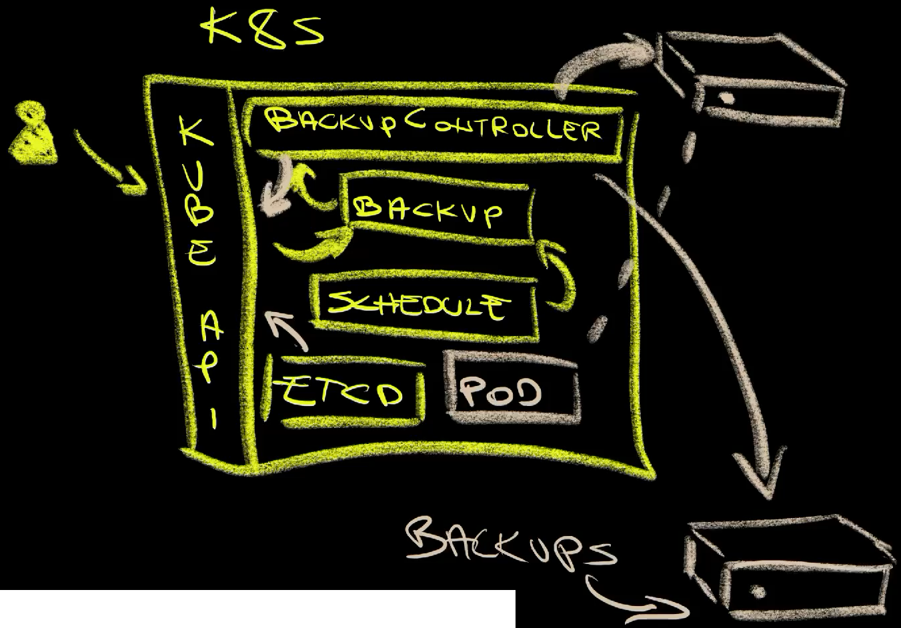
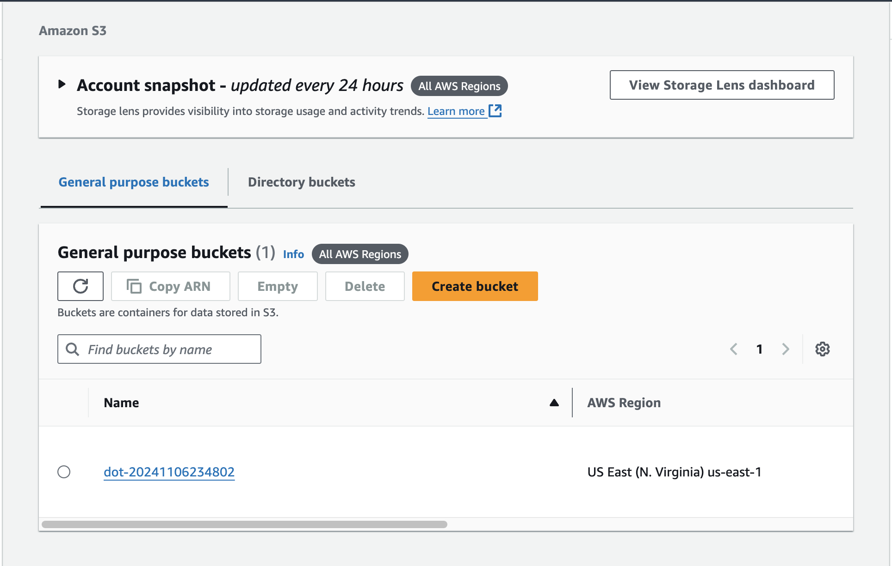
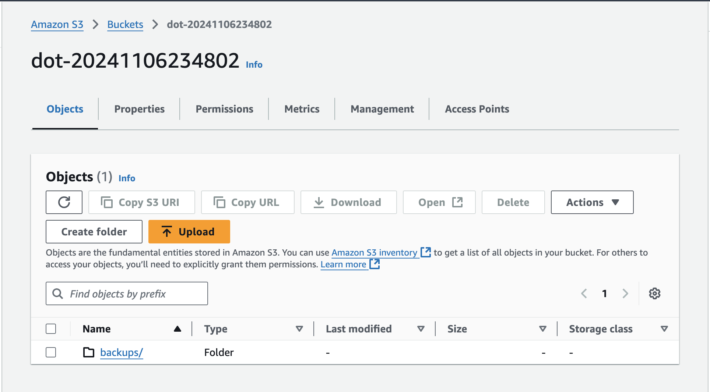
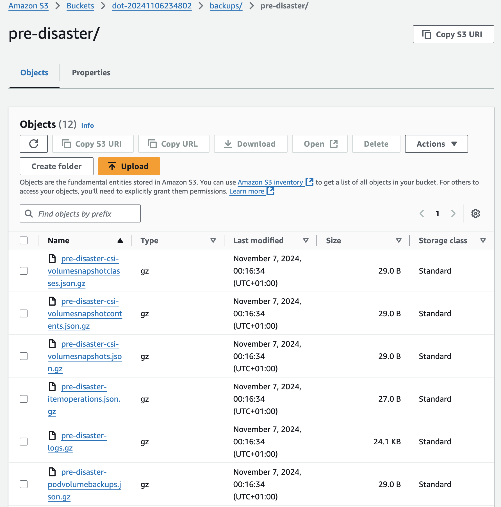

+++
title = 'Master Kubernetes Backups with Velero: Step-by-Step Guide'
date = 2024-12-09T14:00:00+00:00
draft = false
+++

Do you think your Kubernetes clusters are safe and able to withstand anything and everything?

Truth be told, Kuberentes is **very resilient**. It was designed to be highly available and fault tollerant. You hopefully know all that and, if you do, you probably also know that nothing is 100% resilient. Bad things happen. Unexpected things happen, and we should be **prepared for anything and everything**. Backups are a part of that preparation. We are or, at least, we should be creating them regularly in hope that we'll never have to restore any of them. Yet, we might be in a situation when restoring a backup is our last option, especially in cases when a cluster is completely gone and the only option left is to create a new one and restore a backup which, hopefully, should result in the new cluster running the same resources, having the same data, showing the same logs, and everything else that we had in the old cluster that is now dead.

<!--more-->



There are many ways how we can create and restore backups, many of them being commercial. We won't explore any of them today. Instead, we'll focus on the arguably the best solution among open source projects. We'll go through Velero which can be considered the **golden standard**, at least among free options.

Today we'll explore the glorious side of backups in general and Velero in particular, while the next post will focus on the dark side of the story. So, think of this as an intro that's supposed to make you feel happy and at ease. I want you to feel safe before I make you paranoid and shatter all your hopes and dreams.

All in all, this post is a happy one and you have the right to ignore the next one if you're prone to depression.

On that note, let's jump right into it.

## Setup

```sh
git clone https://github.com/vfarcic/velero-demo

cd velero-demo
```

> Watch [Nix for Everyone: Unleash Devbox for Simplified Development](https://youtu.be/WiFLtcBvGMU) if you are not familiar with Devbox. Alternatively, you can skip Devbox and install all the tools listed in `devbox.json` yourself.

```sh
devbox shell
```

> Please watch [The Future of Shells with Nushell! Shell + Data + Programming Language](https://youtu.be/zoX_S6d-XU4) if you are not familiar with Nushell. Alternatively, you can inspect the `setup.nu` script and transform the instructions in it to Bash or ZShell if you prefer not to use that Nushell script.

```sh
chmod +x setup.nu

./setup.nu

source .env
```

## Create and Schedule Backups with Velero

I have a Kubernetes cluster that, among other things, is running an application in the `a-team` Namespace.

```sh
kubectl --namespace a-team get all,ingresses,persistentvolumes
```

The output is as follows.

```
NAME                              READY   STATUS    RESTARTS   AGE
pod/silly-demo-6f85bd9f4f-frhxm   1/1     Running   0          2m10s

NAME                 TYPE        CLUSTER-IP       EXTERNAL-IP   PORT(S)    AGE
service/silly-demo   ClusterIP   10.100.161.133   <none>        8080/TCP   2m11s

NAME                         READY   UP-TO-DATE   AVAILABLE   AGE
deployment.apps/silly-demo   1/1     1            1           2m11s

NAME                                    DESIRED   CURRENT   READY   AGE
replicaset.apps/silly-demo-6f85bd9f4f   1         1         1       2m11s

NAME                                   CLASS     HOSTS                             ADDRESS                                                                  PORTS   AGE
ingress.networking.k8s.io/silly-demo   traefik   silly-demo.44.219.253.50.nip.io   a9f419c5d40934aa19f4a73e1153bff0-190145271.us-east-1.elb.amazonaws.com   80      2m11s

NAME                                                        CAPACITY   ACCESS MODES   RECLAIM POLICY   STATUS   CLAIM                     STORAGECLASS   VOLUMEATTRIBUTESCLASS   REASON   AGE
persistentvolume/pvc-8f2e8d27-8c77-45a2-b086-7e3eacb4e80d   1Gi        RWO            Delete           Bound    a-team/silly-demo-cache   gp2            <unset>                          2m9s
```

The important note here is that it has "typical" Kubernetes resources like Pods, Services, what-so-not, but also a PersistentVolume which is external storage attached to the Pods of the application. That is, effectively, a stateful app that reads and writes data to disk. As such, we might need to ensure that at least two types of resources are backed up. We should have a backup of Kubernetes objects like Deployments, Pods, Secrets, and so on and so forth, but also backups or, to be more precise, snapshots of data in persistent volumes. Otherwise, we might get a volume restored as a Kubernetes object, but no data in it.

Some might also want to backup logs or some other type of data, but that's just silly. You should be shipping logs to a store like Loki so if there is anything to backup, that would be Logs Storage, not logs in Kubernetes objects.

Anyways... We have, among other things an application that consists of Kubernetes objects and data in external storage. We can prove that by sending a request to the app to retrieve all the videos.

```sh
curl "http://silly-demo.$INGRESS_HOST/videos" | jq .
```

The output is as follows.

```json
[
  {
    "id": "1",
    "title": "Video1"
  },
  {
    "id": "2",
    "title": "Video2"
  }
]
```

That is a very uneventful output. Still, remember that there are two entries in that JSON and that it comes not from the application directly but from external storage the application uses instead of a database. If it would have been database, it would still have external storage attached, so the logic would be the same. We'd need to back up that storage, except that backing up database data with Kubernetes backup tools might be a bad idea. Still, I promised this post will be all about sunshines and rainbows, so I'll keep that conversation for the next one. For now, imagine that any data is just data stored on some disk and that we should back it up.

There are two important ways we can create backups. They can be scheduled or on-demand. You are likely to use both.

Almost all operations with Velero can be done through its CLI, or by applying Kubernetes resources in the same way we'd create any other.

In case of the CLI, all we have to do is execute `velero schedule create`, specify the name (`daily`), and choose the `--schedule` with the value that follows the general job scheduling format. For now, we'll choose to create `@daily` backups.

```sh
velero schedule create daily --schedule "@daily"
```

While executing commands to create Kubernetes resources is fairly common, I also believe its not the way to go. A better approach is to always define resources as YAML files, directly or through templating like Helm. That way we can store it in Git, review it, apply GitOps, and do all the other good things we normally do.

Here's an example.

```sh
cat velero/schedule.yaml
```

The output is as follows.

```yaml
apiVersion: velero.io/v1
kind: Schedule
metadata:
  name: every-5-min
spec:
  schedule: '*/5 * * * *'
  skipImmediately: false
  template:
    excludedNamespaces:
    - default
    - kube-node-lease
    - kube-public
    - kube-system
```

That is a slightly more complicated `Schedule` definition than the one we created through the CLI. It's scheduled to run every five minutes (`*/5 * * * *`) and to exclude Namespaces `default`, `kube-node-lease`, `kube-public`, and `kube-system`. Excluding Namespaces might be handy since there are always some that should not be restored. We should, for example, leave *kube-system* be whatever it is in a cluster and not temper with it in any form or way. Still, whether you choose to exclude Namespaces, or apply any other filter to backups is not important since, as we'll see later, we can choose which parts of the backup to restore when the time comes. Hence, it is easiest to backup everything. It's easier to remove stuff we don't need than to end up in a situation that we do need something that is not backed up. The only potential downside of backing up everything is that it might occupy too much space in backups storage which can result in higher cost. If that's not an issue, just backup everything.

Let's apply that manifest,...

```sh
kubectl --namespace velero apply --filename velero/schedule.yaml
```

...and wait for a few moments.

```sh
kubectl --namespace velero get schedules
```

The output is as follows.

```
NAME          STATUS    SCHEDULE      LASTBACKUP   AGE     PAUSED
daily         Enabled   @daily                     6m
every-5-min   Enabled   */5 * * * *   77s          5m28s
```

We can see that we got two backup schedules, one that will be created `@daily` and the other set to the frequency of five minutes (`*/5 * * * *`). One of those two makes no sense, yet we created it mostly so that we can see it in action quickly.

We can, as you can probably guess, create on-demand backups as well which are especially useful if we are clairvoyant and you can sense danger, or if you're into astrology and you see that the stars are aligning into a position that will lead to an inevitable disaster, or if you read tarrot cards and those you pull out result in a nasty situation that might lead to a doomsday. Anyways... We can create on-demand backups prior to some important changes to the cluster or before our sixt sense tells us to. We do that by executing `velero backup create`,...

```sh
velero backup create pre-disaster
```

...and retrieving all the backups just to confirm everything is indeed working.

```sh
kubectl --namespace velero get backups.velero.io
```

The output is as follows.

```
NAME                         AGE
every-5-min-20241106232013   97s
pre-disaster                 5m21s
```

Here's what's happening.



We have the Velero BackupController (1) that reacts every time a *Backup* resource is created (2). Such resources can be created by us (3) or by the `Schedule` (4) which, essentially, acts as a glorified cron job that creates backup resources for us.

When a Backup resource is created, the controller creates a snapshot of etcd (5) which is Kubernetes internal database. That's where the current state of all the resources in the cluster is stored. It also creates snapshots of all the data in volumes (6), of all the logs, and a few other things. All those snapshots are then uploaded to an external storage (7). In case of AWS that would be an S3 bucket, in case of Google Cloud it would be Cloud Storage Bucket, and so on and so forth. Any of those can be the final destination of the backups (8).

Speaking of storage, Velero supports almost anything one can imagine. There is AWS S3, Google Cloud Storage, Azure Blob Storage which are storages from the "big three". It also works with Alibaba Cloud OSS, DigitalOcean Object Storage, and a few others. If none of the currently supported are what you're using, there are many others that are not supported directly but are S3 compatible, including Minio that, effectively, makes almost anything S3 compatible. All in all, if your storage is not supported, one way or another, you are probably using something exotic or, more likely, something so antiquated that no one but you cares about.

We can confirm that's what's really happening by taking a look at the bucket of the provider we chose which, in my case, is AWS S3, but in yours it can be something else.

> Execute the command that follows only if you chose Google Cloud.

```sh
echo "https://console.cloud.google.com/storage/browser?project=$PROJECT_ID"
```

> Execute the command that follows only if you chose AWS.

```sh
echo "https://us-east-1.console.aws.amazon.com/s3/home?region=us-east-1"
```

First of all, we can see that Velero indeed created a bucket.



Inside it, we can see that the directory `backups` was created. That means that we could, at least in theory, share that storage with other processes.



Inside `backups`, there is a subdirectory for each backup.


If we enter inside `pre-disaster` we can see individual files, one for each type of the resources of data that were backed up. There are volume snapshot classes (`pre-disaster-csi-volumesnapshotclasses.json.gz`), contents (`pre-disaster-csi-volumesnapshotcontents.json.gz`), and snapshots themselves (`pre-disaster-csi-volumesnapshots.json.gz`), item operations (`pre-disaster-itemoperations.json.gz`), logs (`pre-disaster-logs.gz`), and so on and so forth.



Now that we have backups, we can explore what we might need to do in the disaster scenario.

## Restore Backups with Velero

Imagine that a disaster happened and our cluster is down. To make things more complicated, imagine that, for one reason or another, we cannot bring it back up. Now, to be clear, that is a very unlikely scenario if that cluster was distributed across multiple zones since that would mean that at least two zones, two datacenters, would need to be down or that we did something that messed it up completely. Still, s**t happens. The cluster is down, but we have a backup. It might not contain the most recent state but whichever state the cluster was in at the time the last backup was made. Something is better than nothing.

*This is a post about backups with Velero so the scope is limited to it. As a result, I won't dive into reasons why in such a disaster scenario you might want to resort to other ways to restore the state nor which other tools might be better suited for it. Also, I promised that I'll be all "rainbows and unicorns" and diving into those potentially better alternatives could result in a negative spin. I'll stay out of it in this post and reserve it for the "doom and gloom" post that is coming soon.*

Fortunately, I already created a second cluster that should continue where the first one left. It can be accessed through the *kubeconfig-dot2.yaml* config so please note that whenever you see me using it we are working with a new cluster. I already installed Velero and Traefik Ingress in that cluster, and nothing else. Velero in that cluster is configured to use the same bucket as Velero in the other cluster that is now "kaput".

Let's confirm that the new cluster is indeed "virgin" by listing all the Namespaces.

```sh
kubectl --kubeconfig kubeconfig-dot2.yaml get namespaces
```

The output is as follows.

```
NAME              STATUS   AGE
default           Active   48m
kube-node-lease   Active   48m
kube-public       Active   48m
kube-system       Active   48m
traefik           Active   38m
velero            Active   39m
```

We can see that there isn't much in that cluster. More importantly, we can see that the application that is supposed to be running in the `a-team` Namespace is not there.

Since Velero in the new cluster is configured to use the same bucket as the one in the old, it should have discovered the backups created in the old cluster. Let's see whether that's indeed the case.

```sh
kubectl --kubeconfig kubeconfig-dot2.yaml \
    --namespace velero get backups.velero.io
```

The output is as follows.

```
NAME                         AGE
every-5-min-20241106232013   7m20s
every-5-min-20241106232513   2m20s
pre-disaster                 10m
```

We can see that a few scheduled backups are there as well as `pre-disaster` we created ourselves. That's the one we're interested in. That's the backup we want to restore, so let's just do it by executing `velero` against the new cluster `dot2` and telling it to `restore` from the `pre-disaster` backup. Further on, let's say that we are not interested in the whole cluster but only in the resources that were running in the *a-team* Namespace so we'll tell it to only include that Namespace (`--include-namespaces`).

```sh
velero --kubeconfig kubeconfig-dot2.yaml restore create \
    --from-backup pre-disaster --include-namespaces a-team
```

That's it or, at least, that's supposed to be it. If we'd like to take a closer look at what was included in that restore we can execute `velero`, still pointing to the new cluster, and tell it that we want to work with `restore` and, more specifically, that we'd like it to describe it.

> Replace `[...]` with the Velero restore name.

```sh
velero --kubeconfig kubeconfig-dot2.yaml restore describe [...]
```

The output is as follows (truncated for brevity).

```yaml
Name:         pre-disaster-20241107002807
Namespace:    velero
...
Phase:                       Completed
Total items to be restored:  12
Items restored:              12
..
Namespaces:
  Included:  a-team
  Excluded:  <none>

Resources:
  Included:        *
  Excluded:        nodes, events, events.events.k8s.io, backups.velero.io, restores.velero.io, resticrepositories.velero.io, csinodes.storage.k8s.io, volumeattachments.storage.k8s.io, backuprepositories.velero.io
  Cluster-scoped:  auto
...
```

We can see that it `Completed` the process that resulted in `12` `items restored`. We can also see that it `Included` only the resources from the `a-team` Namespace and that it also `Excluded` a bunch of resources, mostly those related to Velero itself.

We can confirm that's indeed what happeneded by taking another look at all the Namespaces.

```sh
kubectl --kubeconfig kubeconfig-dot2.yaml get namespaces
```

The output is as follows.

```
NAME              STATUS   AGE
a-team            Active   2m38s
default           Active   52m
kube-node-lease   Active   52m
kube-public       Active   52m
kube-system       Active   52m
traefik           Active   42m
velero            Active   42m
```

There it is. As expected, the `a-team` Namespace is now there and we can list `all` the core resources, plus `ingresses`, and `persistentvolumes` to be certain that everything is indeed the same in the new as in the old cluster.

```sh
kubectl --kubeconfig kubeconfig-dot2.yaml --namespace a-team \
    get all,ingresses,persistentvolumes
```

The output is as follows (truncated for brevity).

```
NAME                            READY STATUS  RESTARTS AGE
pod/silly-demo-6f85bd9f4f-frhxm 1/1   Running 0        2m57s

NAME               TYPE      CLUSTER-IP    EXTERNAL-IP PORT(S)  AGE
service/silly-demo ClusterIP 10.100.198.31 <none>      8080/TCP 2m58s

NAME                       READY UP-TO-DATE AVAILABLE AGE
deployment.apps/silly-demo 1/1   1          1         2m58s

NAME                                  DESIRED CURRENT READY AGE
replicaset.apps/silly-demo-6f85bd9f4f 1       1       1     2m58s

NAME                                 CLASS   HOSTS                           ADDRESS   PORTS AGE
ingress.networking.k8s.io/silly-demo traefik silly-demo.44.219.253.50.nip.io afb2f3... 80    2m59s

NAME                        CAPACITY ACCESS MODES RECLAIM POLICY STATUS CLAIM                   STORAGECLASS VOLUMEATTRIBUTESCLASS REASON AGE
persistentvolume/pvc-8f2... 1Gi      RWO          Delete         Bound  a-team/silly-demo-cache gp2          <unset>                      3m
```

We're not yet done. We confirmed that Kubernetes resources were restored, but that does not necessarily mean that the data that was in external volumes was restored as well. We can confirm that as well by sending a request to the application running in the new cluster. When we started, while we were still using the old cluster, that request returned two entries that were read from the storage. If we get the same result again, that should be the confirmation that the data was restored as well.

But, before we do that, we'll run a quick hack to update the Ingress in the new cluster. Since the application is not accessible through a "real" domain but *nip.io* which needs the IP of the external load balancer, and that LB is different in the new cluster, we'll do a quick patch to update it. If you are using "real" domains, you'll have to update DNS records instead.

```sh
kubectl --kubeconfig kubeconfig-dot2.yaml \
    --namespace a-team patch ingress silly-demo --type json \
    --patch "[{'op': 'replace', 'path': '/spec/rules/0/host', 'value':'silly-demo.$DOT2_INGRESS_HOST'}]"
```

Let's see what we'll get.

```sh
curl "http://silly-demo.$DOT2_INGRESS_HOST/videos" | jq .
```

The output is as follows.

```json
[
  {
    "id": "1",
    "title": "Video1"
  },
  {
    "id": "2",
    "title": "Video2"
  }
]
```

Boom! That was the last confirmation we needed. Both the resources and the data in external volumes were restored. Everyhing is working in the new cluster as if nothing happened. The **disaster** was **averted**. Actually, that's not really true. There was a delay between the old cluster crashing and the new being fully operational so there was some downtime. Also, we restored the last backup which likely does not contain the last state of the old cluster but the state when the backup was created, so neither resources nor data are the same as they were in the cluster before it crashed. Also, we had a simple example when restoring resources worked, even though it would fail in more complex scenarios. To make things worse, if we have used a database inside the cluster, data snapshot could have been corrupted. We can also start asking questions whether we need backup if we're using GitOps, and...

Stop!

I said that I will be all sunshine and unicorns in this post. I got carried away. Appologies.

We'll explore all the bad things that might have happened by us simply restoring backups in the next post. Stay tuned.

## Destroy

```sh
chmod +x destroy.nu

./destroy.nu

exit
```

