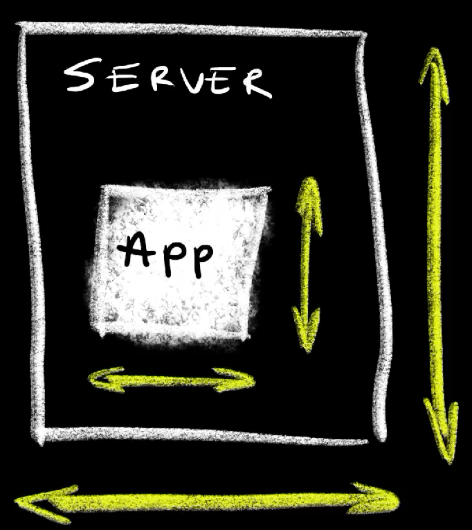
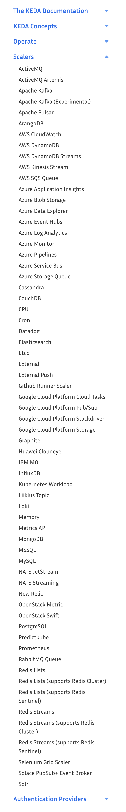

+++
title = 'Scaling Explained Through Kubernetes HPA, VPA, KEDA & Cluster Autoscaler'
date = 2024-07-01T16:00:00+00:00
draft = false
+++

Scaling is probably one of the most important aspects of computing, and a common cause of bankrupcy.

If our processes use more memory and CPU than what they need, they are wasting money or "stealing" those resources from others thus making them less efficient. On the other hand,if we give processes less memory and CPU than what they need, their performance will be affected negatively making user experience suck. And that's the good outcome. Much worse situation is that underpowered processes might crash with "out of memory" and other similar exceptions.

Hence, the goal is to assign just the right amount of resources to processes. Not too much, not to few, but just right. We do that through scaling, and we need to answer three questions.

* **What do we scale?**
* **Where do we scale?**
* **Who scales?**

<!--more-->



So, it is about **what**, and **where**, and **who**.



Let's start with what we scale. We can scale processes, **applications**, so that they get the right amount of memory and CPU. Remember, it's about finding the right amount of resources. Too much is expensive and not enough means that apps will be slow or will crash. That memory and CPU is provided through nodes, through **servers**. Those also need to have just the right amount or memory and CPU. If all the servers combined do not have the resources applications need, we will not be able to scale up those apps. On the other hand, if they have more resources than what those applications need, we are wasting money. If you're using a hyperscaler like AWS, Azure, or Google Cloud, using more server capacity than needed increases cost for no good reason. Having less means that some applications won't be able to run.

All in all, we scale both application and servers. Applications need resources and servers provide those resources. Ideally, applications should be configured to consume just the right amount of memory and CPU and servers should provide that same amount of resources. No more, no less.

The next is "where" or, to be more precise, the direction. We can scale "stuff" by increasing the size or increasing the number. It can go up and down, or left and right. It can be **vertical** or **horizontal**.

Vertical scaling means that we are adding more memory and CPU. We increase the amount a process of an application is allowed to consume and we increase resources assigned to servers. We make them taller, or we make them shorter.

Horizontal scaling is about increasing the number of something. Instead of increasing or decreasing memory and CPU assigned to an application, we increase, or decrease the number of replicas of an application.

The same can be said for servers. We can change their size vertically by increasing or decreasing memory and CPU, or we can change the number of servers. A collection of servers is a cluster and we can change the total amount of resources of a cluster by having bigger servers, or we can change the number of servers in a cluster.

Finally, we have the "who". Who scales applications and servers? It can **humans** who reconfigure applications to use a different amount of resources. Similarly, humans can be creating virtual machines with different sizes or adding physical memory and CPU to physical servers.

Alternatively, we can have machines doing that work. We can have processes that scale applications and virtual servers based on criteria like memory and CPU consumption, or, as we'll see later, any other data. That's what we call **automation**. 

Now, it's not secret that I'm not very fond of humans. I tend to have much easier time reasoning with machines, so you might think that I will advocate automation of any type of scaling, but, as we'll see later, that's not the case. There are situations when scaling is better done manually.

All in all, we scale both applications and servers, we scale vertically and horizontally, and scaling itself can be done manually or automatically.

Let's see all those combinations in action. I'll use Kubernetes to demonstrate scaling but the principles should apply to any other type of a platform, so do not run away if Kubernetes is not your thing. You can probably apply the same principles on mainframes as well.

## Setup

```sh
git clone https://github.com/vfarcic/kubernetes-demo

cd kubernetes-demo

git pull

git checkout scale --
```

> Watch https://youtu.be/WiFLtcBvGMU if you are not familiar with Devbox. Alternatively, you can skip Devbox and install all the tools listed in `devbox.json` yourself.

```sh
devbox shell

chmod +x setup/scale.sh

./setup/scale.sh

source .env
```

## Vertical Scaling Applications with VerticalPodAutoscaler

Here's a definition of an applications.

```sh
cat scale/app.yaml
```

The output is as follows.

```yaml
---
apiVersion: apps/v1
kind: Deployment
metadata:
  name: silly-demo
  labels:
    app.kubernetes.io/name: silly-demo
spec:
  selector:
    matchLabels:
      app.kubernetes.io/name: silly-demo
  template:
    metadata:
      labels:
        app.kubernetes.io/name: silly-demo
    spec:
      containers:
        - image: ghcr.io/vfarcic/silly-demo:1.4.123
          name: silly-demo
          env:
            - name: MEMORY_LEAK_MAX_MEMORY
              value: "512"
            - name: MEMORY_LEAK_FREQUENCY
              value: "1"
          ports:
            - containerPort: 8080    
          readinessProbe:
            httpGet:
              path: /
              port: 8080
---
apiVersion: v1
kind: Service
metadata:
  labels:
    app.kubernetes.io/name: silly-demo
  name: silly-demo
spec:
  ports:
  - name: http
    port: 8080
    protocol: TCP
    targetPort: 8080
  selector:
    app.kubernetes.io/name: silly-demo
  type: ClusterIP
```

It is a simple Kubernetes `Deployment` and a `Service`. The only important thing to note is that I did not specify resource requests and limits. There is no mention of how much memory and CPU it should use. As a side note, do not get scared by the environment variable `MEMORY_LEAK_MAX_MEMORY`. That's a very simple demo application that hardly uses any memory and CPU when running in "normal" mode. That environment variable will instruct it to leak some memory so that we have something to work with.

In any case, the important thing to note is that the `Deployment` does not have resource requests and limits. That means that Kubernetes will not be able to make an intelligent decision where to put it, that it will be the first to be kicked out in case there are no sufficient resources in the cluster, and quite a lot of other things that can cause issues. I should have done better than that. I should have specified how much memory and CPU that application is expected to use, but I didn't. The main reason why I ommitted resources is simple. I have no idea how much CPU and memory that application should use.

We can fix that. We can let Kubernetes manage mamory and CPU of that application by using Vertical Pod Autoscaler or VPA.

Here's a simple definition.

```sh
cat scale/vpa.yaml
```

The output is as follows.

```yaml
apiVersion: autoscaling.k8s.io/v1
kind: VerticalPodAutoscaler
metadata:
  name: silly-demo
spec:
  targetRef:
    apiVersion: apps/v1
    kind: Deployment
    name: silly-demo
  updatePolicy:
    updateMode: Auto
```

That is a `VerticalPodAutoscaler` definition that targets `Deployment` `silly-demo`. Now, there are a few modes we can apply. We'll discuss them later. For now, what matters is that the VPA we're looking at has the `updateMode` set to `Auto`. As a result, VPA will automatically update resource requests and limits of the Pods that will be managed by that Deployment.

Now, before we apply that manifest, I must stress that VPA is not baked into Kubernetes. It needs to be installed separately and how we do that depends largely on the provider. Google Cloud GKE, the one I'm using today, has the option to enable VPA when creating or updating clusters. In some other cases like, for example, AWS EKS, it needs to be installed separately.

With that note out of the way, let's get back to where we were and apply the `vpa` and the `app`.

```sh
kubectl --namespace a-team apply --filename scale/vpa.yaml

kubectl --namespace a-team apply --filename scale/app.yaml
```

Now we can list all `verticalpodautoscalers`.

```sh
kubectl --namespace a-team get verticalpodautoscalers
```

The output is as follows.

```
NAME       MODE CPU MEM PROVIDED AGE
silly-demo Auto                  38s
```

The output is depressing. It's not showing much, and that's normal. VPA might need a few minutes to observe resources usage of target Pods before it calculates memory and CPU usage.

Hence, we should wait for a while before we list all `verticalpodautoscalers` again.

```sh
kubectl --namespace a-team get verticalpodautoscalers
```

The output is as follows.

```
NAME       MODE CPU  MEM        PROVIDED AGE
silly-demo Auto 1m   1290797056 True     3m38s
```

This time, the output is not depressing. We can see some useful data. There is close to no CPU usage but memory is over one gigabyte.

We can see more detail if we `describe` the VPA.

```sh
kubectl --namespace a-team \
    describe verticalpodautoscaler silly-demo
```

The output is as follows (truncated for brevity).

```
Name:         silly-demo
...
Kind:         VerticalPodAutoscaler
...
Status:
  ...
  Recommendation:
    Container Recommendations:
      Container Name:  silly-demo
      Lower Bound:
        Cpu:     1m 
        Memory:  437256192
      Target:
        Cpu:     1m
        Memory:  1293942784
      Uncapped Target:
        Cpu:     1m
        Memory:  1293942784
      Upper Bound:
        Cpu:     830m
        Memory:  932494442496
...
```

The key is the Recommendation section that shows us a recommendation for the container `silly-demo`. Over there, we can see `Lower Bound` which is the minimum amount of recommended resources, `Target` being the recommended values, `Uncapped Target` representing the most recent recommendation, and, finally, `Upper Bound` that shows the maximum amount of recommended resources.

Since the update mode is set to Auto, VPA will be updating the target resource, the Deployment, periodically. However, more often than note, that update is not performed to the Pods created before VPA calculated the recommendation. So, to see it in action, we'll `delete` the `pods`...

```sh
kubectl --namespace a-team delete pods \
    --selector app.kubernetes.io/name=silly-demo
```

...and take a look at `resources` of the Pod.

```sh
kubectl --namespace a-team get pod \
    --selector app.kubernetes.io/name=silly-demo \
    --output jsonpath="{.items[0].spec.containers[0].resources}" \
    | jq .
```

The output is as follows.

```json
{
  "requests": {
    "cpu": "185m",
    "memory": "1293942784"
  }
}
```

We can see that VPA auto-magically assigned a bit of CPU and over one gigabyte of memory. From now on, Kubernetes will have the information it needs to make the right decisions when scheduling or moving Pods related to that application.

Now comes the important question. When should we use vertical scaling? Well... I'll leave the answer to that question for the end when we'll discuss when to use all the scaling models. For now, I will only say that Vertical scaling, at least when Kubernetes is concerned, does not work with horizontal scaling which we'll explore in a moment. That might change in the future but, for now, just say no. As such, it is useful only for applications that cannot run multiple replicas. So, single-replica applications might be good candidates for VPA, and not much more.

Also, since single-replica applications are the best candidates for vertical scaling, and we do not tend to design applications like that any more, that also means that good candidates for vertical scaling are apps designed a while ago. More often than not, those types of applications should not be restarted more than absolutely necessary. Right now, changes to Pod resources results in restarts, so that's another potentially big issue one should consider. That will change soon when [In-place Update of Pod Resources](https://github.com/kubernetes/enhancements/tree/master/keps/sig-node/1287-in-place-update-pod-resources) graduates. Nevertheless, that day is not today, so beware.

Now, to be clear, when I say that they "don't scale vertically" what I really mean is that they "don't scale vertically automatically." We still need to specify resource requests and limits. That should not be optional. Hence, if we should not scale vertically automatically, manual oparations are the only alternative, and VPA can help with that as well. Let's `delete` what we did...

```sh
kubectl --namespace a-team delete --filename scale/vpa.yaml

kubectl --namespace a-team delete --filename scale/app.yaml
```

...and deploy the application as a single replica again.

```sh
kubectl --namespace a-team apply --filename scale/app.yaml
```

Vertical Pod Autoscaler has four **update modes**. There is **Auto** that assigns resource requests on Pod creation as well as updates them on existing pods. That's the mode we used so far.

Then there is the **Recreate** mode which, at the moment, does the same as auto. It recreates Pods when recommended resources change. However, once "in-place" Pod updates becomes GA, Auto will be changing resources without recreating Pods, so that's probably the one you should use.

Further on, there is the **Initial** mode that assigns resources only on Pod creation. More often than not, that's a much safer option to choose. Instead of restarting Pods for the sake of adjusting resources, wait until Pods are created. Sooner of later we have to upgrade apps so that's typically the opportunity for the VPA to adjust resources.

Finally, there is the **Off** mode which does not change anything. Now, you might be wondering what's the purpose of a scaling mode that does not do anything. However, that's probably the most useful mode. It allows us to find out which resource amounts we should assign without assigning them.

Here's an example.

```sh
cat scale/vpa-off.yaml
```

The output is as follows.

```yaml
apiVersion: autoscaling.k8s.io/v1
kind: VerticalPodAutoscaler
metadata:
  name: silly-demo
spec:
  targetRef:
    apiVersion: apps/v1
    kind: Deployment
    name: silly-demo
  updatePolicy:
    updateMode: "Off"
```

The only difference, when compared to the previous VPA, is that the `updateMode` is the to `Off`, hence, it will not manage resources in the target.

Let's apply it...

```sh
kubectl --namespace a-team apply --filename scale/vpa-off.yaml
```

...wait for a few minutes for VPA to calculate the recommendation, and `describe` it.

```sh
kubectl --namespace a-team \
    describe verticalpodautoscaler silly-demo
```

The output is as follows (truncated for brevity).

```
Name:         silly-demo
...
Kind:         VerticalPodAutoscaler
...
Spec:
  ...
  Update Policy:
    Update Mode:  Off
Status:
  ...
  Recommendation:
    Container Recommendations:
      Container Name:  silly-demo
      Lower Bound:
        Cpu:     1m
        Memory:  778043392
      Target:
        Cpu:     185m
        Memory:  1293942784
      Uncapped Target:
        Cpu:     185m
        Memory:  1293942784
      Upper Bound:
        Cpu:     52845m
        Memory:  373659009024
Events:          <none>
```

This is almost the same as before, except that the `Update Mode` is set to `Off`. We're still getting the `Lower Bound`, `Target`, `Uncapped Target`, and `Upper Bound` recommendations. As I already mentioned, the only tangible difference is that VPA is not applying any changes to the target but, instead, provides the recommendation that we can use to set memory and CPU resources ourselves.

We could accomplish a similar results using the `top` command.

```sh
kubectl --namespace a-team top pods
```

The output is as follows.

```
NAME           CPU(cores) MEMORY(bytes)   
silly-demo-... 1m         580Mi
```

That also gives us `CPU` and `MEMORY`. However, the major difference is that the top command gives us current usage while VPA gives us various recommendations based on consumption over a period of time.

Now, to be clear, we could get even better results through Prometheus or a similar observability tool. Nevertheless, VPA with the Off mode is a more convenient and easier to digest solution.

So, let's say that we take the VPA recommendations and incorporate them into the Deployment or whichever resource type we might be using. The end result might look like this.

```sh
cat scale/app-resources.yaml
```

The output is as follows (truncated for brevity).

```yaml
---
apiVersion: apps/v1
kind: Deployment
...
spec:
  ...
  template:
    ...
    spec:
      containers:
        - image: ghcr.io/vfarcic/silly-demo:1.4.123
          ...
          resources:
            limits:
              cpu: 1000m
              memory: 2Gi
            requests:
              cpu: 50m
              memory: 512Mi
...
```

This time, the Deployment has hard-coded resource `limits`set to a generous `1000m` CPU and `2Gi` of memory and `requests` to underwhelming `50m` CPU and `512Mi` of memory. Those numbers should have been taken from VPA recommendations. However, in this case, I put lower values for requests since we'll need them for what's coming next.

Let's apply it...

```sh
kubectl --namespace a-team apply \
    --filename scale/app-resources.yaml
```

...and move on.

## Horizontal Scaling Applications with HorizontalPodAutoscaler

Horizontal scaling is a completely different beast than vertical. We are not trying to increase memory and CPU resources assigned to applications but to increase the number of replicas. In case of Kubernetes, we accomplish that through Horizontal Pod Autoscaler or HPA.

Here's an example.

```sh
cat scale/hpa.yaml
```

The output is as follows.

```yaml
apiVersion: autoscaling/v2
kind: HorizontalPodAutoscaler
metadata:
  name: silly-demo
spec:
  scaleTargetRef:
    apiVersion: apps/v1
    kind: Deployment
    name: silly-demo
  minReplicas: 2
  maxReplicas: 5
  metrics:
  - type: Resource
    resource:
      name: cpu
      target:
        type: Utilization
        averageUtilization: 80
  - type: Resource
    resource:
      name: memory
      target:
        type: Utilization
        averageUtilization: 80
```

Just as the VPA we used earlier, this HPA also references the silly-demo Deployment. That's where similarities stop.

We are specifying that the application should have a minimum number of replicas set to `2` and that it should never go above `5`.

The exact number of replicas will be decided based on metrics. In this case, we have two. The first one is based on `cpu` `Utilization` where we expect to scale up if it reaches `80` percent. The second metric is based on `memory` `Utilization` also set to `80` percent.

In both cases, the HPA will calculate those percentages by observing the actual resource usage and compare it with whatever we specified in the Deployment.

Let's apply it...

```sh
kubectl --namespace a-team apply --filename scale/hpa.yaml
```

...and list all `horizontalpodautoscalers`.

```sh
kubectl --namespace a-team get horizontalpodautoscalers
```

The output is as follows.

```
NAME       REFERENCE             TARGETS                      MINPODS MAXPODS REPLICAS AGE
silly-demo Deployment/silly-demo <unknown>/80%, <unknown>/80% 2       5       0        3s
```

Initially, just as with VPA, it does not have data to do anything, except to scale to 2 Pods since that is the minimum we set.

So, let's give it a few moments and output `horizontalpodautoscalers` again.

```sh
kubectl --namespace a-team get horizontalpodautoscalers
```

The output is as follows.

```
NAME       REFERENCE             TARGETS          MINPODS MAXPODS REPLICAS AGE
silly-demo Deployment/silly-demo 2%/80%, 209%/80% 2       5       5        113s
```

This time, we can see that the memory usage, the second one, is way above the target 80%. As a result, it scaled immediately to five replicas.

We can confirm that by listing all the `pods`.

```sh
kubectl --namespace a-team get pods
```

The output is as follows.

```
NAME           READY STATUS  RESTARTS AGE
silly-demo-... 1/1   Running 0        52s
silly-demo-... 1/1   Running 0        52s
silly-demo-... 1/1   Running 0        98s
silly-demo-... 1/1   Running 0        2m11s
silly-demo-... 1/1   Running 0        95s
```

There's not much more to it. HPA is relatively simple to define, and it works fairly well. Just remember not to mix it with VPA. Those two are not aware of each other so both might be scaling up and down, left and right without taking into the account that the other one accomplished the goal.

There is, however, a better way to scale applications horizontally.

Let's `delete` what we did so far,...

```sh
kubectl --namespace a-team delete --filename scale/hpa.yaml

kubectl --namespace a-team delete \
    --filename scale/app-resources.yaml
```

...and apply the app without the scaler again.

```sh
kubectl --namespace a-team apply \
    --filename scale/app-resources.yaml
```

## Horizontal Scaling Applications with KEDA

The "better" way to scale apps horizontally is [Kubernetes Event-Driven Autoscaling or KEDA](https://keda.sh/).

Here's an example.

```sh
cat scale/keda.yaml
```

The output is as follows.

```yaml
apiVersion: keda.sh/v1alpha1
kind: ScaledObject
metadata:
  name: silly-demo
spec:
  scaleTargetRef:
    apiVersion: apps/v1
    kind: Deployment
    name: silly-demo
  minReplicaCount: 1
  maxReplicaCount: 20
  triggers:
    - type: prometheus
      metadata:
        serverAddress: http://prometheus-server.monitoring:80
        threshold: "250000000"
        query: sum(container_memory_usage_bytes{namespace="a-team", container="silly-demo"})
```

It is a `ScaledObject` which, just as the VPA and HPA manifests we used is referencing the `Deployment` `silly-demo`. It has the minimum number of replicas set to `1` and the maximum to `20`. The difference, when compared with the HPA, is in the `triggers` which can contain any number of scalers.



We can trigger scaling based on data from ActiveMQ, Apache Kafka, Apache Pulsar, ArangoDB, AWS this and that, and so on and so forth. Almost anything anyone could imagine as the source of data to scale apps is available.

In this case, we're using `prometheus` running inside the same cluster (`http://prometheus-server.monitoring:80`). We're setting 250MB (`250000000`) as the threshold and using the `query` that retrieves memory usage of the application.

Now, to be clear, that's a silly example that does not show KEDA in its full glory since the result will be almost the same as if we used HPA. I was too lazy to setup a complicated demo so I'm leaving it to your imagination to run wild and figure out all the use-cases we could accomplish using all those scalers. Or, if your imagination is not working today, you might want to check the [KEDA: Kubernetes Event-Driven Autoscaling](https://youtu.be/3lcaawKAv6s) video I published a while ago.

Let's apply the manifest and see it in action,...

```sh
kubectl --namespace a-team apply --filename scale/keda.yaml
```

...by listing all `scaledobjects`.

```sh
kubectl --namespace a-team get scaledobjects
```

The output is as follows.

```
NAME       SCALETARGETKIND    SCALETARGETNAME MIN MAX TRIGGERS   AUTHENTICATION READY ACTIVE  FALLBACK PAUSED  AGE
silly-demo apps/v1.Deployment silly-demo      1   20  prometheus                True  true    Unknown  Unknown 3s
```

There's not much to see there since KEDA delegates the actual scaling to the Horizontal Pod Autoscaler. It, in a way, extends the capabilities of HPA by allowing it to use data from a variety of sources.

Let's list all `horizontalpodautoscalers`.

```sh
kubectl --namespace a-team get horizontalpodautoscalers
```

The output is as follows.

```
NAME                REFERENCE             TARGETS                  MINPODS MAXPODS REPLICAS AGE
keda-hpa-silly-demo Deployment/silly-demo 243725107200m/250M (avg) 1       20      20       9m54s
```

We can see that an HPA was created by KEDA and instructed to scale the application by providing it with the data which, in this case, is coming from Prometheus.

We can confirm that it is working by listing all the Pods.

```sh
kubectl --namespace a-team get pods
```

The output is as follows.

```
NAME           READY STATUS                 RESTARTS    AGE
silly-demo-... 0/1   Pending                0           35s
silly-demo-... 0/1   Pending                0           98s
silly-demo-... 0/1   OOMKilled              1           113s
silly-demo-... 0/1   Pending                0           98s
silly-demo-... 1/1   Running                1 (43s ago) 113s
silly-demo-... 1/1   Running                1 (27s ago) 98s
silly-demo-... 0/1   CrashLoopBackOff       2 (26s ago) 113s
silly-demo-... 0/1   CrashLoopBackOff       2 (14s ago) 2m8s
silly-demo-... 0/1   Pending                0           98s
silly-demo-... 0/1   Pending                0           98s
silly-demo-... 1/1   Running                1 (39s ago) 98s
silly-demo-... 0/1   Pending                0           78s
silly-demo-... 0/1   Pending                0           98s
silly-demo-... 0/1   ContainerStatusUnknown 1 (85s ago) 113s
silly-demo-... 0/1   Pending                0           82s
silly-demo-... 1/1   Running                2 (64s ago) 2m8s
silly-demo-... 1/1   Running                3 (31s ago) 2m8s
silly-demo-... 1/1   Running                0           5m38s
silly-demo-... 0/1   Pending                0           82s
silly-demo-... 0/1   Pending                0           82s
silly-demo-... 0/1   Pending                0           97s
silly-demo-... 0/1   Pending                0           82s
```

That does not look good. Some Pods are running, while others are crashing due to insufficient memory or other reasons which all boil down to the fact that the cluster does not have the capacity to run twenty replicas of that application. As a matter of fact, quite a few Pods are in the pending state meaning that Kubernetes cannot even try to put them anywhere. The cluster is clearly too small, bringing us to a perfect place to talk about scaling nodes.

## Vertical Scaling Nodes

Just as with applications, servers, or nodes can be scaled vertically or horizontally.

Most of the time, scaling nodes vertically does not make sense. If we need a bigger node, we should create a bigger one instead of attempting to increase memory or CPU of an existing node. At least, that's the case when running in Cloud. If you're on-prem, you might be used to dynamic scaling of resources using, let's say, VMWare but I'm here to tell you that's just silly. If a node is too small, create a bigger one and move the app that needed more capacity to that node. If the app cannot be moved somewhere else, you should move somewhere else. You should change the company. I can safely say that it is unhealthy for you to stay there.

With that note, that probably offended at least a few of you, let's move to the only reasonable direction to scale nodes.

## Horizontal Scaling Nodes Cluster Autoscaler

Let's take a look at the nodes we're currently running in the cluster.

```sh
kubectl get nodes
```

The output is as follows.

```
NAME                     STATUS ROLES  AGE VERSION
gke-dot-default-pool-... Ready  <none> 26m v1.28.8-gke.1095000
```

There is only one node, a small one, so it's no surprise that many of the twenty replicas of the application failed or could not be scheduled. We need more, and the question is how to get more.

One option would be to go to the Google Cloud console, locate the GKE cluster, click a few buttons, fill in a few fields, and that's it. Easy. Right? Well, ignoring the discussion why click-ops is not the right sect to join, scaling that way is close to impossible to do simply because the need to increase or decrease the number of nodes can materialize itself at any moment. Right now, we might have a traffic spike compelling us to scale up, only to relize that shortly afterwards we need less. We'd need to have a dedicated team of people watching Pods and clicking buttons 24/7. Most of the teams that scale nodes manually end up overprovisioning. They end up with more nodes than they usually need just so that when the increase in traffic happens there is just enough capacity. Companies with such teams should be proactive and file for brankrupcy right away. If you know its coming, why not get over with it sooner rather than prolonging the inevitable.

Fortunately, at least when Kubernetes is concerned, horizontal scaling of nodes is a solved problem. We just need to enable it. In Google Cloud GKE, that is fairly easy. All we have to do is `update` the cluster to tell it to enable autoscaling (`--enable-autoscaling`) and specify the minimum (`--min-nodes`) and the maximum (`--max-nodes`) number of nodes. That's all it takes, at least when GKE is concerned.

```sh
gcloud container clusters update dot --project $PROJECT_ID \
    --zone us-east1-b \
    --enable-autoscaling --min-nodes 1 --max-nodes 5
```

Since the cluster was under pressure to expand long before we enabled autoscaling, it should probably take only a few moments until it increases the capacity.

We can confirm that's what happened by listing all the nodes.

```sh
kubectl get nodes
```

The output is as follows.

```
NAME                     STATUS ROLES  AGE VERSION
gke-dot-default-pool-... Ready  <none> 42m v1.28.8-gke.1095000
gke-dot-default-pool-... Ready  <none> 42s v1.28.8-gke.1095000
gke-dot-default-pool-... Ready  <none> 46s v1.28.8-gke.1095000
```

There we go. There are now three nodes, one, the original, being `42m` old and the other two created less than a minute ago.

The cluster autoscaler calculated that three nodes should be enough to run all the Pods, including those twenty replicas of the silly-demo app. We can confirm that by listing all the `pods`.

```sh
kubectl --namespace a-team get pods
```

The output is as follows.

```
NAME           READY STATUS                 RESTARTS      AGE
silly-demo-... 0/1   Running                6 (118s ago)  11m
silly-demo-... 0/1   ContainerStatusUnknown 3 (2m50s ago) 10m
silly-demo-... 1/1   Running                0             18m
silly-demo-... 1/1   Running                0             18m
silly-demo-... 1/1   Running                4 (110s ago)  11m
silly-demo-... 1/1   Running                0             10m
silly-demo-... 0/1   ContainerStatusUnknown 1 (10m ago)   11m
silly-demo-... 1/1   Running                0             104s
silly-demo-... 1/1   Running                4 (2m50s ago) 10m
silly-demo-... 1/1   Running                4 (8m26s ago) 11m
silly-demo-... 1/1   Running                5 (3m26s ago) 10m
silly-demo-... 1/1   Running                6 (2m58s ago) 11m
silly-demo-... 1/1   Running                0             20m
silly-demo-... 1/1   Running                0             18m
silly-demo-... 1/1   Running                5 (3m34s ago) 11m
silly-demo-... 0/1   ContainerStatusUnknown 3 (3m4s ago)  10m
silly-demo-... 1/1   Error                  3 (3m31s ago) 11m
silly-demo-... 1/1   Running                0             18m
silly-demo-... 0/1   Running                4 (47s ago)   10m
silly-demo-... 1/1   Running                0             2m19s
silly-demo-... 0/1   Running                4 (55s ago)   11m
silly-demo-... 1/1   Running                4 (104s ago)  10m
silly-demo-... 1/1   Running                0             2m17s
silly-demo-... 0/1   ContainerStatusUnknown 4 (2m16s ago) 10m
```

Don't be scared by seeing that the status of some Pods is `ContainerStatusUnknown` or `Error`. Those are failures from the past that will go away eventually. What matters is that twenty Pods are now `Running`.

Here's the best part. Just as the number of nodes increased to meet requests for additional resources, it goes down when that same demand decreases. We can demonstrate that by changing the KEDA scaled object to this one.

```sh
cat scale/keda-2.yaml
```

The output is as follows (truncated for brevity).

```yaml
apiVersion: keda.sh/v1alpha1
kind: ScaledObject
...
spec:
  ...
  triggers:
    - type: prometheus
      metadata:
        serverAddress: http://prometheus-server.monitoring:80
        threshold: "2000000000"
        query: avg(container_memory_usage_bytes{namespace="a-team", container="silly-demo"})
```

The updated object now has the threshold set to 2GB (`2000000000`). Given that silly-demo Pods consume less than one GB of memory, that should trigger KEDA to scale down the number of Pods, and to continue scaling down until, eventually, it reaches only one or two Pods.

Let's apply it,...

```sh
kubectl --namespace a-team apply --filename scale/keda-2.yaml
```

...and wait for a while.

Scaling down is more conservative operation so it tends to take much longer to remove Pods than to add them.

After a while, let's say five minutes, we can retrieve the Pods and see what's going on.

```sh
kubectl --namespace a-team get pods
```

The output is as follows (truncated for brevity).

```
NAME           READY STATUS                 RESTARTS      AGE
silly-demo-... 0/1   ContainerStatusUnknown 1             16m
silly-demo-... 1/1   Running                0             9m36s
silly-demo-... 0/1   OOMKilled              1             17m
silly-demo-... 0/1   ContainerStatusUnknown 1             17m
silly-demo-... 0/1   ContainerStatusUnknown 2 (13m ago)   17m
silly-demo-... 1/1   Running                2 (8m2s ago)  10m
silly-demo-... 1/1   Running                5 (12m ago)   17m
silly-demo-... 0/1   Error                  1             9m44s
silly-demo-... 1/1   Running                0             8m32s
silly-demo-... 1/1   Running                2 (8m31s ago) 10m
silly-demo-... 1/1   Running                2 (9m29s ago) 10m
silly-demo-... 1/1   Running                3 (7m34s ago) 9m57s
silly-demo-... 0/1   ContainerStatusUnknown 1             17m
silly-demo-... 0/1   Error                  1             17m
silly-demo-... 1/1   Running                3 (12m ago)   17m
silly-demo-... 1/1   Running                0             9m33s
silly-demo-... 1/1   Running                0             8m30s
silly-demo-... 0/1   ContainerStatusUnknown 1 (8m39s ago) 16m
silly-demo-... 0/1   Error                  1 (10m ago)   17m
silly-demo-... 0/1   ContainerStatusUnknown 1 (16m ago)   17m
silly-demo-... 1/1   Running                1 (9m52s ago) 16m
silly-demo-... 0/1   Error                  4             17m
silly-demo-... 0/1   ContainerStatusUnknown 4 (12m ago)   17m
silly-demo-... 1/1   Running                0             21m
silly-demo-... 1/1   Running                1 (9m47s ago) 16m
silly-demo-... 1/1   Running                1 (10m ago)   16m
silly-demo-... 1/1   Running                1 (10m ago)   17m
silly-demo-... 0/1   ContainerStatusUnknown 1 (9m40s ago) 16m
```

We can see even more errors, but that's to be expected since the application we're running does not know how to deal with SIGTERM signals Kubernetes has been sending in attempts to kill it gracefully. That would be a subject of a completely different video which I can make if you're interested. Just let me know in the comments. What matters is that those new failures are not caused by insufficient capacity since, as we already saw, Cluster Autoscaler created a sufficient number of nodes.

If we ignore those errors, we can observe that the number of Running Pods now dropped to fifteen. That means that KEDA detected that the actual memory usage is way below the threshold and started scaling down. Since, as I mentioned, going down is more conservative, we should wait a while longer. Some twenty minutes should do for what I want to show.

```sh
kubectl --namespace a-team get pods
```

The output is as follows.

```
NAME           READY STATUS                 RESTARTS    AGE
silly-demo-... 0/1   OOMKilled              1           39m
silly-demo-... 0/1   ContainerStatusUnknown 1           39m
silly-demo-... 0/1   ContainerStatusUnknown 2 (36m ago) 39m
silly-demo-... 0/1   ContainerStatusUnknown 1           39m
silly-demo-... 0/1   Error                  1           39m
silly-demo-... 0/1   Error                  1 (32m ago) 39m
silly-demo-... 0/1   ContainerStatusUnknown 1 (39m ago) 39m
silly-demo-... 0/1   Error                  4           40m
silly-demo-... 0/1   ContainerStatusUnknown 4 (34m ago) 40m
silly-demo-... 1/1   Running                0           43m
silly-demo-... 1/1   Running                1 (32m ago) 39m
silly-demo-... 0/1   ContainerStatusUnknown 1 (32m ago) 39m
```

The output now shows that only two Pods are Running. Eventually it will drop to one, but there's probably no need to wait for that. It's clear that horizontal scaling of applications goes in both directions. Nevertheless, I did not show all that for the sake of confirming that apps go up and down but, rather, to confirm that cluster scaler also works in both directions. With a significantly smaller number of Pods in the cluster, the number of nodes should also drop. Let's check that out.

```sh
kubectl get nodes
```

The output is as follows.

```
NAME                           STATUS ROLES  AGE VERSION              
node/gke-dot2-default-pool-... Ready  <none> 64m v1.28.8-gke.1095000  
node/gke-dot2-default-pool-... Ready  <none> 35m v1.28.8-gke.1095000
```

There we go. It dropped from three to two nodes. Mission successful; money saved; no one goes bankrupt; at least not due to unreasonable bill from Google.

## What to Use and When to Use It

By now, you probably understood, at least on high level, how scaling works, what to do, and when to do it. Nevertheless, a short set of instructions might be useful.

Let's start with **apps**.

Use **vertical scaling with legacy apps** that cannot run in more than one replica. For everything else, Vertical Pod Autoscaler is useful mostly to provide **recommendations** how much memory and CPU to assign to Pods manually. The biggest obstacle for wider adoption of vertical scalers, at least when Kubernetes is concerned, lies in conflicts with horizontal scalers. That might change soon given that quite a few companies, especially those associated with cost reduction, are working on better ways to scale vertically. Nevertheless, none of those I've seen so far are good enough to be used for anything but recommendations that should be applied manually.

While scaling apps vertically has limited value, **horizontal scaling is a must** for all applications that can run multiple replicas and do not get penalized by being dynamic. Those are, typically, stateless apps. More often then not, horizontal scaling should be part of every app and, when Kubernetes is concerned, the main question is whether to use **Horizontal Pod Autoscaler** or **KEDA**. The former is more than fine when scaling decisions are made based on memory and CPU while KEDA shines for scaling based on any other criteria.

If we turn our attention to **servers**, **vertical scaling is**, most of the time, just **silly**. Just as vertical scaling of apps results in recreation of the Pods, at least until in-place updates reach GA, vertical scaling of servers results in creation of new servers, at least when VMs in hyperscalers are concerned. If new nodes are created, we can just as well scale horizontally. On the other hand, I cannot imagine a single reason why anyone would not **always use horizontal scaling** for the nodes. It's a no brainer. Enable cluster autoscaler right away. Just do it.

Thank you for watching.
See you in the next one.
Cheers.

## Destroy

```sh
git checkout main

rm $KUBECONFIG

gcloud container clusters delete dot --project $PROJECT_ID \
    --zone us-east1-b --quiet

gcloud projects delete $PROJECT_ID --quiet
```

