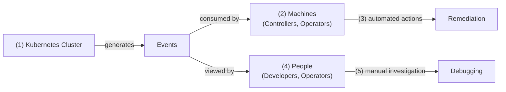

+++
title = 'Self-Healing Kubernetes: When to Use AI vs Traditional Automation'
date = 2025-10-27T15:00:00+00:00
draft = false
+++

It's 2 AM Saturday. You're sleeping when your phone rings. You wake up ready to answer with "go to hell you prick," but then you see it's PagerDuty. Pods are crashing in production. You drag yourself to your laptop, still half-asleep, and start digging. Events. Logs. Metrics. Configurations. Forty minutes later, you've found it: an out-of-memory condition. The fix takes thirty seconds. A simple memory limit adjustment. Something that could have been detected and fixed automatically while you slept.

This doesn't have to be your reality. Here's what you'll learn: how to build automation that watches Kubernetes events, analyzes problems, and remediates issues before they ruin your weekend. We'll cover when traditional automation works, when AI adds value, and how to progressively mature your incident response from manual firefighting to intelligent self-healing systems.

The foundation is understanding events themselves.

<!--more-->



## Setup

```sh
git clone https://github.com/vfarcic/kubernetes-events-demo-2

cd kubernetes-events-demo-2
```

> Make sure that Docker is up-and-running. We'll use it to create a KinD cluster.

> Watch [Nix for Everyone: Unleash Devbox for Simplified Development](https://youtu.be/WiFLtcBvGMU) if you are not familiar with Devbox. Alternatively, you can skip Devbox and install all the tools listed in `devbox.json` yourself.

```sh
devbox shell

chmod +x dot.nu

./dot.nu setup

source .env

kubectl create deployment demo-app --image=nginx:nonexistent-tag

kubectl run resource-demo --image=nginx \
    --overrides='{"spec":{"containers":[{"name":"resource-demo","image":"nginx","resources":{"requests":{"memory":"40Gi"},"limits":{"memory":"40Gi"}}}]}}'
```

## Kubernetes Events Explained

(1) Kubernetes generates events for everything happening in a cluster. When a Pod starts, an event is created. When a container crashes, there's an event. When a node runs out of resources, you get an event.

These events serve two critical audiences: (2) **machines** like controllers, operators, and automation tools that consume events and take (3) automated actions for remediation. A controller might see a Pod failure event and immediately spin up a replacement. An autoscaler might detect resource pressure events and add more nodes. Then there are (4) **people** like developers and operators who view events for (5) debugging through manual investigation. When a deployment fails, an operator traces through the events to understand whether it was an image pull error, a configuration issue, or a resource constraint.



Observability has multiple pillars: metrics, logs, traces, and events. But when it comes to **triggering remediation processes**, events stand out. They represent discrete, actionable state changes: a Pod failed, a Deployment scaled, a node became unschedulable. That makes them ideal triggers. A metric might tell you CPU is high, but an event tells you exactly what happened and when. Once a remediation process starts, it'll need all the observability data it can get to diagnose and fix the issue. But for that initial trigger, for knowing that something specific just happened that requires attention? Events are your best bet.

```sh
kubectl get events -o custom-columns=TIMESTAMP:.firstTimestamp,\
NAMESPACE:.namespace,INVOLVED_OBJECT:.involvedObject.name,\
REASON:.reason,MESSAGE:.message,TYPE:.type,\
SOURCE:.source.component,COUNT:.count
```

The output is as follows (truncated for brevity).

```
TIMESTAMP             NAMESPACE  INVOLVED_OBJECT    REASON
MESSAGE
TYPE     SOURCE                  COUNT
...
2025-10-08T09:01:32Z  <none>     dot-control-plane  RegisteredNode
Node dot-control-plane event: Registered Node dot-control-plane in Controller
Normal   node-controller         1
<nil>                <none>    dot-control-plane           Starting                  <none>                                                                                                                                                                                                           Normal    <none>                  <none>

2025-10-08T09:01:45Z  <none>     dot-control-plane  NodeReady
Node dot-control-plane status is now: NodeReady
Normal   kubelet                 1

2025-10-08T09:09:54Z  <none>     resource-demo      FailedScheduling
0/1 nodes are available: 1 Insufficient memory. no new claims to deallocate, preemption: 0/1 nodes are available: 1 Preemption is not helpful for scheduling.
Warning  default-scheduler       1
```

Let's look at how events are structured. Every Kubernetes event contains metadata like the `TIMESTAMP` and `NAMESPACE`, the `INVOLVED_OBJECT` identifying which resource triggered the event, a `REASON` code that's machine-readable, a `MESSAGE` that's human-readable, a `TYPE` indicating whether it's normal or a warning, the `SOURCE` showing which component generated it, and a `COUNT` tracking how many times this event occurred.

The machine-readable data, like the `REASON` code and `INVOLVED_OBJECT`, exists for automation. Controllers watch for specific reason codes and react accordingly. A custom operator might watch for `FailedScheduling` events on Pods and automatically adjust resource quotas. An autoscaler looks for OOMKilling events and increases memory limits. The structured fields let you write precise logic: "when event type is Warning AND reason is BackOff AND involved object is a Pod in namespace production, do something."

The human-readable data, primarily the `MESSAGE` field, is for people. When you're troubleshooting a failed deployment at 2 AM, you don't want to parse JSON structures. You want to see "Back-off restarting failed container" or "Failed to pull image: authentication required." The message gives you immediate context without needing to understand the Kubernetes API structure. It's the difference between knowing a Pod failed and understanding why it failed.

You can access events through *kubectl get events* to see all events in a namespace, or *kubectl describe* on any resource to see events specific to that object. For automation, you can watch the Kubernetes API directly using client libraries or tools that implement the watch protocol. Most observability platforms also collect and index events, letting you query them alongside metrics and logs.

## Kubernetes Automation Pipeline

Once you have access to events, the question becomes: what do you do with them? That's where alerting and remediation come in. **Alerting** means notifying someone or something that a problem occurred. It's the "hey, something's wrong" signal. **Remediation** is what happens next: the actual actions taken to fix or mitigate the problem. Alerting without remediation just creates noise. Remediation without alerting means you're fixing problems you don't know exist.

The path from event to resolution has three phases: alerting, analysis, and remediation. Each phase can happen in three different ways. **Manually**, where humans discover issues, investigate them, and apply fixes. Through **Kubernetes' built-in mechanisms**, where the control plane detects problems and self-heals automatically. Or via **external automation tools** that watch events, analyze what's happening, and take corrective actions. Let's break down each phase.

**Alerting** is about discovering that something went wrong. In the **manual** approach, a human discovers the issue. Your app isn't responding, so you run *kubectl describe pod* and see the events showing *ImagePullBackOff*. Or you check a dashboard and notice pods are crashing. The human goes looking for the problem.

With **Kubernetes built-in** alerting, the system itself detects the issue as part of its control loops. The kubelet sees a container crashed and generates an event. The scheduler can't place a Pod and creates a *FailedScheduling* event. These events exist whether anyone is watching or not. No configuration needed.

The **external tooling** approach requires humans to define what to watch for upfront. You configure AlertManager, Prometheus, or custom controllers with rules: watch for events where reason is *OOMKilled* AND count is greater than 3 in 5 minutes, then send a notification to Slack. A human programmed the automation, defining which events matter and what conditions trigger alerts. Once configured, the tool watches the event stream and executes those rules automatically.

**Analysis** is figuring out what's actually wrong and why. In the **manual** approach, once you've discovered an issue, you start investigating. You read through events, check logs, look at metrics, and piece together what happened. A Pod is crashing? You check if it's out of memory, if the image is wrong, if there's a configuration problem. This is human-driven troubleshooting.

With **Kubernetes built-in** analysis, the control plane continuously compares desired state to actual state. A ReplicaSet sees it should have 3 Pods but only has 2. The analysis is simple: there's a gap. The scheduler looks at a pending Pod, analyzes available nodes, and determines none have sufficient resources. This analysis happens automatically as part of reconciliation loops.

The **external tooling** approach uses systems that correlate and analyze patterns. These tools might aggregate events with metrics and logs to identify root causes. An observability platform might correlate an *OOMKilled* event with memory usage metrics and show you that memory consumption spiked right before the crash. Like alerting, humans configure what to analyze and the correlation rules, but the analysis itself runs automatically.

**Remediation** is actually fixing the problem. In the **manual** approach, once you've identified the issue, you take action. You edit a Deployment to increase memory limits, fix a typo in a ConfigMap, or pull a new image. The human applies the fix based on their analysis.

With **Kubernetes built-in** remediation, the control plane self-heals automatically. A container crashes? The kubelet restarts it. A Pod is deleted? The ReplicaSet creates a replacement. A node fails? The scheduler moves Pods to healthy nodes. This is Kubernetes doing what it's designed to do: maintaining desired state without human intervention.

The **external tooling** approach uses controllers, operators, or automation systems that watch for specific conditions and take predefined actions. A custom controller might see repeated *OOMKilled* events and automatically increase memory requests. An operator might detect a failed replica and trigger a rollback. A chaos engineering tool might inject failures and then remediate them. Like the other phases, humans configure what actions to take under what conditions, then the tool executes those actions automatically.

In practice, automation follows a maturity progression. Keep in mind that Kubernetes already provides full automation for its core responsibilities: restarting crashed containers, replacing deleted Pods, relocating workloads from failed nodes. That's your baseline. The maturity progression is about handling everything beyond what Kubernetes natively manages.

Here's how this plays out in practice.

Organizations typically start with **manual everything**: for problems Kubernetes doesn't handle automatically, humans discover issues, investigate them, and apply fixes. The first step toward additional automation is usually **automated alerting**: external systems detect problems and notify humans, who then investigate and fix them. As teams mature, they move to **automated alerting and analysis**: systems detect problems, correlate data, and present root causes, but humans still apply fixes. Finally, the most mature setups achieve **full automation**: systems detect, analyze, and remediate without human intervention. You rarely see someone manually discovering issues but having automated analysis and remediation. If you're sophisticated enough to automate the hard parts, you've definitely automated alerting first.

## AI-Powered Kubernetes Remediation

So where does AI fit into this progression? The question isn't whether AI is "better" than traditional automation. It's about understanding where AI adds value and where it doesn't. Let's be specific.

**AI doesn't help much with alerting**, at least not with event-based alerting. A controller watching Kubernetes events and firing alerts based on specific patterns is more efficient, cheaper, and faster than AI. You can configure it as simply as "fire an alert on any Warning event" or as sophisticatedly as "alert when reason is *OOMKilled* AND count exceeds 3 in 5 minutes AND namespace is production." This is event-driven: the controller reacts immediately when events occur. Using AI here would mean periodically analyzing the entire cluster state instead of reacting to events. That's backwards. Traditional event-driven automation wins decisively for alerting.

**AI excels at analysis.** This is where it genuinely shines. Analysis often involves following breadcrumbs: describe a Pod, which leads you to a Deployment, which points to a ConfigMap, which requires checking logs, which reveals a metric spike, which connects to a Service issue. For humans, this is exhausting except in trivial cases. You give up or miss connections. AI can traverse these relationships, correlate unstructured data from logs with structured events and metrics, and synthesize what's actually wrong. An observability platform might show you an *OOMKilled* event next to a memory spike, but AI can explain the connection, trace it back to a recent configuration change, and contextualize it within your specific setup. This is AI's sweet spot.

**Remediation is more nuanced.** Here's the key insight: remediation should focus on **unknowns**. If you know in advance what to do when specific situations occur, automate it. Don't use AI for knowns. That's what Kubernetes controllers already do: restart crashed containers, replace deleted Pods, relocate workloads from failed nodes. Those are knowns, handled by automation.

AI comes in for unknowns: novel problems, unexpected combinations, scenarios you haven't seen before. Traditional automation fails here because you can't write rules for situations you haven't anticipated. AI has two advantages. First, it has broad public knowledge about Kubernetes, common failure patterns, and remediation strategies. Second, it can leverage your tribal knowledge through context: documentation, past incidents, Git history, internal runbooks stored in vector or graph databases. The combination of public expertise and organizational context makes AI effective for unknowns.

But not all unknowns are equal. For high-confidence scenarios, AI can execute remediation automatically through tools. Those tools enforce safety: dry-run first, rate limiting, blast radius controls, rollback mechanisms. The AI doesn't execute actions directly; it returns instructions, and an agent uses constrained tools to perform them. Permissions, admission controllers, and RBAC provide additional guardrails. For low-confidence scenarios, AI suggests remediation for human review. The human can approve, modify, or reject it.

The critical piece is the feedback loop. When AI handles an unknown, whether by executing or suggesting remediation, that information goes somewhere visible: Slack, a ticketing system, an incident log. People see what happened and what the remediation was. When the same situation occurs repeatedly and AI handles it consistently, that's your signal to graduate it from "unknown requiring AI" to "known requiring automation." You codify it as a rule, integrate it into your controllers or operators, and now it's handled faster and cheaper. The unknown became a known.

This requires a controller with filters that determine what's "unknown". Pattern matching against existing automation, exception lists, or heuristics that identify novel situations. When the controller detects an unknown, it fires an alert that triggers AI analysis and remediation. This event-driven architecture means AI only engages when needed. Cost scales with the frequency of unknowns. If unknowns are rare in a mature setup, AI cost is low. If they're frequent because automation is immature, AI costs more but also does more, and you're actively converting unknowns to knowns.

So what's the complete picture?

The maturity model looks like this: Start with Kubernetes built-in automation as your baseline. Initially, humans handle all unknowns manually. As you identify patterns, you build rule-based automation for those knowns. As you mature further, you introduce AI-assisted analysis for remaining unknowns. Then AI-suggested remediation, where humans review and approve. Finally, AI-executed remediation for high-confidence scenarios with proper tooling constraints, while low-confidence scenarios still route to humans. Throughout this progression, you're continuously graduating unknowns to automated knowns, shrinking the surface area where AI is needed while expanding the surface area where automation handles things efficiently.

If you want to see these principles in action, I've built two projects that demonstrate this approach. The first is a Kubernetes controller that watches events and triggers AI-based analysis and remediation: https://github.com/vfarcic/dot-ai-controller. The second is an MCP server that provides the tools AI uses to safely execute remediation with proper constraints: https://github.com/vfarcic/dot-ai/blob/main/docs/mcp-remediate-guide.md. Check them out, and I'd appreciate it if you star them.

## Building Self-Healing Systems

The next time your phone rings at 2 AM, you have a choice. You can keep manually firefighting incidents, spending hours tracking down problems that could be detected and fixed automatically. Or you can build systems that handle the knowns with traditional automation and leverage AI for the unknowns.

Here's what matters: **Kubernetes events are your trigger mechanism**. They tell you exactly what happened and when. Build your automation pipeline around alerting, analysis, and remediation. Use traditional controllers for known patterns because they're faster and cheaper. Bring in AI for analysis, where it excels at correlating data and traversing relationships. Use AI for unknown remediation scenarios, but graduate successful patterns to automated rules. The goal isn't to use AI everywhere. The goal is to continuously shrink the surface area of unknowns until your systems self-heal and you stay asleep.

Start with the baseline Kubernetes already provides. Layer on rule-based automation for your knowns. Introduce AI strategically for unknowns. Build the feedback loop that converts unknowns to knowns. That's how you go from manual firefighting to intelligent self-healing systems.

