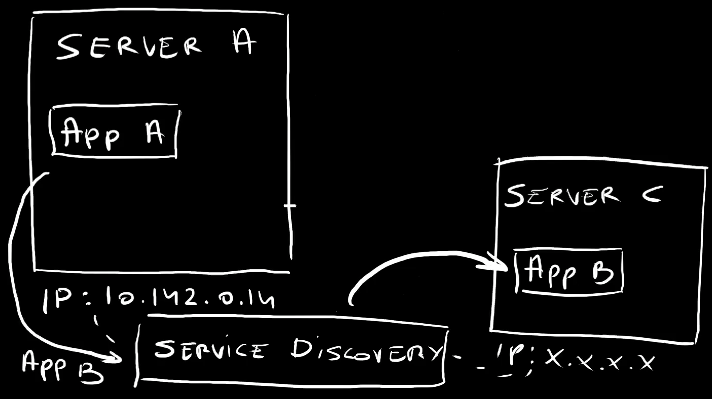
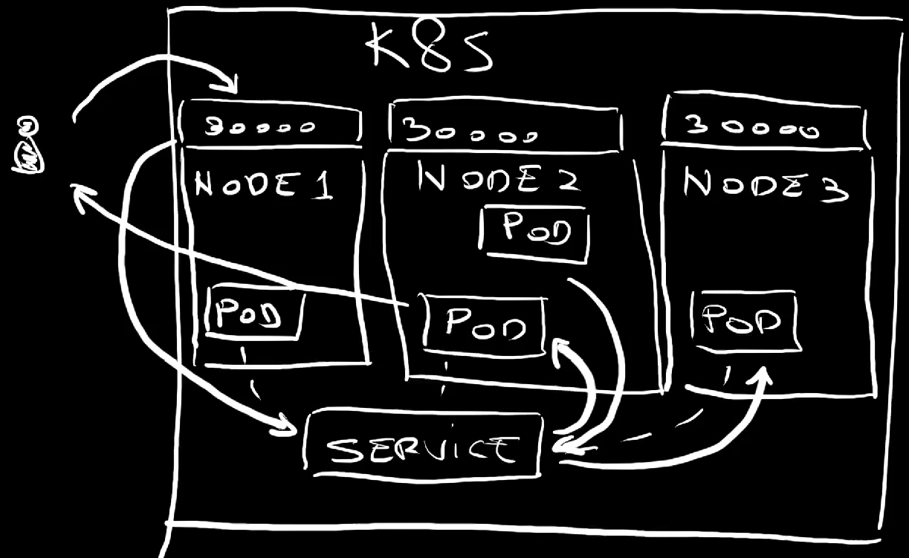
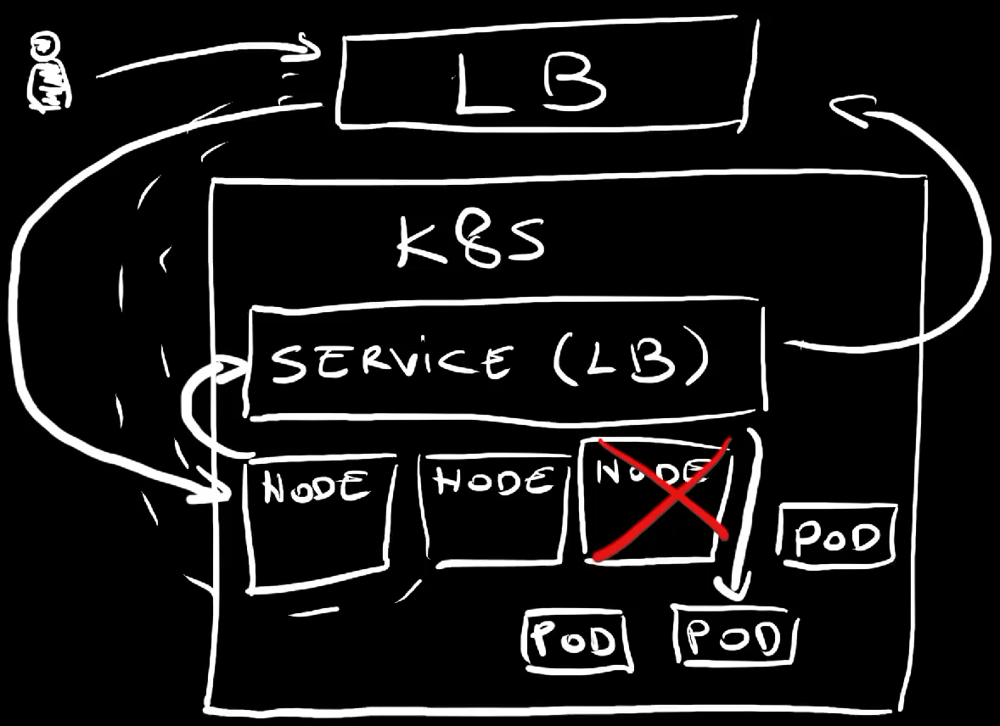
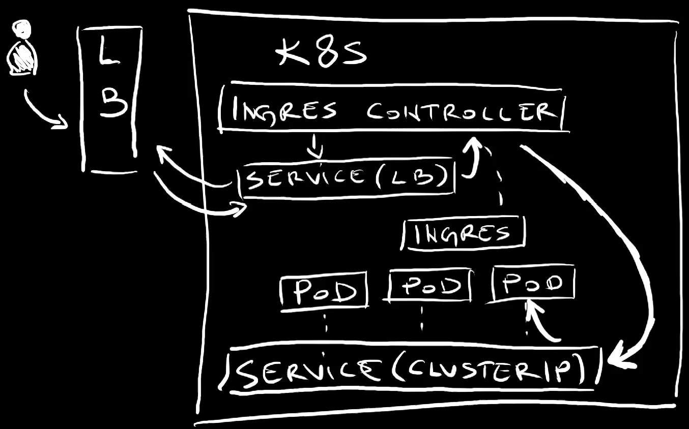

+++
title = 'Mastering Kubernetes: Dive into Service and Network APIs'
date = 2024-05-13T16:00:00+00:00
draft = false
+++


In the [Mastering Kubernetes: Dive into Workloads APIs](https://youtu.be/U6weXlzQxoY) video we explored Kubernetes **Workload APIs**. We saw the differences between **Pods**, **ReplicaSets**, **Jobs**, **Deployments**, **StatefulSets**, **DaemonSets**, and **CronJobs**.

When I asked whether it would be interesting to explore another set of Kubernetes APIs, you overwhelmed me with responses that all say "**Yes. Do more!**" So, today we will continue where we left.

<!--more-->



We'll explore Kubernetes **Service APIs**. We'll see what **Services** are and what the difference is between **ClusterIP**, **NodePort**, and **LoadBalancer** types. From there on, we'll explore **Ingress** and **Gateway API**.

We'll see what is the purpose of each, when each of them should or should not be used for, and quite a few things.

Those should give you a pretty good understanding of Kubernetes networking, at least on the basic level from which you might want to jump into more advanced APIs like those associated with a service mesh.

Buckle up! We're about to dive into all Kubernetes Service and Network APIs.

## Setup

```sh
git clone https://github.com/vfarcic/kubernetes-demo

cd kubernetes-demo

git pull

git checkout services
```

> Watch [Nix for Everyone: Unleash Devbox for Simplified Development](https://youtu.be/WiFLtcBvGMU) if you are not familiar with Devbox. Alternatively, you can skip Devbox and install all the tools listed in `devbox.json` yourself.

```sh
devbox shell
```

> Demo setup is based on Google Cloud GKE. If you prefer a different Kubernetes cluster, skip `gcloud` commands and ensure that your cluster has Gateway API setup.

```sh
gcloud auth login

export USE_GKE_GCLOUD_AUTH_PLUGIN=True

export PROJECT_ID=dot-$(date +%Y%m%d%H%M%S)

gcloud projects create $PROJECT_ID

echo "https://console.cloud.google.com/marketplace/product/google/container.googleapis.com?project=$PROJECT_ID"
```

> Open the URL from the output and enable the Kubernetes API

```sh
export KUBECONFIG=$PWD/kubeconfig.yaml

gcloud container clusters create dot --project $PROJECT_ID \
    --zone us-east1-b --machine-type e2-standard-4 \
    --num-nodes 2 --no-enable-autoupgrade --gateway-api standard

gcloud compute firewall-rules create silly-demo-node-port \
    --allow tcp:30000 --project $PROJECT_ID

kubectl create namespace a-team

kubectl --namespace a-team apply --filename deployment/base.yaml

kubectl create namespace b-team
```

## Kubernetes Without Services

Containers in Kubernetes are wrapped inside Pods. Each Pod gets an IP assigned to it and that means that we can use that IP to comminicate with a specific Pod.

Let me show you what I mean by that by listing Pods inside one of my Namespaces.

```sh
kubectl --namespace a-team get pods
```

The output is as follows.

```
NAME                          READY   STATUS    RESTARTS   AGE
silly-demo-54757f9885-g2ghq   1/1     Running   0          5s
silly-demo-54757f9885-q62fk   1/1     Running   0          5s
```

There are two Pods and if we output them as YAML...

```sh
kubectl --namespace a-team get pod --output yaml | yq .
```

The output is as follows.

```yaml
apiVersion: v1
items:
  - apiVersion: v1
    kind: Pod
    ...
    status:
      ...
      hostIP: 10.142.0.14
      phase: Running
      podIP: 10.124.0.8
      podIPs:
        - ip: 10.124.0.8
      qosClass: Burstable
      startTime: "2024-04-16T19:46:38Z"
```

...we can see the IP assigned to it (`podIPs`).

That is very similar to how servers and virtual machines work. Back in the days when we were deploying applications directly to servers, we would use their IPs to communicate with processes inside it.



If application A would need to talk to application B running in a different server, we would instruct it to talk to the IP of that server. Easy. Right?

Well... That was never a great idea, but it wasn't a horrible one either. You see, back in those days, virtual machines and, especially servers were relatively static. That server where an application is running is likely going to continue existing for a while. That IP will be the endpoint for that application until that server eventually dies. We were placing our bets that it would never die. It would live forever.

In the meantime, we got tools that could do service discovery so that application A would be able to talk to the application B simply by knowing it's name. Service discovery would figure out where it is and how to translate that name into one or more IPs. If the server goes down and we move the application to a different one, service discovery would figure it out and start forwarding requests to that new server.

The lesson learned is that we should never use IPs directly but, instead, rely on service discovery to figure out what is where.

That's why those IPs assigned to those Pods are useless as a way of direct communication. Pods are created and destroyed all the time. They are moved from one node to another. They are scaled up and down. Pods are not static. They are changing all the time. Hence, whichever IP is assigned to a Pod is likely to become invalid pretty soon. We need something more. We need some sort of service discovery. That's what Kubernetes Services are for.

There are a few types of Services. We'll start with the least capable one.

## Kubernetes Services with ClusterIP

Let's take a look at a Service type ClusterIP.

```sh
cat service/base.yaml
```

The output is as follows.

```yaml
---
apiVersion: v1
kind: Service
metadata:
  labels:
    app.kubernetes.io/name: silly-demo
  name: silly-demo
spec:
  ports:
  - name: http
    port: 8080
    protocol: TCP
    targetPort: 8080
  selector:
    app.kubernetes.io/name: silly-demo
  type: ClusterIP
```

This is a relatively simple definition of a `Service`. It has a list of `ports` with only one entry. It uses `TCP` protocol to receive requests on the `port: 8080` and forward them to the `targetPort: 8080`. It assumes that one of the processes in a container is listening to that port.

Further on, we have the `selector` which, in this case, points to the `name` label set to `silly-demo`. That means that requests will be forwarded to all the Pods with that label running in the same Namespace.

The last entry is important. It has the `type` set to `ClusterIP`. That means that only other Pods in the same cluster will be able to use that `Service` to communicate with matching Pods. We will NOT be able to use it for traffic coming from outside the cluster. None of our users will be able to access those Pods directly. It is meant to serve only internal users which are probably other Pods.

Let's apply that manifest...

```sh
kubectl --namespace a-team apply --filename service/base.yaml
```

...and list all the Services.

```sh
kubectl --namespace a-team get services
```

The output is as follows.

```
NAME         TYPE        CLUSTER-IP     EXTERNAL-IP   PORT(S)    AGE
silly-demo   ClusterIP   10.95.55.206   <none>        8080/TCP   5s
```

For now, remember that the name of that Service is `silly-demo` and that it is associated with some Pods. The `EXTERNAL-IP` is set to `<none>` meaning that it is not accessible from outside the cluster.

How can we use it to communicate to those Pods from inside the same cluster? The answer to that question is simple. We just need to know the name of the Service and, sometimes, also the Namespace where it's running.

Let me demonstrate by creating another Pod inside the same Namespace.

```sh
kubectl --namespace a-team run curl \
    --image curlimages/curl:8.7.1 --stdin --tty --rm \
    -- sh
```

This is a pretty "dumb" Pod that has a container that is incapable of doing anything but sending requests through `curl`. That's all we need.

We'll send five requests to the application silly-demo.

The first will calculate Fibonacci number 5,...

```sh
curl http://silly-demo:8080/fibonacci?number=5
```

...the second will go with number 10,...

```sh
curl http://silly-demo:8080/fibonacci?number=10
```

...then goes the third,...

```sh
curl http://silly-demo:8080/fibonacci?number=15
```

...the fourth,...

```sh
curl http://silly-demo:8080/fibonacci?number=20
```

...and the fifth.

```sh
curl http://silly-demo:8080/fibonacci?number=25
```

The important note here is that all those requests were sent to a non-existing domain silly-demo that happens to be the name of the Service we applied. We have no idea where the Pods are, how many of them are there, or anything else. All we needed is the name of the Service and the port.

Given that all the requests received responses, it is clea that those requests somehow reached at least one of those Pods. The question is which one processed those requests.

Let's `exit` the temporary Pod...

```sh
exit
```

...and list all the Pods left in that Namespace.

```sh
kubectl --namespace a-team get pods
```

The output is as follows.

```
NAME                          READY   STATUS    RESTARTS   AGE
silly-demo-54757f9885-g2ghq   1/1     Running   0          4m35s
silly-demo-54757f9885-q62fk   1/1     Running   0          4m35s
```

We can try to deduce which of those two Pods received those requests by taking a look at the logs.

Let's take a look at the logs from one of those Pods and filter them by the word `fibonacci`.

> Replace `[...]` with the `NAME` of the first Pod

```sh
kubectl --namespace a-team logs [...] | grep fibonacci
```

The output is as follows.

```
2024/04/16 19:50:37 DEBUG Handling request URI="/fibonacci?number=5"
2024/04/16 19:50:42 DEBUG Handling request URI="/fibonacci?number=10"
2024/04/16 19:50:45 DEBUG Handling request URI="/fibonacci?number=20"
2024/04/16 19:50:49 DEBUG Handling request URI="/fibonacci?number=25"
```

We can see that only some of those five requests reached that Pod, meaning that the rest went to the other one.

Here's what's happening.


A Service is associated with a number of Pods. That number can be zero, or one, or two, or three, or any other number. Most of the time those are different replicas of the same application. Technically it could be even Pods of different applications but that would not make much sense so I'll ignore that scenario.

So, there is a Service associated with a number of replicas of an application.

Since that Service type is set to `ClusterIP`, it can receive requests only from inside the cluster. Today that is a different Pod.

So, a Pod sends a request to the Service which forwards it to one of the replicas associated with it. Internally, a DNS that equals service name is created for each service. So, that request did not need to know anything but the name of the service. The service, on the other hand, knows the IPs of all the associated Pods and it uses round robin algorythm which can be described as "distribute requests evenly across all replicas". So if there are 3 target Pods and we send 300 requests to the service, each of those Pods will receive approximately 100 requests.

Now, let's try to do the same but from a different Namespace.

So, start a Pod with a container based on the `curl` image,...

```sh
kubectl --namespace b-team run curl \
    --image curlimages/curl:8.7.1 --stdin --tty --rm \
    -- sh
```

...and send a request to `silly-demo`.

```sh
curl http://silly-demo:8080
```

The output is as follows.

```
curl: Could not resolve host: silly-demo
```

That failed, miserably.

Here's the thing. A service, or any other resource type, must have a unique name within a Namespace. We cannot have two silly-demo Services in the same Namespace. What we can have are two silly-demo Services in different Namespaces.

So, Kubernetes assumes that if we reference a service with only its name, that service is in the same Namespace as the Pod trying to communicate with it. The curl Pod we just used was running in the b-team Namespace while the Service it tried to talk to is in the a-team Namespace. To overcome that, we need to add the Namespace to the address we're trying to talk to.

So, we can construct the URL by specifying the name of the service (`silly-demo`) as a subdomain of the Namespace (`a-team`).

```sh
curl http://silly-demo.a-team:8080
```

The output is as follows.

```
This is a silly demo
```

That worked. Huray!

Let's exit the `curl` Pod...

```sh
exit
```

...and explore a different type of Services.

## Kubernetes Services with NodePort

Let's take a look at a variation of the Service we explored earlier.

```sh
cat service/node-port.yaml
```

The output is as follows.

```yaml
---
apiVersion: v1
kind: Service
metadata:
  labels:
    app.kubernetes.io/name: silly-demo
  name: silly-demo
spec:
  ports:
  - name: http
    port: 8080
    protocol: TCP
    targetPort: 8080
    nodePort: 30000
  selector:
    app.kubernetes.io/name: silly-demo
  type: NodePort
```

This time, the `type` of the Service is `NodePort`. That means that it will be available outside of the cluster. A port will be opened on all nodes of the cluster so we should be able to send a request to any node, any VM, of the cluster and that request will find its way to one of the Pods associated with that Service.

Now, if the only change would be the type of the Service, Kubernetes would expose it to the outside world by assigning it a random port and we would need to "discover" which port was assigned. As an alternative, we can specify which port will be opened on all nodes of the cluster by specifying `nodePort` to be, in this case, `30000`.

Bear in mind that specifying a specific nodePort is not a good idea. If another Service would expose itself through the same port, we would have a conflict. If we have to expose Services like that, we are better of letting Kubernetes expose it through a random port. We'll see that in action later. For now, we hard-coded port 30000 mostly for simplicity reasons, and not as something I recommend you to do.

Now, let's apply the change to the Service,...

```sh
kubectl --namespace a-team apply \
    --filename service/node-port.yaml
```

...and retrieve all the Services from that Namespace.

```sh
kubectl --namespace a-team get services
```

The output is as follows.

```
NAME         TYPE       CLUSTER-IP     EXTERNAL-IP   PORT(S)          AGE
silly-demo   NodePort   10.95.55.206   <none>        8080:30000/TCP   4m58s
```

We can see that, this time, the port `8080` is now exposed through the port `30000`.

To confirm that NodePort indeed means what I said it does, first we'll find an IP of one of the nodes of the cluster. It can be any, so we'll use the first one (`[0]`).

```sh
kubectl get nodes \
    --output jsonpath="{.items[0].status.addresses}" | jq .
```

The output is as follows.

```json
[
  {
    "address": "10.142.0.14",
    "type": "InternalIP"
  },
  {
    "address": "35.231.232.6",
    "type": "ExternalIP"
  },
  {
    "address": "gke-dot-default-pool-3e9e609d-5s3n",
    "type": "Hostname"
  }
]
```

The `ExternalIP` is the one we're looking for. That's the IP of one of the worked nodes of the cluster.

So, let's send a request to the external IP of one of the nodes and the port we chose to expose (`30000`).

> Replace `[...]` with the `ExternalIP` address.

```sh
curl "http://[...]:30000"
```

The output is as follows.

```
This is a silly demo
```

That worked. We got a response from one of the Pods associated with the Service.

Here's what we did and what happened.



We have a Service associated with a number of Pods. The Service type is set to NodePort meaning that it exposes a port, in this case 30000, on every single node of the cluster.

We sent a request to one of the nodes of the cluster. The Service picked that request and forwarded it to one of the Pods associated with it. That Pod could be running physically on any of the nodes. The Pod responded and that response eventually got back to us.

An important note here is that Services set to be type NodePort inherit all the features of ClusterIP Services so we can still have Pods inside the cluster communicating with the Pods associated with that Service in the same way as before.

Here's an important note. If you are using a managed Kubernetes in Cloud like, for example, Google GKE, AWS EKS, or Azure AKS, you might never use NodePort services, at least not in the form we just explained. You'll use something better.

That being said, let's remove the Service we just applied...

```sh
kubectl --namespace a-team delete \
    --filename service/node-port.yaml
```

...and see what that something is.

## Kubernetes Services with LoadBalancer

The problem with NodePort services is that it is silly to rely on sending requests directly to a specific node of a cluster. That would fail the moment stops working, be it because it went down due to some unexpected event or upagrade or any other reason.

A much better solution would be to have some sort of a proxy or a load balancer that would always contain an up-to-date list of nodes and forward requests to whichever is healthy. The problem is that such a solution might be challenging to build on our own. Luckily, we don't have to build anything like that ourselves. Kubernetes already has that capability and all we have to do is change the Service to LoadBalancer.

Let's take a look at an example.

```sh
cat service/load-balancer.yaml
```

The output is as follows.

```yaml
---
apiVersion: v1
kind: Service
metadata:
  labels:
    app.kubernetes.io/name: silly-demo
  name: silly-demo
spec:
  ports:
  - name: http
    port: 8080
    protocol: TCP
    targetPort: 8080
  selector:
    app.kubernetes.io/name: silly-demo
  type: LoadBalancer
```

This is almost the same definition as the first one we saw, except that the `type` is now set to `LoadBalancer`.

Just as NodePort Services inherit all the features of ClusterIP, and add the ability to expose a port on all the nodes, LoadBalancer services inherit everything NodePort services do, and than some.

That means that the LoadBalancer Services also open ports on all the nodes. However, since, in this case, we did not specify the nodePort, that port will be auto-generated.

On top of doing all the same things as NodePort, LoadBalancer Services also create external load balancers and configure them to talk to whichever ports are exposed.

Let's apply that definition,...

```sh
kubectl --namespace a-team apply \
    --filename service/load-balancer.yaml
```

...and retrieve the Services in that Namespace.

```sh
kubectl --namespace a-team get services
```

The output is as follows.

```
NAME         TYPE           CLUSTER-IP    EXTERNAL-IP   PORT(S)          AGE
silly-demo   LoadBalancer   10.95.50.22   <pending>     8080:32342/TCP   6s
```

As expected, the Service mapped a port on a node (`32342`) to the port the processes in containers listen to. That's not new. The `EXTERNAL-IP` being in the `<pending>` mode is new.

Right now, the Service instructed the provider, in this case Google Cloud to create a new load balancer. Once the load balancer is created, it will configure it to listen to the port `8080` and forward requests to the service through the node port. From there on, the service itself will forward requests to associated Pods.

Let's wait for a moment... and retrieve the service again.

```sh
kubectl --namespace a-team get services
```

The output is as follows.

```
NAME         TYPE           CLUSTER-IP    EXTERNAL-IP     PORT(S)          AGE
silly-demo   LoadBalancer   10.95.50.22   34.75.165.181   8080:30797/TCP   117s
```

We can see that the `EXTERNAL-IP` now contains an address. That's the IP of the load balancer which we could use to configure a DNS, a domain, so that requests sent to it are redirected to the load balancer. In turn, load balancer contains the list of the IPs of all the healthy nodes. If a node goes down, its IP will be removed from the list load balancer is using to forward requests.

Here's the proof.

I'll copy the external IP, the one of the load balancer, and use it to send a request.

> Replace `[...]` with the `EXTERNAL-IP`

```sh
curl "http://[...]:8080"
```

The output is as follows.

```
This is a silly demo
```

We can see that we got the usual response from one of the Pods. It worked and we did not need to resolve to using IP of any specific node of the cluster.

Here's what we did and what happened.



We created a LoadBalancer Service which, in turn, instructed the provider to create an external load balancer which always has up-to-date information about worker nodes of the cluster. If a node goes down, that node will be removed from the list so requests sent to the load balancer will always be forwarded to one of the healthy nodes.

That load balancer was automatically configured to accept requests on port 8080 and forward them to whichever autogenerated port was exposed on all nodes of the cluster.

Once those requests enter nodes, the Service itself redirects them to associated Pods.

Now, you might think that's it. That's how we expose our applications to outside world. Right? Well... Not so fast. Having LoadBalancer Services alone would mean that we would need a service for each application and that would produce too many load balancers and would cause us to go crazy when configuring DNSes. We need more. We need Ingress controllers.

## Kubernetes Ingress

Before we start exploring Ingress, we'll go back to the begining with our Service.

As a reminder, this is what we started with.

```sh
cat service/base.yaml
```

The output is as follows.

```yaml
---
apiVersion: v1
kind: Service
metadata:
  labels:
    app.kubernetes.io/name: silly-demo
  name: silly-demo
spec:
  ports:
  - name: http
    port: 8080
    protocol: TCP
    targetPort: 8080
  selector:
    app.kubernetes.io/name: silly-demo
  type: ClusterIP
```

It is a `ClusterIP` Service and all the services you will write will be of that type. As you will see soon, there is no need for you to expose ports through NodePort or to create load balancers. Most of the time, if not always, all your services should be accessible only from inside the cluster.

I know. That might sound confusing. I'll explain why in a moment, right after we apply the ClusterIP Service.

```sh
kubectl --namespace a-team apply --filename service/base.yaml
```

We'll use an Ingress controller to do all the work required for requests to reach our Services.


Now, unlike Services themselves, Ingress is not available in Kubernetes out-of-the-box. Ingress specification is there, but Kubernetes does not come with an implementation of that spec. We need to pick one out of many. It could be NGINX Ingress, or Contour, or Kong, or any other. There are many and it would take too much time to go through the pros and cons of all of them. Instead, we'll just install one I picked, and that one is Traefik.

The installation is simple with `helm upgrade --install`, name, repo, and Namespace.

```sh
helm upgrade --install traefik traefik \
    --repo https://helm.traefik.io/traefik \
    --namespace traefik --create-namespace --wait
```

Let's take a look at the Services in the `traefik` Namespace.

```sh
kubectl --namespace traefik get services
```

The output is as follows.

```
NAME      TYPE           CLUSTER-IP     EXTERNAL-IP     PORT(S)                      AGE
traefik   LoadBalancer   10.95.49.105   35.185.11.184   80:31820/TCP,443:31323/TCP   47s
```

Traefik created a `LoadBalancer` service exposing internal port `80` for HTTP and `443` for HTTPS. Those ports were exposed on nodes as random ports, and that's okay since, as we already saw, the external load balancer will automatically map to those.

Normally, we would take the `EXTERNAL-IP` and map DNSes of our domains to it. We won't do that today, if for no other reason, then because I don't have a spare unused domain. We'll use something else. I'll get to that. For now, I'll take that IP and store it in an environment variable. That way I can pretend that I'm not an old fart who cannot memorize a few numbers.

> Replace `[...]` with the `EXTERNAL-IP`

```sh
export EXTERNAL_IP=[...]
```

Since Kubernetes only provides a specification but not an implementation of an Ingress, we need to know the name of the Ingress class, especially since a single claster might install multiple ingresses. That rarely makes sense, but there is that option if you choose to go "crazy".

Anyways... We can see which Ingresses are available by outputting `ingressclasses`.

```sh
kubectl get ingressclasses
```

The output is as follows.

```
NAME      CONTROLLER                      PARAMETERS   AGE
traefik   traefik.io/ingress-controller   <none>       70s
```

We can see that, as expected, only `traefik` is available.

Now, let's take a look at an Ingress definition.

```sh
cat service/ingress.yaml
```

The output is as follows.

```yaml
---
apiVersion: networking.k8s.io/v1
kind: Ingress
metadata:
  labels:
    app.kubernetes.io/name: silly-demo
  name: silly-demo
spec:
  ingressClassName: traefik
  rules:
    - host: silly-demo.35.185.11.184.nip.io
      http:
        paths:
          - backend:
              service:
                name: silly-demo
                port:
                  number: 8080
            path: /
            pathType: ImplementationSpecific
```

This time, the `kind` is set to `Ingress`. It has `ingressClassName` set to `traefik` since that's the one we're using today.

The important part is the `rules` section which contains a list of... well... rules. In this case, there is only one that say that requests coming from the `silly-demo` what so not subdomain of `nip.io` should be redirected to the `silly-demo` `service` on the `port` `8080`.

Since for this example, we need a domain, and I did not have any at hand, we're using nip.io service which provides a "simulation" of "real" domains. It forwards any request coming to it to the IP specified as subdomain. Nip.io has nothing to do with Kubernetes or APIs we're exploring. It's just a convenient way to test resources that requires a domain without having a domain to spare.

Now, before we see it in action, we'll have to change the `host` to have the auto-generated IP of the external load balancer. That's the one we stored in the environment variable EXTERNAL_IP. We'll execute `yq` command to modify that YAML.

```sh
yq --inplace \
    ".spec.rules[0].host = \"silly-demo.$EXTERNAL_IP.nip.io\"" \
    service/ingress.yaml
```

Now we can apply the Ingress resource.

```sh
kubectl --namespace a-team apply --filename service/ingress.yaml
```

The Traefik controller should have detected that Ingress resource and used the information contained in it to update the configuration of the proxy running inside the cluster. That proxy is, today, Traefik we installed earlier.

Typically, every application that should be accessible from outside the cluster would have it's own Ingress resource and each of those resources would configure the proxy with additional rules how to redirect traffic based on hosts or some other criteria.

Let's see whether it works by sending a request to the make-believe domain `nip.io` and...

```sh
curl "http://silly-demo.$EXTERNAL_IP.nip.io"
```

The output is as follows.

```
This is a silly demo
```

There we go. We got the response.

Here's what we did and what happened.



We have a cluster with ClusterIP Service that is inaccessible from anywhere but other Pods inside the same cluster. That Service is associated to a few replicas, a few Pods of an application.

We installed Traefik, one of many Ingress controllers which provides implementation of the Ingress specification and acts as a proxy.

Among other things, Ingress controller created a LoadBalancer service which, in turn, exposed a few random ports on the nodes, one for HTTP and the other for HTTPS traffic, and created and configured external load balancer.

Further on, we applied an Ingress resource that reconfigured the proxy to forward requests coming from a specific domain to the service.

From there on, whenever we send a request to that domain, it would reach the external load balancer which forwards it to the Ingress Service which forwards it to the proxy, to the ingress controller. The proxy evaluates the request and, in our case, if it matches the domain associated with the application, forwards it to the ClusterIP service which, in turn, forwards it further to one of the Pods associated with it.

From here on, we can keep adding Services associated to Pods and Ingress resources that will configure Ingress proxy so that requests coming to other domains are forwarded to other applications.

Here comes an important note though. If you're using Ingress today, you can continue using it for a while longer. But, if you're just starting, you might skip Ingress since its days are numbered. It'll be replaced with Gateway API.

## Kubernetes Gateway API

Kubernetes Ingress specification proved to be too limiting. As a result, Ingress controllers provided through other projects ended up adding their own capabilities through labels and annotations or not even using Ingress spec at all. If I would have to choose a Kubernetes API that proved to be more problematic than any other, Ingress would be, without doubt, my choice.

Kubernetes community realized not only that Ingress specification is not optimal but also that we hit the wall that prevents us from improving it to meet Kubernetes user's needs. As a result, a completely different specification was born. We got Gateway API. Just as Ingress, it is only a specification that other projects should implement. But, unlike Ingress, that specification was designed to accomodate most of the needs we have as well as to be extensible making it future-proof.

I expect Gateway API to become the default choice in the future and those starting now are advized to skip Ingress altogether and jump straight into Gateway API while those already using Ingress should be transitioning to it.

Now, Gateway API is a big subject by itself which we won't have time to explore in depth in the [Gateway API - Ingress And Service Mesh Spec Replacement?](https://youtu.be/YAtXTI3NKtI) video. Besides that, I don't like repeating what I already explored in previous videos so if you're not familiar with it, you might want to watch this one. The link is in the description. Just don't do it now. Finish this video first since I am about to give a very quick introduction.

Today, I'm using Google Kubernetes Engine which has the option to simply enable Gateway API without the need to install it. Depending on Kubernetes provider or distribution you're using, you might not be so lucky and might need to install it separately.

Anyways... If I list all `gatewayclasses`,...

```sh
kubectl get gatewayclasses
```

The output is as follows.

```
NAME                               CONTROLLER                  ACCEPTED   AGE
gke-l7-global-external-managed     networking.gke.io/gateway   True       47m
gke-l7-gxlb                        networking.gke.io/gateway   True       47m
gke-l7-regional-external-managed   networking.gke.io/gateway   True       47m
gke-l7-rilb                        networking.gke.io/gateway   True       47m
```

...we can see that four Gateway API classes are available. The major difference between those is in the type of the external load balancer will be created.

Unlike Ingress which is a single resource, Gateway API is split into multiple types.

Firth, there is the Gateway resource like this one.

```sh
cat service/gateway.yaml
```

The output is as follows.

```yaml
---
kind: Gateway
apiVersion: gateway.networking.k8s.io/v1beta1
metadata:
  name: http
spec:
  gatewayClassName: gke-l7-global-external-managed
  listeners:
    - name: http
      protocol: HTTP
      port: 80
```

The `Gateway` resource defines which Gateway Class (`gatewayClassName`) we should use and what the protocol and port will be used or, to be more precise, configured in the external load balancer.

Let's apply it,...

```sh
kubectl --namespace a-team apply --filename service/gateway.yaml
```

...and output `gateways`.

```sh
kubectl --namespace a-team get gateways
```

The output is as follows.

```
NAME   CLASS                            ADDRESS   PROGRAMMED   AGE
http   gke-l7-global-external-managed             Unknown      5s
```

Just as with Ingress, it might take a while until the external load balancer is created and configured so the `ADDRESS` is empty and it has not yet been `PROGRAMMED`.

If we wait for a few moments... and output the `gateways` again,...

```sh
kubectl --namespace a-team get gateways
```

The output is as follows.

```
NAME   CLASS                            ADDRESS        PROGRAMMED   AGE
http   gke-l7-global-external-managed   34.120.55.14   True         81s
```

We can see that we got the IP, the `ADDRESS`, and that the load balancer has been configured or, in Gateway API terms, `PROGRAMMED`.

Let's store that IP in a variable. We'll need it soon.

> Replace `[...]` with the `ADDRESS`

```sh
export EXTERNAL_IP=[...]
```

What we did so far was, in a way, equivalent to installing Ingress controller, but with more flexibility.

Next, let's take a look at a `route` definition.

```sh
cat service/route.yaml
```

The output is as follows.

```yaml
---
kind: HTTPRoute
apiVersion: gateway.networking.k8s.io/v1beta1
metadata:
  name: silly-demo
  labels:
    app.kubernetes.io/name: silly-demo
spec:
  parentRefs:
    - kind: Gateway
      name: http
  hostnames:
    - silly-demo.34.120.55.14.nip.io
  rules:
    - backendRefs:
        - name: silly-demo
          port: 8080
```

This is similar to defining an Ingress resource. We're instructing it which `Gateway` to use, telling it what the host name is (`silly-demo.*.nip.io`), and what the `rules` are. In this case, there is only a single rule instructing it to forward requests to the service `silly-demo` on the port `8080`.

Next, I'll change the host to use nip.io with the IP of the external load balancer,...

```sh
yq --inplace \
    ".spec.hostnames[0] = \"silly-demo.$EXTERNAL_IP.nip.io\"" \
    service/route.yaml
```

...and apply the manifest.

```sh
kubectl --namespace a-team apply --filename service/route.yaml
```

If we output `httproutes`,...

```sh
kubectl --namespace a-team get httproutes
```

The output is as follows.

```
NAME         HOSTNAMES                            AGE
silly-demo   ["silly-demo.34.120.55.14.nip.io"]   3s
```

...we can see that it was created and that it uses the nip.io as the host (`HOSTNAMES`).

That's it. From now on, if we send a request to that host,...

TODO: Ignore screen coming up...

```sh
curl "http://silly-demo.$EXTERNAL_IP.nip.io"
```

The output is as follows.

```
This is a silly demo
```

...we get the familiar response.

> The output might show an error (e.g., `fault filter abort`). If that's the case, the route was not yet configured. Wait for a few moments and re-run the `curl` command.

There's much more to Gateway API than what we just saw. It servers the same basic purpose as Ingress, while providing quite a few additional capabilities. It is a specification designed to accomodate the needs of different implementations while, at the same time, it provides much more flexibility to end users.

Use it instead of Ingress.

## Goodbye (For Now)

That's it. Now you have a basic understanding of Kubernetes Service and Networking APIs. You should be able to decide which one to use depending on your use-cases.

As a summary, we always need Services which, most of the time, should be ClusterIP types. There are very few cases when they should be NodePort or LoadBalancer types. If we need to enable external access to our applications, we should be using Ingress or Gateway API. Ingress is the widely used, yet soon to be deprecated API that will be replaced by Gateway API. Most third-party applications rely on Ingress while you might want to choose Gateway API for your own applications since you have the freedom to choose. That means that we might have to use both for a while longer, at least until third-party apps switch to it.

## Destroy

```sh
gcloud compute firewall-rules delete silly-demo-node-port \
    --project $PROJECT_ID --quiet

gcloud container clusters delete dot --project $PROJECT_ID \
    --zone us-east1-b --quiet

gcloud projects delete $PROJECT_ID --quiet

rm $KUBECONFIG

exit
```
