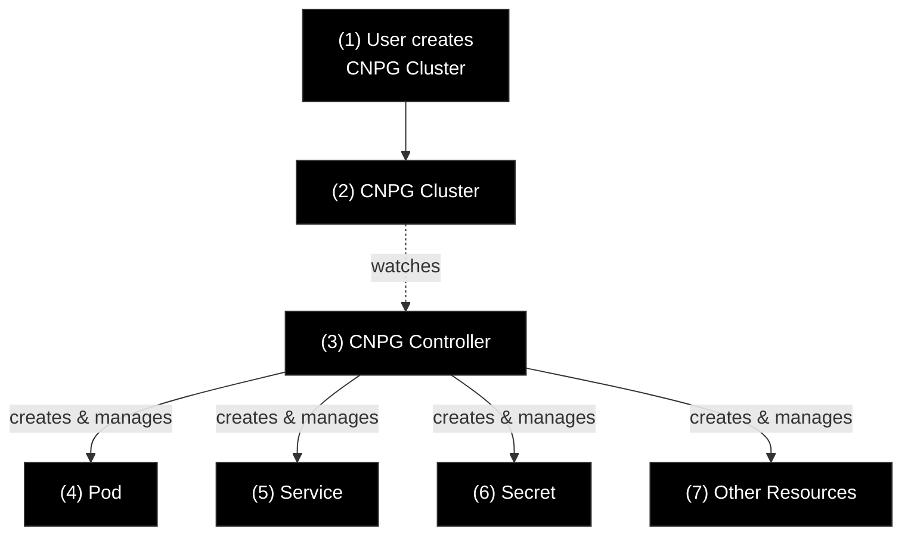
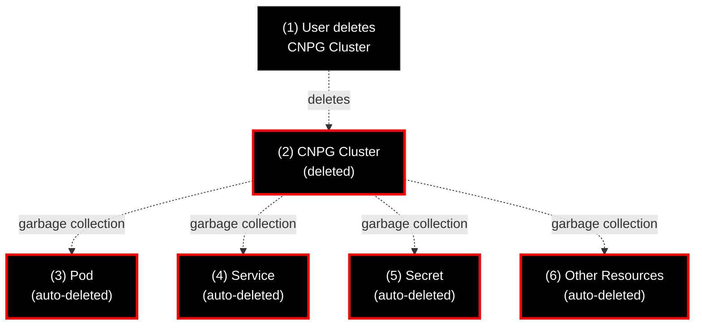

+++
title = 'Stop Trusting kubectl get all! Here Is What It Hides From You'
date = 2025-12-29T15:00:00+00:00
draft = false
+++

Ever wonder why Kubernetes has a command called `get all` that doesn't actually retrieve all your resources? Try it yourself and you'll find it conveniently forgets about Ingresses, PersistentVolumeClaims, and potentially many other resource types.

Worse yet, even when you manually list everything in a namespace, you're left staring at a pile of objects with no idea how they fit together. There's no built-in way to say "these five resources form a complete system" or to check if that system is healthy.

Turns out, this is a real problem when navigating clusters and trying to understand what's actually running. So I created a Custom Resource Definition that wraps related resources into logical groups with status, context, and relationships.

In this video, I'll walk you through the problem, explore how Kubernetes ownership and ownerReferences work, and demonstrate a better approach using CRDs.

<!--more-->



## Setup

```sh
git clone https://github.com/vfarcic/dot-ai-controller

cd dot-ai-controller

git pull

git fetch

git switch demo/solution
```

> Make sure that Docker is up-and-running. We'll use it to create a KinD cluster.

> Watch [Nix for Everyone: Unleash Devbox for Simplified Development](https://youtu.be/WiFLtcBvGMU) if you are not familiar with Devbox. Alternatively, you can skip Devbox and install all the tools listed in `devbox.json` yourself.

```sh
devbox shell
```

> You will be asked to input Anthropic and OpenAI API keys. We will not use AI features in this demo so feel free to type any random strings (e.g., `not-today`) or just press the enter key.

```sh
./dot.nu setup \
    --qdrant-run false \
    --kyverno-enabled false \
    --atlas-enabled false \
    --crossplane-enabled false

source .env

./dot.nu apply cnpg

kubectl --namespace dot-ai apply \
    --filename examples/silly-demo.yaml
```

## What Is This Thing in Kubernetes?

Here's a fundamental question that trips up almost everyone working with Kubernetes: what exactly is an application? Or a database? Or any logical system running in your cluster? Is it just a collection of resources? If so, which ones belong together, and how do you know?

Let's start by looking at what most people try first.

```sh
kubectl --namespace dot-ai get all
```

Here's what we get.

```text
NAME                              READY STATUS  RESTARTS AGE
pod/dot-ai-controller-manager-... 1/1   Running 0        97m
pod/dot-ai-mcp-5cbf78d9ff-27b7n   1/1   Running 0        96m
pod/dot-ai-mcp-qdrant-0           1/1   Running 0        96m
pod/silly-demo-5f68676f87-q78lv   1/1   Running 0        91m
pod/silly-demo-5f68676f87-rzpqs   1/1   Running 0        91m
pod/silly-demo-db-1               1/1   Running 0        90m

NAME                               TYPE      CLUSTER-IP    EXTERNAL-IP PORT(S)                    AGE
service/dot-ai-mcp                 ClusterIP 10.96.150.170 <none>      3456/TCP                   96m
service/dot-ai-mcp-qdrant          ClusterIP 10.96.139.206 <none>      6333/TCP,6334/TCP,6335/TCP 96m
service/dot-ai-mcp-qdrant-headless ClusterIP None          <none>      6333/TCP,6334/TCP,6335/TCP 96m
service/silly-demo                 ClusterIP 10.96.46.206  <none>      8080/TCP                   91m
service/silly-demo-db-r            ClusterIP 10.96.49.250  <none>      5432/TCP                   91m
service/silly-demo-db-ro           ClusterIP 10.96.179.38  <none>      5432/TCP                   91m
service/silly-demo-db-rw           ClusterIP 10.96.52.41   <none>      5432/TCP                   91m

NAME                                      READY UP-TO-DATE AVAILABLE AGE
deployment.apps/dot-ai-controller-manager 1/1   1          1         97m
deployment.apps/dot-ai-mcp                1/1   1          1         96m
deployment.apps/silly-demo                2/2   2          2         91m

NAME                                                DESIRED CURRENT READY AGE
replicaset.apps/dot-ai-controller-manager-cd4d58845 1       1       1     97m
replicaset.apps/dot-ai-mcp-5cbf78d9ff               1       1       1     96m
replicaset.apps/silly-demo-5f68676f87               2       2       2     91m

NAME                               READY AGE
statefulset.apps/dot-ai-mcp-qdrant 1/1   96m
```

But this doesn't show us an "app" at all. Looking at this output, are we seeing two apps? Three? There's qdrant, which might or might not be related to the MCP service. There's silly-demo with its deployment and database. Or maybe silly-demo IS the database? It's impossible to tell from this output alone.

What we're actually seeing here are individual resources that form one or more logical groups. It could be a single app, a database, an app with its database, or multiple independent systems. The `kubectl get all` command gives us no way to distinguish between these possibilities.

Here's another problem: these aren't even all the resources in that namespace. The `kubectl get all` command is misleading, not to say ridiculous. It doesn't retrieve all resources, just some of the Kubernetes core resources. Kubernetes cannot retrieve all resources in a single command. Yet we need to know which ones are involved.

```sh
kubectl --namespace dot-ai get all,ingresses,persistentvolumeclaims
```

And here's the result.

```text
NAME                                          READY STATUS  RESTARTS AGE
pod/dot-ai-controller-manager-cd4d58845-4cc5s 1/1   Running 0        99m
pod/dot-ai-mcp-5cbf78d9ff-27b7n               1/1   Running 0        98m
pod/dot-ai-mcp-qdrant-0                       1/1   Running 0        98m
pod/silly-demo-5f68676f87-q78lv               1/1   Running 0        93m
pod/silly-demo-5f68676f87-rzpqs               1/1   Running 0        93m
pod/silly-demo-db-1                           1/1   Running 0        92m

NAME                               TYPE      CLUSTER-IP    EXTERNAL-IP PORT(S)                    AGE
service/dot-ai-mcp                 ClusterIP 10.96.150.170 <none>      3456/TCP                   98m
service/dot-ai-mcp-qdrant          ClusterIP 10.96.139.206 <none>      6333/TCP,6334/TCP,6335/TCP 98m
service/dot-ai-mcp-qdrant-headless ClusterIP None          <none>      6333/TCP,6334/TCP,6335/TCP 98m
service/silly-demo                 ClusterIP 10.96.46.206  <none>      8080/TCP                   93m
service/silly-demo-db-r            ClusterIP 10.96.49.250  <none>      5432/TCP                   93m
service/silly-demo-db-ro           ClusterIP 10.96.179.38  <none>      5432/TCP                   93m
service/silly-demo-db-rw           ClusterIP 10.96.52.41   <none>      5432/TCP                   93m

NAME                                      READY UP-TO-DATE AVAILABLE AGE
deployment.apps/dot-ai-controller-manager 1/1   1          1         99m
deployment.apps/dot-ai-mcp                1/1   1          1         98m
deployment.apps/silly-demo                2/2   2          2         93m

NAME                                                DESIRED CURRENT READY AGE
replicaset.apps/dot-ai-controller-manager-cd4d58845 1       1       1     99m
replicaset.apps/dot-ai-mcp-5cbf78d9ff               1       1       1     98m
replicaset.apps/silly-demo-5f68676f87               2       2       2     93m

NAME                               READY AGE
statefulset.apps/dot-ai-mcp-qdrant 1/1   98m

NAME                                 CLASS HOSTS                       ADDRESS   PORTS AGE
ingress.networking.k8s.io/dot-ai-mcp nginx dot-ai.127.0.0.1.nip.io     localhost 80    98m
ingress.networking.k8s.io/silly-demo nginx silly-demo.127.0.0.1.nip.io localhost 80    93m

NAME                                  STATUS VOLUME     CAPACITY      ACCESS MODES STORAGECLASS VOLUMEATTRIBUTESCLASS AGE
persistentvolumeclaim/qdrant-storage  Bound  pvc-2ea... 10Gi          RWO          standard     <unset>               98m
persistentvolumeclaim/silly-demo      Bound  pvc-7f1... 1Gi           RWO          standard     <unset>               93m
persistentvolumeclaim/silly-demo-db-1 Bound  pvc-7d2... 107374182400m RWO          standard     <unset>               93m
```

Are those all the resources? I don't know. I just made a wild guess that there might be ingresses and persistent volume claims. There could be more resource types I'm not thinking of.

So here are the fundamental questions: How do resources relate to each other? Which resources form a logical group? What's the status of a logical group? What's the purpose of a group of resources?

Let's take a closer look at one of these resources to see if we can find any clues.

```sh
kubectl --namespace dot-ai get deployment silly-demo --output yaml
```

Here's what that looks like.

```yaml
apiVersion: apps/v1
kind: Deployment
metadata:
  ...
  name: silly-demo
  namespace: dot-ai
  ...
spec:
  progressDeadlineSeconds: 600
  replicas: 2
  ...
status:
  availableReplicas: 2
  conditions:
  - lastTransitionTime: "2025-11-27T20:35:09Z"
    lastUpdateTime: "2025-11-27T20:35:09Z"
    ...
```

With a Deployment, we might know it creates a ReplicaSet, which then creates Pods. We know this from experience. But we can't always rely on knowing what each resource does and which resources it creates and owns.

How about, for example, a CNPG Cluster? I know it exists in this namespace because I deployed it. But someone else looking at this cluster wouldn't know it's there. Even I might forget about it in a few weeks.

```sh
kubectl --namespace dot-ai get cluster
```

Here's what we see.

```
NAME          AGE   INSTANCES READY STATUS                   PRIMARY
silly-demo-db 5h38m 1         1     Cluster in healthy state silly-demo-db-1
```

So what is this Cluster resource really? Is it just this one object related to PostgreSQL, or is there more? How can we know? It might not be a resource you've worked with before, and even if you have, the chances are you don't know which resources it created, if any.

I happen to know it created a Pod, among other things. Let's take a look at that.

```sh
kubectl --namespace dot-ai get pod \
    --selector cnpg.io/cluster=silly-demo-db --output yaml
```

And here's the output.

```yaml
apiVersion: v1
items:
- apiVersion: v1
  kind: Pod
  metadata:
    ...
    name: silly-demo-db-1
    namespace: dot-ai
    ownerReferences:
    - apiVersion: postgresql.cnpg.io/v1
      blockOwnerDeletion: true
      controller: true
      kind: Cluster
      name: silly-demo-db
      uid: 6a919d83-cc9e-4fc4-bf3b-b685cb4117c6
    ...
```

Here's where things get interesting. The key is in the `ownerReferences` array. This tells us that some other resource owns this Pod. Specifically, a controller related to that resource created it. In this case, the owner is the CNPG `Cluster` resource named `silly-demo-db`.

Let me explain how this works, because owner references are fundamental to understanding Kubernetes resource relationships.

## Kubernetes ownerReferences and Garbage Collection

(1) When you create a resource in Kubernetes, you're often not just creating that one object. Many resources are actually controllers that watch for their corresponding custom resources and then create and manage other resources in response. The CNPG Cluster is a perfect example. (2) When you create a CNPG Cluster object, the CNPG operator sees it and (3) starts creating Pods, Services, Secrets, and other resources needed to run PostgreSQL.



The controller establishes ownership by adding an `ownerReferences` entry to each resource it creates. This creates a parent-child relationship. The CNPG Cluster is the parent, and the Pod is the child.

There are a few important fields in the owner reference. The `controller` field set to `true` means this owner is responsible for managing the resource. The `blockOwnerDeletion` field set to `true` means you can't delete the owner while this child resource still exists. This prevents you from accidentally destroying a CNPG Cluster while Pods are still running.

Most importantly, owner references enable garbage collection. (1) When you delete the CNPG Cluster resource, (2) Kubernetes automatically deletes all the resources it owns. (3) You don't have to manually clean up each Pod, (4) Secret, (5) Service, or (6) other resources. The ownership chain takes care of it.



This creates hierarchies of resources. A Deployment owns ReplicaSets. Those ReplicaSets own Pods. A CNPG Cluster owns Pods, Services, Secrets, and potentially other resources. It's resources all the way down.

Here's the problem though. We discovered the owner by looking at the child resource, the Pod. We can see ownership bottom-up, from child to parent. But we can't see it top-down, from parent to children. When we looked at the CNPG Cluster resource earlier, there was no field listing all the resources it created. We have to know what to look for, then search for it, then check if it has an owner reference pointing back.

Luckily for us, there's `kubectl-tree`, an amazing little tool that relies on `ownerReferences`. It can show us the hierarchy of owned resources. But it only helps if we know what we're looking for and what constitutes a logical group, which we often don't.

Let's try it with the CNPG Cluster we just discovered.

```sh
kubectl tree --namespace dot-ai cluster silly-demo-db
```

The output is as follows.

```text
NAMESPACE NAME                                        READY REASON         STATUS  AGE
dot-ai    Cluster/silly-demo-db                       True  ClusterIsReady Current 42s
dot-ai    ├─PersistentVolumeClaim/silly-demo-db-1     -                    -       42s
dot-ai    ├─Pod/silly-demo-db-1                       True                 Current 18s
dot-ai    ├─PodDisruptionBudget/silly-demo-db-primary -                    -       42s
dot-ai    ├─Role/silly-demo-db                        -                    -       42s
dot-ai    ├─RoleBinding/silly-demo-db                 -                    -       42s
dot-ai    ├─Secret/silly-demo-db-app                  -                    -       42s
dot-ai    ├─Secret/silly-demo-db-ca                   -                    -       42s
dot-ai    ├─Secret/silly-demo-db-replication          -                    -       42s
dot-ai    ├─Secret/silly-demo-db-server               -                    -       42s
dot-ai    ├─Service/silly-demo-db-r                   -                    -       42s
dot-ai    │ └─EndpointSlice/silly-demo-db-r-xtw7n     -                    -       42s
dot-ai    ├─Service/silly-demo-db-ro                  -                    -       42s
dot-ai    │ └─EndpointSlice/silly-demo-db-ro-llqp9    -                    -       42s
dot-ai    ├─Service/silly-demo-db-rw                  -                    -       42s
dot-ai    │ └─EndpointSlice/silly-demo-db-rw-8t76d    -                    -       42s
dot-ai    └─ServiceAccount/silly-demo-db              -                    -       42s
```

Look at that. kubectl-tree shows us everything the CNPG `Cluster` owns through the *ownerReferences* chain. There's the `Pod`, multiple `Services` with their `EndpointSlices`, `Secrets` for certificates and authentication, RBAC resources, even a `PodDisruptionBudget`. Now we can see the complete hierarchy starting from this one `Cluster` resource.

That's great for this specific example since the CNPG `Cluster` is the top-level resource. But what if that cluster is part of an application? What if there's more to the system, as there often is? kubectl-tree shows us the ownership hierarchy, but only starting from the resource we specify.

Let's try it with the Deployment.

```sh
kubectl tree --namespace dot-ai deployment silly-demo
```

Here's what that shows.

```text
NAMESPACE NAME                                READY REASON STATUS  AGE
dot-ai    Deployment/silly-demo               -            -       26m
dot-ai    └─ReplicaSet/silly-demo-5f68676f87  -            -       26m
dot-ai      ├─Pod/silly-demo-5f68676f87-26zl8 True         Current 26m
dot-ai      └─Pod/silly-demo-5f68676f87-w7jpk True         Current 26m
```

That still doesn't show us that there's a *Service*, an *Ingress*, a *PersistentVolumeClaim*, and probably a few other resources as well. The *Deployment* doesn't own those resources, so kubectl-tree doesn't show them.

## Solving Resource Grouping with CRDs

So let me summarize the problems we're facing. First, there's no easy way to answer questions like "What is this app? What does it consist of?" We could consult Git if everything is organized well, but let's be honest, that's often a mess. All I want is to look at my cluster and figure out what is what and how resources relate to each other.

Second, we don't have a decent way to find out the status of a logical group. I cannot ask "What is the status of the Silly Demo app?" I would first need to figure out what it consists of, then check the Deployment, the Ingress, the Service, the CNPG Cluster, and so on. As we already established, we cannot do that easily. That's fucked up.

Third, by looking at individual resources it's hard to figure out what it's all about. What is the context? Why does this thing exist? What did the author want to accomplish?

To be fair, we can address some of these issues if the author added labels and annotations. But that often doesn't happen. And when it does, people tend to use different labels for conceptually the same stuff.

All in all, unless I'm the author of this mess and I have very good memory, I might easily get lost. The same can be said for AI. Both humans and AI need to know what a solution consists of, what the relations between resources are, what the context is, and what the intent was.

I ran into this exact problem when working on a project. I needed a way to define logical groups of resources with their relationships, context, and status. So I built a simple, one could even say silly, solution that helps with all of this.

Let me show you what I mean.

```sh
kubectl tree --namespace dot-ai solution silly-demo
```

And look at this.

```text
NAMESPACE NAME                                          READY REASON            STATUS  AGE  
dot-ai    Solution/silly-demo                           True  AllResourcesReady Current 5h55m
dot-ai    ├─Cluster/silly-demo-db                       True  ClusterIsReady    Current 5h55m
dot-ai    │ ├─PersistentVolumeClaim/silly-demo-db-1     -                       -       5h55m
dot-ai    │ ├─Pod/silly-demo-db-1                       True                    Current 5h54m
dot-ai    │ ├─PodDisruptionBudget/silly-demo-db-primary -                       -       5h55m
dot-ai    │ ├─Role/silly-demo-db                        -                       -       5h55m
dot-ai    │ ├─RoleBinding/silly-demo-db                 -                       -       5h55m
dot-ai    │ ├─Secret/silly-demo-db-app                  -                       -       5h55m
dot-ai    │ ├─Secret/silly-demo-db-ca                   -                       -       5h55m
dot-ai    │ ├─Secret/silly-demo-db-replication          -                       -       5h55m
dot-ai    │ ├─Secret/silly-demo-db-server               -                       -       5h55m
dot-ai    │ ├─Service/silly-demo-db-r                   -                       -       5h55m
dot-ai    │ │ └─EndpointSlice/silly-demo-db-r-tn2ln     -                       -       5h55m
dot-ai    │ ├─Service/silly-demo-db-ro                  -                       -       5h55m
dot-ai    │ │ └─EndpointSlice/silly-demo-db-ro-kt4h8    -                       -       5h55m
dot-ai    │ ├─Service/silly-demo-db-rw                  -                       -       5h55m
dot-ai    │ │ └─EndpointSlice/silly-demo-db-rw-6zksl    -                       -       5h55m
dot-ai    │ └─ServiceAccount/silly-demo-db              -                       -       5h55m
dot-ai    ├─Deployment/silly-demo                       -                       -       5h55m
dot-ai    │ └─ReplicaSet/silly-demo-5f68676f87          -                       -       5h55m
dot-ai    │   ├─Pod/silly-demo-5f68676f87-q78lv         True                    Current 5h55m
dot-ai    │   └─Pod/silly-demo-5f68676f87-rzpqs         True                    Current 5h55m
dot-ai    ├─Ingress/silly-demo                          -                       -       5h55m
dot-ai    ├─PersistentVolumeClaim/silly-demo            -                       -       5h55m
dot-ai    └─Service/silly-demo                          -                       -       5h55m
dot-ai      └─EndpointSlice/silly-demo-qmhn5            -                       -       5h55m
```

This time, kubectl-tree returned everything related to the app. There's a `Cluster` with a bunch of resources related to the PostgreSQL database. There's a `Deployment` with the app itself. There's an `Ingress` for public access, a `PersistentVolumeClaim` for storage, and a `Service`. Most of those own other resources, which you can see in the tree. The important part is that I can finally see all the resources related to a specific solution in one place.

Here's how that Solution resource looks.

```sh
kubectl --namespace dot-ai get solution silly-demo --output yaml
```

Here's the YAML.

```yaml
apiVersion: dot-ai.devopstoolkit.live/v1alpha1
kind: Solution
metadata:
  ...
  name: silly-demo
  namespace: dot-ai
  ...
spec:
  context:
    createdBy: vfarcic
    rationale: A Silly Demo stack that was made for no particular reason than to demonstrate
      that some things in Kubernetes are silly
  intent: Deploy a demo web application with persistent storage, PostgreSQL database,
    and public ingress access
  resources:
  - apiVersion: apps/v1
    kind: Deployment
    name: silly-demo
  - apiVersion: v1
    kind: PersistentVolumeClaim
    name: silly-demo
  - apiVersion: v1
    kind: Service
    name: silly-demo
  - apiVersion: networking.k8s.io/v1
    kind: Ingress
    name: silly-demo
  - apiVersion: postgresql.cnpg.io/v1
    kind: Cluster
    name: silly-demo-db
status:
  conditions:
  - lastTransitionTime: "2025-11-28T02:34:12Z"
    message: All 5 resources are ready
    reason: AllResourcesReady
    status: "True"
    type: Ready
  observedGeneration: 1
  resources:
    ready: 5
    total: 5
  state: deployed
```

It's a custom resource `Solution` that contains all the information we need. There's `context` and `intent` that give us insight into what the author wanted to accomplish. There's the list of top-level `resources` the solution manages. Those might spawn other resources, and as we already saw with kubectl-tree, once we know what the top resources are, we can easily explore the full hierarchy. Finally, we can see the `status` of the complete solution.

This isn't some grand multi-generational project. It's a simple solution to a problem I had, and you might have as well. Install the controller, create a Solution custom resource, and you're done.

Check out https://github.com/vfarcic/dot-ai-controller. Use it, fork it, star it, open issues, request new features. I'd love to hear if this helps solve your problems too.

## Destroy

```sh
./dot.nu destroy kubernetes kind

git switch main

exit
```
