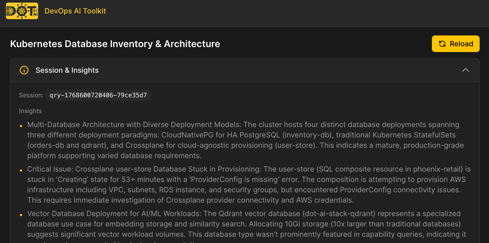
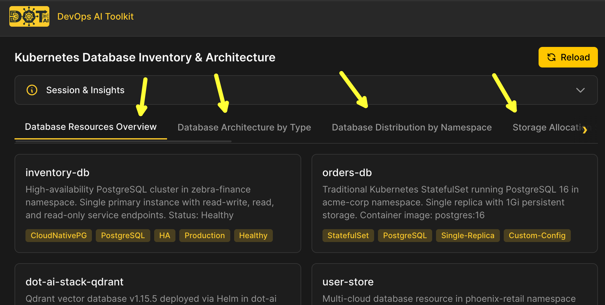
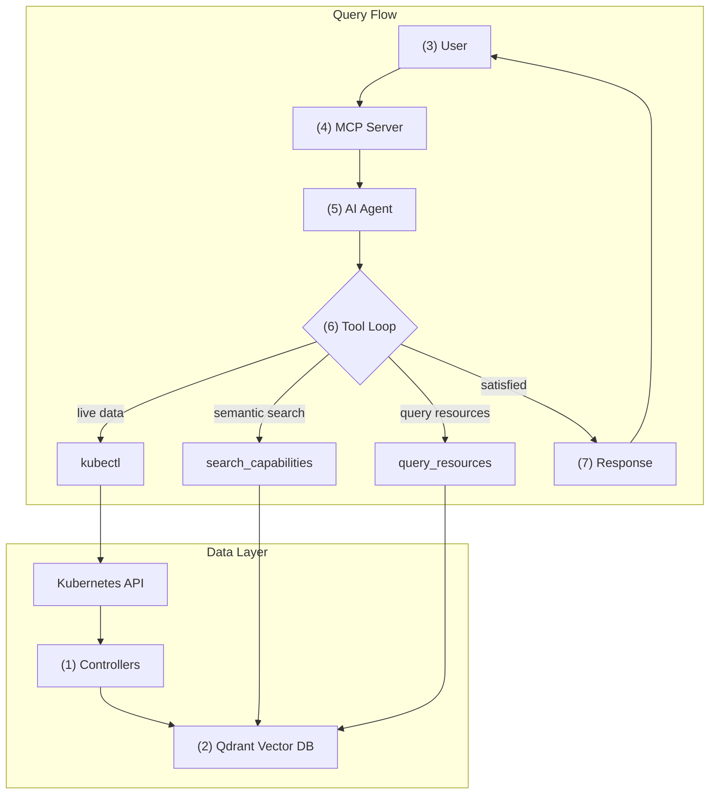

+++
title = 'Why Kubernetes Querying Is Broken and How I Fixed It'
date = 2026-02-22T14:00:00+00:00
draft = false
+++

**`kubectl get all` is a lie.** It doesn't get all. It gets maybe 10% of what's actually in your cluster. And if you want the other 90%? You're writing bash loops, waiting forever, and still missing resources because you don't even know what to search for.

This video is about fixing Kubernetes' terrible querying story. The root cause is etcd. It's a key-value store, not a database. It was never designed to answer questions like "show me all databases" or "what's running in this namespace."

I'll show you how to sync Kubernetes metadata into a Vector database, enabling both traditional queries and semantic search. By the end, you'll be able to run proper database queries AND ask questions in plain English, and get answers that actually make sense. **No more grep pipelines. No more guessing resource names.**

<!--more-->



## Setup

> This demo is using Claude Code as the coding agent. With a few modification, it should work with any other coding agents like Cursor, GitHub Copilot, etc. The major change you might need to make is to change `.mcp-kubernetes.json` to whichever format and location for MCP config your agent expects.

> If you don't have Claude Code already, and would like to install it, please follow [Setup Claude Code](https://code.claude.com/docs/en/setup) instructions.

```sh
git clone https://github.com/vfarcic/dot-ai

cd dot-ai

git pull

git fetch

git switch demo/query
```

> Make sure that Docker is up-and-running. We'll use it to run create a KinD cluster.

> Watch [Nix for Everyone: Unleash Devbox for Simplified Development](https://youtu.be/WiFLtcBvGMU) if you are not familiar with Devbox. Alternatively, you can skip Devbox and install all the tools listed in `devbox.json` yourself.

```sh
devbox shell

./dot.nu setup \
    --kyverno-enabled false \
    --atlas-enabled false \
    --crossplane-db-config true \
    --cnpg-enabled true

source .env

kubectl --namespace dot-ai apply --filename examples/qdrant-ingress.yaml

kubectl apply --filename examples/databases.yaml
```

## Kubernetes Query Limitations

Let's start by listing all the resources in the cluster.

```sh
kubectl get all --all-namespaces
```

The output is as follows (truncated for brevity).

```text
NAMESPACE          NAME                                                      READY STATUS  RESTARTS AGE
acme-corp          pod/orders-db-0                                           1/1   Running 0        72s
cnpg-system        pod/cnpg-cloudnative-pg-597d759495-l5jcq                  1/1   Running 0        7m56s
crossplane-system  pod/crossplane-contrib-function-auto-ready-...            1/1   Running 0        10m
crossplane-system  pod/crossplane-contrib-function-kcl-...                   1/1   Running 0        10m
crossplane-system  pod/crossplane-contrib-function-patch-and-transform-...   1/1   Running 0        9m47s
crossplane-system  pod/crossplane-contrib-function-status-transformer-...    1/1   Running 0        10m
crossplane-system  pod/crossplane-contrib-provider-aws-ec2-...               1/1   Running 0        9m27s
crossplane-system  pod/crossplane-contrib-provider-aws-rds-...               1/1   Running 0        9m37s
crossplane-system  pod/crossplane-contrib-provider-azure-dbforpostgresql-... 1/1   Running 0        9m29s
crossplane-system  pod/crossplane-contrib-provider-family-aws-...            1/1   Running 0        9m40s
...
NAMESPACE NAME                                 READY AGE
acme-corp statefulset.apps/orders-db           1/1   11m
dot-ai    statefulset.apps/dot-ai-stack-qdrant 1/1   18m
```

The output shows over a hundred resources, but here's the thing. Those are not all the resources. `kubectl get all` retrieves only core resources, and not even all of those. Ingresses are not there. Custom resources are not there either. Most of what makes up your cluster is missing from that output.

That's the stupid part of Kubernetes. If we want all resources, we first need to find out what "all" even means.

```sh
kubectl api-resources
```

The output is as follows (truncated for brevity).

```text

NAME              SHORTNAMES APIVERSION NAMESPACED KIND
bindings                     v1         true       Binding
componentstatuses cs         v1         false      ComponentStatus
configmaps        cm         v1         true       ConfigMap
endpoints         ep         v1         true       Endpoints
events            ev         v1         true       Event
limitranges       limits     v1         true       LimitRange
namespaces        ns         v1         false      Namespace
nodes             no         v1         false      Node
...
```

There are, in this cluster, 356 resource definitions. There can be resources based on any of those. So those hundred or so resources we saw earlier could be all the resources in the cluster. Or there might be a few more. Or a few thousand more. Who knows?

Now, to actually see everything, we need to iterate over all those APIs and execute `kubectl get` for each one. I'm filtering out events since they're constantly changing noise that would just clutter the results.

```sh
kubectl api-resources --verbs=list -o name \
    | grep -v "^events" \
    | xargs -n 1 kubectl get --show-kind --ignore-not-found -A
```

Look at it struggling. It's working, and working, and working. Eventually, we get something like this (truncated for brevity).

```text
...
NAME                                 STATUS    MESSAGE   ERROR
componentstatus/scheduler            Healthy   ok
componentstatus/controller-manager   Healthy   ok
componentstatus/etcd-0               Healthy   ok
NAMESPACE            NAME                                       DATA   AGE
a-team               configmap/kube-root-ca.crt                 1      24m
acme-corp            configmap/kube-root-ca.crt                 1      16m
b-team               configmap/kube-root-ca.crt                 1      24m
cnpg-system          configmap/cnpg-controller-manager-config   0      23m
,,,
NAME                                                      VALUE        GLOBAL-DEFAULT   AGE   PREEMPTIONPOLICY
priorityclass.scheduling.k8s.io/system-cluster-critical   2000000000   false            28m   PreemptLowerPriority
priorityclass.scheduling.k8s.io/system-node-critical      2000001000   false            28m   PreemptLowerPriority
NAME                                       DRIVERS   AGE
csinode.storage.k8s.io/dot-control-plane   0         28m
NAME                                           PROVISIONER           RECLAIMPOLICY VOLUMEBINDINGMODE    ALLOWVOLUMEEXPANSION AGE
storageclass.storage.k8s.io/standard (default) rancher.io/local-path Delete        WaitForFirstConsumer false                28m
```

That was a stupidly silly way to get something that should be table stakes. That's madness, and this isn't even a "real" production cluster.

Let's spice it up a bit more. How many resources are there in the `dot-ai` Namespace for each kind, sorted in descending order?

```sh
kubectl api-resources --verbs=list -o name | grep -v "^events" | while read resource; do
    count=$(kubectl -n dot-ai get "$resource" -A --no-headers 2>/dev/null | wc -l)
    [ "$count" -gt 0 ] && echo "$resource: $count"
done | sort -t: -k2 -rn
```

Waiting for it to list all resources for each of the 356 definitions is an exercise in patience. Eventually, we get the data, and it tells us there are over fifteen hundred resources in the cluster. That's a very different picture from the hundred or so we got with `kubectl get all`.

If that was SQL or any other database, it would be faster and more intuitive. Right?

Let's spice it up a bit more. Can we find all the databases in the cluster?

```sh
kubectl get statefulsets --all-namespaces
```

The output is as follows.

```text
NAMESPACE   NAME                  READY   AGE
acme-corp   orders-db             1/1     32m
dot-ai      dot-ai-stack-qdrant   1/1     39m
```

But what makes us think that all databases are StatefulSets? Let's try another resource type.

```sh
kubectl get clusters.postgresql.cnpg.io --all-namespaces
```

The output is as follows.

```text
NAMESPACE     NAME         AGE INSTANCES READY STATUS                   PRIMARY
zebra-finance inventory-db 33m 1         1     Cluster in healthy state inventory-db-1
```

Did we now get all databases? Who knows? As we saw earlier, there are 356 resource definitions in this cluster. There could be any number of other resources related to databases.

Can we figure out which definitions are related to databases?

```sh
kubectl api-resources | grep database
```

The output is as follows.

```text
databases               dbforpostgresql.azure.m.upbound.io/v1beta1 true  Database
flexibleserverdatabases dbforpostgresql.azure.m.upbound.io/v1beta1 true  FlexibleServerDatabase
databases               mssql.sql.crossplane.io/v1alpha1           false Database
databases               mssql.sql.m.crossplane.io/v1alpha1         true  Database
databases               mysql.sql.crossplane.io/v1alpha1           false Database
databases               mysql.sql.m.crossplane.io/v1alpha1         true  Database
databases               postgresql.cnpg.io/v1                      true  Database
databases               postgresql.sql.crossplane.io/v1alpha1      false Database
databases               postgresql.sql.m.crossplane.io/v1alpha1    true  Database
databaseinstances       sql.gcp.m.upbound.io/v1beta1               true  DatabaseInstance
databases               sql.gcp.m.upbound.io/v1beta1               true  Database
```

What if names of database-related resources have `db` instead of `database` in their name?

```sh
kubectl api-resources | grep db
```

The output is as follows.

```text

activedirectoryadministrators                   dbforpostgresql.azure.m.upbound.io/v1beta1 true ActiveDirectoryAdministrator
configurations                                  dbforpostgresql.azure.m.upbound.io/v1beta1 true Configuration
databases                                       dbforpostgresql.azure.m.upbound.io/v1beta1 true Database
firewallrules                                   dbforpostgresql.azure.m.upbound.io/v1beta1 true FirewallRule
flexibleserveractivedirectoryadministrators     dbforpostgresql.azure.m.upbound.io/v1beta1 true FlexibleServerActiveDirectoryAdministrator
flexibleserverconfigurations                    dbforpostgresql.azure.m.upbound.io/v1beta1 true FlexibleServerConfiguration
flexibleserverdatabases                         dbforpostgresql.azure.m.upbound.io/v1beta1 true FlexibleServerDatabase
flexibleserverfirewallrules                     dbforpostgresql.azure.m.upbound.io/v1beta1 true FlexibleServerFirewallRule
flexibleservers                                 dbforpostgresql.azure.m.upbound.io/v1beta1 true FlexibleServer
flexibleservervirtualendpoints                  dbforpostgresql.azure.m.upbound.io/v1beta1 true FlexibleServerVirtualEndpoint
serverkeys                                      dbforpostgresql.azure.m.upbound.io/v1beta1 true ServerKey
servers                                         dbforpostgresql.azure.m.upbound.io/v1beta1 true Server
virtualnetworkrules                             dbforpostgresql.azure.m.upbound.io/v1beta1 true VirtualNetworkRule
poddisruptionbudgets                        pdb policy/v1                                  true PodDisruptionBudget
scheduledbackups                                postgresql.cnpg.io/v1                      true ScheduledBackup
dbinstanceautomatedbackupsreplications          rds.aws.m.upbound.io/v1beta1               true DBInstanceAutomatedBackupsReplication
dbsnapshotcopies                                rds.aws.m.upbound.io/v1beta1               true  DBSnapshotCopy
```

Are those all? We don't know. Names can have `sql`, or `postgresql`, or `postgre`, or `psql`, or any number of other synonyms for a database.

Did those examples find all the information we were looking for? Not even close. Were those easy? Nope. Were they intuitive? Nope. Will everyone be able to write such commands and scripts depending on what they're looking for? Most likely not. Heck, how can we find something if we don't even know what we're looking for?

Now imagine more complex queries.

It's a nightmare, mainly caused by Kubernetes' decision to use etcd. It's a key-value store that might be a good choice for its primary function of managing state. It's a terrible choice when it comes to querying.

## Kubernetes Query and Semantic Search

So what do we need? We need data that can be searched, both through queries and semantic search. Enter Vector DBs.

Let me show you the same query against a Vector database that automagically gets populated with all resource definitions and metadata from all the resources in the cluster.

```sh
curl \
    -s "http://qdrant.127.0.0.1.nip.io/collections/resources/points/scroll" \
    -H "Content-Type: application/json" \
    -d '{"limit": 10000, "with_payload": true}' \
    | jq .
```

The output is as follows (truncated for brevity).

```json
{
  "result": {
    "points": [
      {
        "id": "00021be7-6156-eec3-17e7-6623fae4a43f",
        "payload": {
          "id": "_cluster:apiextensions.k8s.io/v1:CustomResourceDefinition:instancestates.ec2.aws.m.upbound.io",
          "namespace": "_cluster",
          "name": "instancestates.ec2.aws.m.upbound.io",
          "kind": "CustomResourceDefinition",
          "apiVersion": "apiextensions.k8s.io/v1",
          "apiGroup": "apiextensions.k8s.io",
          "labels": {},
          "annotations": {},
          "createdAt": "2026-01-16T23:56:28Z",
          "updatedAt": "2026-01-16T23:57:59.179028511Z",
          "searchText": "CustomResourceDefinition instancestates.ec2.aws.m.upbound.io | namespace: _cluster | apiVersion: apiextensions.k8s.io/v1 | group: apiextensions.k8s.io",
          "hasEmbedding": true
        }
      },
      ...
      {
        "id": "ff19b762-e0d6-910c-60bb-178fd9338c4f",
        "payload": {
          "id": "_cluster:rbac.authorization.k8s.io/v1:ClusterRoleBinding:crossplane:provider:crossplane-contrib-provider-azure-dbforpostgresql-8a9bd6edfc6b:system",
          "namespace": "_cluster",
          "name": "crossplane:provider:crossplane-contrib-provider-azure-dbforpostgresql-8a9bd6edfc6b:system",
          "kind": "ClusterRoleBinding",
          "apiVersion": "rbac.authorization.k8s.io/v1",
          "apiGroup": "rbac.authorization.k8s.io",
          "labels": {},
          "annotations": {},
          "createdAt": "2026-01-16T23:55:28Z",
          "updatedAt": "2026-01-16T23:57:59.878152178Z",
          "searchText": "ClusterRoleBinding crossplane:provider:crossplane-contrib-provider-azure-dbforpostgresql-8a9bd6edfc6b:system | namespace: _cluster | apiVersion: rbac.authorization.k8s.io/v1 | group: rbac.authorization.k8s.io",
          "hasEmbedding": true
        }
      }
    ],
    "next_page_offset": null
  },
  "status": "ok",
  "time": 0.003149208
}
```

That was almost instant. We got all the resources in the database without any delay. And since it's a proper database, we can write any query we like to filter and slice the data.

Now, do I expect you to write `curl` commands? Nope. I expect you to use a Web UI, or a CLI, or an AI agent, or any other interface you prefer. In this case, I'll use Claude Code with an MCP server that connects to the Vector database.

```sh
claude --mcp-config .mcp-kubernetes.json --strict-mcp-config
```

> If you see that it's not using MCP, add `use dot-ai MCP` to intents.

Let's ask it to show all the resources in the cluster.

[user]
```text
Show all the resources in the cluster
```

[agent]
```text

⏺ The cluster contains a comprehensive multi-layered infrastructure:

  Namespaces (14 total)

  - System: default, kube-system, kube-node-lease, kube-public
  - Platform: cnpg-system, crossplane-system, ingress-nginx, local-path-storage
  - Application: dot-ai, a-team, b-team, acme-corp, phoenix-retail, zebra-finance

  Core Resources
  ┌───────────────────┬───────┐
  │     Resource      │ Count │
  ├───────────────────┼───────┤
  │ Pods              │ 33    │
  ├───────────────────┼───────┤
  │ Deployments       │ 24    │
  ├───────────────────┼───────┤
  │ StatefulSets      │ 2     │
  ├───────────────────┼───────┤
  │ DaemonSets        │ 2     │
  ├───────────────────┼───────┤
  │ Services          │ 40+   │
  ├───────────────────┼───────┤
  │ Ingresses         │ 3     │
  ├───────────────────┼───────┤
  │ PersistentVolumes │ 3     │
  ├───────────────────┼───────┤
  │ ConfigMaps        │ 25+   │
  ├───────────────────┼───────┤
  │ Secrets           │ 45+   │
  └───────────────────┴───────┘
  CRD Ecosystem (500+ definitions)

  - CNPG (Cloud Native PostgreSQL): 8 CRDs
  - Crossplane: 50+ CRDs with multi-cloud providers
  - Dot-AI: 4 CRDs (solutions, remediation policies, resource sync configs, capability scans)
  - AWS (via Crossplane): 200+ resource types
  - Azure (via Crossplane): 100+ resource types
  - GCP (via Crossplane): SQL and compute resources
  - GitHub (via Crossplane): repositories, teams, actions, workflows

  Major Systems

  1. Crossplane - IaC/GitOps platform with multi-cloud support
  2. CNPG - PostgreSQL operator for database management
  3. Dot-AI - AI-powered Kubernetes operations with Qdrant vector database
  4. Ingress-NGINX - Ingress controller
  5. CoreDNS - DNS service

  Custom Resources

  - 1 PostgreSQL Cluster (inventory-db in zebra-finance)
  - 11 Providers installed (AWS, Azure, GCP, GitHub, Helm, Kubernetes, SQL)
  - 7 Compositions defined
  - 2 Composite Resource Definitions (Apps and SQLs)

  All pods and deployments are in Running/Ready state.

  Visualization: http://dot-ai-ui.127.0.0.1.nip.io/v/qry-1768600154555-f6e5f9e4
```

That took longer, but that's because we're not just fetching data. The semantic search against the Vector database is close to instant. But then AI goes through the results, checks them, adds additional information, formats the output, and so on. It's a different way to massage data than raw output from the database. Still, AI had to start with a complete list, and that was much easier to fetch from the Vector DB than from the Kube API.

Let's ask it to show how many resources there are in the `dot-ai` Namespace for each kind.

[user]
```text
How many resources there are in the dot-ai namespace for each kind?
```

[agent]
```text

⏺ The dot-ai namespace contains 35 resources distributed across these kinds:
  ┌───────────────────────┬───────┐
  │         Kind          │ Count │
  ├───────────────────────┼───────┤
  │ Deployment            │ 3     │
  ├───────────────────────┼───────┤
  │ Pod                   │ 3     │
  ├───────────────────────┼───────┤
  │ Endpoints             │ 4     │
  ├───────────────────────┼───────┤
  │ Service               │ 4     │
  ├───────────────────────┼───────┤
  │ Ingress               │ 3     │
  ├───────────────────────┼───────┤
  │ ReplicaSet            │ 3     │
  ├───────────────────────┼───────┤                                                      │ ServiceAccount        │ 3     │
  ├───────────────────────┼───────┤
  │ ConfigMap             │ 2     │
  ├───────────────────────┼───────┤
  │ Secret                │ 2     │
  ├───────────────────────┼───────┤
  │ PersistentVolumeClaim │ 1     │
  ├───────────────────────┼───────┤
  │ StatefulSet           │ 1     │
  ├───────────────────────┼───────┤
  │ ControllerRevision    │ 1     │                                                      ├───────────────────────┼───────┤
  │ ResourceSyncConfig    │ 1     │
  ├───────────────────────┼───────┤
  │ CapabilityScanConfig  │ 1     │
  ├───────────────────────┼───────┤
  │ Solution              │ 1     │
  └───────────────────────┴───────┘
  Visualization: http://dot-ai-ui.127.0.0.1.nip.io/v/qry-1768600579077-1aed85d1
```

It found resources that the Kube API would not find without going through each of the 356 definitions one at a time. And it did that relatively fast.

Now let's ask it to find all databases.

[user]
```text
Find all databases
```

[agent]
```text

⏺ Found 4 databases in the cluster:
  Database: orders-db
  Type: PostgreSQL 16 (StatefulSet)
  Namespace: acme-corp
  Status: Running (1/1)
  ────────────────────────────────────────
  Database: inventory-db
  Type: PostgreSQL 18 (CloudNativePG)
  Namespace: zebra-finance
  Status: Healthy (1/1)
  ────────────────────────────────────────
  Database: dot-ai-stack-qdrant
  Type: Qdrant v1.15.5 (Vector DB)
  Namespace: dot-ai
  Status: Running (1/1)                                                                  ────────────────────────────────────────                                               Database: user-store
  Type: AWS RDS PostgreSQL (Crossplane)
  Namespace: phoenix-retail
  Status: Synced (provisioning)
  Details:

  1. orders-db - Traditional StatefulSet PostgreSQL with 1Gi storage
  2. inventory-db - CloudNativePG cluster with HA, WAL archiving, TLS encryption, and point-in-time recovery
  3. dot-ai-stack-qdrant - Vector database for AI embeddings (10Gi storage)
  4. user-store - Crossplane-managed AWS RDS instance (still provisioning infrastructure)

  Visualization: http://dot-ai-ui.127.0.0.1.nip.io/v/qry-1768600720406-79ce35d7
```

Now we're talking! It found database-related resources no matter whether they're called DB, database, PostgreSQL, or anything else. That's the power of semantic search. It understands meaning, not just exact text matches. If it's related to databases, it found it. One is based on a StatefulSet. Another is based on CloudNativePG. There's the Qdrant Vector DB where the actual data is stored. And there's an AWS RDS instance made with Crossplane.

As icing on the cake, that data is accessible from anywhere, so we can, for example, show it in a Web UI.

> Click the visualization link in the output.

That page is dynamically generated based on a combined response from the database where resources are stored and AI analyzing the data.

At the top, we can see AI-generated insights about what was found, including observations about the multi-database architecture and any issues detected.



Below that are visualizations generated by AI. These could be diagrams, tables, code, graphs, or whatever else AI decides is the best way to present the data. The UI just renders what AI tells it to.



Now, I have much more coming up related to the Web UI. This is just a taste. The only thing I'll say for now is that it's fully dynamic. None of those tabs are predefined. Stay tuned.

## Kubernetes Query Architecture

Long story short, etcd in Kubernetes is a good system of record, but it's not a "real" database. It's a key-value store. If we put data into a database, we get queries. If that database is a Vector DB, we get semantic search. If we combine queries and semantic search, **we can find anything**.

Nevertheless, we need to be careful what we sync into the database. Everything? Bad idea. Kubernetes is very noisy with logs, events, constant status changes, and so on. What we likely need to sync into a DB is metadata. That changes less frequently, so we can sync it reliably and fast.

The bottom line? **Ask anything and you'll be answered.** I dare you to come up with a question it won't answer, as long as it can be answered based on Kubernetes metadata. If you do, please let me know what that is.

Now, you can build this yourself, or you can use the solution I built. Check out [DevOps AI Toolkit](https://devopstoolkit.ai). While you're at it, give it a star, fork it if you'd like to contribute, and open any issues or feature requests you think would improve the project.

Here's how it works. You can use this pattern to create your own if that's what you prefer.

(1) It starts with controllers that watch the Kubernetes API and sync CRDs and resource metadata into (2) a Vector DB. In this case, Qdrant. The Vector DB enables both traditional querying and semantic search.

(3) When a user asks a question, the request goes to (4) an MCP server. It exposes both MCP and REST HTTP protocols. That means generic agents like Claude Code or Cursor can use it. So can any other client like a Web UI. The server handles the heavy lifting so your context doesn't get polluted with raw data.

(5) The server calls an AI agent that knows what to do with the data. (6) The agent enters a tool loop. It can perform semantic searches, query resources, or even call kubectl for live data like logs and events that change too frequently to sync. (7) Once satisfied, it returns a summary along with data needed to generate visualizations.



## Destroy

```sh
exit

./dot.nu destroy

git switch main

exit
```

