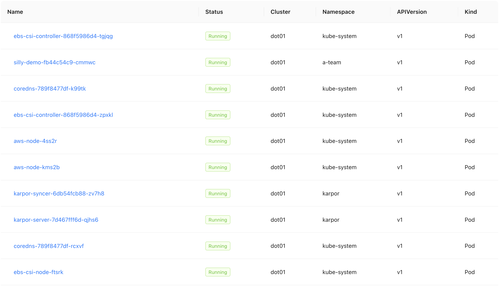

+++
title = 'Why Most Kubernetes Dashboards Are Failing You (and What Is The Future)'
date = 2025-03-10T16:00:00+00:00
draft = false
+++

Most **Kubernetes dashboards got it wrong**. Most did not understand the **limitations of Kubernetes API** and, as a result, act as glorified file explorers rather than tools that help us find what we're looking for, especially when dealing with large scale.

Today we are going to explore the **mistakes** Kubernetes dashboards are making and try to figure out how they might be able to get onto the right path, even though that might require some drastic changes in their design.

By the end of today's story you should see what we need to **navigate**, **search**, **debug**, and do whatever we might need to do in Kubernetes clusters. We'll feel like we are using Google Search rather than navigating through Kubernetes resources in a similar way we are traversing files and directories.

<!--more-->



## Typical Kubernetes Dashboard (feat. Headlamp)

Most Kubernetes dashboards are, more or less, the same. Most assume that they should be doing the same job as file explorers. They allow us list files and directories, navigate from one to another, and get information about any of them. Most Kubernetes dashboards act in, more or less, the same way.

Here's [Headlamp](https://headlamp.dev/). It's a Kubernetes Dashboard similar to most other Kubernetes dashboards.

*Before we proceed, I have two important notes. First, today's video is not about Headlamp. It's about something else and I'm using Headlamp only to demonstrate some of the issues Kubernetes dashboards are facing. Second, I might be negative towards dashboards and you might interpret that as me being negative towards Headlamp. I'm not. I think that Headlamp is one of the best, if not the best Kubernetes dashboard. I'm negative towards typical implementations of dashboards. It's a general negativity that is not aimed specifically towards Headlamp.*


If we open Headlamp, we are presented with the same functionality and information as any other Kubernetes dashboard. It starts at a cluster level with information like `CPU` and `memory` usage, number of `nodes`, and so on and so forth.

We can think of a cluster as a root directory of a file system.


If we select workloads, we can see all Kubernetes resources that, ultimately, manage containers. There are Pods, Deployments, Stateful Sets, and others. Think of them as directories nested inside each other.

We can see information about any of them.


We can also see which resources are managed by, in this case, the Deployment, just as we could see files inside a directory.

So, think of a dashboard as a file explorer. We can start at root, a cluster, and navigate through different types of resources just as we would be navigating through directories. Eventually, we will find what we're looking for and get information about that something.

So, Kubernetes dashboards are conceptually similar to file explorers. If you're old enough, you might remember Yahoo, which had the same approach. It tried to organize Internet into categories and subcategories and we would be navigating through it in a very similar way as we're navigating through a file system. That failed miserably, and the reason for that failure is obvious. You cannot organize something as massive as Internet into categories and subcategories. The only reasonable way to find something across whole Internet is to **search** for it. That's why today we have Google and most people do not even know that Yahoo existed. Google is a household name today while Yahoo abandoned most of what it was doing and is now limited to some obscure services.

You see, we can have one, or a few, or a few hundred clusters, and each of them can have dozens, or hundreds, or thousands or resources that are constanctly moving around. New ones are created, and existing ones are beign destroyed or mutating all the time. It's a lot.

Now, to be clear, it is sometimes useful to navigate through it all by choosing a cluster and then going through Namespaces and resources until we find what we're looking for. However, very often that's not what we really want. We often want to find what we're looking for by searching for it.

We should be able to ask a question like: "Give me all resources that belong to this application no matter in which cluster they are located", or "give me all the Pods that are not working, no matter where they are", or any other similar type of a query.

However, dashboards cannot do that, not necessarily because they don't want to, but, rather, because they **can not search**, mainly because they rely on Kubernetes API to give them the information.

Let me explain.

## How Kubernetes Dashboards Work?

Kubernetes dashboards are, first and foremost, a way to provide graphical representation of data provided by Kubernetes API. So, any advantages as well as disadvantages of the API are automatically advtantages and disadvantages of dashboards.

Here's how it works.


We have a Kubernetes cluster that is accessible through its API.

When it comes to getting intormation from it, we can ask it, in this case through a dashboard, to retrieve information of a specific resource. We can ask it to give us everything it knows about a any resource. To get that information, we need to ask for a specific kind of a resource in a specific namespace, and with a specific name. The problem is that we need to know what exactly are we looking for. Fortunately, we can also ask it to give us information about all the resources of a specific kind in a specific namespace, or even across the whole cluster. We can also filter resources based on labels.

The problem is that querying capabilities of Kubernetes API are very limited, even though it might not seem that way. We cannot search across all the resources. There is an alias *all* that is missleading since *kubectl get all* actually retrieves only specific resources which are often a fraction of the resource types we might have in a cluster. We cannot search by image, by status, by keywords (other than labels), and so on and so forth.

We cannot, for example, ask Kubernetes API to give us all the resources, no matter the type, that contain a keyword in the name. There are no expressions like those commonly used in, let's say, SQL databases.

The reason for those and many other limitations lies in Kubernetes' internal database.

Kubernetes API is, essentially, an interface that allows us to interact with [etcd](https://etcd.io), it's internal database. It is a key/value store that is not meant to be used as a database we can query. It's primary function, within Kubernetes is not to serve as a "traditional" database we can query but, rather, as a system of record. Its primary purpose is to be a reliable storage for the state of all resources managed by Kubernetes.


So, any question we send to Kubernetes API is being sent as a query to etcd and the result is returned back to us. Kubernetes API is, in a way, a frontend with etcd as a backend. If a query is not allowed by etcd, it is not allowed in Kubernetes API.

Now, part of those limitations are somehow overcome by making multiple requests to the API. If we would, for example, like to list all the resources in a Kubernetes cluster, we would first need to make a query to retrieve all the resource types. That would be one query. Now, let's say that there are hundred resource types in a cluster. To get them all, we would need to send additional hundred requests to the cluster. That would be hundred and one request only to list the resources managed by the cluster. From there on, if we would like to filter those resources, the interface we are using, a dashboard, would need to process those resources internally so that only those we are interested in are displayed. Now, if we would like to search for a specific keyword in those resources, it would need to make another trip to the API for each of the returned resources to get all the information about each of them and do some internal filtering to find out whether that keyword is indeed present somewhere inside the data that belongs to each of those resources. So, let's say that there are ten thousand resources in total, that would be another 10000 requests to the API, totalling, so far, 10101 requests on top of internal processing that dashboard would need to make.

Now, to make things even more complicated, let's say that we have 12 clusters. if that search would be performed across all those clusters, that would be 10101 requests multipled by 12, resulting in 121212 requests, only to get raw information that still needs to be processed by the dashboard.

Such operations would be very slow, at best. If we would perform them more frequently, they might even crash etcd instances in those clusters, and that is not something we would like.

That's why most dashboards are showing data as tree-like structures allowing us to traverse the cluster in pretty similar way we are navigating through files and directories on a computer. That's why most dashboards do not show us all the clusters as a single unified view but force us navigate through one cluster at a time. That's why dashboards rarely have an option to search for resources and even when they do have it the capabilities are very limited.

The root cause of those problems is that, in this scenario, we would be trying to use etcd, through the API, for something it is not designed to be. etcd's main purpose is to be a reliable system of record, not a searchable database. It intentionally limits querying capabilities.

If we would like to be able to perform "real" searches based on data in Kubernetes, we need to replace etcd with some other type of database like PostgreSQL, ElasticSeach, or anything else that has better query capabilities. However, that would be a bad idea as well.

To begin with, replacing etcd is not trivial and is likely to jeopardize one functionality for another. We would be putting reliability and speed in danger for the sake of search. In case of Kubernetes, having a reliable system of record is more important than being able to perform free-text search. On top of that, we would still not solve the problem of searching across multiple clusters since we would still need to make as many queries as there are clusters.

A much better solution is NOT to replace etcd but, instead, to add a database that synchronizes data from etcd instances from all the clusters into a central location.

If we do that, if we manage to have a central database where all the data from Kubernetes clusters is synchronized, our dashboard could stop asking Kubernetes APIs for information and, instead, perform queries against that database. If we do that, we would transform our Kubernetes dashboard from allowing us to navigate through clusters, namespaces, and resources to acting in a similar way as Google is acting for Internet. We would be able to search for anything using any criteria we deem important. We should be able to find almost anything almost instrantly.

If we do that right, we could actually have both. We could have a "traditional" dashboard that allows us to choose a cluster, select a namespace, see Deployments in it, find ReplicaSets it created, and drop into Pods managed by one of those ReplicaSets. That would be the mode where the dashboard is sending requests to Kubernetes API. Then we could combine that with a search that would allow us to find anything we want as long as we know what to search for. That search would not be limited to a single cluster, a single namespace, a single resource, or a set of labels, but find information no matter what it is and where it originates from.

As an additional bonus, if all our data in stored in a central database, we might be able to extend capabilities to AI. We should, at least in theory, be able to point an AI model to that database and start asking it questions.

Let's take a look at one such solution.

## Setup

```sh
git clone https://github.com/vfarcic/karpor-demo

cd karpor-demo
```

> Make sure that Docker is up-and-running. We'll use it to create KinD clusters.

> Watch [Nix for Everyone: Unleash Devbox for Simplified Development](https://youtu.be/WiFLtcBvGMU) if you are not familiar with Devbox. Alternatively, you can skip Devbox and install all the tools listed in `devbox.json` yourself.

```sh
devbox shell
```

> Watch [The Future of Shells with Nushell! Shell + Data + Programming Language](https://youtu.be/zoX_S6d-XU4) if you are not familiar with Nushell. Alternatively, you can inspect the `dot.nu` script and transform the instructions in it to Bash or ZShell if you prefer not to use that Nushell script.

```sh
chmod +x dot.nu

./dot.nu setup

source .env
```

## Multi-Cluster Kubernetes Dashboard (feat. Karpor)

Today we'll use a project called [Karpor](https://kusionstack.io/karpor/), which is a part of KusionStack. You might want to explore other projects from the stack. They are all very interesting. You'll have to do that on your own though, since Karpor is the only one that matters within the scope of today's subject.

Let's start by port-forwarding Karpor's service,...

```sh
kubectl --namespace karpor \
    port-forward service/karpor-server 7443:7443
```

...and open it in a browser.

> Open https://127.0.0.1:7443 in a browser


Karpor's home screen is, frankly, boring just as, in a way, Google Search home screen is boring. In both cases, the only prominent thing is the search field. We'll get to it later. Right now we should register our clusters.

> Click the `Cluster Management` link in the top menu.

> Click the `Register Cluster` button.

> Type `dot01` as the *Cluster Name*, upload `kubeconfig-dot02.yaml` from the repo, and click the `Verify and Submit` button.
> Repeat the process for `dot02` and `dot03` clusters.


> Select `dot01` cluster.

If we go inside one of the clusters, we can see the same boring info that we can see in any dashboard. There are statistics, like the number of nodes, CPU and memory utilization, the number of Pods, and so on and so forth.


We can also see the issues related to that cluster.


Topology is semi-special. Unlike other dashboards that might show us network traffic in a similar view, Karpor shows us how are resources related to each other. That might be something semi-complex to do in other solutions but, in case of Karpor, it is trivial because it does not get the information from Kubernetes directly but from its internal database. We'll get to that later. 



Finally, we can also see all the Pods running in that cluster.

All that is boring and, to be honest, if that would be the main feature of Karpor, I would not waste a single second on it. That's not the case though. Cluster management is the part of Karpor that exist in any other Kubernetes dashboard-like solution, so we'll just move on back to the home screen.

> Click the *Karpor* logo in the top-left corner to go back to the home screen.


Search is what makes Karpor "special" and we can see, from the tooltip in the search field, that it is based on SQL. That's awesome, not because SQL is the best query language but, rather, because it is something that almost everyone knows. There is hardly any software engineer that does not know at least basic SQL. Even if you find such a person, it takes no time to learn it.

So, what can we do with that search?

We can, for example, query for all resources with the `name` set to `silly-demo`.

> Type the SQL from the snippet that follows in the search field and submit it.

```sql
where name = 'silly-demo'
```


We can see the list of all the resources with the *name* set to *silly-demo*.

There are a couple of important notes here.

First of all, we got results from all three clusters. We can see that by `Cluster` values. If we had hundred clusters instead, we would get results from all those as well.

All in all, we got all the resources with the matching name, no matter which cluster or Namespace they belong to and no matter which resource Kind we have in the cluster. Even though today's demo has only "standard" resources, we would see custom resources in the output if we had any.

The second observation is that we got the result almost instantly. It was blazing fast. If it tried to get all resources no matter the type from a single cluster by querying the API directly, it would probably take more time given that it would need to send quite a few requests to accomplish the same result. If we take into the account the fact that we got results from multiple clusters, querying the API directly would take even more time.

We can see that we got `Services` and `Deployments`. We can see that ReplicaSets, Pods, and potentially other resources are missing. The explanation for that behavior is simple. When a Deployment creates a ReplicaSet, it generates a name that starts the same as the name of the Deployment and ends with some non-deterministic value. The same happens with Pods created by ReplicaSets. As a result, those are not, in this case, named *silly-demo* but *silly-demo* followed with some hash string. As a result, those were not returned since their names do not match what we asked for.

A potentially better way to get all the resources we want, even though auto-generated, could be to query by a label.

> Type the SQL from the snippet that follows in the search field and submit it.

```sh
where `labels.app.kubernetes.io/name` = 'silly-demo'
```


This time we got more resources. There are now ReplicaSets and Pods as well.

Now, searching by labels might not work for everyone since that would mean that we know which labels are used, so lets try to get the same result by searching by name again. This time, however, we will try to find all the resources with the name that contains the word *silly*. Since we are using a "standard" SQL, we can accomplish that through the *like* instruction by typing `where name like '%silly%'`.

> Type the SQL from the snippet that follows in the search field and submit it.

```sh
where name like '%silly%'
```

> Type the SQL from the snippet that follows in the search field and submit it.


We got the same result as before, but, this time, with an arguably easier syntax that, at the same time, does not force us to know the labels.

Next, let's say that we would like to sort the results by timestamp, from newest to oldest, still unrestricted by any type of the resource.

We can do that by adding `order by creationTimestamp` to the previous query.

> Type the SQL from the snippet that follows in the search field and submit it.

```sh
where name like '%silly%' order by creationTimestamp
```


Now we got, again, the same results but, this time, sorted. The best part of it is that we did not have to learn almost anything, but just type "standard" SQL queries. It's brilliant!

Let's make it more interesting by saying that we would like to find resources with the image *silly-demo* and tag *1.4.327*. Further on, let's say that we don't know what is the specific field that should contain that information and, to make it even more complicated, let's say that we do not even know the full image but only that it contains *silly-demo:1.4.327*.

We can do that by simply specifying in the `where` statement that it should `contain` `content` that has `silly-demo:1.4.327`. In other words, we're saying: "Find resources that contain that value somewhere. We have no idea what those resources are not where that value is nor what the full value is. Just find anything that contains that string."

> Type the SQL from the snippet that follows in the search field and submit it.

```sh
where contains(content, 'silly-demo:1.4.327')
```


We found two Deployments. Awesome!

Similarly, let's say that we would like to find all the resources that are somehow, without knowing how, are related to production. The only assumption we'll make is that they have the word *production* mantioned somewhere, be it a label, an environment variable, image tag, or anything else.

We can do that with a query similar to the previous one by simply instructing it to find resources that `contain` the word `production`.

> Type the SQL from the snippet that follows in the search field and submit it.

```sh
where contains(content, 'production')
```


There we go. We got all the resources of any type and from any of the clusters that contain the word *production*. Amazing!

We can also observe that two of the Pods have the status `ImagePullBackOff`. We stumbled upon an issue that we want to resolve. We can see that affects only Pods, that it is limited to the *production* Namespace, and that they are all related to *silly-demo* resources.

Let's narrow it down by typing another query that will get resources that contain the `name` `silly`, are in the `namespace` `production` from any of the clusters, and with the `kind` `Pod`.

> Type the SQL from the snippet that follows in the search field and submit it.

```sh
where name like '%silly%' and namespace = 'production' and kind = 'Pod'
```


We got two results. We found what we're looking for, so we might want to take a look at the details.

> Click on one of the Pods from the results.


Some of the things we see on the screen are pretty standard on all dashboards. What makes this different is mainly in how we got where we are, rather than what we are seeing.

We have the list of potential issues, and we could get that from other solutions as well. It's nothing new.

Topology is somewhat "special" since it shows all the resources directly or indirectly related to the Pod we're observing. We can see that it was created by a specific ReplicaSet which was created by a specific Deployment. We can also observe the Service related to it and the Node where its running. While all that might not seem special at first, that's actually something non-trivial to gather by other dashboard tools that would need to make multiple trips to the API to gather all the information and stich it all together. Still, that is not the main feature and certainly not something that hasn't been seen in other tools. How to get here is what makes it special. Search is the star of the show.

There's one more interesting feature we should explore.

> Click the `Insight` link from the top menu.

By default, there is only one insight available. It shows us all the Namespaces. Since the data is coming from a database and not a specific cluster, that is the list of all Namespaces across all the clusters. While that might be interesting, it's not very special by itself. We can make it "special" by adding our own insights.


Let's create one.

> Click the `+` tab in the *Insight* screen.

> Type `app` as  the *Name*, select `labels` as *Group By*, type `app.kubernetes.io/name` as the value next to it, and click the `Submit` button.

> Select the `app` tab.


We can see all the resources from all the clusters groupped by the label *name*. In other words, now we can see all the distinct apps.

That is yet another operation that would be very expensive if the dashboard would need to query all the clusters to find all the resources and then discard those that do not have that label and, finally, group them all. Since Karpor is not working with Kubernetes APIs directly but with data in a database, that operation was simple and fast.

Let's make another one, just for good taste.

> Click the `+` tab in the *Insight* screen.
> Type `team` as  the *Name*, select `labels` as *Group By*, type `team` as the value next to it, and click the `Submit` button.
> Select the `team` tab.


Now we can see all the teams using the cluster, assuming that their resources have the matching label.

> Select the `a-team` team.


Over there, we can see a similar page we saw before but, this time, only with resources that have the *team* label set to *a-team*. As always, data is coming from all the clusters.

Now comes the exciting part. AI!

As I already mentioned, it would be complicated, maybe even impossible, to introduce an AI model that uses data from all the clusters since such data would be difficult to extract from the API. Karpor should not have a problem with that since all the data is available in a database.

As such, we can go back to the home screen and use the search field to ask a question to one of the AI models. We won't explore that today, mainly because AI is not yet fully baked in. It's not yet working as expected but, hopefully, it will soon, and I'm really forward to it. Actually, it's more than that. I can't wait for it.

## How Should Dashboards Work?


As a recap, "traditional" Kubernetes dashboards fetch data from Kubernetes API. If we have multiple clusters, they are fetching data from all of them, but only when we request it. More often than not, dashboards operate on a single cluster. We can switch from one to another but we will be observing a single cluster at a time.

The approach we discussed today is different. There is a database which, in case of Karpor, is ElasticSearch, but it could be anything else. On top of that, there is a process in the control plane cluster, as is the case with Karpor, or one in each of the clusters. Those processes are reacting to Kubernetes events and synchronizing data into the database. As a result, when we request some information from the dashboard, it can forward that request to the database and send the output back to us. We get quite a few benefits from that. First of all, we can query data by almost any criteria we want without being limited to the capabilities of Kube API. Second, we are not limited to a single cluster since all the data is gathered in a single place (the database). Finally, all that opens the doors for some potentially very interesting integration with AI. Even though Karpor did not yet finish such integration, it should be able to instruct the model to fetch that same data gathered from all the clusters when trying to answer our questions. As such, I am much more positive about the potential AI integration than if we would hook a model into a "traditional" dashboard.

Here's the question though.

Does all that mean that you should replace your favorite Kubernetes dashboard with Karpor? The answer to that one is a huge no. Don't do it, at least not just yet. While "traditional" dashboards lack search and processing capabilities Karpor offers, they are good at everything else.

Now, if we modify the question to be "Should you look forward to using a similar solution in the future?", the answer is "I hope so."

Karpor is not the first tool to take this approach. There are others that realized that if we want to find out what's going on in a fleet of clusters, or even a single cluster, we need to sync data into a database and query it instead of querying etcd through Kube API. Karper, however, is missing the baseline features of a dashboard. Will it get it? I'm not sure.

Here's what I would really like to get. I would like maintainers of a dashboard like, for example, Headlamp to join forces with Karpor and integrate its capabilities. If we would have Headlamp, or any other similar dashboard, with search and filtering similar to, if not copied from, Karpor, we would get something great, especially since Headlamp can be extended through plugins. It's doable, I just need someone to do it and if that happens, we would get a dashboard better than any other.

## Destroy

> Stop port-forward by pressing `ctrl+c` in the terminal.

```sh
./dot.nu destroy $HYPERSCALER

exit
```

