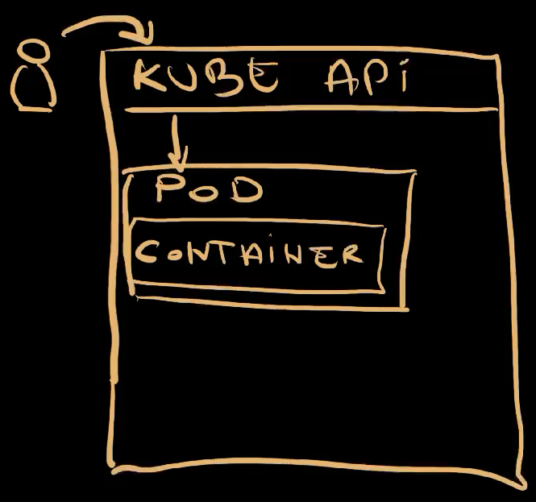
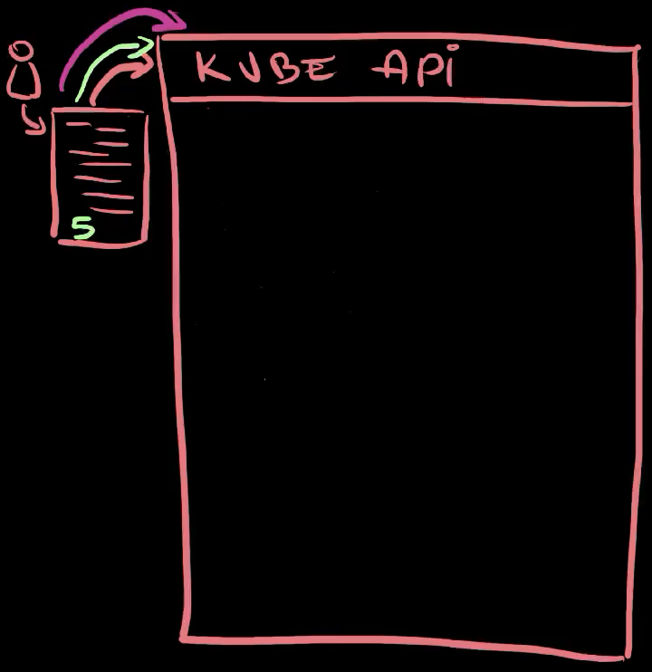
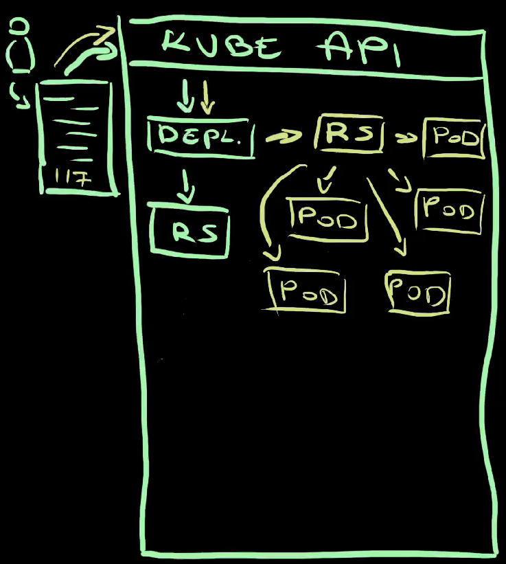
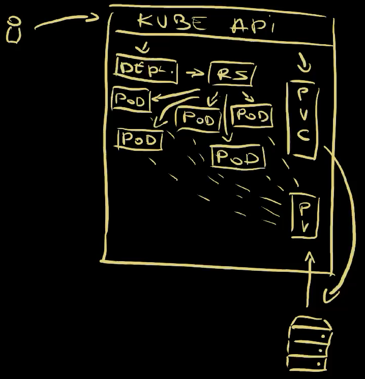
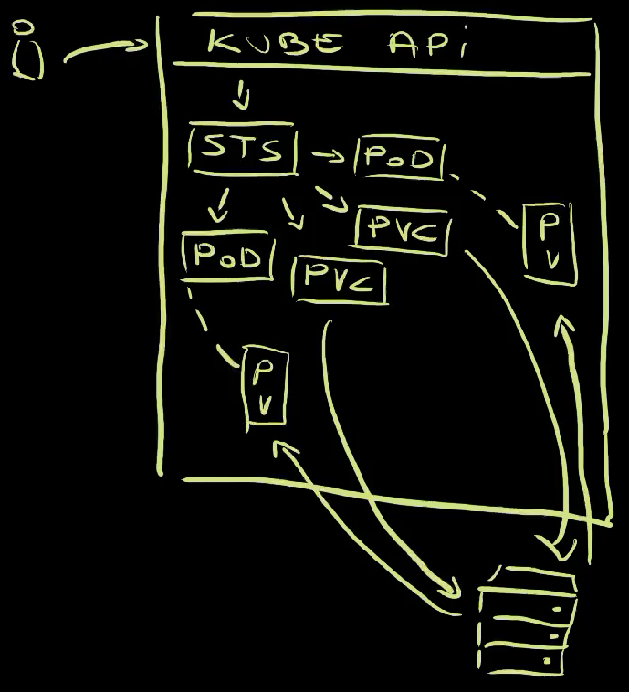
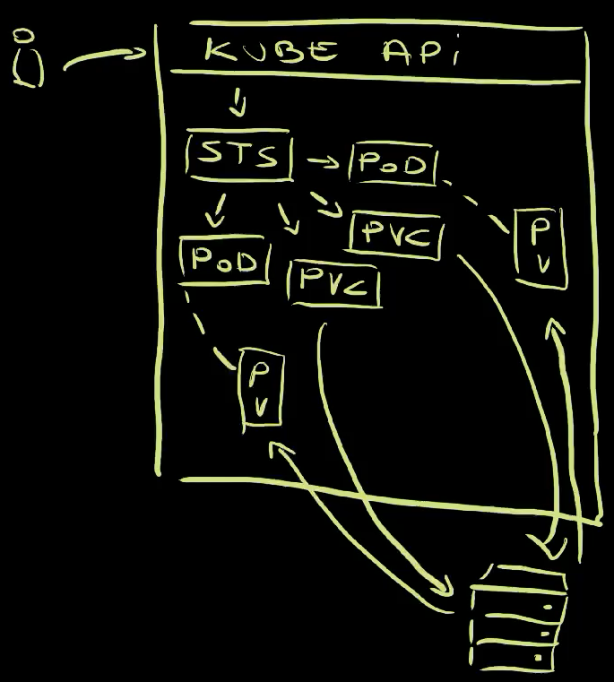
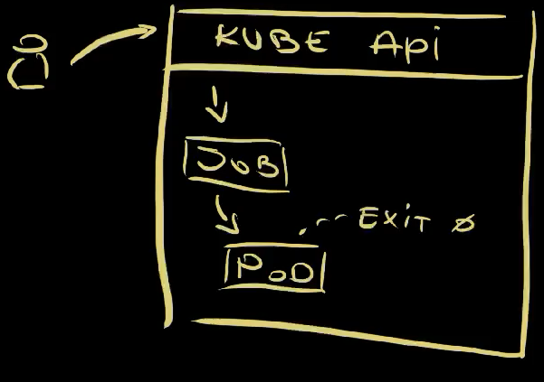

+++
title = 'Mastering Kubernetes: Dive into Workloads APIs'
date = 2024-04-15T16:00:00+00:00
draft = false
+++

You might be new to **Kubernetes** or you might have been working with it for a while. No matter your experience level, you might not be aware of all the **Kubernetes Workload APIs**. 
<!--more-->



There are **Pods** as lower level, **ReplicaSets** and **Jobs** in between, and **Deployments**, **StatefulSets**, **DaemonSets**, and **CronJobs** on top. To make things more complicated, those are workload APIs baked into Kubernetes cluster and, on top of those, we can have more, much more.

Today we'll explore all of those. We'll see what is the purpose of each, when each of them should or should not be used for, and quite a few things.

Buckle up! We're about to dive into all Kubernetes workload resource types.

## Setup

```sh
git clone https://github.com/vfarcic/kubernetes-demo

cd kubernetes-demo

git pull

git checkout workloads
```

*Make sure that Docker is up-and-running. We'll use it to create a KinD cluster.*

*Watch https://youtu.be/WiFLtcBvGMU if you are not familiar with Devbox. Alternatively, you can skip Devbox and install all the tools listed in `devbox.json` yourself.*

```sh
devbox shell

kind create cluster --config kind.yaml

kubectl create namespace a-team
```

## Containers in Kubernetes

**Containers** are the base of everything running in Kubernetes. Everything ends up either running in a container or be managed by something running in a container.

Actually... that's not really true. It does not have to be containers. It could be **WASM** or it could be VMs managed by **KubeVirt**, or many other ways to run processes. Nevertheless, if we're talking about "vanilla" Kubernetes, it's all about containers. We package processes into container images and we run them as containers.

However... you need to pay attention to this one. We cannot run containers directly. There is no option in Kubernetes to say "run this container". Containers are always wrapped into Pods, hence that is our starting point.

Let's take a look at what they are, how they work, and why you are unlikely to ever run them directly.

## Pods in Kubernetes

Pods are the base Kubernetes resources. Any type of a workload, at least among those baked in Kubernetes, ends up being a Pod.

So, **what is a Pod?**

A Pod is **a collection of one or more containers**. Most of a time, a Pod contains a single container with your or someone else's application. On top of that, there might be additional containers for various purposes. For example, a service mesh might attach a container that deals with networking. Those are called **side-car containers**.

Here's an example.

```sh
cat pod/base.yaml
```

The output is as follows.

```yaml
apiVersion: v1
kind: Pod
metadata:
  name: silly-demo
  labels:
    app.kubernetes.io/name: silly-demo
spec:
  containers:
    - image: ghcr.io/vfarcic/silly-demo:1.4.115
      name: silly-demo
      ports:
        - containerPort: 8080    
      readinessProbe:
        httpGet:
          path: /
          port: 8080
      resources:
        limits:
          cpu: 250m
          memory: 256Mi
        requests:
          cpu: 125m
          memory: 128Mi
```

That's a `Pod` manifest containing a list of `containers`. In this case there is only one based on the `silly-demo` image. It has a `name`, a list of `ports`, a `readinessProbe` that is used by Kubernetes to deduce whether it is healty, and resource `limits` and `requests` that are used to deduce how much `memory` and `cpu` we expect it to use.

If we apply that manifest,...

```sh
kubectl --namespace a-team apply --filename pod/base.yaml
```

...and retrieve all the Pods in that Namespace,...

```sh
kubectl --namespace a-team get pods
```

The output is as follows.

```
NAME       READY STATUS  RESTARTS AGE
silly-demo 1/1   Running 0        7s
```

...we can see that it is `running`.



We sent a request to Kubernetes API  to apply a manifest containing a Pod with a single container. As a result, Kubernetes started running that container  wrapped inside a Pod . That's the container with our application.

Here's a thing though.

You will probably **never run Pods directly**. That would be foolish since Pods alone are not fault tollerant, are complicated to replace with new releases safely, and so on and so forth. Pods are building blocks that should be managed by other types of workloads.

Here's an example. Let's say that something happened to a Pod. Let's say that it crashed, that it dissapeared. What would happen in that case?

We can simulate that by deleting the Pod.

```sh
kubectl --namespace a-team delete pod silly-demo
```

You can probably guess what happens when we delete something.

```sh
kubectl --namespace a-team get pods
```

The output is as follows.

```
No resources found in a-team namespace.
```

It dissapeared. It's gone, and it's not coming back.

Now, if that was our intention, that should be the expected outcome. But what if that's not what we wanted. What if our goal is to have that Pod running forever and ever, or until we choose to replace with with a newer release? What if we would like to have some kind of a "contract" that says "run this Pod no matter what happens."

In that case, we would need something else. We would need a ReplicaSet.

## ReplicaSets in Kubernetes

A **ReplicaSet** is a Kubernetes resource that ensures there is always a **stable set of running pods** for a specific workload. It is a "special" type of resource that ensures that the contract between you and Kubernetes is maintained. It is a resource that allows us to say: "**I want this number of Pods with those specifications**. Make sure that is fullfilled no matter what happens. The world might end, but those Pods should still be running."

Here's an example.

```sh
cat replicaset/base.yaml
```

The output is as follows.

```yaml
apiVersion: apps/v1
kind: ReplicaSet
metadata:
  name: silly-demo
  labels:
    app.kubernetes.io/name: silly-demo
spec:
  replicas: 3
  selector:
    matchLabels:
      app.kubernetes.io/name: silly-demo
  template:
    metadata:
      labels:
        app.kubernetes.io/name: silly-demo
    spec:
      containers:
        - image: ghcr.io/vfarcic/silly-demo:1.4.115
          name: silly-demo
          ports:
            - containerPort: 8080    
          readinessProbe:
            httpGet:
              path: /
              port: 8080
          resources:
            limits:
              cpu: 250m
              memory: 256Mi
            requests:
              cpu: 125m
              memory: 128Mi
```

This is a `ReplicaSet` very similar to the definition of the Pod we explored earlier. The `containers` section is exactly the same. The difference, however, is that the `spec` is now part of a `template`. We are telling ReplicaSet how to create Pods rather than what the Pods are. ReplicaSet is a controller that ensures that Pods we want are the Pods that will run, forever and ever.

A second difference is that, this time, we have an option to specify the number of `replicas`. So, we are not only saying "This is the template to create Pods" but also "This is the number of Pods I want. No more, no less."

Let's apply that ReplicaSet.

```sh
kubectl --namespace a-team apply --filename replicaset/base.yaml
```

The easiest way to see what's happened is through the `kubectl tree` plugin, so let's use it.

```sh
kubectl tree --namespace a-team replicaset silly-demo
```

The output is as follows.

```
NAMESPACE NAME                   READY REASON AGE
a-team    ReplicaSet/silly-demo  -            23s
a-team    ├─Pod/silly-demo-7z7zt True         23s
a-team    ├─Pod/silly-demo-hj4k2 True         23s
a-team    └─Pod/silly-demo-npgb6 True         23s
```

kubectl tree plugin allows us to explore ownership relationships between Kubernetes resource. In this case, we can see that the `ReplicaSet` created three `Pods` and it now owns them. It's responsible for them. It's making sure that the "contract" is maintained meaning that it is ensuring that three Pods based on the template we specified are always up-and-running.



All in all, we sent a request to the Kube API to apply a ReplicaSet . Since that ReplicaSet did not exist, Kubernetes created it . The ReplicaSet controller detected a discrepancy between the desired and the actual state. We said that we want to have three Pods , and there were none owner by that ReplicaSet. Hence, the controller created three Pods  based on the template we defined.

We can confirm that is indeed the case by deleting one of those Pods,

*Replace `[...]` with the name of one of the Pods (e.g., `silly-demo-7z7zt`)*

```sh
kubectl --namespace a-team delete pod [...]
```

...and retrieving the ReplicaSet and the Pods it owns with `kubectl tree`.

```sh
kubectl tree --namespace a-team replicaset silly-demo
```

The can see that there are three Pods, one of them being created a moment ago.

```
NAMESPACE NAME                   READY REASON AGE 
a-team    ReplicaSet/silly-demo  -            103s
a-team    ├─Pod/silly-demo-hj4k2 True         103s
a-team    ├─Pod/silly-demo-jw6p5 True         13s 
a-team    └─Pod/silly-demo-npgb6 True         103s
```

That's the fulfilment of the "contract" in action. ReplicaSet manages Pods by continuously watching their state and reacting if it differ from what was specified. As a result, it created a new Pod to replace the one we deleted.

So, when we removed the Pods , the ReplicaSet detected the discrepancy between what we want and what something is, and created three new Pods .

Similarly, we can use it to scale up and down.

Let's take a look at a diff between the manifest we applied and a slightly modified version.

```sh
diff replicaset/base.yaml replicaset/replicas.yaml
```

The output is as follows.

```
8c8
<   replicas: 3
---
>   replicas: 5
```

We can see that the only difference is that the new manifest has `5` instead of `3` replicas.

You can probably guess what will happen if we apply it, but let's do it anyways.

```sh
kubectl --namespace a-team apply \
    --filename replicaset/replicas.yaml

kubectl tree --namespace a-team replicaset silly-demo
```

The output is as follows.

```
NAMESPACE NAME                   READY REASON AGE  
a-team    ReplicaSet/silly-demo  -            2m32s
a-team    ├─Pod/silly-demo-gx742 True         5s   
a-team    ├─Pod/silly-demo-hj4k2 True         2m32s
a-team    ├─Pod/silly-demo-jw6p5 True         62s  
a-team    ├─Pod/silly-demo-npgb6 True         2m32s
a-team    └─Pod/silly-demo-wj52t True         5s   
```

This time, we can see that there are five Pods managed by the `ReplicaSet`.

We changed the number of replicas in the manifest  and sent it to Kube API  which resulted in the updated ReplicaSet running in the cluster . That ReplicaSet noticed that the desired state of five replicas is not the same as the actual state of three, and created two new Pods .

Now, there is one important note here.

ReplicaSet ensures that the desired state specified in the spec is always the same as the actual state, except for the template. Template is used to create new Pods, and nothing else. ReplicaSet does not ensure that the state of the Pods created with the template is always correct.

We can demonstrate that with a modified version of the manifest, so let's take a look at the diff.

```sh
diff replicaset/replicas.yaml replicaset/image.yaml
```

The output is as follows.

```
18c18
<         - image: ghcr.io/vfarcic/silly-demo:1.4.115
---
>         - image: ghcr.io/vfarcic/silly-demo:1.4.116
```

We can see that the tag of the image changed from `115` to `116`.

Let's see what happens if we apply that manifest,...

```sh
kubectl --namespace a-team apply --filename replicaset/image.yaml
```

...and retrieve the dependency tree of the ReplicaSet.

```sh
kubectl tree --namespace a-team replicaset silly-demo
```

The output is as follows.

```
NAMESPACE NAME                   READY REASON AGE  
a-team    ReplicaSet/silly-demo  -            3m58s
a-team    ├─Pod/silly-demo-gx742 True         91s  
a-team    ├─Pod/silly-demo-hj4k2 True         3m58s
a-team    ├─Pod/silly-demo-jw6p5 True         2m28s
a-team    ├─Pod/silly-demo-npgb6 True         3m58s
a-team    └─Pod/silly-demo-wj52t True         91s  
```

Judging by the `AGE`, we can see that no new Pods were created. The ReplicaSet did nothing because we did not modify the specification itself but the template used to create Pods.

We can confirm that even further by retrieving the YAML specification of the Pods running in the cluster.

```sh
kubectl --namespace a-team get pods --output yaml | yq .
```

The output is as follows (truncated for brevity).

```yaml
...
  - apiVersion: v1
    kind: Pod
    ...
    spec:
      containers:
        - image: ghcr.io/vfarcic/silly-demo:1.4.115
          ...
```

We can see that the image is still `115`. The changes we made to the template were not applied since, as I already mentioned, template is not used to manage the state of the Pods but only to create new Pods.

Now, try to guess what will happen if we delete all the Pods managed by that ReplicaSet,...

```sh
kubectl --namespace a-team delete pods \
    --selector app.kubernetes.io/name=silly-demo
```

...and retrieve all the dependencies of the ReplicaSet.

```sh
kubectl tree --namespace a-team replicaset silly-demo
```

The output is as follows.

```
NAMESPACE NAME                   READY REASON AGE
a-team    ReplicaSet/silly-demo  -            7m41s
a-team    ├─Pod/silly-demo-7fhpn True         39s
a-team    ├─Pod/silly-demo-hcrkt True         39s
a-team    ├─Pod/silly-demo-q2ngj True         39s
a-team    ├─Pod/silly-demo-stlvn True         39s
a-team    └─Pod/silly-demo-zxwxj True         39s
```

We can see that new Pods were created. That was to be expected since, as you know, we made a contract that the number of replicas should always be five. We already saw that and the reason for deleting the Pods is not to demonstrate that ReplicaSet always maintains the spec, but what happens with changes to the template.

Let's retrieve YAML spec of the Pods in the cluster one more time.

```sh
kubectl --namespace a-team get pods --output yaml | yq .
```

```yaml
...
  - apiVersion: v1
    kind: Pod
    ...
    spec:
      containers:
        - image: ghcr.io/vfarcic/silly-demo:1.4.116
          ...
```

We can see that, this time, the version is indeed set to the new one, to `116`.

The ReplicaSet detected that the number of running Pods differs from the number of specified Pods, and created those that were missing. It used the template to do that.

There's a thing though. Just as you will probably never run Pods directly, you will probably not be creating ReplicaSets either. We already saw that ReplicaSets are limited when we changed the version of the image in the template. We had to delete the Pods for that change to be applied. That's, obviously, not ideal. We should have used Deployments instead, and we will, but only after we delete the ReplicaSet we created.

```sh
kubectl --namespace a-team delete \
    --filename replicaset/image.yaml
```

Here's another lesson. When we delete a Kubernetes resource, the controller behind it makes sure that all the resources that might have been managed by it are removed as well. Since the ReplicaSet was managing Pods, they should be deleted as well.

Let's double check that.

```sh
kubectl --namespace a-team get all
```

The output is as follows.

```
No resources found in a-team namespace.
```

It's all gone. There is nothing. There is no ReplicaSet and there are no Pods.

We deleted the ReplicaSet  which, before dissapearing completely, made sure that the dependant resources were deleted as well. In this case, those dependent resources were the Pods it created and managed . Only after the ReplicaSet controller deleted all the Pods it owned, it removed itself from the system .

With everything gone, we can take a look at Deployments.

## Deployments in Kubernetes

Deployments are almost the same as ReplicaSets, at least when defining them is concerned.

Let's take a diff between the two I prepared.

```sh
diff replicaset/image.yaml deployment/base.yaml
```

The output is as follows.

```
2c2
< kind: ReplicaSet
---
> kind: Deployment
8a9,13
>   minReadySeconds: 10
>   strategy:
>     rollingUpdate:
>       maxUnavailable: 1
>       maxSurge: 1
```

We can see that the `kind` changed. That could have been the only change. I also added `minReadySeconds` and `strategy` entries, not necessarily because we needed those but, rather, because those will slow down some processes we'll explore later so that we can observe them easily.

Anyway... Let's apply that Deployment,...

```sh
kubectl --namespace a-team apply --filename deployment/base.yaml
```

...and take a look at the tree.

```sh
kubectl tree --namespace a-team deployment silly-demo
```

The output is as follows.

```
NAMESPACE NAME                               READY REASON AGE
a-team    Deployment/silly-demo              -            10s
a-team    └─ReplicaSet/silly-demo-5f76b8d84  -            10s
a-team      ├─Pod/silly-demo-5f76b8d84-c5lvb True         10s
a-team      ├─Pod/silly-demo-5f76b8d84-c9vkt True         10s
a-team      ├─Pod/silly-demo-5f76b8d84-j9wgh True         10s
a-team      ├─Pod/silly-demo-5f76b8d84-rspnv True         10s
a-team      └─Pod/silly-demo-5f76b8d84-vchgz True         10s
```

On the first look, creating that `Deployment` seems like a waste. The end result are the same five `Pods` we would get if we created the `ReplicaSet` directly.



We sent a request to the Kube API to apply a manifest of a Deployment , a Deployment was created , and its controller created a ReplicaSet . The controller of the ReplicaSet saw that Pods are missing, so it created them .

Now, let's take a look at one of the things that make Deployments special. As you saw before, updating a template of a ReplicaSet does not affect existing Pods so changing the image tag did not produce the effect we wanted. Let's see what will happen if we do the same with the Deployment.

Here's a diff of the changes I made to the Deployment manifest.

```sh
diff deployment/base.yaml deployment/image.yaml
```

The output is as follows.

```
23c23
<         - image: ghcr.io/vfarcic/silly-demo:1.4.116
---
>         - image: ghcr.io/vfarcic/silly-demo:1.4.117
```

The only modification is in the `image` value which now contains tag `117`.

A few things will happen if we update that Deployment, so I'll execute `kubectl apply` followed with `kubectl tree` to output right away the ownership tree. Since I want us to see how it progresses, we'll use `viddy` to output the tree every second. If you're not familiar with `viddy`, it is an alternative to `watch`.

Anyways... Here it goes...

```sh
kubectl --namespace a-team apply \
    --filename deployment/image.yaml \
    && viddy kubectl tree --namespace a-team \
    deployment silly-demo
```

The output is as follows.

```
...
NAMESPACE NAME                                READY REASON AGE
a-team    Deployment/silly-demo               -            73s
a-team    ├─ReplicaSet/silly-demo-5f76b8d84   -            73s
a-team    │ ├─Pod/silly-demo-5f76b8d84-c5lvb  True         73s
a-team    │ ├─Pod/silly-demo-5f76b8d84-c9vkt  True         73s
a-team    │ ├─Pod/silly-demo-5f76b8d84-j9wgh  True         73s
a-team    │ └─Pod/silly-demo-5f76b8d84-rspnv  True         73s
a-team    └─ReplicaSet/silly-demo-7879f7dfd7  -            9s
a-team      ├─Pod/silly-demo-7879f7dfd7-98758 True         9s
a-team      └─Pod/silly-demo-7879f7dfd7-md865 True         9s
```

Deployment created a second ReplicaSet which, initially, was set to have a single replica of a Pod that uses the new image tag. From there on, it started performing rolling updates. It started reducing the number of replicas in the old ReplicaSet and increasing the number of replicas in the new.

The output is as follows (cont.).

```
NAMESPACE NAME                                READY REASON AGE
a-team    Deployment/silly-demo               -            2m3s
a-team    ├─ReplicaSet/silly-demo-5f76b8d84   -            2m3s
a-team    └─ReplicaSet/silly-demo-7879f7dfd7  -            59s
a-team      ├─Pod/silly-demo-7879f7dfd7-98758 True         59s
a-team      ├─Pod/silly-demo-7879f7dfd7-9jqgv True         45s
a-team      ├─Pod/silly-demo-7879f7dfd7-dwvz9 True         31s
a-team      ├─Pod/silly-demo-7879f7dfd7-f8lfx True         45s
a-team      └─Pod/silly-demo-7879f7dfd7-md865 True         59s
```

At the end of the process, the old ReplicaSet was scaled to zero replicas, and the new one, the one with the new image tag, was scaled to five replicas. That was an example of an effeortless rolling updates and is, arguably, the main reason why we use Deployments.

*Stop watching by pressing `ctrl+c`.*

Here's what happened.

We modified the manifest of the Deployment to use image tag `117`  and applied it to the Kube API . That resulted in updated Deployment  which, in turn, realized that the tag changed and created a second ReplicaSet set to have a single replica . The new ReplicaSet created a single Pod . From there on, Deployment started updating both ReplicaSets. It was reducing the number of replicas in the old one and increasing the number of replicas in the new. As a result, the old ReplicaSet started removing Pods while the new one was creating them . Eventually, all Pods ended up being managed by the new ReplicaSet while the old one ended up managing none.

The new version of the application was released safely and without downtime. Huray!

There's one more thing related to Deployments we need to explore. We need to talk about volumes since they are one of the main reasons why you might choose NOT to use Deployments.

## Deployment Volumes in Kubernetes

So far, we established that we should neither use Pods nor ReplicaSets. They are important building blocks and understanding them is important, but we can safely focus on Deployments which will create and manage those for us.

But, depending on the type of the application we have, Deployments might or might not be a good choice. The main reason why we might use them or discard them lies in how they manage volumes which are, most of the time, external storage.

Let's take a look at yet another example.

```sh
cat deployment/volume.yaml
```

The output is as follows.

```yaml
---
apiVersion: v1
kind: PersistentVolumeClaim
metadata:
  name: silly-claim
spec:
  accessModes:
    - ReadWriteOnce
  resources:
    requests:
      storage: 1Gi
---
apiVersion: apps/v1
kind: Deployment
metadata:
  name: silly-demo
  labels:
    app.kubernetes.io/name: silly-demo
spec:
  replicas: 5
  minReadySeconds: 10
  strategy:
    rollingUpdate:
      maxUnavailable: 1
      maxSurge: 1
  selector:
    matchLabels:
      app.kubernetes.io/name: silly-demo
  template:
    metadata:
      labels:
        app.kubernetes.io/name: silly-demo
    spec:
      containers:
        - image: ghcr.io/vfarcic/silly-demo:1.4.117
          name: silly-demo
          ports:
            - containerPort: 8080    
          readinessProbe:
            httpGet:
              path: /
              port: 8080
          resources:
            limits:
              cpu: 250m
              memory: 256Mi
            requests:
              cpu: 125m
              memory: 128Mi
          volumeMounts:
          - mountPath: /cache
            name: silly-cache
      volumes:
        - name: silly-cache
          persistentVolumeClaim:
            claimName: silly-claim
```

This manifest defines two resources.

The first one is a `PersistentVolumeClaim`. I'll explore volumes in one of the upcoming videos. For now, what matters, is that `PersistentVolumeClaim` is a way for us to claim a volume, to request storage that can be attacted to containers in a Pod.

Further down, we have a modified version of the `Deployment` we used earlier.

At the very bottom of it is the list of `volumes` we'd like to have. There's only one called `silly-cache` which references the `persistentVolumeClaim` named `silly-claim`.

Inside the `containers` section we are mounting the `silly-cache` volume into the `/cache` directory inside the container.

As a result, all `5` replicas of our application should have external storage mounted.

Here's a question for you. How many volumes do you think will be created for those five replicas?

Do not answer that question aloud. It's not a good idea to talk to your monitor. Keep the number to yourself while we take a look at the result.

```sh
kubectl --namespace a-team apply \
    --filename deployment/volume.yaml
```

The output is as follows.

```
persistentvolumeclaim/silly-claim created
deployment.apps/silly-demo configured
```

Let's wait for a few moments until rolling updates are finished.... and take a look at the `pods` and `persistentvolumes` that were created.

```sh
kubectl --namespace a-team get pods,persistentvolumes
```

The output is as follows.

```
NAME                            READY STATUS  RESTARTS AGE
pod/silly-demo-77fb46fcfc-5bqw5 1/1   Running 0        27s
pod/silly-demo-77fb46fcfc-5lgdf 1/1   Running 0        27s
pod/silly-demo-77fb46fcfc-cdtrl 1/1   Running 0        11s
pod/silly-demo-77fb46fcfc-hpr24 1/1   Running 0        11s
pod/silly-demo-7879f7dfd7-98758 1/1   Running 0        1s

NAME                                                      CAPACITY ACCESS MODES RECLAIM POLICY STATUS CLAIM              STORAGECLASS VOLUMEATTRIBUTESCLASS REASON AGE
persistentvolume/pvc-903d6f48-bb49-4c77-995f-b4ddd773868f 1Gi      RWO          Delete         Bound  a-team/silly-claim standard     <unset>                      23s
```

As expected, there are five Pods. If you see more, you were inpatient and did not wait until rolling updates finished.

The number of Pods does not matter right now. What does matter is that there is only one `persistentvolume`. All the replicas of the application, the Pods, got the same volume attached. They are all sharing the same storage.



So, we sent a request to Kube API to apply a PersistentVolumeClaim and a Deployment  so those were created or updated inside the cluster . The Deployment itself created a ReplicaSet  which created five Pods . Since the Pods themselves ware instructed, through the template in the Deployment, to use the claim to request a volume, a PersistentVolume was created  and attached to all the Pods .

Now, depending on the type of the application we're using, that might be just what we want, or unacceptable. As a rule of thumb, stateless applications should be managed through Deployments. On the other hand, stateful applications tend to need separate storage for each replicas as a way to avoid potential issues when writing files to disk. Hence, we need to look for a different way to run stateful apps.

We'll do that right after we destroy the deployment and the volume we just created.

```sh
kubectl --namespace a-team delete \
    --filename deployment/volume.yaml
```

## StatefulSets in Kubernetes

StatefulSets are similar to Deployments, at least in the way we define them.

Here's an example.

```sh
cat statefulset/base.yaml
```

The output is as follows.

```yaml
---
apiVersion: apps/v1
kind: StatefulSet
metadata:
  name: silly-demo
  labels:
    app.kubernetes.io/name: silly-demo
spec:
  replicas: 2
  minReadySeconds: 10
  updateStrategy:
    rollingUpdate:
      maxUnavailable: 1
  selector:
    matchLabels:
      app.kubernetes.io/name: silly-demo
  template:
    metadata:
      labels:
        app.kubernetes.io/name: silly-demo
    spec:
      containers:
        - image: ghcr.io/vfarcic/silly-demo:1.4.117
          name: silly-demo
          ports:
            - containerPort: 8080    
          readinessProbe:
            httpGet:
              path: /
              port: 8080
          resources:
            limits:
              cpu: 250m
              memory: 256Mi
            requests:
              cpu: 125m
              memory: 128Mi
          volumeMounts:
          - mountPath: /cache
            name: silly-claim
  volumeClaimTemplates:
    - apiVersion: v1
      kind: PersistentVolumeClaim
      metadata:
        name: silly-claim
      spec:
        accessModes:
          - ReadWriteOnce
        resources:
          requests:
            storage: 1Gi
```

On the first look, this is almost the same as the Deployment we used earlier, with three notable differences.

First of all, there is no need to define a PersistentVolumeClaim. We'll see why is that so.

Next is the obvious one with `kind` being set to `StatefulSet`.

Finally, the most important difference is in the way StatefulSets deal with volumes. While Deployments specify which volume claims to use, StatefulSets define `volumeClaimTemplates`. That's similar to how ReplicaSets contain Pod templates that allow them to create Pods they need. Similarly, StatefulSets have `volumeClaimTemplates` that create volume claims for each replica. In this case, we have a single claim template that is essentially the same as the `PersistentVolumeClaim` we had as a separate resource in the manifest with the Deployment.

What matters for now, is that StatefulSets know how to create PersistentVolumeClaims and that enables them to treat volumes in a very different way from Deployments.

Let's see it in action by applying the StatefulSet,...

```sh
kubectl --namespace a-team apply --filename statefulset/base.yaml
```

...and watching the `tree`.

```sh
viddy kubectl tree --namespace a-team statefulset silly-demo
```

Before we get back to volumes, there is one important thing we can observe.

The names of the Pods are, this time, predictable. We specified that we want two replicas of `silly-demo`. Unlike with Deployments the names are predictable and the order how Pods are created and destroyed are predictable as well.

The output is as follows.

```
NAMESPACE NAME                                       READY REASON AGE            
a-team    StatefulSet/silly-demo                     -            9s            
a-team    ├─ControllerRevision/silly-demo-6848df9f6f -            9s            
a-team    └─Pod/silly-demo-0                         True         9s  
```

Since we requested two replicas, StatefulSet created the frist one with the name `silly-demo-0`,...

The output is as follows (cont.).

```
NAMESPACE NAME                                       READY REASON AGE            
a-team    StatefulSet/silly-demo                     -            64s            
a-team    ├─ControllerRevision/silly-demo-6848df9f6f -            64s            
a-team    ├─Pod/silly-demo-0                         True         64s            
a-team    └─Pod/silly-demo-1                         True         44s
```

...and then the second one called `silly-demo-1`.

*Stop watching by pressing `ctrl+c`.*

So, the names are predictable and the order Pods are created and, as you will see soon, destroyed is predictable as well. That's important when working with stateful apps like, for example, databases.

Another note is that, unlike Deployments, StatefulSets do not create and manage ReplicaSets. Instead, StatefulSets manage Pods directly.

Let's get back Pods and PersistentVolumes.

```sh
kubectl --namespace a-team get pods,persistentvolumes
```

The output is as follows.

```
NAME               READY   STATUS    RESTARTS   AGE
pod/silly-demo-0   1/1     Running   0          88s
pod/silly-demo-1   1/1     Running   0          68s

NAME                                                      CAPACITY ACCESS MODES RECLAIM POLICY STATUS CLAIM                           STORAGECLASS VOLUMEATTRIBUTESCLASS REASON AGE
persistentvolume/pvc-254a27c2-2c82-44bc-afb2-b95e93b3c2d5 1Gi      RWO          Delete         Bound  a-team/silly-claim-silly-demo-0 standard     <unset>                      85s
persistentvolume/pvc-7b8eccc9-ad50-4387-b3d8-4f6664e86bc6 1Gi      RWO          Delete         Bound  a-team/silly-claim-silly-demo-1 standard     <unset>                      65s
```

This is the important different. This time, containers in each `pod` got a separate `persistentvolume`, a separate storage attached.

Here's what we did and what happened.



We sent a request to Kube API to apply a StatefulSet . Since that StatefulSet did not exist in the cluster, a new one was created . Since we specified that it should contain two replicas, two Pods were created by the StatefulSet controller . In parallel, the StatefulSet created two PersistentVolumeClaims , which claimed two volumes  and atteched one to each of the Pods .

Let's see what happens if, for example, we increate the number of replicas.

Here's the diff between the old and the new manifest.

```sh
diff statefulset/base.yaml statefulset/replicas.yaml
```

The output is as follows.

```
9c9
<   replicas: 2
---
>   replicas: 5
```

The only change is that the number of replicas jumped from `2` to `5`.

Let's apply that and watch the changes of the `tree`.

```sh
kubectl --namespace a-team apply \
    --filename statefulset/replicas.yaml \
    && viddy kubectl tree --namespace a-team \
    statefulset silly-demo
```

The output is as follows.

```
NAMESPACE NAME                                       READY REASON AGE
a-team    StatefulSet/silly-demo                     -            3m25s
a-team    ├─ControllerRevision/silly-demo-6848df9f6f -            3m25s
a-team    ├─Pod/silly-demo-0                         True         3m25s
a-team    ├─Pod/silly-demo-1                         True         3m5s
a-team    └─Pod/silly-demo-2                         -            3s
```

StatefulSet continues working in an ordered and predictable manner. It started by creating the third replica (`silly-demo-2`) since two were already there. Then it created the fourth (`silly-demo-3`),...

The output is as follows (cont.).

```
NAMESPACE NAME                                       READY REASON AGE
a-team    StatefulSet/silly-demo                     -            4m5s
a-team    ├─ControllerRevision/silly-demo-6848df9f6f -            4m5s
a-team    ├─Pod/silly-demo-0                         True         4m5s
a-team    ├─Pod/silly-demo-1                         True         3m45s
a-team    ├─Pod/silly-demo-2                         True         43s
a-team    ├─Pod/silly-demo-3                         True         23s
a-team    └─Pod/silly-demo-4                         -            3s
```

...and the fifth (`silly-demo-4`).

As you can probably guess, even though we cannot see that on the screen, it also created three new PersistentVolumeClaims which resulted in three new PersistentVolumes, one for each new Pod.

*Stop watching by pressing `ctrl+c`.*

Finally, just as creation of Pods is predictable by always starting from the zero indexed Pod, deletion is predicatable as well. Depending on whether we reduce the number of replicas or delete the whole StatefulSet and all the Pods it manages, deletion always starts from the one with the highest index and continues down.

Let's delete the StatefulSet.

```sh
kubectl --namespace a-team delete \
    --filename statefulset/replicas.yaml
```

I'll leave it to you to observe how Pods get deleted. Once you're done, we'll explore a completely different, yet somehow the same type of Kubernetes workloads.

## DaemonSets in Kubernetes

The next Kubernetes workload type is DaemonSet. I already prepared a manifest. Instead taking a look at it directly, we'll explore the difference compared with the one that contains the Deployment.

```sh
diff deployment/base.yaml daemonset/base.yaml
```

The output is as follows.

```
2c2
< kind: Deployment
---
> kind: DaemonSet
8,13d7
<   replicas: 5
<   minReadySeconds: 10
<   strategy:
<     rollingUpdate:
<       maxUnavailable: 1
<       maxSurge: 1
```

There is the obvious change in the `kind` that is now set to `DaemonSet`, but also in some fields missing. It would not make sense to specify `replicas`, `strategy` and quite a few other things that might be useful for Deployments or StatefulSets. "Why?" you might ask. Well... Let me show it in action before I answer that question.

Let's apply the manifest,...

```sh
kubectl --namespace a-team apply --filename daemonset/base.yaml
```

...and output the ownership tree.

```sh
kubectl tree --namespace a-team daemonset silly-demo
```

The output is as follows.

```
NAMESPACE NAME                                      READY REASON AGE
a-team    DaemonSet/silly-demo                      -            4s 
a-team    ├─ControllerRevision/silly-demo-5f76b8d84 -            4s 
a-team    ├─Pod/silly-demo-6w5fb                    True         4s 
a-team    ├─Pod/silly-demo-mhpcj                    True         4s 
a-team    └─Pod/silly-demo-wrdrs                    True         4s
```

This might look strange. The `DaemonSet` created three `Pods` even though we did not specify any number of replicas. Why are there three Pods and not one, or five, or any other number?

To understand that, we need to output the nodes of the cluster.

```sh
kubectl get nodes
```

The output is as follows.

```
NAME               STATUS ROLES         AGE VERSION
kind-control-plane Ready  control-plane 31m v1.29.2
kind-worker        Ready  <none>        30m v1.29.2
kind-worker2       Ready  <none>        30m v1.29.2
kind-worker3       Ready  <none>        30m v1.29.2
```

If we exclude the `control-plane` node that, typically, should not have any workloads, there are three `worker` nodes. That can lead you to guess what DaemonSets do. They guarantee that a Pod will run in every single worked node of a cluster.

Here's what happened.



We have a Kubernetes cluster with a control plane  and three worker nodes . We applied a DaemonSet  which, in turn, ensured that there is a Pod based on the template in every single node of the cluster . If we would add more nodes to the cluster , the DaemonSet would ensure that a Pod is running there as well . If we would remove a node ... nothing would happen. We would have one less node and with it gone, one less Pod.

All that begs yet another "Why?". Why would any want an instance running in every single node? Well... That's very useful for types of applications that are specific to nodes. An example could be log collection. Tools like Fluentd run as DaemonSets since they need to collect and ship logs from each node of a cluster. A similar need exists for observability tools and many others. More often than not, DaemonSets are used by third-party tools, but there might be cases when your apps should also run on every node of a cluster.

We're not yet done though. There are a few other workload APIs we should explore, so let's remove the DaemonSet and move on.

```sh
kubectl --namespace a-team delete --filename daemonset/base.yaml
```

The next in line are Jobs.

## Jobs in Kubernetes

All the workload types we explored so far are meant to be used for long running processes. If a main process in a container stops, the container itself would stop and, with it, Pod would be considered unhealthy. If such a Pod was created through a ReplicaSet, StatefulSet, or a DaemonSet, it would be recreated. All those assume that the contract means that they should ensure that specific number of Pods should run forever and ever. More often than not, that's what we want.

However, there are cases when we want to execute a process that does something and, once it's finished, shuts itself down and dissapears. A typical use-case for such processes would be batch processing, pipeline builds, and other one-shot actions.

Fortunately, Kubernetes has **Jobs** which are a type workload designed to do just that.

Let's take a look at yet another manifest.

```sh
cat job/base.yaml
```

The output is as follows.

```yaml
apiVersion: batch/v1
kind: Job
metadata:
  name: silly-demo
  labels:
    app.kubernetes.io/name: silly-demo
spec:
  template:
    metadata:
      labels:
        app.kubernetes.io/name: silly-demo
    spec:
      restartPolicy: OnFailure
      containers:
        - image: cgr.dev/chainguard/bash
          name: silly-demo
          command: ["echo", "What is this?"]
```

This is a `Job`. It is very similar to other workload types with a `template` that allows us to define the characteristics that will enable it to spin up Pods. The only notable difference is that we can set `restartPolicy` to be either Never or, as is the case of this example, to OnFailure. As a comparison, Deployments have that field set to hard-coded value Always.

That field alone gives a clear indication what a Job does. While Pods created through Deployments are always restarted or recreated, no matter the reason they might fail, those created through Jobs are either never restarted, or only in case they fail. If the process running in a container ends running successfully by emitting status code 0, Job that created it will make no attempt to start it again.

Let's apply it,...

```sh
kubectl --namespace a-team apply --filename job/base.yaml
```

...and take a look at the ownership tree.

```sh
kubectl tree --namespace a-team job silly-demo
```

```
NAMESPACE NAME                   READY REASON       AGE
a-team    Job/silly-demo         -                  11s
a-team    └─Pod/silly-demo-vn5xg False PodCompleted 11s
```

A Pod was created and it is no longer `READY`. That's okay since it completed doing whatever it was supposed to do, which, in this case, was to output "What is this?" message.

Now, even though the Pod is no longer running, we can still access the logs it created.

```sh
kubectl --namespace a-team logs \
    --selector app.kubernetes.io/name=silly-demo
```

The output is as follows.

```
What is this?
```



There we go. We sent a request to Kube API to apply a Job , a Job was created  and its controller created a Pod . The container in that Pod started a process that, eventually, finished doing whatever it was doing and returned exit code 0 . That was it. Unlike other workload types, the Job did not try to restart it or to recreate it.

The job finished, so let's remove it before we move into a next workload type.

```sh
kubectl --namespace a-team delete --filename job/base.yaml
```

## CronJobs in Kubernetes

Being able to run run Job as we just did is often great when creation of those jobs is triggered by something. For example, if we would run CI/CD pipelines in Kubernetes, those pipelines would be Jobs triggered by some events like pushing code to a Git repo, container images to a registry, uploads to an S3 drive, and so on and so forth. There are, however, cases, when we do not have such triggers but would like to run jobs periodically. A good example would be scheduled backups. In those cases, we can use **CronJobs**.

Here's an example.

```sh
cat cronjob/base.yaml
```

The output is as follows.

```yaml
apiVersion: batch/v1
kind: CronJob
metadata:
  name: silly-demo
  labels:
    app.kubernetes.io/name: silly-demo
spec:
  schedule: "*/1 * * * *"
  jobTemplate:
    spec:
      template:
        metadata:
          labels:
            app.kubernetes.io/name: silly-demo
        spec:
          restartPolicy: OnFailure
          containers:
            - image: cgr.dev/chainguard/bash
              name: silly-demo
              command: ["echo", "What is this?"]
```

The `kind` is, this time, `CronJob`. It contains `schedule` that uses a standard Linux cronjob syntax to define frequency of execution, and a `jobTemplate`. In this case, the Job will run every minute.

Just as Deployments are types of resources that manage ReplicaSets, CronJobs manage Jobs. So, `jobTemplate` tells CronJob how to create Jobs and, in this case, the content of the template is pretty much the same as what we had in the Job.

Let's apply it,...

```sh
kubectl --namespace a-team apply --filename cronjob/base.yaml
```

...and take a look at the CronJobs inside the `a-team` Namespace.

```sh
kubectl --namespace a-team get cronjobs
```

The output is as follows.

```
NAME       SCHEDULE    SUSPEND ACTIVE LAST SCHEDULE AGE
silly-demo */1 * * * * False   0      22s           35s
```

You can probably guess what those fields mean, so let's watch the Pods that should be created by that Job.

```sh
viddy kubectl --namespace a-team get pods
```

The output is as follows.

```
NAME                      READY STATUS            RESTARTS AGE
silly-demo-28521541-wzj7f 0/1   Completed         0        63s
silly-demo-28521542-pt5hp 0/1   ContainerCreating 0        3s
...
```

We can see that the first Pod was created. Let's fast-forward to the next minute and... there we go. The second Pod was created... and the third, and so on and so forth.

*Stop watching by pressing `ctrl+c`.*

We explored all workload resources baked into Kubernetes, but there's more, much more. Baked-in resource types are only the tip of the iceberg.

Let's destroy the CronJob before we move on.

```sh
kubectl --namespace a-team delete --filename cronjob/base.yaml
```

## Goodbye (For Now)

Resource definitions baked into Kubernetes are more more like building blocks than something we should use dirctly. We can accomplish so much more if we add projects that use those blocks and provide higher levels of abstractions. Unfortunately, we don't have time to go through those, especially since the number of those extensions and abstractions is close to infinite. We could be using Knative, Cloud-Native PostgreSQL or CNPG, and many other third-party CRDs and controllers or we could build our own. You can find examples of quite a few of such solutions on this channel.

Now I have a question for you.
Was this video useful? Would it make sense to continue through other Kubernetes API groups? If it does, which one would you like to see next? Service API? Config and storage APIs? Something else?

Let me know in the comments.

## Destroy

```sh
kind delete cluster

git checkout main

exit
```
