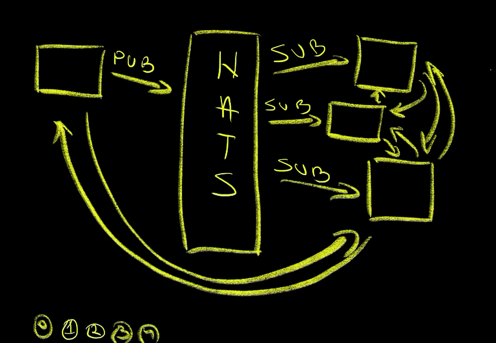
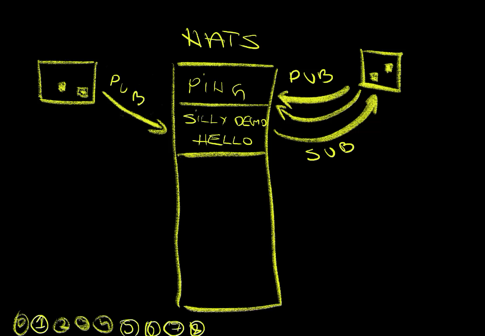
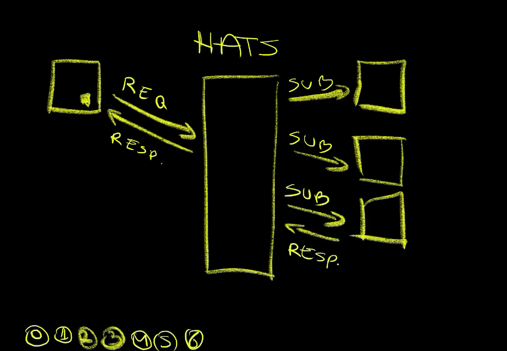

+++
title = 'Say Goodbye to Direct Communication! Event-Driven Pub/Sub With NATS'
date = 2024-12-02T01:00:00+00:00
draft = false
+++

Imagine a world where **everyone minds their own business**. A world where no one tells anyone what to do and where no one is forcing anyone to do something. A world where everyone is focused only and exclusively on **their own tasks** and nothing else. A world where we work in complete isolation yet a world where everything is done more officiently.

In such a world, each of us would do a task and, when finished, announce to the world that we are done. After that, we would pick another task from the pile that corresponds to our specific skilset instead of being told what to do.

The process would be very simple and apply to everyone. Pick a task, do it, say that you are done, repeat.

Now, that might not be the world we would like to live in, but that might be a perfect world for processes. That might be just the way we should organize our applications.

<!--more-->



In such a world, there would be no direct communication. Applications would not need to know that other applications exist. They would not be sending messages to any other application. Instead, everything would be based on **events**. An application could either **publish** messages describing what happened or **subscribe** to specific types of messages and react to whatever is coming, from wherever it's coming.

That will be the subject we'll explore today. We'll see how we could completely decouple applications and make them oblivious of any other processes in our system. We'll try to accomplish an utter and complete separation of concerns by adopting **event-based architecture**.

## Setup

```sh
git clone https://github.com/vfarcic/nats-demo

cd nats-demo
```

> Make sure that Docker is up-and-running. We'll use it to create a KinD cluster.

> Watch [Nix for Everyone: Unleash Devbox for Simplified Development](https://youtu.be/WiFLtcBvGMU) if you are not familiar with Devbox. Alternatively, you can skip Devbox and install all the tools listed in `devbox.json` yourself.

```sh
devbox shell

kind create cluster --config kind.yaml

kubectl apply \
    --filename https://raw.githubusercontent.com/kubernetes/ingress-nginx/main/deploy/static/provider/kind/deploy.yaml

helm upgrade --install nats nats \
    --repo https://nats-io.github.io/k8s/helm/charts \
    --namespace nats --create-namespace --wait

kubectl create namespace a-team

kubectl apply --filename app.yaml

kubectl --namespace nats exec -it deployment/nats-box \
    -- sh
```

> Open a second terminal session in the same directory. Devbox in this repository already comes with Zellij that can be used for that purpose (for multiplexing). Make sure that you are in the Devbox Shell (e.g., `devbox shell`). Please watch [Master Terminal Multiplexing with Zellij in Minutes!](https://youtu.be/ZndhImXIGlg) if you are not familiar with Zellij.

> All the commands, unless specified explicitly, should be executed in the first terminal session.

> Execute the command that follows in the second terminal session.

```sh
kubectl --namespace a-team logs \
    --selector app.kubernetes.io/name=silly-demo \
    --follow
```

## Event-Driven Architecture with NATS

The first and the most important thing we need when implementing even-based architecture is **pub/sub** messaging. That could be Kafka, Pulsar, RAbbit MQ, or any other similar solution. We won't use any of those today. Instead, I picked NATS, because... it's awesome. It's **fast and simple** and I'll avoid doing a comparison with other similar tools mostly because that's not today's subject. Everything we'll do today can be done with any other pub/sub tool, so think of today's usage of NATS as a way to demonstrate how event-driven architecture could be done rather than me telling you that NATS is the best tool of that kind.

Now, I am inside a container running in a Kubernetes cluster. While in there, I will be executing some *nats* commands and you will have to imagine that's not what I'm doing. Instead, every time I execute *nats* this and that, you should pretend that it is your application doing the same. Later on, we will see how all that is done from inside an application but, for now, executing *nats* commands will be an easier way to demonstrate what your apps should be doing.

Also, you should note that none of the applications in my cluster are aware of each other. The only thing they know how to do is **send messages** or **listen for messages** sent by others. There will be no direct communication involved.

Finally, before we proceed, you should know that there are channels. They are, in a way, similar to channels we used to talk to each other without talking to anyone directly. A NATS channel is similar to Reddit feeds, Slack channels, or Discord topics. There are only two things we can do in those channels. We can post a message and we can read messages posted by others. In other words, we can read and we can write, or to use NATS terminology, we can subscribe to a channel and we can publish a messsage to a channel. That's it. That's all we can do. That's all we are allowed to do, at least today.

Let's start by publishing a message to the `test` channel. Let's say `hi`.

```sh
nats publish test hi
```



We published a message (1) and that's it. We are done! We don't care whether someone will read it or not. For all we know, maybe no one read that message or maybe many received (2) it and are doing something with it. The key here is that we do not care, and that's something that might be very hard to grasp initially. We are likely used to work with applications that send direct messages to each others (3). We might be used to sending requests and expecting responses (4). This is different. It's **fire-and-forget**. It's separation of concerns. I did my part and I assume that everyone else will do theirs.

Besides publishing messages, we can also subscribe to messages from a channel. We do not necessarily know who will publish something but we sure can listen.

For example, we can `subscribe` to a channel `ping`.

```sh
nats subscribe ping
```

The output is as follows.

```
18:36:44 Subscribing on ping
```



We subscribed to the *ping* channel (1), and now is the waiting time. Something might post a message to that channel or not. We are going to...

The output is as follows.

```
[#1] Received on "ping"
Silly demo is here. Is there anyone else around? Say hi on the silly-demo.hello channel.
```

There we go. We just received a message (2) on that channel stating that `silly demo is here.` asking whether `there is anyone else around?` and instructing us to `say hi on the silly-demo.hello channel.` Some other process published that message on that channel (3).

As a matter of fact, as we'll see later, we have an application in that cluster that is publishing that message once every minute. It's obviously not a very clever app but a dumb one doing the same thing over and over again.

As a result, we'll see another one of those messages a minute later (4), and will keep doing that until the end of days.

The output is as follows (truncated for brevity).

```
...
[#1] Received on "ping"
Silly demo is here. Is there anyone else around? Say hi on the silly-demo.hello channel.


[#2] Received on "ping"
Silly demo is here. Is there anyone else around? Say hi on the silly-demo.hello channel.
...
```

Let's follow the instructions from those messages by cancelling the subscription (5) and publishing a message to the `silly-demo.hello` channel (6).

> Unsubscribe from the channel by pressing `ctrl+c`.

```sh
nats publish silly-demo.hello "Hello. I'm NATS."
```

Nothing interesting happened as a result of publishing that message, at least not where we are currently. Remember, it's fire-and-forget, at least for now.

The output, in the second terminal session, the one with the logs from an app, is as follows (truncated for brevity).

```
...
2024/10/17 18:38:10 received message: Hello. I'm NATS.
...
```

However, if we take a look at the logs of the other application, we can see that it got our message (7). That application is, obviously, subscribed to the `silly-demo.hello` channel (8).

We sent a message to no one in particular and that message was received by whomever is subscribed to that channel.

We are not limited only to fire-and-forget messages. We can also send requests similar to HTTP requests we would normally send to applications except that, this time, those requests are being sent to NATS. As a result, we don't need to know who should the message be sent to and who should respond to it. We can just **request** something and hope that there is a process that is listening to that channel and respond.

Here's how that looks like.



We'll send a `request` (1) to the `fibonacci.request` channel asking for `Something`. The assumption is that there are processes subscribed on that channel that can calculate Fibonacci numbers.

```sh
nats request fibonacci.request "Something"
```

The output is as follows.

```
18:39:05 Sending request on "fibonacci.request"
18:39:05 Received with rtt 2.098042ms
Something is not a number
```

We got a response that can be loosely interpreted as "You silly thing. Don't you know that you need to send a number if you'd like someone to calculate Fibonacci for you."

There was, obviously, a process (2) or, maybe, even multiple processes (3) subscribed to that channel (4). When we sent a message as a `request`, one of those processes responded (5). We sent a request instead of just publishing a message, and we got that response (6).

Let's try again but, this time, with a message that is an actual number.

```sh
nats request fibonacci.request 20
```

The output is as follows.

```
18:39:38 Sending request on "fibonacci.request"
18:39:38 Received with rtt 951.417µs
6765
```

This time we did get the calculated number `6765`. Whomever is subscribed to that channel got our message, calculated the Fibonacci number, and sent it back to NATS which routed it back to us.

So far, we were publishing, subscribing, and requesting from channels. We did that through our applications or, in this case, through similation of what would be done by our apps.

However, we are not limited to using pub/sub model only with our applications. We could be using that model from anywhere.

For example, let's say that we have a CI workflow. That workflow could be running some tests and building and pushing images to a registry. From the workflow perspective, we would not necessarily know whether there are some other activities that should be done afterward. The beauty of this model is that we would not need to know or care. That would be someone else's problem, if it is a problem in the first place. All we would have to do is publish a message that a workflow run is finished.

That could look something like this. We would `publish` a message on the `ci` channel. Since, in this hypothetical scenario, the workflow just finished CI for the application called `silly-demo`, that would be the sub-channel we will post.

```sh
nats publish ci.silly-demo "Workflow run finished successfully."
```

Now, to be clear, we would not be sending such a message manually but through GitHub Actions, Jenkins, Argo Workflows, or whichever other solution we might be using.

The point is that the process is done and that we announced it. If there is anyone or anything that needs to do something afterwards, it's their responsability to **subscribe** to that channel, listen to the messages and, if needed, perform some actions.

The output, in the second terminal session, the one with the logs from an app, is as follows (truncated for brevity).

```
2024/10/17 18:40:35 received message: Workflow run finished successfully.
```

We can see that one of the applications in the cluster `received` the `message` and did whatever needs to be done as a result of that.

In the real-world situation, that subscriber could have been Argo Events which, among other things, can subscribe to NATS channels and trigger actions as a result of specific messages. It could have triggered another workflow run, or it could have created a Kubnernetes job, or anything else. The sky is the limit but the point is still the same. Everything is decoupled and none of the processes care what cames before or what should happen afterwards. The only thing they should care about is doing whatever they should be doing and either subscribing to channels as a way to deduce what should be done or publishing messages as a way to announce that something has been done.

Now, let's see what would happen if we send the same message but to the `ci.serious-demo` instead of the `ci.silly-demo` channel.

```sh
nats publish ci.serious-demo "Workflow run finished successfully."
```

Unlike the last time, this time nothing appeared in the logs of the application listening to NATS. That application is most likely listening only to the sub-channel *silly-demo* while we sent a message to *serious-demo* announcing that a workflow run of that application is finished. Even though silly demo is subscribed to the *ci* channel, it is focused exclusively on the subchannel it's interested in; to *silly-demo*.

We could, however, subscribe to all the sub-channels as well. There could be, for example, a processes that is interested in all workflow runs, no matter which application initiated them.

Before we see that in action, let us first stop watching logs of the application.

> Stop watching the logs in the second terminal session by pressing `ctrl+c`.

Next, we'll simulate an application by entering into the shell of a container with the NATS client and subscribe to `ci.*`.

> Execute the two commands that follow in the second terminal session.

```sh
kubectl --namespace nats exec -it deployment/nats-box \
    -- sh

nats subscribe "ci.*"
```

Asterisk means everything so we just subscribed to all messages in all sub-channels of `ci`.

Now, let's publish the same two messages we published earlier.

First, we'll announce that the `ci` of `silly-demo` is finished.

```sh
nats publish ci.silly-demo "Workflow run finished successfully."
```

The output, in the second terminal session, the one where we subscribed to all sub-channels of `ci`, is as follows.

```
[#1] Received on "ci.silly-demo"
Workflow run finished successfully.
```

We got the message hence confirming that it worked.

Similarly, we can publish a message announcing that `ci` of `serious-demo` finished as well.

```sh
nats publish ci.serious-demo "Workflow run finished successfully."
```

The output, in the second terminal session, the one where we subscribed to all sub-channels of `ci`, is as follows.

```
[#2] Received on "ci.serious-demo"
Workflow run finished successfully.
```

We received that message as well, thus confirming that we are subscribed to all sub-channels of `ci`.

The only thing left is to explore the code from one of the applications. That should give us an idea how everything we saw works.

```sh
exit
```

## The Code

Let's take a look at the code that publishes, subscribes, and requests messages from NATS channels.

```sh
gh browse --repo vfarcic/silly-demo --branch nats nats.go
```

The output is as follows (truncated for brevity).

```go
...
func natsPublish(channel, message string) error {
	nc, err := nats.Connect(getNatsURL())
	if err != nil {
		return err
	}
	defer nc.Close()
	log.Printf("publishing message: %s\n", message)
	err = nc.Publish(channel, []byte(message))
	if err != nil {
		return err
	}
	return nil
}

func natsSubscribe(ctx context.Context, channel string, fn NatsResponse) {
	nc, err := nats.Connect(getNatsURL())
	if err != nil {
		log.Fatal(err)
	}
	defer nc.Close()

	messages := make(chan *nats.Msg, 1000)
	subscription, err := nc.ChanSubscribe(channel, messages)
	if err != nil {
		log.Fatal("Failed to subscribe to subject:", err)
	}
	defer func() {
		subscription.Unsubscribe()
		close(messages)
	}()
	for {
		select {
		case <-ctx.Done():
			log.Println("exiting from the message subscriber")
			return
		case message := <-messages:
			log.Printf("received message: %s\n", string(message.Data))
			response := fn(string(message.Data))
			message.Respond([]byte(response))
		}
	}
}
...
```

The code was written in Go, but the same logic applies to any other language. NATS supports them all. Do not blame NATS if your favorite language is not supported. You probably chose a wrong language to code.

In any case, the important note is that working with NATS is very simple.

For example, the `natsPublish` function connects (`nats.Connect`) to the NATS server and publishes a message (`nc.Publish`). That's all it takes to publish.

Subscription in `natsSubscribe` might be, in this case, a bit more complicated since it involves running in a separate thread. Still, essence of it is simple.

We subscribe to a channel (`nc.ChanSubscribe`) and wait for messages (`<-messages`). When a message comes, we respond to it (`message.Respond`), probably after doing some calculation or executing a task.

That's most of what you need to know. It's simple, and that's what makes it great. No fuss. Only a few lines of code or execution of a single command if we choose to use the CLI instead.

Now it's your turn to let me know if you'd like me to go deeper into events. Would it make sense to show a practical implementation of event-driven CI/CD? Or, maybe, you would like to see how messaging is implemented in a standard form using CloudEvents and CDEvents. Do you have something else in mind? Please let me know in the comments.

## Destroy

```sh
kind delete cluster
```

> Exit all terminal sessions

