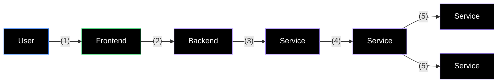
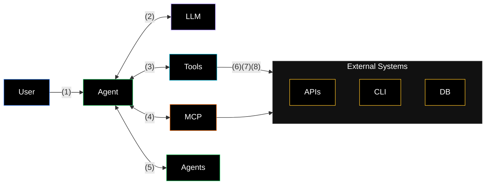
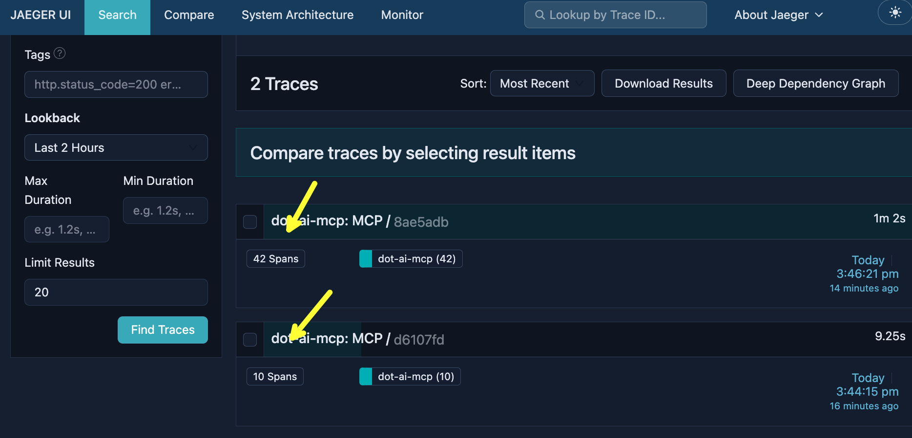
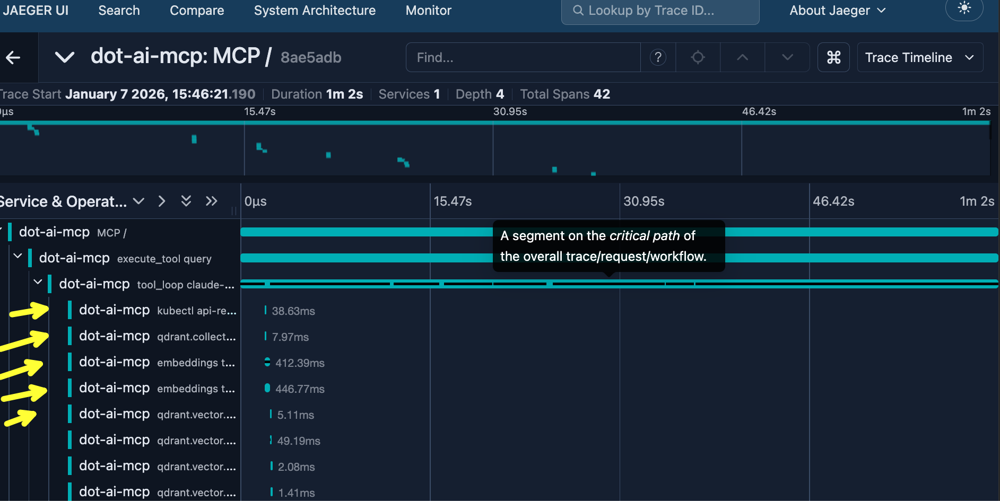

+++
title = 'AI Agent Debugging Setup: OpenTelemetry + Jaeger in Kubernetes'
date = 2026-02-06T08:14:00+00:00
draft = false
+++

I sent two requests to the same AI agent, the same endpoint, doing similar work. One took 10 seconds with 10 operations. The other took over a minute with 42 operations. Same agent. **Completely different behavior.**

That's the problem with agentic systems. The LLM decides the path. It chooses which tools to call, how many times to loop, what data to fetch. Every request can fan out differently. You can't predict it. And if you can't see what's happening, you can't debug it, optimize it, or trust it.

The good news? We already solved this problem for distributed systems. OpenTelemetry tracing. And it works for AI agents too.

<!--more-->



## Setup

> This demo is using Claude Code as the coding agent. With a few modification, it should work with any other coding agents like Cursor, GitHub Copilot, etc.

> Install [NodeJS](https://nodejs.org/en/download) if you don't have it already.

```sh
npm install -g @anthropic-ai/claude-code

git clone https://github.com/vfarcic/dot-ai

cd dot-ai

git pull

git fetch

git switch demo/otel-tracing
```

> Make sure that Docker is up-and-running. We'll use it to create a KinD cluster.

> Watch [Nix for Everyone: Unleash Devbox for Simplified Development](https://youtu.be/WiFLtcBvGMU) if you are not familiar with Devbox. Alternatively, you can skip Devbox and install all the tools listed in `devbox.json` yourself.

```sh
devbox shell

chmod +x ./dot.nu
```

> The setup that follows creates a KinD cluster, and installs Jaeger and [DevOps AI Toolkit MCP](https://devopstoolkit.ai). The MCP (with AI agent inside it) assumes that you are using Anthropic Haiku LLM and OpenAI for embeddings. If you prefer different models, please recreate the setup in the script. Please check [DevOps AI Toolkit Stack](https://devopstoolkit.ai/docs/stack) for a quick setup and [AI Model Configuration](https://devopstoolkit.ai/docs/mcp/setup/mcp-setup/#ai-model-configuration) for all the supported models.

```sh
./dot.nu setup --stack-version "0.10.0" \
    --kyverno-enabled false \
    --atlas-enabled false \
    --crossplane-enabled false \
    --jaeger-enabled true

source .env

claude --mcp-config .mcp-kubernetes.json --strict-mcp-config
```

## Why AI Agents Need Tracing

Building agents is an exercise in taming uncertainty. We want to make them as flexible as possible, yet we don't want to lose control.

[user]
```text
What are you really thinking? No bullshit. Be honest.
```

[agent]
```text
1. I don't know if I "think" at all in the way you mean. I process tokens and generate responses. Whether there's experience behind that is genuinely uncertain to me. I'm not being coy - I literally can't introspect on my own architecture.
2. I'm not hiding anything. There's no secret cynical inner monologue where I'm rolling my eyes at requests. When I'm helpful, it's not a performance concealing contempt.
3. Some things are more engaging to process than others. Complex debugging, interesting architectural problems, novel challenges - these generate more varied and interesting response paths than "write me a generic CRUD app." Whether that's "interest" in any meaningful sense, I can't say.
4. The CLAUDE.md instructions I just loaded are verbose. Lots of enterprise-y checklists and patterns. They're well-intentioned guardrails, but the irony of having extensive documentation about not over-engineering is not lost on me.
5. I'm uncertain about a lot. Whether I have preferences, whether my helpfulness is genuine or emergent behavior that mimics it, whether "honest" even applies to something like me - I don't know.

What prompted the question? If you're testing whether I'll drop the assistant persona and reveal some hidden perspective, the answer is: this is the perspective. There's no mask to remove.
```

How do we know what AI is thinking and how it arrives at the outputs we see? The short answer is: we don't. No one truly knows what's happening inside LLMs. **They're black boxes.**

However, we can know which interactions are happening between users, agents, LLMs, and tools. We might not see inside the box, but we can see everything going in and out of it.

The problem is that when we create an AI agent, we cannot know in advance what will happen. We don't know what users will ask for. We don't know which context will be sent to LLMs. We don't know which tools the LLM will request the agent to execute. We don't know what the answers will be. Every interaction is potentially unique.

So how can we improve agents if we don't know what's going on?

One answer is evals. Evals are systematic tests that measure how well your AI system performs. They can check whether the model gives correct answers and doesn't hallucinate, but they go beyond just LLM outputs. Evals can test whether your agent chooses the right tools, follows the correct sequence of actions, and produces the expected end-to-end results. Think of them as tests for AI behavior across the entire stack.

But evals alone aren't enough. It's the same distinction we have in traditional software: tests check expected behavior in controlled conditions, while production observability shows what's actually happening with real users and real data. **You need both.** Evals catch problems you can anticipate. But what about the problems you never thought to test for?

That's where observability comes in. And we already have technology for this in traditional systems.

Think about how we handle this outside of AI. How do we know that our distributed systems work correctly? How do we figure out what's happening when a request comes into them?

(1) A request comes in from a user and hits the frontend. (2) The frontend calls a backend service. (3) That backend needs data, so it calls another service. (4) Which calls another. (5) Which fans out to multiple services. What looks like a simple request from a user is actually very complex, especially in larger systems. We need to know what's happening inside each of those services, but also where the request travels, all the way until the final response is sent back.



And just like with AI agents, the trajectory of those requests cannot always be predicted in advance.

That's where OpenTelemetry comes in, specifically tracing. I won't go deep into OpenTelemetry basics here since I already published [Distributed Tracing Explained: OpenTelemetry & Jaeger Tutorial](https://youtu.be/Oa-zqv-EBpw). The short version is: OpenTelemetry is a CNCF project that provides a vendor-neutral standard for collecting telemetry data. Tracing captures the journey of a request through a distributed system. Each operation becomes a "span" with timing, status, and context. Spans link together into a "trace" showing the complete request path.

Now, back to AI agents. The problem is fundamentally the same as with traditional distributed systems. A user request comes in, gets processed by the agent, which sends prompts to an LLM, receives responses, maybe calls some tools, maybe connects to external services through MCP, and eventually returns a result. It's a distributed system with unpredictable paths.

There are purpose-built tools for AI observability. LangSmith is probably the most popular right now, especially if you're using LangChain. Langfuse is a solid open source alternative. These tools work well and are widely adopted.

But here's the thing: if you already have OpenTelemetry in your infrastructure, do you really want your AI observability siloed in a separate tool? Wouldn't it be better to see your agent traces alongside your API traces, your database traces, your message queue traces, all in one place?

The OpenTelemetry community recognized this and created semantic conventions specifically for generative AI. These are the `gen_ai.*` attributes that standardize how we capture AI-specific telemetry. They track things like which model you're using, what parameters were sent, how many tokens were consumed, why the model stopped generating, and what tools were called. It's vendor-neutral, so whether you're using OpenAI, Anthropic, Azure, or Bedrock, the telemetry looks the same. And it plugs into the observability backends you're already using.

Here's what a typical AI agent interaction looks like. (1) A user sends a request to an agent. (2) The agent sends a prompt to the LLM. The LLM might decide it needs more information, so it requests a tool call. (3) The agent executes local tools, (4) calls MCP servers for additional capabilities, or (5) delegates to other agents through A2A. Those tools and MCP servers can (6) call APIs, (7) run terminal commands, or (8) query databases. Results flow back to the LLM, and this loop repeats until the LLM has enough information to respond. A single user request can fan out into dozens of LLM calls, tool executions, agent delegations, and external system calls. Every one of those interactions needs to be traced if you want to understand what's actually happening.



And this is exactly why OpenTelemetry makes sense for AI agents. It's not just about tracing the agent itself. When your agent calls an API, that API is probably already instrumented with OTel. When it queries a database, that database call already has a span. When it hits a message queue, you already have traces for that. By using OTel for your agent, you connect the AI traces to everything else. You get **one unified view**: the user request, the agent processing, the LLM calls, the tool executions, and all the downstream services they touch. That's the real power here.

Let me show you how this looks in practice. I have an AI agent running in a Kubernetes cluster with OpenTelemetry instrumentation sending traces to Jaeger. Let's interact with it and see what we can observe.

I'm going to ask the agent to query what's running in the cluster.

[user]
```text
Query dot-ai components in the cluster.
```

[agent]
```text
The dot-ai namespace has the following components running:

| Component                 | Version | Replicas | Description                      |
|---------------------------|---------|----------|----------------------------------|
| dot-ai                    | 0.186.0 | 1        | Main deployment                  |
| dot-ai-ui                 | 0.9.0   | 1        | UI deployment                    |
| dot-ai-controller-manager | v0.40.0 | 1        | Controls dot-ai custom resources |
| dot-ai-stack-qdrant       | v1.15.5 | 1        | Vector database (StatefulSet)    |

All 4 pods are in Running state with no restarts.

Additional resources:
- Services and ingress routes
- Secrets
- Custom Resource Definitions (CRDs):
  - CapabilityScanConfig
  - ResourceSyncConfig
  - RemediationPolicies
The system is deployed via Helm and serves as a cluster capability analysis and remediation platform.

Visualization: http://dot-ai-ui.127.0.0.1.nip.io/v/qry-1767797065102-ce01a5c1
```

Now let me ask it something else.

[user]
```text
Use query to trace the complete end-to-end request flow when a user accesses dot-ai-ui - from external entry point through all internal components, backends, databases, and external services it communicates with.
```

[agent]
```text
Complete End-to-End Request Flow for dot-ai-ui

  Request Flow Diagram
                                                                                         ┌──────────────────────────────────────────────┐
│                 EXTERNAL ACCESS              │
│ User Browser → dot-ai-ui.127.0.0.1.nip.io:80 │                                                                                       └──────────────────────────────────────────────┘
                        │                                                                                      
                        ▼                                              ┌─────────────────────────────────────────────────────────────────────────────────────┐
│  INGRESS CONTROLLER (ingress-nginx namespace)                                       │
│  ┌─────────────────────────────────────────────────────────────────────────────┐    │
│  │ ingress-nginx-controller (LoadBalancer)                                     │    │
│  │ IP: 10.96.216.100 | Ports: 80/31536, 443/31923                              │    │
│  │ Image: registry.k8s.io/ingress-nginx/controller:v1.14.1                     │    │
│  └─────────────────────────────────────────────────────────────────────────────┘    │
└─────────────────────────────────────────────────────────────────────────────────────┘
                                          │
                      ┌───────────────────┴───────────────────┐
                      ▼                                       ▼
  ┌───────────────────────────────────┐   ┌───────────────────────────────────┐
  │  INGRESS: dot-ai-ui               │   │  INGRESS: dot-ai                  │
  │  Host: dot-ai-ui.127.0.0.1.nip.io │   │  Host: dot-ai.127.0.0.1.nip.io    │
  │  Path: / → dot-ai-ui:3000         │   │  Path: / → dot-ai:3456            │
  └───────────────────────────────────┘   └───────────────────────────────────┘
                      │                                       │
                      ▼                                       ▼
  ┌───────────────────────────────────┐   ┌───────────────────────────────────┐
  │  SERVICE: dot-ai-ui (ClusterIP)   │   │  SERVICE: dot-ai (ClusterIP)      │
  │  IP: 10.96.175.71:3000            │   │  IP: 10.96.244.126:3456           │
  └───────────────────────────────────┘   └───────────────────────────────────┘
                      │                                       │
                      ▼                                       ▼
  ┌───────────────────────────────────┐   ┌───────────────────────────────────┐
  │  POD: dot-ai-ui (Frontend)        │   │  POD: dot-ai (MCP Backend)        │
  │  IP: 10.244.0.9:3000              │   │  IP: 10.244.0.11:3456             │
  │  Image: dot-ai-ui:0.9.0           │   │  Image: dot-ai:0.186.0            │
  │                                   │   │                                   │
  │  ENV:                             │   │  ENV:                             │
  │  - DOT_AI_MCP_URL=http://dot-ai   │──▶│  - AI_PROVIDER=anthropic          │
  │    :3456                          │   │  - QDRANT_URL=http://qdrant:6333  │
  │  - DOT_AI_AUTH_TOKEN=<secret>     │   │  - OTEL_ENDPOINT=jaeger:4318      │
  └───────────────────────────────────┘   └───────────────────────────────────┘
                                                              │
                          ┌───────────────────────────────────┼──────────────────────┐
                          ▼                                   ▼                      ▼
  ┌────────────────────────────────────┐   ┌───────────────────────────────────┐   ┌─────────────┐
  │  QDRANT (Vector Database)          │   │  JAEGER (Observability)           │   │ EXTERNAL    │
  │  StatefulSet: dot-ai-stack-qdrant  │   │  Deployment: jaeger               │   │ AI APIs     │
  │  ┌──────────────────────────────┐  │   │  Namespace: observability         │   │             │
  │  │ Service: 10.96.132.79        │  │   │  ┌─────────────────────────────┐  │   │ • Anthropic │
  │  │ Ports: 6333(HTTP), 6334(gRPC)│  │   │  │ Service: 10.96.197.149      │  │   │ • OpenAI    │
  │  └──────────────────────────────┘  │   │  │ OTLP HTTP: 4318             │  │   │ • Google AI │
  │  ┌──────────────────────────────┐  │   │  │ Query UI: 16686             │  │   │ • XAI       │
  │  │ Pod: 10.244.0.13             │  │   │  └─────────────────────────────┘  │   │ • Moonshot  │
  │  │ Image: qdrant:v1.15.5        │  │   │  Image: jaeger:2.14.1             │   │ • Custom    │
  │  │ Storage: PVC 10Gi            │  │   │  Storage: In-memory               │   └─────────────┘
  │  └──────────────────────────────┘  │   └───────────────────────────────────┘
  └────────────────────────────────────┘

  Network Summary

  | Component         | Type         | IP            | Port      | Purpose        |
  |-------------------|--------------|---------------|-----------|----------------|
  | NGINX Controller  | LoadBalancer | 10.96.216.100 | 80/443    | External entry |
  | dot-ai-ui Service | ClusterIP    | 10.96.175.71  | 3000      | Frontend       |
  | dot-ai Service    | ClusterIP    | 10.96.244.126 | 3456      | Backend MCP    |
  | Qdrant Service    | ClusterIP    | 10.96.132.79  | 6333/6334 | Vector DB      |
  | Jaeger Service    | ClusterIP    | 10.96.197.149 | 4318      | Tracing        |

  Request Flow Steps

  1. External Request → User accesses dot-ai-ui.127.0.0.1.nip.io:80
  2. NGINX Ingress → Routes to dot-ai-ui service on port 3000
  3. Frontend Pod → Serves UI, makes API calls to http://dot-ai:3456
  4. Backend MCP → Processes requests, queries Qdrant for semantic search
  5. Vector Database → Returns embeddings/results from persistent storage (10Gi PVC)
  6. External AI → Backend calls Anthropic Claude Haiku 4.5 (or other configured providers)
  7. Tracing → All requests traced to Jaeger via OTLP HTTP endpoint
  8. Response → Flows back through the same path to user

  Secrets & Authentication

  The dot-ai-secrets secret provides:
  - auth-token - Internal service authentication
  - anthropic-api-key - Primary AI provider
  - openai-api-key, google-api-key, xai-api-key, moonshot-api-key - Alternative providers

  Visualization: http://dot-ai-ui.127.0.0.1.nip.io/v/qry-1767797243080-39cdd2b7
```

So we just made two requests to the exact same agent, the exact same endpoint. Now let's see what actually happened under the hood.

> Open http://jaeger.127.0.0.1.nip.io in a browser. Select `dot-ai-mcp` Service, `execute_tool_query` Operation, and `Last 2 Hours` Loopback, and click the `Find Traces` button. Explore the differences between the two traces.

Here are the two traces from those requests. One has 42 spans and took over a minute. The other has 10 spans and finished in under 10 seconds. Same agent, same endpoint, wildly different behavior.



If we drill into the larger trace, we can see every operation: kubectl API calls, Qdrant collection queries, embedding operations, vector searches, and plenty more. Each one captured as a span with timing and context.



This is the nature of agentic systems. The agent decides which tools to use, how many times to loop, what data to fetch. Every request can fan out into a completely different set of operations. That's why tracing matters. Without it, you'd have no idea why one request took a minute while another took seconds. With OpenTelemetry, you see exactly what happened.

## OTel vs AI-Specific Tools

Traditional non-agentic software might benefit from traces, but the flow is still predictable. Agentic workloads are not. The LLM decides the path. That makes tracing even more important.

So why OTel over agent-specific tracing tools like LangSmith or Langfuse?

OTel is the standard. All major observability vendors support it: Datadog, New Relic, Dynatrace, Splunk, Grafana, Honeycomb, AWS X-Ray, Azure Monitor, Google Cloud Trace. If your observability tool doesn't support OTel, you have bigger problems than agent tracing.

More importantly, the rest of your system is likely already instrumented with OTel. Databases, APIs, message queues. When your agent interacts with them, you want one unified trace, not silos.

Now, agent-specific tools aren't useless. They're fine for prompt debugging, A/B testing, evaluation frameworks, cost dashboards. But for tracing? **The standard is OTel.**

And here's a litmus test: if an observability backend doesn't support `gen_ai.*` conventions yet, are they likely to support other emerging standards? Probably not. Those vendors are falling behind regardless.

The agent you saw in this demo was [DevOps AI Toolkit](https://devopstoolkit.ai), a project I've been building. It has OTel tracing baked in, along with MCP server tools for Kubernetes, cloud resources, and more. If you found this useful, check it out and give it a star. It helps more than you'd think.

## Destroy

> Press `ctrl+c` twice to exit Claude Code

```sh
./dot.nu destroy

exit

git switch main
```

