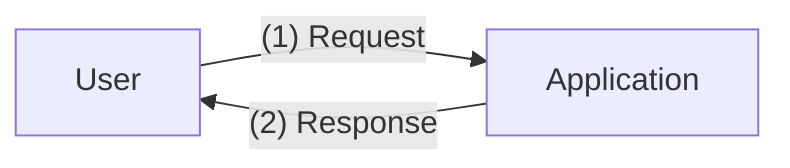
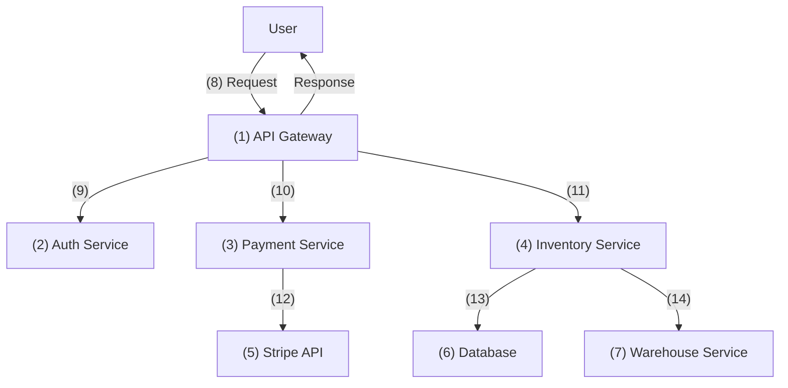
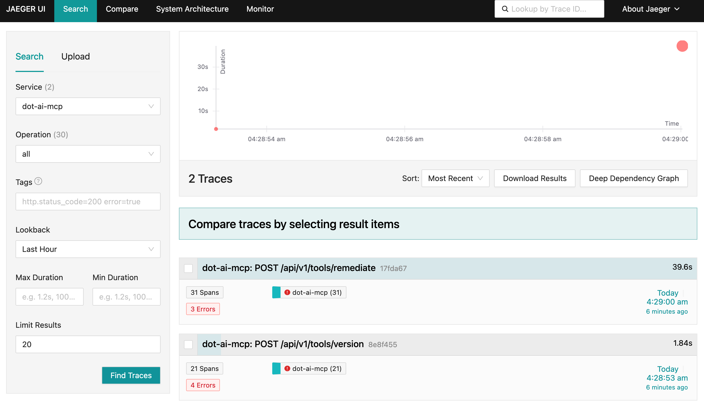
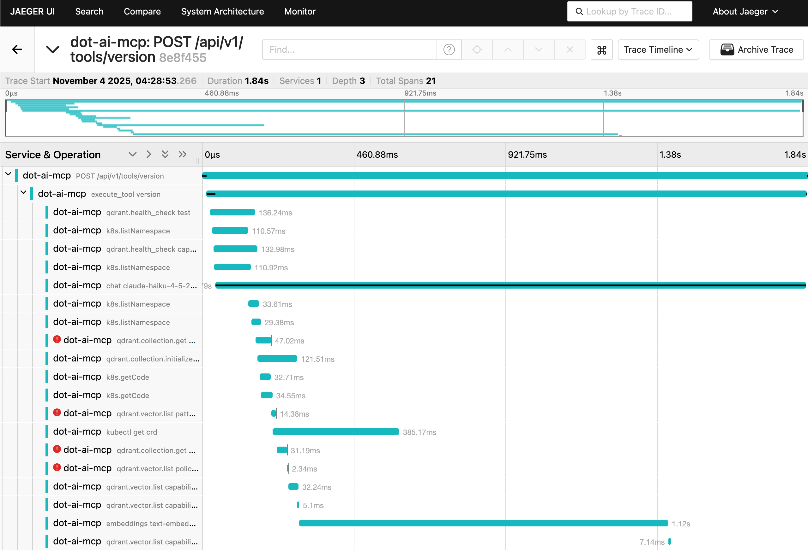
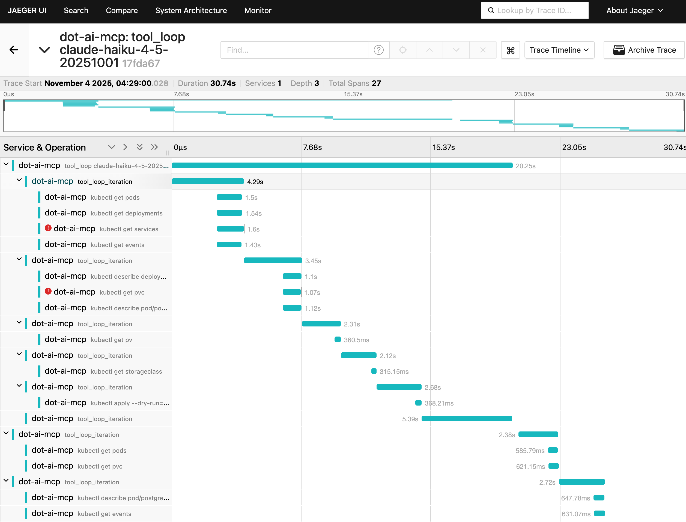
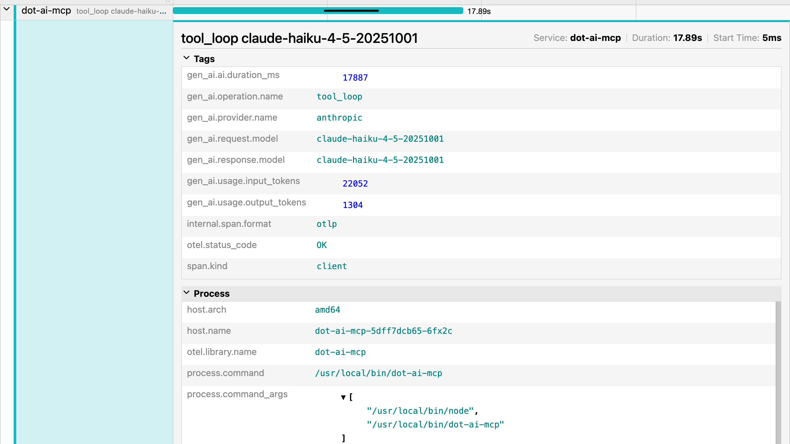

+++
title = 'Distributed Tracing Explained: OpenTelemetry & Jaeger Tutorial'
date = 2025-12-17T21:00:00+00:00
draft = false
+++

Your users are complaining that your application is slow. Sometimes it takes 8 seconds to respond, other times 2 seconds. But when you check your metrics, everything looks fine. Average response times are acceptable. All services report healthy. Your dashboards are green.

So either your users are idiots, or you're not capable of capturing what's actually happening with their requests. Now, I tend to assume users are right. Which means I'd have to call you... Well... I'm not going to do that. Instead, I'm going to show you why you can't see what's really happening.

Here's what you're about to learn. You'll see exactly how to track requests as they flow through dozens of microservices, identify which specific operation is causing delays, and understand why your traditional observability tools are lying to you. By the end of this video, you'll know how to implement distributed tracing that actually shows you what's happening in your system.

Let's start with why this problem exists in the first place.

<!--more-->



## Setup

> The demo is based on Anthropic Haiku model (the cheaper one). Nevertheless, the project we're using works with all the commonly used models in case you want to explore it deeper. We'll also need OpenAPI key for vector DB embedding. The model we're using is extremely cheap so that will not present almost any cost.

```sh
git clone https://github.com/vfarcic/dot-ai

cd dot-ai

git pull

git fetch

git switch demo/tracing
```

> Make sure that Docker is up-and-running. We'll use it to create a KinD cluster.

> Watch [Nix for Everyone: Unleash Devbox for Simplified Development](https://youtu.be/WiFLtcBvGMU) if you are not familiar with Devbox. Alternatively, you can skip Devbox and install all the tools listed in `devbox.json` yourself.

```sh
devbox shell
```

> When asked to provide Anthropic and OpenAI keys, feel free to put any random value. We are using this project to demonstrate non-AI features, so it's okay if keys are false.

```sh
./dot.nu setup --dot-ai-tag 0.134.0 \
    --qdrant-run false --kyverno-enabled false \
    --atlas-enabled false --crossplane-enabled false \
    --jaeger-enabled true --dot-ai-kubernetes-enabled true

source .env

echo '
apiVersion: apps/v1
kind: Deployment
metadata:
  name: postgres-db
spec:
  replicas: 1
  selector:
    matchLabels:
      app: postgres
  template:
    metadata:
      labels:
        app: postgres
    spec:
      containers:
      - name: postgres
        image: postgres:13
        env:
        - name: POSTGRES_PASSWORD
          value: testpass
        - name: POSTGRES_DB
          value: testdb
        volumeMounts:
        - name: postgres-storage
          mountPath: /var/lib/postgresql/data
      volumes:
      - name: postgres-storage
        persistentVolumeClaim:
          claimName: postgres-pvc
' | kubectl --namespace a-team apply --filename -

curl -s -X POST http://dot-ai.127.0.0.1.nip.io/api/v1/tools/version \
    -H "Content-Type: application/json" -d '{}' | jq '.'

curl -X POST "http://dot-ai.127.0.0.1.nip.io/api/v1/tools/remediate" \
    -H "Content-Type: application/json" \
    -d '{
        "issue": "There is something wrong with my app in the a-team namespace",
        "mode": "automatic",
        "maxRiskLevel": "medium",
        "confidenceThreshold": 0.8
    }' | jq '.'
```

> Open http://jaeger.127.0.0.1.nip.io in a browser.

## Microservices Performance Mystery

Let's say your application is experiencing intermittent slowdowns. Sometimes a request takes 8 seconds, other times it completes in just 2 seconds. The inconsistency is frustrating because you can't predict when it will happen or why.

You check your metrics, and here's the kicker: the average response times look acceptable. All your services report healthy. According to your traditional observability tools, everything is fine. But clearly, it's not.

From the user's perspective, it looks simple. (1) A user makes a request to your application, and (2) gets back a response. That's how it appears on the surface.



The problem is you're dealing with a complex system made up of dozens of microservices. It's so complex that you honestly don't know what exact path each request takes through the architecture. You've got (1) an API Gateway, (2) an Auth Service, (3) a Payment Service, (4) an Inventory Service, (5) an external payment processor like Stripe, (6) a Database, (7) a Warehouse Service, and many more. Sure, you have a general idea of how things are supposed to flow, but the reality is far more intricate.

Here's the fundamental issue: what appears to be one request flowing through your system is actually many separate, independent requests. When a user makes a request, that single action triggers a cascade of individual service calls, each one independent from the others.

Each service in your architecture receives an incoming request, does its work, and then makes separate outgoing requests to other services. (8) The user's request hits the API Gateway, which then (9) calls the Auth Service, (10) calls the Payment Service, and (11) calls the Inventory Service. But it doesn't stop there. (12) The Payment Service calls Stripe, (13) the Inventory Service queries the Database, and (14) might also call the Warehouse Service. It's a massive web of interconnected calls.



But here's the catch: each service only sees its own incoming and outgoing requests. There's no inherent way for a service to know that its work is part of the same logical transaction that started with that user's request. From each service's perspective, it's just handling independent requests.

Your logs from individual services show that operations completed successfully. The auth service logged that it validated a token. The payment service logged that it processed a payment. The inventory service logged that it updated stock. But you can't correlate these log entries across services. You can't tell that they're all part of the same user action.

So you're left with critical questions that remain unanswered. Which microservices are actually involved in the slow requests? What is the actual request path through the system? Which service is causing the delay? And within that service, which specific operation is slow? Is it a database query, an external API call, a cache lookup, or some business logic? Is it always the same service and operation causing the problem, or does it vary? Is the bottleneck in inter-service communication or network latency? Are there cascading timeouts or retry storms happening? Where exactly are those extra 6 seconds being spent? Is it between services or within a specific operation?

What you really need is the ability to follow a single request across all service boundaries. You need to map its complete journey through your system and identify exactly where the bottleneck is.

This is where distributed tracing becomes essential. It's the tool that finally gives you visibility into what's really happening across your entire distributed system. Let's explore how it works and how you can implement it in your own applications.

## OpenTelemetry Distributed Tracing

OpenTelemetry tracing gives you distributed tracing capabilities to track requests as they flow through your microservices and distributed systems. It's the solution to the visibility problem we've been discussing.

Let's start with the fundamentals. **Traces** represent the complete journey of a logical transaction through your system, connecting all the separate requests that were triggered by a single user action. Remember, when a user clicks checkout, that's not one request moving through services. It's dozens of separate, independent requests. The trace connects them all together.

Within each trace, you have **spans**. Spans are individual units of work, like a database query, an HTTP request to another service, or a function call. Each span contains timing data showing how long that specific operation took. It has attributes providing metadata about what happened. It records events marking significant moments like errors or retries. And it maintains parent-child relationships that show how spans connect to each other.

The magic that ties this all together is context propagation. It ensures the trace ID and span information flow across service boundaries, so every service knows its work is part of the same logical transaction.

Now, how do you actually add tracing to your applications? There are two main approaches: automatic instrumentation and manual instrumentation.

**Automatic instrumentation** uses agents or libraries to instrument common frameworks without requiring code changes. It's quick to set up with minimal code modifications. It covers common frameworks out of the box like HTTP servers, databases, and messaging systems. It has less maintenance burden since the instrumentation is handled for you. And it provides consistent instrumentation across all your services.

The downsides? It gives you limited visibility into custom business logic. It may capture too much or too little data depending on your needs. You get less control over span names and attributes. And it can add overhead to all operations since it instruments everything by default.

**Manual instrumentation** is where you write explicit code to create custom spans for your business logic. This gives you full control over what gets traced. You can add business-specific context and attributes that matter to your domain. You can trace only critical paths to reduce overhead. And you get better span naming for your domain operations.

The trade-offs? It requires code changes and ongoing maintenance. It needs developer effort to instrument properly. It risks inconsistent instrumentation across teams if everyone does it differently. And it can be forgotten during rapid development when people are moving fast.

Here's my take: auto-instrumentation is fine for getting started. It'll show you what tracing looks like, help you understand the concepts, and give you something to experiment with. But don't mistake it for the destination. Real observability requires you to understand what you're measuring and why. Auto-instrumentation captures a bunch of noise you don't care about while missing the stuff that actually matters to your business logic. Manual instrumentation forces you to think about what's important. So use auto-instrumentation to learn, then move to manual instrumentation and instrument what actually matters. That's where the real value is.

Let's look at a real example of manual instrumentation in action. We'll extract some code from a TypeScript file that shows how to create a custom span for tracing tool executions.

```sh
sed -n '33,53p' src/core/tracing/tool-tracing.ts
```

```ts
export async function withToolTracing<T>(
  toolName: string,
  args: any,
  handler: (args: any) => Promise<T>
): Promise<T> {
  const tracer = trace.getTracer('dot-ai-mcp');

  // Create INTERNAL span for tool execution
  // Using INTERNAL kind since this is business logic within the server process
  const span = tracer.startSpan(
    `execute_tool ${toolName}`,
    {
      kind: SpanKind.INTERNAL,
      attributes: {
        // GenAI semantic conventions for tool execution
        'gen_ai.tool.name': toolName,
        'gen_ai.tool.input': JSON.stringify(args, null, 2),
      },
    }
  );
```

This code creates a custom span for tracing tool executions. You get a tracer instance, start a span with a descriptive name that includes the tool being executed, set the span kind to `INTERNAL` since this is business logic within your process, and add custom attributes that capture the tool name and its input arguments. This is manual instrumentation at work: you're explicitly deciding what to trace and what context to capture.

## Analyzing Traces with Jaeger

> Open http://jaeger.127.0.0.1.nip.io in a browser, click the `Find Traces`.

Now let's see what distributed tracing looks like in action when you actually run your instrumented application. This is the Jaeger UI, one of the most popular open-source tracing backends. You can see it found 2 traces from the *dot-ai-mcp* service. One trace is for a POST request to */api/v1/tools/remediate* that took around 40 seconds. The other is for */api/v1/tools/version* that took under 2 seconds. Both show multiple spans and have some errors reported. This is your trace search interface.



Let's take a look at the version endpoint. This is just a simple function that returns the status of the application. How many external interactions do you think such a simple function has? One? Two? Maybe none? Let's find out.

> Select `dot-ai-mcp: POST /api/v1/tools/version`.



Over 20 spans. That simple version endpoint made around 20 different calls to the rest of the system. It interacted with Qdrant DB, made quite a few calls to the Kubernetes cluster, interacted with Claude Haiku LLM, as well as the embeddings model.

This waterfall view shows you exactly what happened and when. Each bar represents a span with its duration. The hierarchy shows parent-child relationships. You can see the main `POST /api/v1/tools/version` at the top, then `execute_tool version` as a child, followed by operations like `qdrant.health_check`, `k8s.listNamespace`, and various others. Notice some spans have red error indicators showing potential issues related to the interactions made in those spans.

Here's the thing: even if I'm the one who wrote all that code and know it by heart, which is often not the case, I would still not be able to deduce all of this without tracing. The complexity is just too damn high, even for such a simple function.

> Go back to the home screen and select `dot-ai-mcp: POST /api/v1/tools/remediate`.

Now let's look at the remediation endpoint, which is more complex. This function interacts with an LLM in a loop. In each iteration, it sends context to the LLM. The AI responds with requests to execute some tools. Then in the next iteration the context is augmented with the outputs of those tools and sent back to the LLM. And so on, until the LLM decides it has all the information to provide a solution.

Here's the critical part: I cannot know in advance how many loops will be done. In some cases it might be zero, in others twenty, or any other number. How would I know that without tracing?

This trace shows multiple `tool_loop_iteration` spans, each one making Kubernetes API calls like `kubectl get pods`, `kubectl get deployments`, adn `kubectl get services`. The waterfall shows when each operation happened and how long it took. Some spans have red error indicators showing where things went wrong.



> Select one of the spans.

When you click on a specific span, you get detailed information about that operation. At the top, you can see the Service name, Duration, and Start Time.

The Tags section shows **span attributes**, which are key-value pairs providing metadata about the operation. These are custom attributes we added through manual instrumentation. `gen_ai.operation.name` is `tool_loop`. `gen_ai.provider.name` is `anthropic`. You can see the specific Claude model used. And token usage showing it consumed over `20,000` input tokens and produced over `1,000` output tokens.

Notice `span.kind` is `client` since this is an external call to the LLM. The Process section shows which host and pod this ran on, the library name, and the actual command that was executed.



## Understanding OpenTelemetry Traces

Let's break down the key components that make distributed tracing work.

Every trace has a **Trace ID**, a unique identifier for the entire logical transaction across all services. Each operation has a **Span ID**, a unique identifier for that specific operation. The **Parent Span ID** links spans together to form the trace hierarchy, showing which operations triggered which other operations.

**Span attributes** are those key-value pairs you saw in the Tags section. They provide metadata like HTTP methods, status codes, or custom tags you define. And **span events** are time-stamped log entries within a span, capturing things like errors, exceptions, or checkpoints during execution.

You might have noticed *SpanKind.INTERNAL* in the code earlier and *span.kind: client* in the span details. These are **span kinds**, which categorize what type of operation the span represents. OpenTelemetry defines five span kinds: **INTERNAL** for internal operations within your application, **CLIENT** for outgoing requests to external services, **SERVER** for handling incoming requests, **PRODUCER** for sending messages to queues, and **CONSUMER** for receiving messages from queues. This categorization helps tracing tools understand the role each span plays in your distributed system.

And those *gen_ai.** attributes you saw throughout the examples? Those aren't arbitrary names. OpenTelemetry defines **semantic conventions**, which are standardized attribute names for specific domains. There are conventions for HTTP (like *http.method*, *http.status_code*), databases (like *db.system*, *db.statement*), messaging systems, GenAI (like *gen_ai.operation.name*, *gen_ai.provider.name*), Kubernetes, cloud providers, and many more. Using these conventions means tracing tools can automatically recognize and display domain-specific information consistently, whether you're tracing HTTP calls, database queries, LLM interactions, or anything else.

Now, in a high-traffic production system, you can't capture every single trace. The volume would be massive and the storage costs would kill you. This is where **sampling strategies** come in.

**Head-based sampling** makes decisions at trace creation time. You might sample probabilistically, like "capture 10% of all traces." Or use rate-limiting, like "capture 100 traces per second." The decision is made upfront before you know anything about the trace.

**Tail-based sampling** is smarter but more complex. It makes decisions after the trace completes based on criteria like errors or latency. You can say "keep all traces with errors" or "keep all traces over 5 seconds." This captures the interesting stuff while discarding the boring successful requests.

**Always-on sampling** captures everything. It's useful for development but expensive and impractical in production. And **adaptive sampling** dynamically adjusts based on traffic patterns, increasing or decreasing the sample rate depending on load.

Here's a critical piece: **context propagation**. Remember, distributed tracing only works if the trace ID flows through all your services. When Service A calls Service B, Service B needs to know it's part of the same trace.

OpenTelemetry uses the **W3C Trace Context standard** for interoperability across vendors and tools. For HTTP requests, special headers carry the trace context. *traceparent* contains the trace ID and span ID. *tracestate* carries vendor-specific data.

Within a single process, context propagation uses context objects that flow through your code. This works across both synchronous and asynchronous operations, so your trace doesn't break just because you're using async/await or callbacks.

OpenTelemetry has libraries available for all major languages: Java, Python, Go, JavaScript, .NET, and more. It supports popular frameworks out of the box, including HTTP servers, databases, messaging systems, and gRPC. So, whichever language you're using, there's no excuse not to add tracing. Do it. Do it now. You'll thank me later.

Once you've instrumented your code and captured traces, you need to export that data somewhere. OpenTelemetry uses **OTLP**, the OpenTelemetry Protocol, as the native protocol for exporting trace data.

Here's the real power of OpenTelemetry as a standard: it's adopted by almost everyone. You write your traces once using OpenTelemetry, and you can send them to any backend without changing your instrumentation code. Open-source options like Jaeger, Zipkin, and Tempo. Commercial cloud providers like DataDog, New Relic, and Honeycomb. They all support OpenTelemetry.

You're not locked into a vendor. You can switch backends, use multiple backends simultaneously, or migrate from one to another without touching your application code. Exporters batch and buffer data to optimize network usage. And you can configure them to send to multiple destinations if you want redundancy or need to support different tools.

## Tracing Solves Observability Blindness

So let's bring this back to where we started. Your users were complaining about slow responses, but your metrics said everything was fine. That's the fundamental problem with distributed systems. You can't see what's really happening when a user action triggers dozens of separate requests flowing through your microservices.

Distributed tracing solves this. OpenTelemetry gives you the ability to follow a logical transaction across all service boundaries, see exactly which operations are slow, understand the complete path through your system, and identify bottlenecks you couldn't see before. You get traces that connect separate requests into one logical transaction. Spans that show timing for each operation. Attributes that capture the context you care about. And context propagation that makes it all work seamlessly across services.

Start with auto-instrumentation to learn the concepts. Then move to manual instrumentation to capture what actually matters to your business logic. Use sampling strategies to keep costs reasonable in production. And leverage the vendor-neutral nature of OpenTelemetry so you're never locked in.

Your traditional observability tools aren't lying to you. They're just blind to what's really happening in distributed systems. Distributed tracing gives you the visibility you need. So implement it. Start today. Your future self will thank you when you're debugging the next production issue.

## Destroy

```sh
./dot.nu destroy --qdrant-run false

git switch main

exit
```

