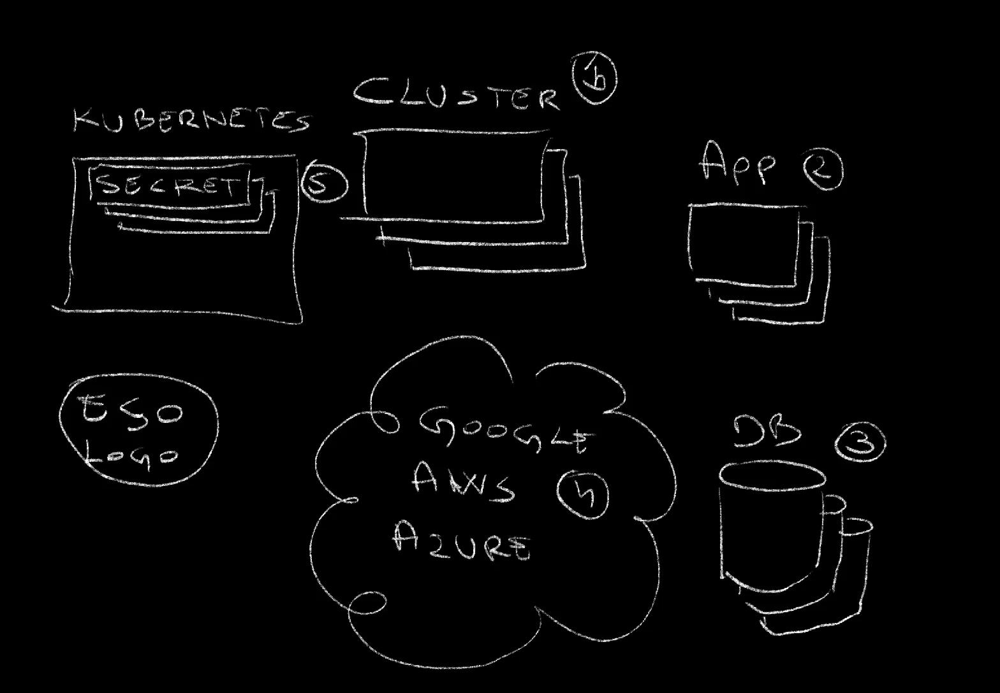
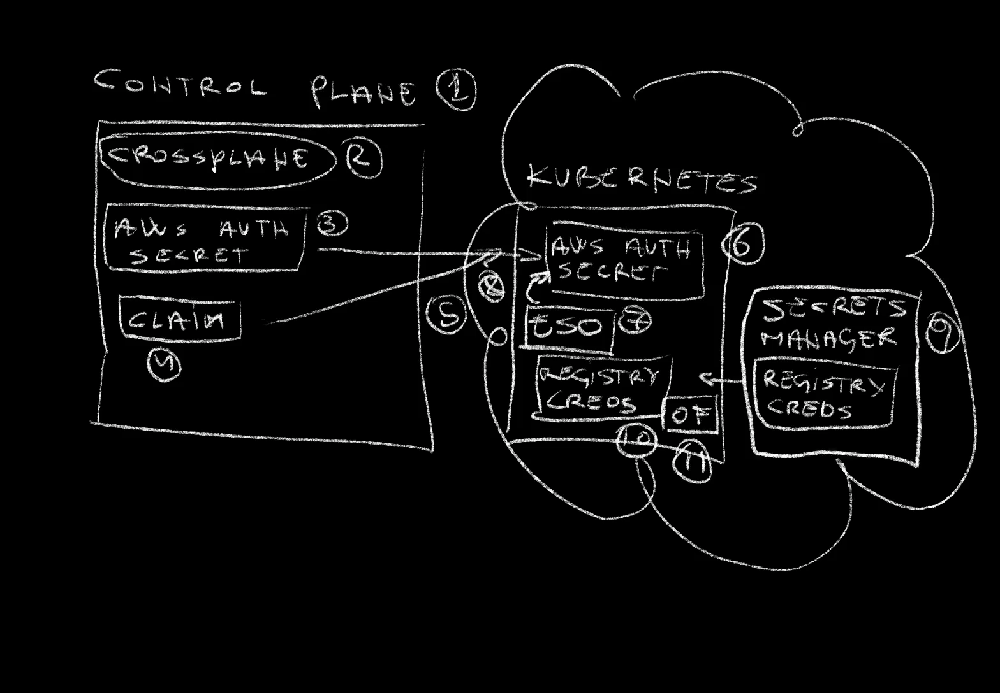
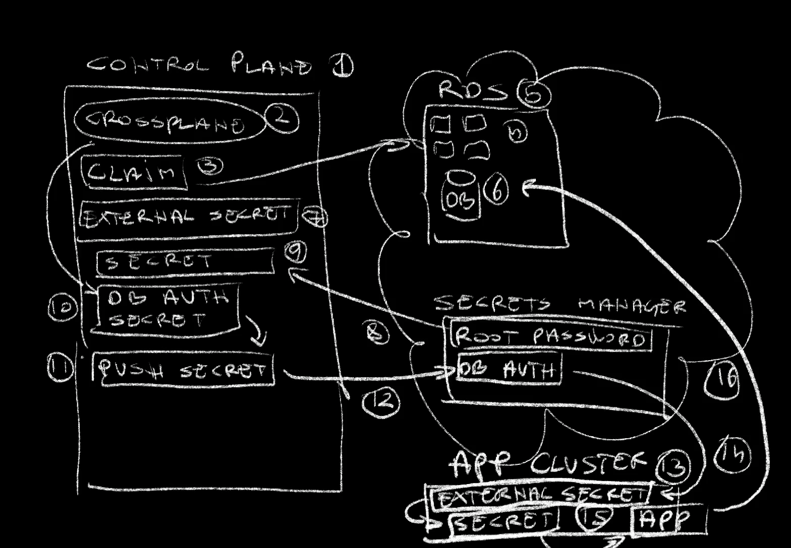

+++
title = 'How to Propagate Secrets Everywhere with External Secrets Operator (ESO) and Crossplane'
date = 2024-03-18T16:00:00+00:00
draft = false
+++

Today I want to talk about secrets.

Don't go away! I know that for many secrets is either boring or you think you already know everything there is to know about managing secrets. I will not talk about obvious "secret stuff". Instead, I want to try to answer some less often asked yet important questions. "**How do we make secrets easy and irrelevant to users?**" "**How do we propagate secrets without making them exposed?**" "**How do we generate secrets in one place but use them in another safely?**"

...and a few others.
<!--more-->



Today's post is different than what you might expect from "secrets". Today I want to explore and solve a few problems I was facing not long ago and that that I believe I **solved without making anyone suffer**.

Let me explain the problem before I show you a possible solution.

## The Problem



I tend to manage a number of resources. There are clusters (1), applications (2), databases (3), and so on and so forth. Most of those generate or consume secrets. Some of them do both.

Some secrets were added manually to a secret store like Google Secret Manager, AWS Secret Manager, Azure Key Vault (4), or whatever else is used. Others, however, are generated as Kubernetes secrets (5) and not stored in any of those secret stores, which, by itself, is a bad situation, which I'll explain in a moment.

So far, you probably do not see a problem. You might be inclined to say that a tool like [External Secrets Operator](https://external-secrets.io) can solve those issues. It can pull secrets from almost any secrets manager. If you're already using it, you might even be aware that it can also push secrets to the secret manager of choice.

> If you're not familiar with External Secrets, you might want to watch [Manage Kubernetes Secrets With External Secrets Operator (ESO)](https://youtu.be/SyRZe5YVCVk).*

If that's what you're thinking, you're right. External Secrets Operator, or any other similar tool solves some of my problem, but not all.

Let me explain what I need.


I have a control plane cluster (1). In my case that's Crossplane, and in yours that might be something else. It could be a simple server from which you run Terraform or a pipeline or anything else from where you do "stuff". It does not matter, for now. What does matter is that Kubernetes clusters are created, managed, and removed from that control plane (2).

Now, those clusters need to have a number of secrets that enable them to interact with outside services (3). A good example would be credentials that must be used to pull or even push images from or to a container image registry (4). Almost every cluster needs some secrets to operate correctly.

Now, those secrets should be pulled from whichever secrets manager I might be using (5) and that means that they all have to have External Secrets Operator (ESO) (6), or which other similar tool I might be using. However, that operator needs a Secret with authentication so that it can fetch secrets from the secrets manager (7).

To be honest, I know that there are many ways to accomplish all that but I tend to complicate my life by treating all those requirements as baseline requirements, as table stakes. When I do create a cluster, all those need to be there **from the start**, and I don't want to have to perform many steps to get them. Ideally, I should say "create a cluster" and, apart from a cluster being created, it should come preloaded with External Secrets Operator, credentials it needs, and secrets pulled. I don't want to work to get those. They just need to get there automagically.

There's more though.

Sometimes I will setup a new database in one place but run an application that consumes that database in another. I might, for example, instruct the control plane to create and manage a database (8) and that will, among other things, result in a secret with database authentication (9) being created in the control plane cluster. I don't need that secret there. I need it somewhere else. I need it in a cluster where the application that consumes that database is running (10). Hence, that secret needs to be moved from one place to another. Actually, that's not correct. It should not be moved but, rather, copied. However, I cannot just copy the secret. That would be silly since I'm supposed to keep secrets in the secret manager. Hence, I need to push (11) that secret to the secret manager from one place, and pull (12) it from the secret manager in another.

There's still more...

I don't want those things to be a **burden to others** creating and managing databases or applications or whatever they are managing. I want all that to be transparent. No! Invisible. I want people to be able to be secure, yet not to have to learn all the details or worry about those things. I should be like "magic". People should be in control of things that matter to them while those that don't should just happen. Secrets or even security in general fall into the "**I don't care, yet I'm safe**" category.

Normally, I have quite a few other requirement but those I discussed so far so be enough to give you an idea what I'm trying to accomplish.

That was enough talk. Let me show you how I solved those issues. Let me show you how to deal with secrets without making anyone suffer.

## Setup

```sh
git clone \
    https://github.com/vfarcic/external-secrets-crossplane-demo

cd external-secrets-crossplane-demo
```

> Replace `[...]` with hyperscaler you'd like to use. Choices are: `aws` and `google`. Please open an issue if you'd like to add support for other hyperscalers.

```sh
export HYPERSCALER=[...]
```

> Nix Shell will install all the tools required for this demo (except Docker). Watch [Say Goodbye to Containers - Ephemeral Environments with Nix Shell](https://youtu.be/0ulldVwZiKA) if you are not familiar with Nix. As an alternative, you can skip using Nix Shell but, in that case you need to make sure that you are all the CLIs used in this demo.

```sh
nix-shell --run $SHELL shell-$HYPERSCALER.nix

chmod +x setup.sh

./setup.sh

source .env
```

## Secrets Between Kubernetes Clusters

Right now, my `kubectl` is pointed to the control plane cluster. Over there, if we take a look at the `crossplane-system` Namespace,...

```sh
kubectl --namespace crossplane-system get secrets
```

The output is as follows.

```
NAME      TYPE   DATA AGE
aws-creds Opaque 3    71s
...
```

...we can see that `aws-creds` is available. I created that secret manually and, hopefully, that's the only Secret I will manage myself.

That Secret contains AWS credentials which, for example, is used by Crossplane to communicate with my AWS account to create Kubernetes clusters, databases, and whatever else I need. At the same time, that Secret is also used by External Secrets Operator to pull secrets I instruct it to pull.

*By the way, I made assumption that you are familiar with Crossplane. If you're not, please watch [Crossplane - GitOps-based Infrastructure as Code through Kubernetes API](https://youtu.be/n8KjVmuHm7A), [How To Shift Left Infrastructure Management Using Crossplane Compositions](https://youtu.be/AtbS1u2j7po), and [Crossplane Composition Functions: Unleashing the Full Potential](https://youtu.be/jjtpEhvwgMw). Even better, watch the [Crossplane tutorial](https://www.youtube.com/playlist?list=PLyicRj904Z99i8U5JaNW5X3AyBvfQz-16) I published as a set of videos.*

The important note, within the context of today's subject, is that I need that Secret to be available in Clusters I will create from this control plane, so let's take a look at one example.

```sh
cat cluster/$HYPERSCALER.yaml
```

The output is as follows.

```yaml
apiVersion: devopstoolkitseries.com/v1alpha1
kind: ClusterClaim
metadata:
  name: cluster
spec:
  id: a-team-cluster
  compositionSelector:
    matchLabels:
      provider: aws
      cluster: eks
  parameters:
    nodeSize: medium
    minNodeCount: 3
    namespaces:
      - dev
      - production
      - crossplane-system
    apps:
      openfunction:
        enabled: true
      externalSecrets:
        enabled: true
        store: true
        awsAccessKeyIDKey: accessKeyID
        awsSecretAccessKeyKey: secretAccessKey        
        secrets:
          - fromSecret: registry-auth
            toSecret: push-secret
            toNamespace: production
    creds:
      name: aws-creds
      namespace: crossplane-system
      keys:
        - creds
        - accessKeyID
        - secretAccessKey
```

This is the part that makes everything simple for the end users.

It is a `ClusterClaim` that creates everything required to run a Kubernetes cluster in AWS. If you followed my work, you already saw a variation of such Crossplane Compositions so I won't go into details.

The interesting part is the `spec.parameters.creds` entry. That one tells Crossplane to take the `aws-creds` Secret and put them into the `crossplane-system` `namespace`. That secret in that cluster should contain the `creds`, `accessKeyID`, and `secretAccessKey` keys.

As a result, Crossplane will create a Cluster and everything it needs, and it will copy the `aws-creds` Secret into that new cluster.

Now, to be clear, that's not the best way to propagate Secrets from one place to another. A better way would be to use External Secrets Operator and instruct it to pull a secret from a Secret Manager. However, to do that, we need External Secrets to be able to authenticate with the secrets manager and that's the primary purpose of copying the `aws-creds` secret.

An important note is that the end-user has freedom to choose which Secret to copy, to which Namespace to place it, and which keys to include. On the other hand, the end user does not need to worry about the details. There's no need to know how it was done and what's the magic behind the process.

Further on, we have the `spec.parameters.apps.openfunction` field which installs **OpenFunction** in that cluster. That one is not directly related to secrets. However, among other things, OpenFunction builds container images and stores them in a registry. For that to work, it needs credentials stored in a Kubernetes Secret.

> If you are not familiar with OpenFunction, please check out [OpenFunction: The Best Way to Run Serverless Functions on Kubernetes?](https://youtu.be/UGysOX84v2c). Since I already explained it over there, I won't go into details of how it works and what it does in this one.

To accomodate the need for a secret with container registry authentication as well as any other secrets we might need, there is the `spec.parameters.apps.externalSecrets` section. In it, we have the `enabled` field that will ensure that External Secrets Operator is deployed to the cluster and the `store` which will create the `ClusterSecretStore` resource. That's the one that needs a secret that allows it to connect to the Secret Manager. That secret is retrieved from the `aws-creds` we explored earlier and all we had to do is specify the **keys**.

Finally, with External Secrets Operator fully operational and capable of fetching secrets from the secrets manager, we are listing all the `secrets` we'd like to pull into the cluster. In this specific, there is one that provides authentication to the container image registry needed for OpenFunction.

Now, you might be thinking that the whole setup is not secure, and you would be right. Secrets are stored safely in the secret manager but anyone could create a cluster with any or all of the secrets. That's where policies would come in. Typically, I would set up **Kyverno** policies that would define who can do what and, more specifically, who can create those cluster claims and which values are allowed. That, combined with the fact that secrets are safely pulled from a secret manager, makes it pretty safe except the fact that Kubernetes Secrets themselves are not always safe, but that would be a subject for a separate video.

The good news is that the end-users do not need to worry about any of the things we discussed. All they have to do is write those thirty something lines of YAML and send it to the Kube API, so let's do just that.

```sh
kubectl --namespace a-team apply \
    --filename cluster/$HYPERSCALER.yaml
```

Now we can observe what's happening with the `crossplane trace` command.

```sh
crossplane beta trace clusterclaim cluster --namespace a-team
```

The output is as follows (truncated for brevity).

```
NAME                                                   SYNCED READY STATUS
ClusterClaim/cluster (a-team)                          True   False Waiting: ...
└─ CompositeCluster/cluster-8f5jz                      True   False Creating: ...
   ├─ InternetGateway/a-team-cluster                   False  -     ReconcileError: ...
   ├─ MainRouteTableAssociation/a-team-cluster         False  -     ReconcileError: ...
   ├─ RouteTableAssociation/a-team-cluster-1a          False  -     ReconcileError: ...
   ├─ RouteTableAssociation/a-team-cluster-1b          False  -     ReconcileError: ...
   ├─ RouteTableAssociation/a-team-cluster-1c          False  -     ReconcileError: ...
   ├─ RouteTable/a-team-cluster                        False  -     ReconcileError: ...
   ├─ Route/a-team-cluster                             False  -     ReconcileError: ...
   ├─ SecurityGroupRule/a-team-cluster                 False  -     ReconcileError: ...
   ├─ SecurityGroup/a-team-cluster                     False  -     ReconcileError: ...
   ├─ Subnet/a-team-cluster-1a                         False  -     ReconcileError: ...
   ├─ Subnet/a-team-cluster-1b                         False  -     ReconcileError: ...
   ├─ Subnet/a-team-cluster-1c                         False  -     ReconcileError: ...
   ├─ VPC/a-team-cluster                               True   False Creating
   ├─ Addon/a-team-cluster-ebs                         True   False Creating
   ├─ ClusterAuth/a-team-cluster                       False  -     ReconcileError: ...
   ├─ Cluster/a-team-cluster                           False  -     ReconcileError: ...
   ├─ NodeGroup/a-team-cluster                         False  -     ReconcileError: ...
   ├─ ProviderConfig/a-team-cluster                    -      -
   ├─ Release/a-team-cluster-app-external-secrets      False  -     ReconcileError: ...
   ├─ Release/a-team-cluster-app-openfunction          False  -     ReconcileError: ...
   ├─ RolePolicyAttachment/a-team-cluster-cni          True   False Creating
   ├─ RolePolicyAttachment/a-team-cluster-controlplane True   False Creating
   ├─ RolePolicyAttachment/a-team-cluster-registry     True   False Creating
   ├─ RolePolicyAttachment/a-team-cluster-service      True   False Creating
   ├─ RolePolicyAttachment/a-team-cluster-worker       True   False Creating
   ├─ Role/a-team-cluster-controlplane                 True   True  Available
   ├─ Role/a-team-cluster-nodegroup                    True   True  Available
   ├─ ProviderConfig/a-team-cluster                    -      -
   ├─ Object/a-team-cluster-creds                      False  -     ReconcileError: ...
   ├─ Object/a-team-cluster-ns-crossplane-system       False  -     ReconcileError: ...
   ├─ Object/a-team-cluster-ns-dev                     False  -     ReconcileError: ...
   ├─ Object/a-team-cluster-ns-production              False  -     ReconcileError: ...
   ├─ Object/a-team-cluster-secret-push-secret         False  -     ReconcileError: ...
   └─ Object/a-team-cluster-secret-store               False  -     ReconcileError: ...
```

Quite a few resources were created in the control plane cluster. Some of them will create and manage AWS resources, others will create "stuff" in the control plane cluster, while some will setup "things" in the new cluster, once it's operational.

You'll notice that quite a few resources are having errors. That's okay. Some of them like, for example, **Namespaces** cannot be created just yet since the **cluster** where they should be applied is not yet operational. Everything will be eventually consistent and, while waiting for that to happen, we can focus on the few of those resources related to the secrets we discussed.

TODO: Thumbnails: 4-WpJ49MDG8, kubernetes-deployment-order-thumbnail.png

> I explored eventuall consistency both from the theoretical and from practical perspectives in [Kubernetes Deployment Order and Dependencies Demystified](https://youtu.be/4-WpJ49MDG8) and [Argo CD Synchronization is BROKEN! It Should Switch to Eventual Consistency!](https://youtu.be/t1Fdse-F9Jw), so please check them out if you'd like to understand better what I meant by it.

We have the `a-team-cluster-creds` resource that is copying the hyperscaler credentials from the control plane cluster to the to the new cluster. That's the one External Secrets needs to authenticate with the secrets manager which, in my case, is in AWS.

Than we have `a-team-cluster-secret-store` that will create External Secrets Store that uses those credentials.

Finally, there is the `a-team-cluster-secret-push-secret` that will be pulled from the secret manager and which will be used by OpenFunction to push container images.

That's it. That was yet another explanation that matter to you, the person that builds services like the one we're exploring today, but not to the end-users. They do not need to care, yet they will be safe.

All that's left to do is to wait until all the resources are up-and-running. Let's fast-forward...

...and trace the claim one more time.

```sh
crossplane beta trace clusterclaim cluster --namespace a-team
```

The output is as follows.

```
NAME                                                   SYNCED READY STATUS
ClusterClaim/cluster (a-team)                          True   False Waiting: ...
└─ CompositeCluster/cluster-8f5jz                      True   False Creating:...
   ├─ InternetGateway/a-team-cluster                   True   True  Available
   ├─ MainRouteTableAssociation/a-team-cluster         True   True  Available
   ├─ RouteTableAssociation/a-team-cluster-1a          True   True  Available
   ├─ RouteTableAssociation/a-team-cluster-1b          True   True  Available
   ├─ RouteTableAssociation/a-team-cluster-1c          True   True  Available
   ├─ RouteTable/a-team-cluster                        True   True  Available
   ├─ Route/a-team-cluster                             True   True  Available
   ├─ SecurityGroupRule/a-team-cluster                 True   True  Available
   ├─ SecurityGroup/a-team-cluster                     True   True  Available
   ├─ Subnet/a-team-cluster-1a                         True   True  Available
   ├─ Subnet/a-team-cluster-1b                         True   True  Available
   ├─ Subnet/a-team-cluster-1c                         True   True  Available
   ├─ VPC/a-team-cluster                               True   True  Available
   ├─ Addon/a-team-cluster-ebs                         True   True  Available
   ├─ ClusterAuth/a-team-cluster                       True   True  Available
   ├─ Cluster/a-team-cluster                           True   True  Available
   ├─ NodeGroup/a-team-cluster                         True   True  Available
   ├─ ProviderConfig/a-team-cluster                    -      -
   ├─ Release/a-team-cluster-app-external-secrets      True   True  Available
   ├─ Release/a-team-cluster-app-openfunction          True   False ReconcileError: ...et.data "issuer.crt">: error calling index: ind
ex of untyped nil
   ├─ RolePolicyAttachment/a-team-cluster-cni          True   True  Available
   ├─ RolePolicyAttachment/a-team-cluster-controlplane True   True  Available
   ├─ RolePolicyAttachment/a-team-cluster-registry     True   True  Available
   ├─ RolePolicyAttachment/a-team-cluster-service      True   True  Available
   ├─ RolePolicyAttachment/a-team-cluster-worker       True   True  Available
   ├─ Role/a-team-cluster-controlplane                 True   True  Available
   ├─ Role/a-team-cluster-nodegroup                    True   True  Available
   ├─ ProviderConfig/a-team-cluster                    -      -
   ├─ Object/a-team-cluster-creds                      True   True  Available
   ├─ Object/a-team-cluster-ns-crossplane-system       True   True  Available
   ├─ Object/a-team-cluster-ns-dev                     True   True  Available
   ├─ Object/a-team-cluster-ns-production              True   True  Available
   ├─ Object/a-team-cluster-secret-push-secret         True   True  Available
   └─ Object/a-team-cluster-secret-store               True   True  Available
```

There is a problem with OpenFunction. It's still `creating` or, to be more precise, Crossplane thinks that it's creating but it's probably up-and-running. It's a massive Helm chart that takes ages to deploy so it's probably timing out. I'll fix that later since it's not relevant for our story.

What does matter is that we can now retrieve Kube config,...

```sh
export KUBECONFIG=$PWD/kubeconfig.yaml

# Execute only if using Google Cloud
gcloud container clusters get-credentials a-team-cluster \
    --region us-east1 --project $PROJECT_ID

# Execute only if using AWS
aws eks update-kubeconfig --region us-east-1 \
    --name a-team-cluster --kubeconfig $KUBECONFIG
```

...and retrieve secrets from the `crossplane-system`.

```sh
kubectl --namespace crossplane-system get secrets
```

The output is as follows.

```
NAME      TYPE   DATA AGE
aws-creds Opaque 3    47m
```

It's there. The `aws-creds` Secret was auto-magically created in this new cluster.

We can also list External Secret's store,...

```sh
kubectl get clustersecretstores
```

The output is as follows.

```
NAME AGE STATUS CAPABILITIES READY
aws  45m Valid  ReadWrite    True
```

...and observe that was created correctly. The fact that the status is `Valid` means that it was able to connect to the secrets manager in AWS.

We can also list external secret resources,...

```sh
kubectl --namespace production \
    get externalsecrets.external-secrets.io
```

The output is as follows.

```
NAME        STORE REFRESH INTERVAL STATUS       READY
push-secret aws   1h               SecretSynced True
```

...and observe that `push-secret` was `Synched`. That means that it succeeded in pulling the registry secret from the secret manager.

We can confirm that as well by retrieving Kubernetes Secrets from the `production` Namespace.

```sh
kubectl --namespace production get secrets
```

The output is as follows.

```
NAME        TYPE   DATA AGE
push-secret Opaque 1    46m
```

The `push-secret` is there. That's the one that contains the authentication to the container image registry OpenFunction needs.

What did we do.


The control plane (1) cluster contained Crossplane (2) and a Secret with the AWS authentication (3). From there on, we applied a Crossplane Composite Claim (4) that created a new Kubernetes cluster (5), in my case EKS with everything that requires. The secret from the control plane was copied to the new cluster (6) and External Secrets Operator (ESO) (7) was installed and configured using that secret (8) to communicate with the AWS secrets manager (9). Finally, External Secrets Operator pulled the secret with credentials for the container image registry (10) which will be used by OpenFunction (OF) (11) that was also installed and configured inside that new cluster.

That's not all though. I have a potentially more interesting example to demonstrate.

## Pushing and Pulling PostgreSQL Database Secrets

Databases are special. They often do not run in the same place where applications are running. For example, I might have an AWS RDS database and an application running in a Kubernetes cluster. If RDS is created with Crossplane, Crossplane will create a Kubernetes Secret with authentication details. However, that Secret will be created in the control plane cluster, the one where Crossplane is running, while the application that should use it might be running in a different cluster. That means that we might need to safely propagate the secret from one cluster to another. Ideally, we should not just copy the secret but push it to the secret manager and pull it from there wherever we need it.

That's exactly what we'll do next, and I already prepared a Composition that'll do just that, so let's take a look at a manifest that will claim it.

```sh
cat db/$HYPERSCALER.yaml
```

The output is as follows.

```yaml
---
apiVersion: devopstoolkitseries.com/v1alpha1
kind: SQLClaim
metadata:
  name: my-db
spec:
  id: my-db
  compositionSelector:
    matchLabels:
      provider: aws
      db: postgresql
  parameters:
    version: "14.10"
    size: medium
    databases:
      - my-db
    secrets:
      storeName: aws
      pullRootPasswordKey: db-password
      pushToStore: true
      pullToCluster: a-team-cluster
      pullToClusterNamespace: production
```

That manifest will create a PostgreSQL server and everything else needed for it to run in AWS, a database inside that server, and quite a few other things. Those are not important right now. What matters is the `spec.parameters.secrets` section.

*Please let me know, through comments, if it would be interesting to explore Database-as-a-Service in one of the videos.*

That Claim will create a Secret in the control plane cluster, the one that runs Crossplane, but, as I already mentioned, we need it elsewhere. That elsewhere could be the new cluster we created earlier. It already contains OpenFunction which is a great way to define, build, and deploy applications which might need to connect to a database. Hence, we need the secret in that other cluster.

The `storeName` defines the External Secret store. That's the one we created earlier when we created the cluster. RDS requires a root password so we're fetching it from the AWS secrets manager through the `pullRootPasswordKey` value. That's similar to what we did before. The interesting part comes next.

The `pushToStore` parameter tells the Composite Resource to push that secret it will create in the control plane cluster to the secret manager, the one in AWS. External Secrets Operator, which we're wrapping here, has the capability not only to pull, but also to push secrets.

Further on, we're telling the Claim to pull the secret from the secret manager into the `production` Namespace inside the `a-team-cluster`.

Let's apply the Claim and see what happens.

First, I'll `unset KUBECONFIG` so that `kubectl` points to the control plane cluster,...

```sh
unset KUBECONFIG
```

...and `apply` the Claim.

```sh
kubectl --namespace a-team apply --filename db/$HYPERSCALER.yaml
```

Let's see what we got with the `crossplane trace` command.

```sh
crossplane beta trace sqlclaim my-db --namespace a-team
```

The output is as follows (truncated for brevity).

```
NAME                                   SYNCED READY STATUS
SQLClaim/my-db (a-team)                True   False Waiting: ...
└─ SQL/my-db-6gwtv                     True   False Creating: ...
   ├─ InternetGateway/my-db            False  -     ReconcileError: ...
   ├─ MainRouteTableAssociation/my-db  False  -     ReconcileError: ...
   ├─ RouteTableAssociation/my-db-1a   False  -     ReconcileError: ...
   ├─ RouteTableAssociation/my-db-1b   False  -     ReconcileError: ...
   ├─ RouteTableAssociation/my-db-1c   False  -     ReconcileError: ...
   ├─ RouteTable/my-db                 False  -     ReconcileError: ...
   ├─ Route/my-db                      False  -     ReconcileError: ...
   ├─ SecurityGroupRule/my-db          False  -     ReconcileError: ...
   ├─ SecurityGroup/my-db              False  -     ReconcileError: ...
   ├─ Subnet/my-db-a                   False  -     ReconcileError: ...
   ├─ Subnet/my-db-b                   False  -     ReconcileError: ...
   ├─ Subnet/my-db-c                   False  -     ReconcileError: ...
   ├─ VPC/my-db                        True   False Creating
   ├─ ProviderConfig/my-db-sql         -      -
   ├─ Object/my-db-schema-my-db        True   True  Available
   ├─ Object/my-db-secret              False  -     ReconcileError: ...
   ├─ Object/my-db-secret-pull         True   True  Available
   ├─ Object/my-db-secret-pull-cluster True   True  Available
   ├─ Object/my-db-secret-push-store   True   True  Available
   ├─ Database/my-db-my-db             False  -     ReconcileError: ...
   ├─ ProviderConfig/my-db             -      -
   ├─ Instance/my-db                   False  -     ReconcileError: ...
   └─ SubnetGroup/my-db                False  -     ReconcileError: ...
```

Among others, we got the `secret-pull` resource that pulls root password from hyperscaler's secret store. Then there is the `push-store` resource that pushes DB creds to the secret store, and, finally, the `pull-cluster` resource that pulls the secret with the creds to the other cluster.

It'll take a while until all the resources are `Available`, so let's fast-forward,...

...and trace the Claim again.

```sh
crossplane beta trace sqlclaim my-db --namespace a-team
```

The output is as follows.

```
NAME                                   SYNCED READY STATUS
SQLClaim/my-db (a-team)                True   True  Available
└─ SQL/my-db-6gwtv                     True   True  Available
   ├─ InternetGateway/my-db            True   True  Available
   ├─ MainRouteTableAssociation/my-db  True   True  Available
   ├─ RouteTableAssociation/my-db-1a   True   True  Available
   ├─ RouteTableAssociation/my-db-1b   True   True  Available
   ├─ RouteTableAssociation/my-db-1c   True   True  Available
   ├─ RouteTable/my-db                 True   True  Available
   ├─ Route/my-db                      True   True  Available
   ├─ SecurityGroupRule/my-db          True   True  Available
   ├─ SecurityGroup/my-db              True   True  Available
   ├─ Subnet/my-db-a                   True   True  Available
   ├─ Subnet/my-db-b                   True   True  Available
   ├─ Subnet/my-db-c                   True   True  Available
   ├─ VPC/my-db                        True   True  Available
   ├─ ProviderConfig/my-db-sql         -      -
   ├─ Object/my-db-schema-my-db        True   True  Available
   ├─ Object/my-db-secret              True   True  Available
   ├─ Object/my-db-secret-pull         True   True  Available
   ├─ Object/my-db-secret-pull-cluster True   True  Available
   ├─ Object/my-db-secret-push-store   True   True  Available
   ├─ Database/my-db-my-db             True   True  Available
   ├─ ProviderConfig/my-db             -      -
   ├─ Instance/my-db                   True   True  Available
   └─ SubnetGroup/my-db                True   True  Available
```

All the resources are available and we can take a look at what we got.

To begin with, there should be the secret with the root password in the control plane cluster since that's the data Crossplane itself needs.

```sh
kubectl --namespace a-team \
    get externalsecrets.external-secrets.io
```

The output is as follows.

```
NAME           STORE REFRESH INTERVAL STATUS       READY
my-db-password aws   1h               SecretSynced True
```

We can see that the External Secret was created which, in turn,...

```sh
kubectl --namespace a-team get secrets
```

The output is as follows.

```
NAME                   TYPE                              DATA AGE
a-team-cluster-cluster connection.crossplane.io/v1alpha1 3    66m
my-db                  Opaque                            4    8m57s
my-db-password         Opaque                            1    15m
```

...created the `my-db` Kubernetes Secret with the password pulled from the secrets manager.

Once the database server was created, Crossplane created a Secret with the IP, port, username, and password that can be used to access the database server. Since we need that info in the other cluster, the one where the application that might use that database should be running, the Composite Resource created the External Secret's Push Secret,...

```sh
kubectl --namespace a-team get pushsecrets
```

The output is as follows.

```
NAME  AGE STATUS
my-db 16m Synced
```

...which, in turned, pushed it to the secrets manager.

We can confirm that's indeed what happened by going to the AWS console and...

...there we go. The secret was indeed created.

Finally, that secret should be pulled into the other cluster, so let's `export KUBECONFIG` again,...

```sh
export KUBECONFIG=$PWD/kubeconfig.yaml
```

...and list all external secrets in the `production` Namespace.

```sh
kubectl --namespace production \
    get externalsecrets.external-secrets.io
```

The output is as follows.

```
NAME        STORE REFRESH INTERVAL STATUS       READY
my-db       aws   1h               SecretSynced True
push-secret aws   1h               SecretSynced True
```

The `my-db` External Secret is there, and you know what that means. Right?

If we list the Secrets in the `production` Namespace,...

```sh
kubectl --namespace production get secrets
```

The output is as follows.

```
NAME        TYPE   DATA AGE
my-db       Opaque 5    45m
push-secret Opaque 1    114m
```

...we can see that it was pulled from the Secrets Manager.

What did we do?


From the control plane cluster (1), the one with Crossplane (2), we created a Composite Claim (3) that created all the AWS resources (4) required to run RDS database (5) server and it created a database inside it (6). Among other things, the server needed a root password, so the Composite Resource created an External Secret (7) which, in turn, pulled the root password from the AWS Secrets Manager (8) and used it to create a Kubernetes Secret (9). Once the database was created, Crossplane created a Secret with the connection info (DB auth secret) (10). Since we needed that info in a Secret in a different cluster, it also created External Secret's (ESO) Push Secret (11), which pushed it to the Secret Manager (12). Finally, it created an External Secret in the cluster where the application should run (13) which, in turn pulled the connection info from the Secret Manager (14) and created a Kubernetes Secret (15). From here on, an application can connect to the database from that cluster by simply mounting the Secret (16).

Huh!

That must have been overwhelming, but, hopefully useful to see what can be done by combining Crossplane with External Secrets and a few other tools.

## Destroy

```sh
./destroy.sh
```
