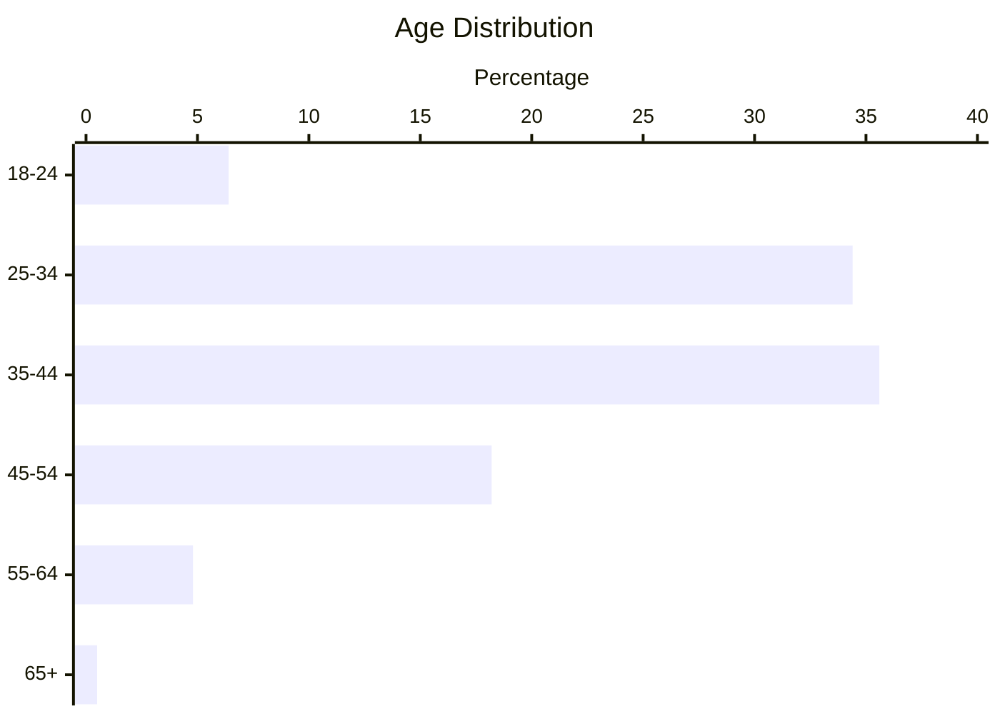
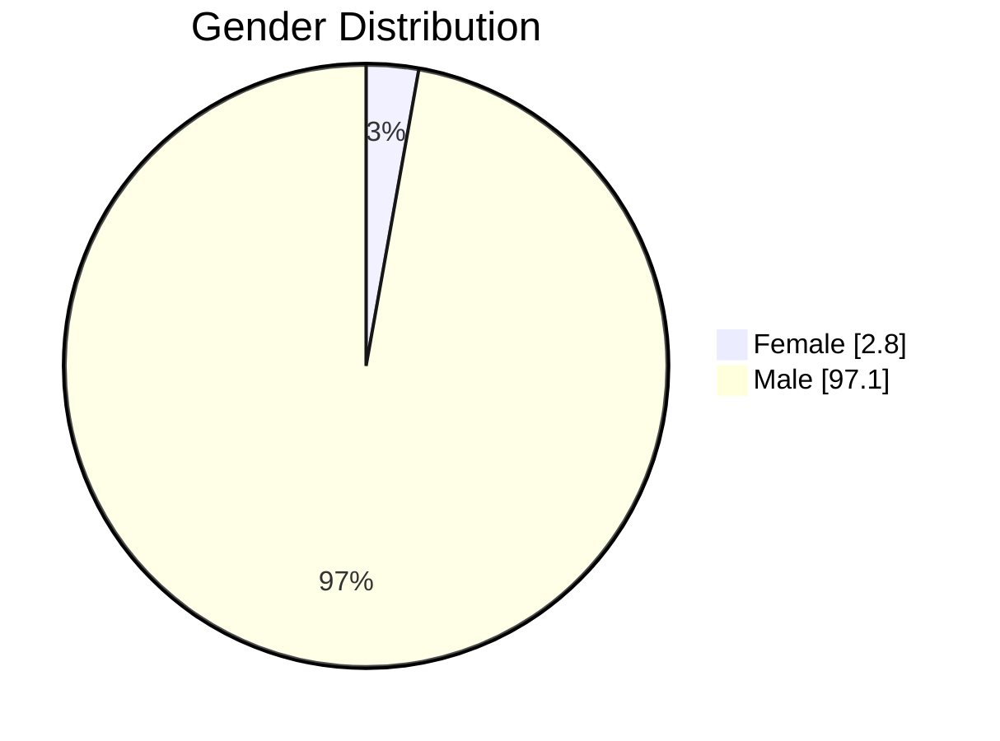
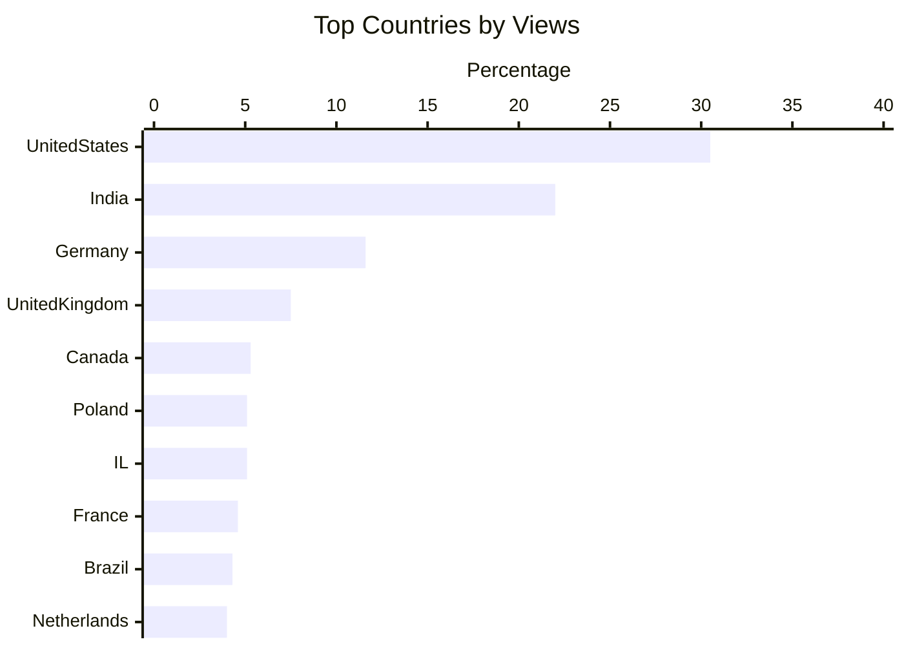

+++
title = "Sponsor DevOps Toolkit"
weight = 300
hidden = false
+++

The following sponsorship options are available on **[The DevOps Toolkit](https://youtube.com/@DevOpsToolkit)** YouTube channel:
1. 30-60 seconds ad inside a video
2. Shout-Out in a live stream
3. Full video review and/or tutorial

The objective behind accepting sponsorships in the **[The DevOps Toolkit](https://youtube.com/@DevOpsToolkit)** channel is to **cover the costs** of equipment and post-production (e.g., editing, animations, etc.). As such, the number of sponsorship spots is **limited**.

## 30-60 seconds ad inside a video

The price of a 30-60 seconds ad inside a video is **900€** (**$1000**). The ad is placed within the first 3 minutes of the video containing a brief description of the project, service, or product and a call to action. Illustrations can be taken from the website or provided by the sponsor. The URL and logo is placed in lower-third of the video as well as in the description.

## Shout-Out in a live stream

The price of a shout-out within a live stream Ask Us Anything is **450€** (**$500**). The Shout-Out is accompanied by a lower-third graphic containing a link, a logo, and, optionally, a "special" message like a discount or a slogan.

## Full video review and/or tutorial

The price for a **video review and/or tutorial** is **4500€** (**$5000**). The video will receive the same treatment as non-sponsored videos with the goal of being as objective as possible. The sponsor cannot influence the content of the sponsored video. The goal of the channel is to be unbiased, critical, and objective, no matter whether the video is sponsored or not.

The **transcript** including all the commands used in the video is published here on [DevOps Toolkit](http://devopstoolkit.live) site.

Only videos about projects, products, or services we find interesting are eligible to be sponsored. As such, requests to sponsor a full video might be rejected.

## Contact

If you are interested in sponsoring the channel, please set up a [meeting](https://calendar.app.google/gDXN62s8dLGx3FpR8) with us and we'll go into details and answer any questions you might have.

<!-- SPONSOR_ANALYTICS_START -->
## Channel Analytics

*Last updated: February 3, 2026.*

### Overview (All Time)

| Metric | Value |
|--------|-------|
| Subscribers | 93,900 |
| Total Views | 5,570,368 |
| Videos | 491 |

### Audience Demographics (Last 90 Days)

### Geographic Distribution (Last 90 Days)

### Engagement (Last 90 Days, Regular Videos Only)

| Metric | Value |
|--------|-------|
| Avg Watch Time | 5m 34s |
| Likes | 3,794 |
| Comments | 215 |
| Shares | 2,165 |
| Engagement Rate | 2.31% |

<!-- SPONSOR_ANALYTICS_END -->