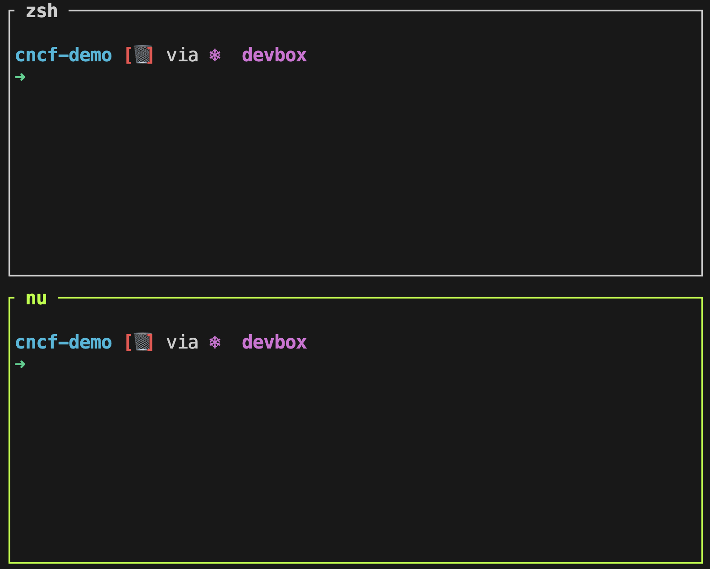

+++
title = 'The Future of Shells with Nushell! Shell + Data + Programming Language'
date = 2024-09-30T15:00:00+00:00
draft = false
+++

Take a look at this.



One the first look, one might conclude that there are two terminal sessions, and that would be correct. On the top is a Zshell session where we can execute commands and scripts. There's **nothing special** about it. The bottom pane, however, is something completely different, yet somehow the same. Over there we can also execute commands and script, but that's only the tip of the iceberg. What you're looking at is not only a shell session but also a programming language focused on managing data. It's a **Shell**, a **language**, **data**, it **works everywhere**, it **contains everything** one might need, and much much more. It is a very special project that might change the way you operate.

It's **Nushell**.

<!--more-->



## Setup

> If you forked the `vfarcic/cncf-demo` repo, you can skip cloning it but you'll have to merge with upstream.

```sh
git clone https://github.com/vfarcic/cncf-demo

cd cncf-demo

git pull

git fetch

git checkout nushell
```

> Make sure that Docker is up-and-running. We'll use it to create a KinD cluster.

> Watch [Master Terminal Multiplexing with Zellij in Minutes!](https://youtu.be/WiFLtcBvGMU) if you are not familiar with Devbox. Alternatively, you can skip Devbox and install all the tools listed in `devbox.json` yourself.

```sh
devbox shell
```

> Watch [Master Terminal Multiplexing with Zellij in Minutes!](https://youtu.be/ZndhImXIGlg) if you are not familiar with Zellij.

```sh
zellij --session nushell --layout zellij.kdl

kind create cluster
```

> Press `Ctrl + p` followed by `↓` to select to the bottom pane. Press the enter key to select the pane.

```sh
nu

chmod +x manuscript/setup/security.nu

chmod +x manuscript/setup/security-orig.nu

def get-hyperscaler [] {
    let hyperscaler = [google aws azure]
        | input list $"(ansi green_bold)Which Hyperscaler do you want to use?(ansi yellow_bold)"

    open settings.yaml
        | upsert hyperscaler $hyperscaler
        | save settings.yaml --force

    $hyperscaler
}
```

> Press `Ctrl + p` followed by `↑` to select to the bottom pane. Press the enter key to select the pane.

> Follow the setup instructions.

## Pretty Outputs with Nushell

I have two terminal sessions opened. The bottom pane is Zshell. It could have been Bash or any other Shell. Within the context of our subject, they all work the same.

Below it is a Nushell session. That's the special one we're exploring today.

> Throughout the rest of the post, some commands are marked to run in the `zsh` and others in the `nu` pane. You'll know which one if it through `[zsh]` and `[nu]` above code blocks. Press `Ctrl + p` followed by `↑` or `↓` to move between panes and press the enter key to select a pane.

Now, let's say that we'd like to list all the files and directories. Anyone who ever used a Shell, at least on macOS and Linux, know that we can do that through the `ls` command.

[zsh]
```sh
ls
```

The output is as follows (truncated for brevity).

```
Dockerfile
README.md
apps
argo-rollouts
argocd
...
```

If we would like to get more information we can add the `-l` argument.

[zsh]
```sh
ls -l
```

The output is as follows (truncated for brevity).

```
total 232
-rw-r--r--  1 viktorfarcic staff   375 Jul  6 00:52 Dockerfile
-rw-r--r--  1 viktorfarcic staff 38761 Jul 19 02:22 README.md
drwxr-xr-x  3 viktorfarcic staff    96 Jul  6 00:52 apps
drwxr-xr-x  3 viktorfarcic staff    96 Jul  6 00:52 argo-rollouts
drwxr-xr-x 36 viktorfarcic staff  1152 Aug 12 19:43 argocd
...
```

As I already said, there is nothing special about the `ls` command. It's boring common knowledge.

Now, let's take a look at how boring looks like in Nushell.

[nu]
```sh
ls
```

The output is as follows (truncated for brevity).

```
╭────┬──────────────────────────────┬──────┬──────────┬──────────────╮
│  # │             name             │ type │   size   │   modified   │
├────┼──────────────────────────────┼──────┼──────────┼──────────────┤
│  0 │ Dockerfile                   │ file │    375 B │ a month ago  │
│  1 │ README.md                    │ file │ 37.9 KiB │ 3 weeks ago  │
│  2 │ apps                         │ dir  │     96 B │ a month ago  │
│  3 │ argo-rollouts                │ dir  │     96 B │ a month ago  │
│  4 │ argocd                       │ dir  │  1.1 KiB │ 2 days ago   │
...
├────┼──────────────────────────────┼──────┼──────────┼──────────────┤
│  # │             name             │ type │   size   │   modified   │
╰────┴──────────────────────────────┴──────┴──────────┴──────────────╯
```

> Please note that I could not figure out how to represent colors in this post so you'll have to use your imagination and pisture most of Nushell commands being full of colors or, even better, follow along and observe the outputs in your own terminal.

The output of *ls* in a Nushell is definitely prettier. It's organized as a table and it's full of colors. That's great but... Who cares? I could assomplish a similar result with *eza* or some other CLI replacement for *ls*. That "better" output alone would not be worth my time and I would not dare to suggest that you should change your favorite shell, whichever it is, just so that you get prettier outputs.

There's much much more to Nushell and it all revolves about... data.

## Structured Data In Nushell

Let's say that we would like to list only files from the current directory and that, for whatever reason, we want to continue using the *ls* command baked into every Shell instead of opting for some more advanced alternative.

How would we do that.

One way to accomplish that would be to list all the files and directories with `ls -l` and pipe the output (`|`) to `egrep` that will keep all lines except those starting with `d`.

[zsh]
```sh
ls -l | egrep -v '^d'
```

The output is as follows.

```
total 232
-rw-r--r--  1 viktorfarcic staff   375 Jul  6 00:52 Dockerfile
-rw-r--r--  1 viktorfarcic staff 38761 Jul 19 02:22 README.md
-rw-r--r--  1 viktorfarcic staff  1000 Aug 13 13:05 devbox.json
-rw-r--r--  1 viktorfarcic staff 27794 Aug 13 13:05 devbox.lock
-rw-r--r--  1 viktorfarcic staff  1341 Jul  6 00:52 devfile.yaml
-rw-r--r--  1 viktorfarcic staff   569 Jul  6 00:52 devspace.yaml
-rwxr-xr-x  1 viktorfarcic staff  1240 Jul  6 00:52 devspace_start.sh
-rw-r--r--  1 viktorfarcic staff   864 Jul  6 00:52 fibonacci.go
-rw-------  1 viktorfarcic staff  2376 Aug 12 17:59 gcp-creds.json
-rw-------  1 viktorfarcic staff   381 Aug 13 01:02 gke_gcloud_auth_plugin_cache
-rw-r--r--  1 viktorfarcic staff  2074 Jul  6 00:52 go.mod
-rw-r--r--  1 viktorfarcic staff 23800 Jul  6 00:52 go.sum
-rw-------  1 viktorfarcic staff  8287 Aug 12 15:46 kubeconfig.yaml
-rw-r--r--  1 viktorfarcic staff  2476 Jul  6 00:52 letter-to-guests.md
-rw-r--r--  1 viktorfarcic staff  1984 Jul  6 00:52 main.go
-rw-r--r--  1 viktorfarcic staff  1126 Jul  6 00:52 openfga.go
-rw-r--r--  1 viktorfarcic staff  1367 Jul  6 00:52 opentelemetry.go
-rw-r--r--  1 viktorfarcic staff   889 Jul  6 00:52 ping.go
-rw-r--r--  1 viktorfarcic staff   295 Jul  6 00:52 renovate.json
-rw-r--r--  1 viktorfarcic staff   669 Jul  6 00:52 root.go
-rw-r--r--  1 viktorfarcic staff   327 Aug 13 23:57 settings.yaml
-rw-r--r--  1 viktorfarcic staff 55340 Jul 19 02:21 solution.md
-rw-r--r--  1 viktorfarcic staff  3572 Jul  6 00:52 video.go
```

That worked, somehow. What we saw is the cornerstone of Linux and, pretty much, any other operating system.

Much of Linux is based on the concept of pipes. One command generates an output that is passed as input of the next command. That's truly great, but there is a problem though.

All the commands output text and only text and that leads to often complicated situations. Text is hard to filter, even harder to transform, and close to impossible to sort. Still, that's how everything works and, over time, we learned how to deal with it.

Nushell has a very different approach to piping. Commands do not output text. They **output data**. When we executed `ls` and got that pretty table, we saw a graphical representation of data that can be manipulated in a very different way that text.

Let's try to accomplish the same objective of retrieving only files but, instead of using *grep* to sift through lines of text, try to accomplish the same outcome by leveraging the fact that Nushell outputs data.

To do that, we can, for example, use the *where* command baked into Nushell.

Let's see what  `where` has to offer.

[nu]
```sh
where --help
```

The output is as follows.

```
Filter values based on a row condition.

This command works similar to 'filter' but allows extra shorthands for working with
tables, known as "row conditions". On the other hand, reading the condition from a variable is
not supported.

Search terms: filter, find, search, condition

Usage:
  > where <row_condition>

Flags:
  -h, --help - Display the help message for this command

Parameters:
  row_condition <condition>: Filter condition.

Examples:
  Filter rows of a table according to a condition
  > [{a: 1} {a: 2}] | where a > 1
  ╭───┬───╮
  │ # │ a │
  ├───┼───┤
  │ 0 │ 2 │
  ╰───┴───╯

  Filter items of a list according to a condition
  > [1 2] | where {|x| $x > 1}
  ╭───┬───╮
  │ 0 │ 2 │
  ╰───┴───╯

  List all files in the current directory with sizes greater than 2kb
  > ls | where size > 2kb

  List only the files in the current directory
  > ls | where type == file

  List all files with names that contain "Car"
  > ls | where name =~ "Car"

  List all files that were modified in the last two weeks
  > ls | where modified >= (date now) - 2wk

  Find files whose filenames don't begin with the correct sequential number
  > ls | where type == file | sort-by name --natural | enumerate | where {|e| $e.item.name !~ $'^($e.index + 1)' } | each {|| get item }

  Find case-insensitively files called "readme", without an explicit closure
  > ls | where ($it.name | str downcase) =~ readme

  same as above but with regex only
  > ls | where name =~ '(?i)readme'
```

The first thing you'll notice is that the available help is much better organized and easier to digest than with other commands, especially those baked into shells.

The second thing you'll notice is that there aren't many arguments, not only in the `where` but any other Nushell comamnd. As you'll see later, there is no need for endless arguments since Nushell relies on passing data through pipes to accomplish the end result.

Still, the goal is not to admire Nushell help but, instead, to retrieve only files from the current directory.

We can do that by executing `ls` which, as we already saw, retrieves all files and directories and outputs them not as a text but as data. From there on, we can pipe (`|`) that data to the `where` command that will filter it by the column `type` being equal (`==`) to `file`.

```sh
ls | where type == "file"
```

The output is as follows.

```
╭────┬──────────────────────────────┬──────┬──────────┬─────────────╮
│  # │             name             │ type │   size   │  modified   │
├────┼──────────────────────────────┼──────┼──────────┼─────────────┤
│  0 │ Dockerfile                   │ file │    375 B │ a month ago │
│  1 │ README.md                    │ file │ 37.9 KiB │ 3 weeks ago │
│  2 │ devbox.json                  │ file │  1,000 B │ a day ago   │
│  3 │ devbox.lock                  │ file │ 27.1 KiB │ a day ago   │
│  4 │ devfile.yaml                 │ file │  1.3 KiB │ a month ago │
│  5 │ devspace.yaml                │ file │    569 B │ a month ago │
│  6 │ devspace_start.sh            │ file │  1.2 KiB │ a month ago │
│  7 │ fibonacci.go                 │ file │    864 B │ a month ago │
│  8 │ gcp-creds.json               │ file │  2.3 KiB │ 2 days ago  │
│  9 │ gke_gcloud_auth_plugin_cache │ file │    381 B │ 2 days ago  │
│ 10 │ go.mod                       │ file │  2.0 KiB │ a month ago │
│ 11 │ go.sum                       │ file │ 23.2 KiB │ a month ago │
│ 12 │ kubeconfig.yaml              │ file │  8.1 KiB │ 2 days ago  │
│ 13 │ letter-to-guests.md          │ file │  2.4 KiB │ a month ago │
│ 14 │ main.go                      │ file │  1.9 KiB │ a month ago │
│ 15 │ openfga.go                   │ file │  1.1 KiB │ a month ago │
│ 16 │ opentelemetry.go             │ file │  1.3 KiB │ a month ago │
│ 17 │ ping.go                      │ file │    889 B │ a month ago │
│ 18 │ renovate.json                │ file │    295 B │ a month ago │
│ 19 │ root.go                      │ file │    669 B │ a month ago │
│ 20 │ settings.yaml                │ file │    327 B │ a day ago   │
│ 21 │ solution.md                  │ file │ 54.0 KiB │ 3 weeks ago │
│ 22 │ video.go                     │ file │  3.5 KiB │ a month ago │
╰────┴──────────────────────────────┴──────┴──────────┴─────────────╯
```

We still got a nice table-like representation of the output but, this time, it shows only files. That's awesome yet, you might be thinking that alone is not worth the switch. it's true that *grep* might not be as intuitive and user friendly as what we just saw with Nushell. Still, you're used to *grep* and it works everywhere. That is still not enough to make a switch to Nushell interesting, especially since it is not POSIX compliant.

For now, what matters, is that, unlike the "typical" Shells that always output text, Nushell outputs data. That data might originate from almost any format and Nushell will transform it into it's own that can be used as input for other commands through pipes.

Let's go a bit further and say that we would like to retrieve only files that are bigger than one kilobyte. How would we do that?

In the "traditional" Zshell or Bash, such a simple task would already become complicated. We're probably need to abandon *ls*  command and switch to *find* and, once we do that, start practicing witchcraft and wizardry to get what we're looking for. Alternatively, we might be able to accomplish the object with some replacement for *ls*  or *find*.

With Nushell, such a task is very easy.

We can list the files and directories with `ls`, pipe it to one `where` statement that will filter data from *ls* so that only files are retrieved, and, finally, pipe that data to a second `where` statement that will filter data so that only the rows with the column `size` greater than `1kb` are retrieved.

> From here on, all the rest of the command should be executed in the `nu` pane.

```sh
ls | where type == "file" | where size > 1kb
```

The outpu is as follows.

```
╭────┬─────────────────────┬──────┬──────────┬─────────────╮
│  # │        name         │ type │   size   │  modified   │
├────┼─────────────────────┼──────┼──────────┼─────────────┤
│  0 │ README.md           │ file │ 37.9 KiB │ 3 weeks ago │
│  1 │ devbox.lock         │ file │ 27.1 KiB │ a day ago   │
│  2 │ devfile.yaml        │ file │  1.3 KiB │ a month ago │
│  3 │ devspace_start.sh   │ file │  1.2 KiB │ a month ago │
│  4 │ gcp-creds.json      │ file │  2.3 KiB │ 2 days ago  │
│  5 │ go.mod              │ file │  2.0 KiB │ a month ago │
│  6 │ go.sum              │ file │ 23.2 KiB │ a month ago │
│  7 │ kubeconfig.yaml     │ file │  8.1 KiB │ 2 days ago  │
│  8 │ letter-to-guests.md │ file │  2.4 KiB │ a month ago │
│  9 │ main.go             │ file │  1.9 KiB │ a month ago │
│ 10 │ openfga.go          │ file │  1.1 KiB │ a month ago │
│ 11 │ opentelemetry.go    │ file │  1.3 KiB │ a month ago │
│ 12 │ solution.md         │ file │ 54.0 KiB │ 3 weeks ago │
│ 13 │ video.go            │ file │  3.5 KiB │ a month ago │
╰────┴─────────────────────┴──────┴──────────┴─────────────╯
```

So far, what Nushell does looks similar to SQL except that output of any Nushell command is data and that data is passed from one command to another through pipes.

Let's continue.

Actually, we won't continue with Zshell since the previous task proved to be too complex for my little brain. So, I'm abandoning Zshell and we'll continue with Nushell.

Let's say that we'd like not only to retrieve files bigger than one kb but also to sort those files by size.

We could do that by repeating the previous command and piping the resulting data to the the `sort-by` command.

```sh
ls | where type == "file" | where size > 1kb | sort-by size
```

The output is as follows.

```
╭────┬─────────────────────┬──────┬──────────┬─────────────╮
│  # │        name         │ type │   size   │  modified   │
├────┼─────────────────────┼──────┼──────────┼─────────────┤
│  0 │ openfga.go          │ file │  1.1 KiB │ a month ago │
│  1 │ devspace_start.sh   │ file │  1.2 KiB │ a month ago │
│  2 │ devfile.yaml        │ file │  1.3 KiB │ a month ago │
│  3 │ opentelemetry.go    │ file │  1.3 KiB │ a month ago │
│  4 │ main.go             │ file │  1.9 KiB │ a month ago │
│  5 │ go.mod              │ file │  2.0 KiB │ a month ago │
│  6 │ gcp-creds.json      │ file │  2.3 KiB │ 2 days ago  │
│  7 │ letter-to-guests.md │ file │  2.4 KiB │ a month ago │
│  8 │ video.go            │ file │  3.5 KiB │ a month ago │
│  9 │ kubeconfig.yaml     │ file │  8.1 KiB │ 2 days ago  │
│ 10 │ go.sum              │ file │ 23.2 KiB │ a month ago │
│ 11 │ devbox.lock         │ file │ 27.1 KiB │ a day ago   │
│ 12 │ README.md           │ file │ 37.9 KiB │ 3 weeks ago │
│ 13 │ solution.md         │ file │ 54.0 KiB │ 3 weeks ago │
╰────┴─────────────────────┴──────┴──────────┴─────────────╯
```

That's great. We got out files filtered and sorted by size, but that's not really what I wanted. I made a mistake. What I actually need is to sort files by size, from the biggest to the smallest and the output in front of me sorts them ascending, from smallest to largest.

We can fix that with the *reverse* command.

While we're at it, let's split the commands into multiple lines so that they are easier to digest.

There's `ls` and, if this would be Zshell or Bash, we'd add backslash at the end of the line. We don't have to do that with Nushell. We can just press the enter key to go to the next line, pipe it to the first `where` statement that applies the filter so that only files are kept... new line... pipe to the second `where`... new line... pipe to `sort-by`, new line, and, finally, `reverse` the order.

```sh
ls
    | where type == "file"
    | where size > 1kb
    | sort-by size
    | reverse
```

The output is as follows.

```
╭────┬─────────────────────┬──────┬──────────┬─────────────╮
│  # │        name         │ type │   size   │  modified   │
├────┼─────────────────────┼──────┼──────────┼─────────────┤
│  0 │ solution.md         │ file │ 54.0 KiB │ 3 weeks ago │
│  1 │ README.md           │ file │ 37.9 KiB │ 3 weeks ago │
│  2 │ devbox.lock         │ file │ 27.1 KiB │ a day ago   │
│  3 │ go.sum              │ file │ 23.2 KiB │ a month ago │
│  4 │ kubeconfig.yaml     │ file │  8.1 KiB │ 2 days ago  │
│  5 │ video.go            │ file │  3.5 KiB │ a month ago │
│  6 │ letter-to-guests.md │ file │  2.4 KiB │ a month ago │
│  7 │ gcp-creds.json      │ file │  2.3 KiB │ 2 days ago  │
│  8 │ go.mod              │ file │  2.0 KiB │ a month ago │
│  9 │ main.go             │ file │  1.9 KiB │ a month ago │
│ 10 │ opentelemetry.go    │ file │  1.3 KiB │ a month ago │
│ 11 │ devfile.yaml        │ file │  1.3 KiB │ a month ago │
│ 12 │ devspace_start.sh   │ file │  1.2 KiB │ a month ago │
│ 13 │ openfga.go          │ file │  1.1 KiB │ a month ago │
╰────┴─────────────────────┴──────┴──────────┴─────────────╯
```

Wasn't that something? If you don't think that what we just did is awesome, I dare you to accomplish the same result with `ls` and `grep` and whatever else you might be used to use.

Do it. Do it now. I'll wait...

Was it a success? If it was, how many sessions with a psychologist do you think you'll need to supress that experience?

Now, let's take a look at the commands available in Nushell.

```sh
help commands
```

The output is as follows (truncated for brevity).

```
╭───────────────────┬──────────┬──────────────┬───────────────────────────────────┬─────╮
│ # │     name      │ category │ command_type │               usage               │ ... │
├───────────────────┼──────────┼──────────────┼───────────────────────────────────┼─────┤
│ 0 │ alias         │ core     │ keyword      │ Alias a command (with optional... │ ... │
│ 1 │ all           │ filters  │ built-in     │ Test if every element of the...   │ ... │
│ 2 │ ansi          │ platform │ built-in     │ Output ANSI codes to change...    │ ... │
│ 3 │ ansi gradient │ platform │ built-in     │ Add a color gradient (using ANSI  │ ... │
│ 4 │ ansi link     │ platform │ built-in     │ Add a link (using OSC 8 escape... │ ... │
│ 5 │ ansi strip    │ platform │ built-in     │ Strip ANSI escape sequences...    │ ... │
...
├───────────────────┼──────────┼──────────────┼───────────────────────────────────┼─────┤
│ # │     name      │ category │ command_type │               usage               │ ... │
╰───────────────────┴──────────┴──────────────┴───────────────────────────────────┴─────╯
```

That's nice. We can easily see what's available, but that's not why we executed it. Instead, I want to demonstrate, one more time, that all Nushell commands output data that can be manipulated.

We can, for example, retrieve only the `ls` command by listing all `commands` and piping the output data into `where` so that we filter it by `name` being equal to `ls`.

```sh
help commands | where name == ls
```

The output is as follows.

```
╭───┬──────┬────────────┬──────────────┬───────────────────────────────────────────┬─────╮
│ # │ name │  category  │ command_type │                           usage           │ ... │
├───┼──────┼────────────┼──────────────┼───────────────────────────────────────────┼─────┤
│ 0 │ ls   │ filesystem │ built-in     │ List the filenames, sizes, and modific... │ ... │
╰───┴──────┴────────────┴──────────────┴──────────────────────────────────────────────┴─────╯
```

Here's an important thing to note. When we retrieve a list of data, we can only a fraction of the information. That's similar to executing *kubectl get pods* that returns only a few fields for each Pods. If we'd like to see all the data related to the Pod, we should retrieve one Pod (and output it to YAML or JSON).

Nushell has does something similar if only one record is retrieved. Let's take a look by repeating the previous command and piping it to `first` that limits the output to only one row of data.

```sh
help commands | where name == ls | first
```

The output is as follows.

```
╭──────────────┬───────────────────────────────────────────────────────────────────╮
│ name         │ ls                                                                │
│ category     │ filesystem                                                        │
│ command_type │ built-in                                                          │
│ usage        │ List the filenames, sizes, and modification times of items in...  │
│              │ ╭───┬───────────────────┬──────────────────────┬──────────┬─────╮ │
│ params       │ │ # │       name        │         type         │ required │ ... │ │
│              │ ├───┼───────────────────┼──────────────────────┼──────────┼─────┤ │
│              │ │ 0 │ ...pattern        │ one_of(glob, string) │ false    │ ... │ │
│              │ │ 1 │ --help(-h)        │ switch               │ false    │ ... │ │
│              │ │ 2 │ --all(-a)         │ switch               │ false    │ ... │ │
│              │ │ 3 │ --long(-l)        │ switch               │ false    │ ... │ │
│              │ │ 4 │ --short-names(-s) │ switch               │ false    │ ... │ │
│              │ │ 5 │ --full-paths(-f)  │ switch               │ false    │ ... │ │
│              │ │ 6 │ --du(-d)          │ switch               │ false    │ ... │ │
│              │ │ 7 │ --directory(-D)   │ switch               │ false    │ ... │ │
│              │ │ 8 │ --mime-type(-m)   │ switch               │ false    │ ... │ │
│              │ ╰───┴───────────────────┴──────────────────────┴──────────┴─────╯ │
│              │ ╭───┬─────────┬────────╮                                          │
│ input_output │ │ # │  input  │ output │                                          │
│              │ ├───┼─────────┼────────┤                                          │
│              │ │ 0 │ nothing │ table  │                                          │
│              │ ╰───┴─────────┴────────╯                                          │
│ search_terms │ dir                                                               │
╰──────────────┴───────────────────────────────────────────────────────────────────╯
```

We got all the information about the `ls` command and we can go even further and, let's say, pipe all that to `get params` so that only the *params* field is returned.

```sh
help commands | where name == ls | first | get params
```

The output is as follows (truncated for brevity).

```
╭───┬───────────────────┬──────────────────────┬──────────┬──────────────────────────╮
│ # │       name        │         type         │ required │       description        │
├───┼───────────────────┼──────────────────────┼──────────┼──────────────────────────┤
│ 0 │ ...pattern        │ one_of(glob, string) │ false    │ The glob pattern to use. │
│ 1 │ --help(-h)        │ switch               │ false    │ Display the help mess... │
│ 2 │ --all(-a)         │ switch               │ false    │ Show hidden files        │
│ 3 │ --long(-l)        │ switch               │ false    │ Get all available colu...│
│ 4 │ --short-names(-s) │ switch               │ false    │ Only print the file na...│
│ 5 │ --full-paths(-f)  │ switch               │ false    │ display paths as absol...│
│ 6 │ --du(-d)          │ switch               │ false    │ Display the apparent d...│
│ 7 │ --directory(-D)   │ switch               │ false    │ List the specified dir...│
│ 8 │ --mime-type(-m)   │ switch               │ false    │ Show mime-type in type...│
╰───┴───────────────────┴──────────────────────┴──────────┴──────────────────────────╯
```

We can also use a short-hand syntax and just envelop the whole command in braces (`(` and `)`) and just say to get `.params` without the need to pipe it to the `get` command.

```sh
(help commands | where name == ls | first).params
```

The output should be the same.

We can use the same logic to manipulate data in files.

For example, we can `open settings.yaml` file. 


```sh
open settings.yaml
```

The output is as follows.

```
╭─────────────┬─────────────────────────────────────────────────────╮
│             │ ╭─────┬────────╮                                    │
│ gitOps      │ │ app │ argocd │                                    │
│             │ ╰─────┴────────╯                                    │
│             │ ╭───────────┬──────────────────────╮                │
│ ingress     │ │ host      │ 35.196.249.89.nip.io │                │
│             │ │ classname │ contour              │                │
│             │ ╰───────────┴──────────────────────╯                │
│ image       │ index.docker.io/vfarcic/cncf-demo                   │
│ tag         │ v0.0.1                                              │
│ templates   │ helm                                                │
│             │ ╭─────────────┬────────╮                            │
│ crossplane  │ │ destination │ google │                            │
│             │ ╰─────────────┴────────╯                            │
│             │ ╭────────┬────────────────────────────────────────╮ │
│ production  │ │        │ ╭───────────────┬────────────────────╮ │ │
│             │ │ azure  │ │ resourceGroup │ dot-20240123133515 │ │ │
│             │ │        │ │ location      │ eastus             │ │ │
│             │ │        │ ╰───────────────┴────────────────────╯ │ │
│             │ │        │ ╭───────────┬────────────────────╮     │ │
│             │ │ google │ │ projectId │ dot-20240812152736 │     │ │
│             │ │        │ ╰───────────┴────────────────────╯     │ │
│             │ ╰────────┴────────────────────────────────────────╯ │
│ hyperscaler │ azure                                               │
╰─────────────┴─────────────────────────────────────────────────────╯
```

Now, let's say that we are not interested in the whole file but, instead, we'd like to retrieve the *production.azure.location* field. Since the `open` command, just as any other, outputs data, we can get what we need by piping the data from the `settings.yaml` file to the `get` command to retrieve what we need.

```sh
open settings.yaml | get production.azure.location
```

The output is as follows.

```
eastus
```

So far, we saw that Nushell is pretty and that it outputs everything as data. There's more though.

## Nushell Auto-Complete, Error Detection

Nushell also comes with all the bangs and whistles that we would normally need to add ourselves to whichever other Shell we might be using.

For example, I can type `let hyperscaler = get-hyper` and...

```sh
let hyperscaler = get-hyper
```

Press the `tab` key to autocomplete it into `get-hyperscaler`

```sh
let hyperscaler = get-hyperscaler
```

The output allows us to select one of three hyperscalers.

```
Which Hyperscaler do you want to use?:
  google
> aws
  azure
```

Besides the auto-complete functionality which, by the way, works better than in any other Shell, you might be wondering what is the *get-hyperscaler* command we just executed. Does Nushell come with a baked-in command that allows us to select between *google*, *aws*, and *azure*? The short answer is no. It doesn't. We'll see how that happened in a moment. For now, what matters, is that auto-complete works.

As a side note, the `let` instruction we just executed is how we declare varibles so now `hyperscaler` contains the value `aws` or whatever you might have selected.

There's more though. Nushell also comes with excellent error messages. Unlike "typical" Shell commands that often leave you wondering what the heck is wrong, Nushell, due to reasons we'll discuss later, know exactly what's wrong and is not afraid to tell you.

Here's an example.

```sh
print $"You selected (ansi magenda_bold)($hyperscaler)(ansi reset)"
```

The output is as follows.

```
Error: nu::shell::type_mismatch

  × Type mismatch.
   ╭─[entry #3:1:28]
 1 │ print $"You selected (ansi magenda_bold)($hyperscaler)(ansi reset)"
   ·                            ──────┬─────
   ·                                  ╰── Unknown ansi code
   ╰────
```

That command was supposed to output text with the value of the *hyperscaler* variable painted as magenta and in bold. However, Nushell correctly identified that I made a mistake and used an Ansi code that does not exist. I wrote `magenda_bold` instead of *magenta_bold*. It should be *t*  instead of *d*.

Now that we know what exactly is wrong, we can correct it and run it again.

```sh
print $"You selected (ansi magenta_bold)($hyperscaler)(ansi reset)"
```

The output is as follows.

```
You selected aws
```

So far, we saw that Nushell it pretty, that it always outputs data. It also contains all the bells and whistles we would normally need to add ourselves. That would be auto-complete we saw earlier, but there are quite a few others. Finally, we saw that it know what exactly is wrong, if anything.

Now, what does that level of information output on errors remind you of? Where have you seen something like that?

If the answer is "languages like JavaScript, Python, Go, and others", you are right. Nushell is also a language.

## Nushell Language

Here's the thing. Everything we executed so far we're commands piped to each other. Right? Well... That is correct, but wrong at the same time.

While those commands act as commands, they are also acting as instructions in a **programming language**.

A set of instructions is validated and compiled before they are executed. Nushell is just as much a programming language as it is a Shell and we saw a glimpse of it when we executed the command that threw an error. We got a notification that something is wrong before that something was even executed.

We'll see a better example of that in a moment. For now, let's take take a look and apply a definition I prepared.

```sh
def get-hyperscaler [] {
    let hyperscaler = [google aws azure]
        | input list $"(ansi green_bold)Which Hyperscaler do you want to use?(ansi yellow_bold)"

    open settings.yaml
        | upsert hyperscaler $hyperscaler
        | save settings.yaml --force

    $hyperscaler
}
```

That code block defined a new definition that acts as a new command. It defines a variable `hyperscaler` that will get the output of the command. That command is a list of values (`google`, `aws`, `azure`) which is piped to `input` with the text that acts as the header. That text will be in `green` and `bold` and whatever comes after it will be in `yellow`.

Fuurther on, we're opening (`open`) the `settings.yaml` file that outputs YAML as data. Then we are upserting the value of the `hyperscaler` variable into the `hyperscaler` key in that YAML and, finally, we'll `save` the data back to the `settings.yaml` file.

At the very end, we'll output the value of the `hyperscaler` variable back to whomever will call that new command.

Let's run it.

```sh
get-hyperscaler
```

The output is as follows.

```
Which Hyperscaler do you want to use?:
  google
  aws
> azure

azure
```

We can see the message, the header, and the choices. If, for example, we select `azure`, it is output back to the caller. Also, the *settings.yaml* file was updated. There's probably no need to validate that really happened. You should trust me by now.

Now, let's take a look at the source code of a `nu` script.

```sh
cat manuscript/setup/security-orig.nu
```

The output is as follows (truncated for brevity).

```sh
#!/usr/bin/env nu

rm .env

source common.nu

start-script

header "Hyperscalers"

let hyperscaler = get-hyperscaler
...
```

It would take a lot of time to go through that whole code here. I'll leave that to you to do at some later time. Instead, we'll can jump straight into running it.

```sh
./manuscript/setup/security-orig.nu
```

The output is as follows.

```
Error: nu::parser::variable_not_found

  × Variable not found.
     ╭─[/Users/viktorfarcic/code/cncf-demo/manuscript/setup/security-orig.nu:271:24]
 270 │
 271 │ $"export INGRESS_HOST=($ingress_ip)\n" | save --append .env
     ·                        ─────┬─────
     ·                             ╰── variable not found.
 272 │ open settings.yaml
     ╰────
```

If that was, for example, a Bash script, it would start running immediately and throw an, often incomprehensible, error once it reaches the instruction with it. Nushell did not execute anything. It tried to compile that script and detected that the `ingress_ip` was not found. Nothing was run since there would be no point in running anything. It behaved in the same way as if we, for example, wrote that in Go. It could not run if it could not be compiled.

Fortunately, I have a version of that same script that does work, so let's run that one instead.

```sh
./manuscript/setup/security.nu
```

This time it worked. There is no compile-time error in the code.

> Cancel the execution by pressing `ctrl + c`.

There's more though. We can run non-Nushell commands as well.

## Nushell External Commands

Let us, for example, use `kubectl` to run a Pod and...

```sh
kubectl run something --image=something
```

...retrieve all the Pods across `--all-namespaces`.

```sh
kubectl get pods --all-namespaces
```

The output is as follows.

```
NAMESPACE          NAME                                       READY STATUS  RESTARTS AGE
kube-system        coredns-7db6d8ff4d-d6nnk                   1/1   Running 0        3h52m
kube-system        coredns-7db6d8ff4d-h6hfx                   1/1   Running 0        3h52m
kube-system        etcd-kind-control-plane                    1/1   Running 0        3h52m
kube-system        kindnet-xc4p6                              1/1   Running 0        3h52m
kube-system        kube-apiserver-kind-control-plane          1/1   Running 0        3h52m
kube-system        kube-controller-manager-kind-control-plane 1/1   Running 0        3h52m
kube-system        kube-proxy-wn6sn                           1/1   Running 0        3h52m
kube-system        kube-scheduler-kind-control-plane          1/1   Running 0        3h52m
local-path-storage local-path-provisioner-988d74bc-hjxcb      1/1   Running 0        3h52m
```

There was nothing special about those commands. Any Shell command can be run in Nushell. We call them external commands.

There's a catch though. External commands, those not baked into Nushell, do not output results as data. That list of Pods is a text blob. That's what *kubectl* does. It outputs text just as almost any other shell command does.

We can change that by piping the text output of `kubectl get pods` to `detect columns`.

```sh
kubectl get pods --all-namespaces | detect columns
```

The output is as follows.

```
╭───┬─────────────┬───────────────────────────────────┬───────┬─────────┬──────────┬─────╮
│ # │  NAMESPACE  │               NAME                │ READY │ STATUS  │ RESTARTS │ AGE │
├───┼─────────────┼───────────────────────────────────┼───────┼─────────┼──────────┼─────┤
│ 0 │ kube-system │ coredns-7db6d8ff4d-d6nnk          │ 1/1   │ Running │ 0        │ 3h5 │
│   │             │                                   │       │         │          │ 3m  │
│ 1 │ kube-system │ coredns-7db6d8ff4d-h6hfx          │ 1/1   │ Running │ 0        │ 3h5 │
│   │             │                                   │       │         │          │ 3m  │
│ 2 │ kube-system │ etcd-kind-control-plane           │ 1/1   │ Running │ 0        │ 3h5 │
│   │             │                                   │       │         │          │ 3m  │
│ 3 │ kube-system │ kindnet-xc4p6                     │ 1/1   │ Running │ 0        │ 3h5 │
│   │             │                                   │       │         │          │ 3m  │
│ 4 │ kube-system │ kube-apiserver-kind-control-plane │ 1/1   │ Running │ 0        │ 3h5 │
│   │             │                                   │       │         │          │ 3m  │
│ 5 │ kube-system │ kube-controller-manager-kind-c... │ 1/1   │ Running │ 0        │ 3h5 │
│   │             │                                   │       │         │          │ 3m  │
│ 6 │ kube-system │ kube-proxy-wn6sn                  │ 1/1   │ Running │ 0        │ 3h5 │
│   │             │                                   │       │         │          │ 3m  │
│ 7 │ kube-system │ kube-scheduler-kind-control-plane │ 1/1   │ Running │ 0        │ 3h5 │
│   │             │                                   │       │         │          │ 3m  │
│ 8 │ local-pa... │ local-path-provisioner-988d74bc-hj│ 1/1   │ Running │ 0        │ 3h5 │
│   │             │                                   │       │         │          │ 3m  │
╰───┴─────────────┴───────────────────────────────────┴───────┴─────────┴──────────┴─────╯
```

The `detect columns` instruction parsed the text, figured out column headers and column values and used that to generate Nushell data. The end results is a table similar to other tables we saw earlier.

From there on, we can use that data in the same way we would use data generated by Nushell commands. WE can, for example, use the `where` instruction to retrieve only Pods with the `status` other than `Running`.

```sh
kubectl get pods --all-namespaces
    | detect columns
    | where status != "Running"
```

The output is as follows.

```
Error: nu::shell::name_not_found

  × Name not found
   ╭─[entry #88:3:13]
 2 │     | detect columns
 3 │     | where status != "Running"
   ·             ───┬──
   ·                ╰── did you mean 'STATUS'?
   ╰────
```

That was one more example of Nushell's precise error messages. WE can see that there is no `status` column and that we should probably have set it to `STATUS` (all uppercase).

Let's correct that and run it again.

```sh
kubectl get pods --all-namespaces
    | detect columns
    | where STATUS != "Running"
```

The output is as follows.

```
╭───┬───────────┬───────────┬───────┬──────────────────┬──────────┬─────╮
│ # │ NAMESPACE │   NAME    │ READY │      STATUS      │ RESTARTS │ AGE │
├───┼───────────┼───────────┼───────┼──────────────────┼──────────┼─────┤
│ 0 │ default   │ something │ 0/1   │ ImagePullBackOff │ 0        │ 17s │
╰───┴───────────┴───────────┴───────┴──────────────────┴──────────┴─────╯
```

This time it worked and we go the list of all the Pods with statuses other than *Running*.

We can continue from there and, for example, retrieve only the `NAME` column from those Pods.

```sh
kubectl get pods --all-namespaces
    | detect columns
    | where STATUS != "Running"
    | get NAME
```

The output is as follows.

```
╭───┬───────────╮
│ 0 │ something │
╰───┴───────────╯
```

Finally, if we would like to take a closer look at the Pod that is missbehaving, we can assign it all to the `pod_name` variable,...

```sh
let pod_name = (kubectl get pods --all-namespaces
    | detect columns
    | where STATUS != "Running"
    | get NAME
    | first)
```

...and use it `describe` the Pod.


```sh
kubectl describe pod $pod_name
```

The output is as follows (truncated for brevity).

```
Name:             something
Namespace:        default
Priority:         0
Service Account:  default
Node:             kind-control-plane/172.18.0.2
Start Time:       Wed, 14 Aug 2024 22:36:29 +0200
Labels:           run=something
Annotations:      <none>
...
Events:
  Type     Reason     Age                From               Message
  ----     ------     ----               ----               -------
  Normal   Scheduled  70s                default-scheduler  Successfully assigned...
  Normal   Pulling    30s (x3 over 70s)  kubelet            Pulling image "something"
  Warning  Failed     29s (x3 over 69s)  kubelet            Failed to pull image...
  Warning  Failed     29s (x3 over 69s)  kubelet            Error: ErrImagePull
  Normal   BackOff    3s (x4 over 68s)   kubelet            Back-off pulling image...
  Warning  Failed     3s (x4 over 68s)   kubelet            Error: ImagePullBackOff
```

We're almost done. There is only one more thing I want to show.

## Nushell Works Everywhere

You might find some Nushell syntax a bit confusing if you're coming from other Shells.

For example, if we would like to split a single command into multiple lines, we would normally write backslash (`\`) at the end of each.

```sh
kubectl --namespace kube-system \
        get pods
```

The output is as follows.

```
Error: nu::parser::input_type_mismatch

  × Command does not support nothing input.
   ╭─[entry #99:2:9]
 1 │ kubectl --namespace kube-system \
 2 │         get pods
   ·         ─┬─
   ·          ╰── command doesn't support nothing input
   ╰────
```

That does not work in Nushell and your first reaction could be to ask "why?". Using backslash at the end of a line is widely accepted way to separate lines of a single command. It would make perfect sense for Nushell to respect it, but it doesn't. The reason is Nushell's commitment to work anywhere and while backslash can be used to separate or, to be more precise, remove new lines in Linux and macOS, in Windows it is used to separate directories. So, Nushell does not allow it since it would not work in Windows. Instead, we can use braces to define a single command that can span any number of lines. Here it goes.

```sh
(
    kubectl --namespace kube-system
        get pods
)
```

The output is as follows.

```
NAME                                         READY   STATUS    RESTARTS   AGE
coredns-7db6d8ff4d-d6nnk                     1/1     Running   0          3h56m
coredns-7db6d8ff4d-h6hfx                     1/1     Running   0          3h56m
etcd-kind-control-plane                      1/1     Running   0          3h56m
kindnet-xc4p6                                1/1     Running   0          3h56m
kube-apiserver-kind-control-plane            1/1     Running   0          3h56m
kube-controller-manager-kind-control-plane   1/1     Running   0          3h56m
kube-proxy-wn6sn                             1/1     Running   0          3h56m
kube-scheduler-kind-control-plane            1/1     Running   0          3h56m
```

Here's another example of something that works everywhere.

In macOs we can use *open* to open a file or a web page or anything else. However, *open* does not work in Linux and we to use *xdg-open* instead. I have no idea whether it work in Windows since I haven't used it in a while and, given my age, I cannot remember anything older than a year (sometimes even a day).

In Nushell, the command that opens something is `start` and it works on any operating system.

```sh
start "https://devopstoolkit.live"
```

That, for example, opened *devopstoolkit.live* in my default browser. It's a site with text versions of my videos.

I think that was enough. I could talk about Nushell for a very long time. It is a big project with a lot to explore. I'll leave that to you and finish it with pros and cons.

## Nushell Pros and Cons

Shells haven't changed much since the dawn of time. Nushell tries to change that. It tries to reimagine what shells could be if we would design them today and if we would not be bound by standards, like POSIX, established decades ago.

Nushell merges at least three distinct capabilities. It takes a shell and makes it **interactive**. It combines it with a **fully-typed scripting language** that feels like a combination of TypeScript and SQL. Finally, and, perhaps, most importantly, it is a **data processing system**. Piping is based on passing structured data instead of passing text blobs. Every Nushell command outputs data and (almost) every command accepts data as input.

Nevertheless, there are good and bad sides to Nushell, so let's discuss them, starting with cons.

**Cons:**
* Not POSIX compliant
* Replaces familiar commands
* Completion of external commands

The first and, potentially, the biggest negative thing is that Nushell is **not POSIX compliant**. If you have a set of shell commands written in some markdown there is a chance that they will not be executable in Nushell. A good example is backslash at the end of a line in multi-line commands. That, and quite a few other instructions will not work in Nushell and that can be annoying since you'll have to learn a new syntax. Now, to be clear, there are, potentially, good reasons why Nushell made those choices. Nevertheless, you might need to prepare for the initial shock even though it will reap benefits later.

The second issue is that Nushell **replaces common shell commands** with alternatives that are not compatible. For example, `ls` in Nushell lists files and directories just as `ls` in any other shell does. However, if you try to use arguments like `-l` you will quickly realize that they do not work in Nushell. Hence, you cannot start doing in Nushell what you were doing before in hopes that you'll gradually switch to it. To be fair, most of those arguments are not needed in Nushell commands and, once you get used to it, you will not miss them. Still, there is going to be some adjustment period.

Finally, the last negative thing I chose today is that **completion** might be hard to get for **external commands** (those not baked into Nushell). It's not impossible but it is often not trivial either.

There are other negatives but those three tend to be the biggest ones, at least for me.

As for pros...

**Pros:**
* Structured data
* Language
* Bangs and whistles
* Works everywhere
* Tables
* Fewer arguments

The first thing you'll hopefully love about Nushell is that it outputs **structured data**. That might not seem like a big thing at first but once you get used to it and once you realize that you do not need tools like `grep`, `aws`, `jq`, `yq`, and so on, you'll start to appreciate the difference between outputs being text blobs and structured data.

Then we have the **language**. Nushell is as much a language as it is a Shell and those two are integrated seamesly. It's like using TypeScript combined with SQL. It requires a bit of an investment to wrap your head around it but, once you do, you might not be able to go back to writing Bash scripts. It is not going to replace languages for writing applications but it certainly can replace your scripts. It's a big improvement, as long as you're willing to learn it. It's not hard and it can be digested fast so the learning curve is very shallow.

Being a language, brings typical benefits that do not exist or a badly done in other shells. There is type checker, useful error messages, background compilation, and so on and so forth.

Next, Nushell comes with all the **bangs and whistless** you might except from a Shell. There is completion, at least for internal commands, syntax highlighting, and other things that are typically not baked in other shells but can be added through plugins or other means. That does not make Nushell "special" by itself. What makes it special is that those are baked in so we do not need to bother spending time to add them as is the case with, let's say, Zshell.

Then we have the fact that it **works everywhere**. It can run on macOS, on Windows, and on Linux. That ability is one of the reasons why Nushell chose syntax that, in some cases, might look strange. Still, the committment to work everywhere is an important one.

What else...

Oh yeah. Outputs to the screen are formated as **tables** making them very easy to digest. There are cases when table formatting might not be the best choice like in the case of YAML or JSON and, in those situations, we can always add the `--raw` argument that outputs data as-is which results in the same look and feel as POSIX shells.

Finally, over time, one gets to appreciate that Nushell commands tend to have **fewer arguments**, not because Nushell developers were lazy but bacause there is no need for as many arguments as in other shells. Since it deals with structured data, operations that are often fine tuned through endless arguments tend to be accomplished through pipes.

Nushell is well-made, it is logical, and it is a very solid Shell and language.

The main question we might need to answer is whether we want a shell that is, at the same time, a programming language and that is focused on structured data. I say "yes!" to that.

Nushell is not a variation of an existing shell but a true conceptual change in how we work. I strongly recommend it. Try it out and let me know what you think.

Thank you for watching.
See you in the next one.
Cheers.

## Destroy

> Press `Ctrl + q` to quit Zellij

```sh
zellij delete-session nushell

kind delete cluster

exit

git checkout main
```

