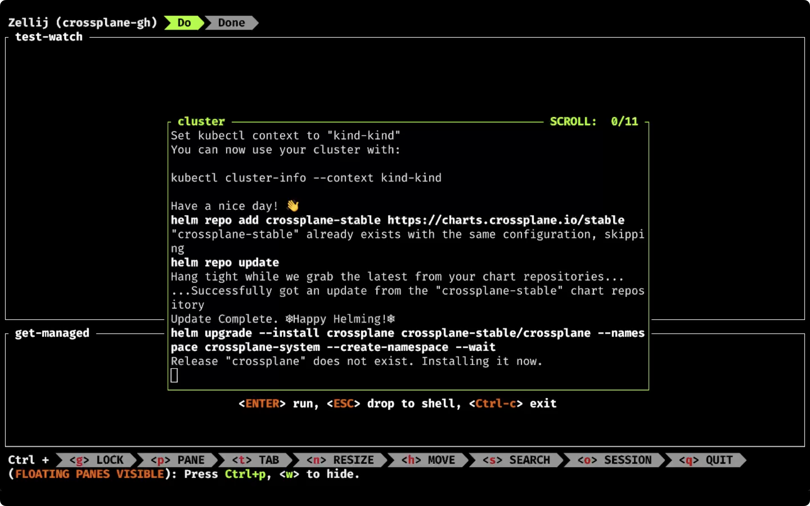

+++
title = 'Master Terminal Multiplexing with Zellij in Minutes!'
date = 2024-09-01T16:00:00+00:00
draft = false
+++

Let me show you something exciting, something that makes me much more productive.

I am going to execute command `zellij`, specify a name of the session (`crossplane-kubernetes`), and a layout (`test-layout.kdl`), and...

> Do NOT run the command that follows. It is only a preview. We'll set it all up later.

```sh
zellij --session crossplane-kubernetes --layout test-layout.kdl
```

BOOM!



There's everything I need, nicely split into tabs and panes.

<!--more-->



Cluster is being created in a floating pane (`cluster`). If we fast forward a few moments, we can see that the floating pane dissapeared once the cluster is fully operational, leaving us with two panes.

The top one (`test-watch`) is waiting for me to press the enter key and, once I do, it starts running tests continuously. If I move to the bottom tab and press the enter key, it starts watching for managed resources.

Once I'm finished developing, I can switch to the second tab (`Done`) and press the enter key to destroy everything I created so far.

I'm done working and I haven't even thouched my mouse. **Everything I need** is waiting for me and all the operations I performed were done through keyboard shortcuts.

The tool that enabled all that is Zellij.

Let's talk about it.

## What is Zellij?

Zellij describes itself as "**A terminal workspace with batteries included**." That makes sense if you are not already familiar with tmux. If you are, you can think of Zellij as a better or, at least, easier version of it. On the other hand, if you are not already using or, at least, familiar with tmux it is a "**terminal multiplexer**". That, probably, does not mean much, so let me explain what terminal multiplexers are.

Terminal multiplexers are types of applications that can be used to create **pseudo terminal sessions**.

Now, while I'm saying that I realized that "pseudo terminal sessions" might be confusing as well so let's skip all the mambo jumbo type of explanations, and show you Zellij and, thought it how multiplexer terminals work and what they do.

## Setup

```sh
git clone https://github.com/vfarcic/crossplane-kubernetes

cd crossplane-kubernetes

git checkout zellij
```

> Make sure that Docker is up-and-running. We'll use it to create a KinD cluster.

> Watch https://youtu.be/WiFLtcBvGMU if you are not familiar with Devbox. Alternatively, you can skip Devbox and install all the tools listed in `devbox.json` yourself.

```sh
devbox shell
```

## Terminal Multiplexing With Zellij

Let's start a new `zellij` session.

```sh
zellij --session crossplane-kubernetes
```


That does not look very exciting. It looks like a "normal" terminal session, except for the top and bottom panes.

At the top is the session name and the list of tabs, while the bottom pane contains the list of common shortcuts. We'll explore both of those soon. For now, what matters is that you are in control and you can, for example, choose not to display the bottom pane with the shortcuts. Once you develop muscle memory you will probably not need it. We'll keep it, for now.

From here on, we can execute commands just as we would in a normal terminal. When I start working on this specific project, the first action is to create a cluster and install and configure everything. I already automated all that with `just`, so let's just execute it.

```sh
just cluster-create
```


That operation will take a few minutes to complete, leaving me with two options. I can watch something on YouTube, or I can open a second tab and do some work while waiting for the current process to finish.

While watching YouTube is often a good idea, after all, that's what you're doing right now, I'll go with the second option.

Pressing `Ctrl + t` gives us additional shortcuts related to operations related to tabs. We can see that `<t> TAB` is selected in the bottom menu and that some, not all, shortcuts related to tabs are listed below it.

Since we want to open a `New` tab, we can see that the shortcut is `n`, so let's press it.

> Press `Ctrl + t` followed by `n`.

A new tab is opened and we can, for example, output `README` to see instructions related to this project.

```sh
cat README.md
```


Now, let's get back to the first tab by pressing `Ctrl + t` again. Now we can move between tabs by pressing left and right arrow keys so let me press the left arrow followed by the enter key to select the tab we selected.

> Press `Ctrl + t` followed by `←`. Press the enter key to select the pane.

While the cluster is being created, we can open a second pane by pressing `Ctrl + p` and, just as with tabs, the `n` button to create a new one.

> Press `Ctrl + p` followed by `n`.

It might be nice to create a third pane below the first one so let's press `Ctrl + p` to select panes, then the left arrow key to move to the left pane and, finally, `d` to create a new pane below it (or down from it).

> Press `Ctrl + p` followed by `←` and `d`.


Actually, this does not seem right. I don't really need the pane on the right. Two panes split horizontally should be enough, for now. So, we'll remove the right pane by pressing `Ctrl + p`, followed by the right arrow key to move to the right pane, and `x` to remove it.

> Press `Ctrl + p` followed by `→` and `x`.


Something might be wrong with the packages that are being deployed to the cluster, so let's check them out.

```sh
kubectl get pkgrev
```


It seems okay, but we might not need the lower pane to be half of the screen. Let's reduce it's size by pressing `Ctrl + n` to resize it, followed with the bottom arrow. Once we're done making it smaller, we can press the enter key to select that pane.

> Press `Ctrl + n` followed by `↓`. Press the enter key to select the pane.


By now, the cluster should be fully operational, so let's move to the top pane by pressing `Ctrl + p`, the arrow key up, and the enter key to select it.

> Press `Ctrl + p` followed by `↑`. Press the enter key to select the pane.

Now we can run test watcher.

```sh
just test-watch
```


Since my tests are creating some managed resources before running asserts, I often want to see which resources are created. So, we'll move to the bottom pane and you already know how to do that. Press the `Ctrl + p` button followed by the arrow down key and the enter key to select the pane.

> Press `Ctrl + p` followed by `↓`. Press the enter key to select the pane.

Now we can watch managed resources by executing `viddy`, which is a watcher, and `kubectl get managed`.

```sh
viddy kubectl get managed
```


Let's say that we would like to take a closer look at the tests in the top pane by putting it into the full screen mode. We can do that by pressing `Ctrl + p` followed with the arrow key up to move up and pressing `f` for fullscreen.

> Press `Ctrl + p` followed by `↑` and `f`.


The top pane now occupies almost the entire screen.

Once we're finished marveling at the test results, we can go out of the full screen by repeating the process; `Ctrl + p` followed by `f`.

> Press `Ctrl + p` followed by `f`.

We can also move panes by pressing `Ctrl + h` followed by the arrow key down to move the top pane down.

> Press `Ctrl + h` followed by `↓`. Press the enter key to select the pane.


Once we're finished, we can get out of the current session by pressing `Ctrl + o` followed by `d` to detach from it.

> Press `Ctrl + o` followed by `d`.

The output is as follows.

```
Session detached
```

The important note is that we did not close the session but only detached from it. It's still there, we're just not attached from it.

We can confirm that's truly the case by listing all the sessions.

```sh
zellij list-sessions
```

The output is as follows.

```
crossplane-kubernetes [Created 16m 16s ago]
```

There is only one session. Once you start working with Zellij, you'll probably have many detached sessions and you will be able to attach to any of them and continue where you left.

Since we have only one detached session, we can attach back to it by executing `zellij attach` without specifying the name of the session we want to attach to.

```sh
zellij attach
```


We can see that both panes are still running processes that were active before we detached from the session.

So far, we used the default shortcuts and plugins. I like sane defaults and rarely change them, so my Zellij configuration is untouched (for now). If we do want to remap some bindings or add some plugins, all we have to do is create a new config file. But, since its silly to start from scratch, we can dump the existing configuration to a file and modify it.

Since both panes in the first tab are doing something or, to be more precise, waiting for something, we'll switch to the second tab by pressing `Ctrl + t` followed by the arrow right key to move to the right tab and the enter key to select the only pane in it.

> Press `Ctrl + t` followed by `→`. Press the enter key to select the pane.

Now we can get the current config by executing `zellij setup --dump-config`.

```sh
zellij setup --dump-config
```

The output is as follows (truncated for brevity).

```
keybinds {
    ...
    pane {
        bind "Ctrl p" { SwitchToMode "Normal"; }
        bind "h" "Left" { MoveFocus "Left"; }
        bind "l" "Right" { MoveFocus "Right"; }
        bind "j" "Down" { MoveFocus "Down"; }
        bind "k" "Up" { MoveFocus "Up"; }
        bind "p" { SwitchFocus; }
        bind "n" { NewPane; SwitchToMode "Normal"; }
        bind "d" { NewPane "Down"; SwitchToMode "Normal"; }
        bind "r" { NewPane "Right"; SwitchToMode "Normal"; }
        bind "x" { CloseFocus; SwitchToMode "Normal"; }
        bind "f" { ToggleFocusFullscreen; SwitchToMode "Normal"; }
        bind "z" { TogglePaneFrames; SwitchToMode "Normal"; }
        bind "w" { ToggleFloatingPanes; SwitchToMode "Normal"; }
        bind "e" { TogglePaneEmbedOrFloating; SwitchToMode "Normal"; }
        bind "c" { SwitchToMode "RenamePane"; PaneNameInput 0;}
    }
    ...
}

plugins {
    tab-bar location="zellij:tab-bar"
    status-bar location="zellij:status-bar"
    strider location="zellij:strider"
    compact-bar location="zellij:compact-bar"
    session-manager location="zellij:session-manager"
    welcome-screen location="zellij:session-manager" {
        welcome_screen true
    }
    filepicker location="zellij:strider" {
        cwd "/"
    }
}

..
// on_force_close "quit"
...
// simplified_ui true
..
// default_shell "fish"
...
// theme "default"
```

We can see all the key bindings, the list of plugins, and some general settings like whether to detach or quit on forced close, whether to use a simplified UI, the default Shell, the theme, and so on and so forth.

If we'd send the output of that file to *~/.config/zellij/config.kdl* all we'd have to do is change any of those parameters and... enjoy.

Now, let's say that we're finished working and would like to destroy the cluster we created. We could do that by moving to the first tab. Instead of using arrow keys, we'll do that slightly differently this time. We'll press `Ctrl + t` followed by number `1`.

> Press `Ctrl + t` followed by `1`.

That is especially useful if we have many tabs. If we'd like to move from the first to the fifth tab, instead of pressing the arrow right key four times, we can just press `5`.

Next, we'll press `Ctrl + c` to stop watching tests,...

> Press `Ctrl + c` to stop watching tests.

...and type `just cluster-destroy` to execute yet another Just task that will get us back to square zero.

```sh
just cluster-destroy
```

We should probably stop watching managed resources as well, so let's press `Ctrl + p` followed by arrow up key to move to the top pane and press the enter key to select it.

> Press `Ctrl + p` followed by `↑`. Press the enter key to select the pane.

Now we can stop that process as well by pressing `Ctrl + c`.

> Press `Ctrl + c` to stop watching managed resources.

We're done, so let's exit Zellij session by pressing `Ctrl + q`.

> Press `Ctrl + q`.

We're out. We're done working, but there are a few other Zellij-related features we should explore.

We might want to leave the session we just quit active so that we can attach to it again, or we might want to delete it. We can do the latter by listing all the sessions,...

```sh
zellij list-sessions
```

The output is as follows.

```
crossplane-kubernetes [Created 22m 31s ago] (EXITED - attach to resurrect)
```

...and executing `zellij delete-session` followed by the name of the session and forcing deletion.

```sh
zellij delete-session crossplane-kubernetes --force
```

Here comes, in my opinion, the most important feature of Zellij; the ability to define the layout.

While it's great to be able to create panes and tabs and move them around and tweak them to get the environment that is just right, those operations are tedious. I don't want to waste precious minutes every time I start working. I have two options to avoid that. I can do it once, just as we did so far, and keep the session alive forever and ever so that we can simply attach to it and continue where we left. That's not always a good idea since, at least in my case, I want a repeatable process that always starts from scrach. I need to create a cluster first, then jump into the tab with panes to run tests, watch managed resources, and a few other things, and, finally, a different tab from where I can destroy everything. If I would be attaching to an existing session, I'd always start from the end and not from the start.

A potentially better alternative is to create a **layout for each project**. Here's the one I use in this repo.

```sh
cat test-layout.kdl
```

The output.

```
layout {
    default_tab_template {
        pane size=1 borderless=true {
            plugin location="zellij:tab-bar"
        }
        children
        pane size=2 borderless=true {
            plugin location="zellij:status-bar"
        }
    }
    tab name="Do" focus=true {
        floating_panes {
            pane {
                name "cluster"
                command "just"
                args "cluster-create"
                close_on_exit true
                x "20%"
                y "20%"
                width "60%"
                height "60%"
                focus true
            }
        }
        pane {
            name "test-watch"
            command "just"
            args "test-watch"
            start_suspended true
            size "70%"
        }
        pane {
            name "get-managed"
            command "viddy"
            args "kubectl" "get" "managed"
            start_suspended true
            size "30%"
        }
    }
    tab name="Done" {
        pane {
            name "cluster-destroy"
            command "just"
            args "cluster-destroy"
            start_suspended true
        }
    }
}
```

At the top is the `default_tab_template` which will be applied to any tab defined below or created during a session.

Over there, we have a `borderless` pane with `size` `1`, meaning that it will occupy one row. That pane will display `tab-bar` which is a plugin that shows, as the name suggests, the top bar we already saw.

At the bottom of that section there is a second pane, this time with `size` `2`, Just as the top one, that one is also based on a plugin except that, this time, it is the `status-bar`. That's the one with shortcuts and statuses.

In between those two is the single entry `children` which, essentially, means "put there whichever other panes you define". So, all the panes we'll define will be between those two panes defined in the default tab.

Further on we have the `Do` tab which should be focused by default.

That one will start with `floating_panes` which, as the name suggests, are... well... floating. We haven't explored floating panes just yet. They're awesome and we'll see them in action soon.

Inside the `floating_panes` section is a single pane named `cluster` which will automatically execute `just` command with the `cluster-create` argument. Since the purpose of that one is to create a cluster and dissapear once it's done, it is set to `close_on_exit`. Than there are coordinates (`x`, `y`) and the size (`width`, `height`). Finally, that pane should be in `focus`.

Furth on, we have two "normal" panes, one that executes test watcher (`test-watch`) and the other that observes managed resource (`get-managed`).

All that is the first tab where I spend most of my time. I might create additional panes depending on what I'm doing but, those three are always there since I always need them.

Then there is the second tab called `Done`. As the name suggests, that's where I go when I'm done working and will execute the `just` command with `cluster-destroy` argument.

Now, all those tabs, except the floating one, have `start_suspended` set to `true`. That means that the commands specified for those panes will not be executed automatically but only after we press the enter key.

Let's see that layout in action by executing `zellij` to start a new session `crossplane-kubernetes` with the layout defined in the `test-layout.kdl` file.

```sh
zellij --session crossplane-kubernetes --layout test-layout.kdl
```

Look at that.


There is a floating pane in the middle that started executing the process that creates and configures the cluster. I did not have to do anything but wait until it's done.


The moment the process executed in the floating pane finished, the pane itself dissapeared leaving us with two panes, both waiting for us to press the enter key to start the predefined processes.

Let's do just that.

Press the enter key to start executing the tests watcher.

> Press the enter key

Next, we'll move to the bottom pane by pressing `Ctrl + p` followed by the arrow down and enter keys to select it and another enter key to execute the predefined process that watches for managed resources.

> Press `Ctrl + p` followed by `↓`. Press the enter key to select the pane.

> Press the enter key


Now, let's say that we finished writing and testing code and that we'd like to destroy everything. That's what the second tab is for, so let's move there by pressing `Ctrl + t` followed with number `2`.

> Press `Ctrl + t` followed by `2`.

The "destroy everything" command is waiting for us to press the enter key so let's just press it.

> Press the enter key


A few moments later, we are done and can exit the session by pressing `Ctrl + q`.

> Press `Ctrl + q`.

Wasn't that an awesome and streamlined experience?

There's much more to Zellij and I'll leave it to you to explore the rest yourself. All I'll say is that Zellij is awesome and that I strongly recommend it. It's so great that I won't even do the typical pros and cons section. There isn't a single thing I don't like about it. It's a no brainer if you need multiple panes or tabs when working in a terminal.

Thank you for watching.
See you in the next one.
Cheers.

## Destroy

```sh
git checkout main
```

