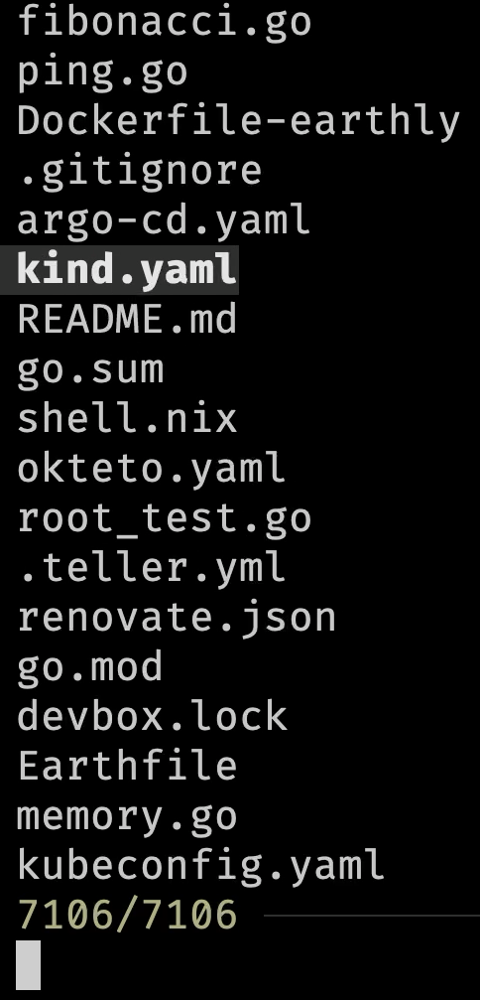
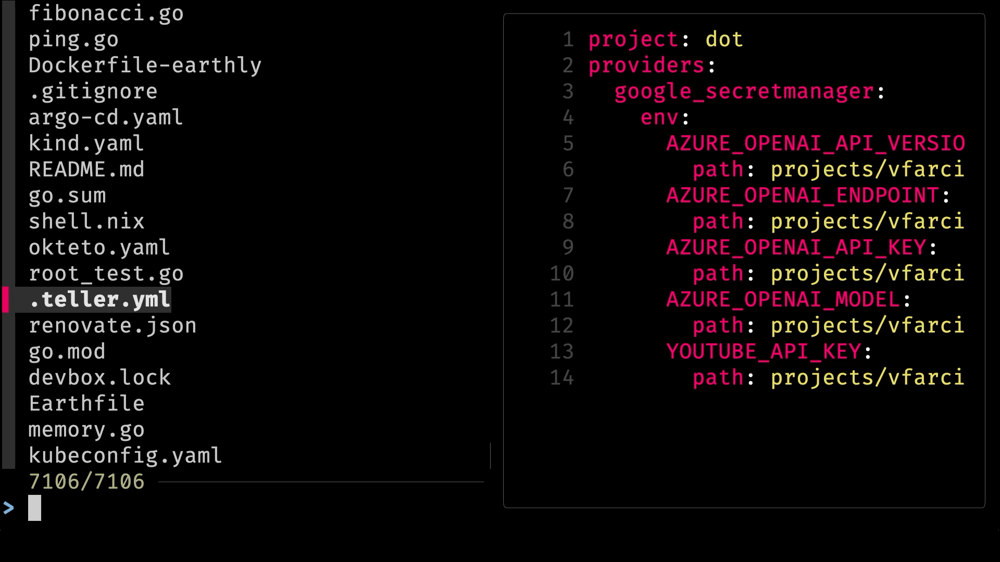

+++
title = '10 CLIs I Can Not Live Without!'
date = 2024-08-05T16:00:00+00:00
draft = false
+++

Today we'll explore **ten CLI tools** without which my life would be meaningless. Well... Maybe not meaningless, but certainly much less productive and harder.

So, without further ado, those are tend CLIs I use on a daily basis, and you should use them as well.

<!--more-->



## Setup

*The setup and the demo is based on `zsh`. Some modifications might be needed for other shells.*

```sh
git clone https://github.com/vfarcic/clis-demo

cd clis-demo
```

> Watch https://youtu.be/WiFLtcBvGMU if you are not familiar with Devbox. Alternatively, you can skip Devbox and install all the tools listed in `devbox.json` yourself.

```sh
devbox shell

zoxide add $PWD

zoxide add $PWD/.devbox/bin

zoxide add $PWD/.devbox/gen

zoxide add $PWD/.devbox/gen/flake

zoxide add $PWD/.devbox/nix

devbox add kind@0.23.0

yq --inplace ".metadata.annotations.something = \"else\"" \
    k8s/app.yaml
```

## eza: ls Replacement

The first tool is **[eza](https://github.com/eza-community/eza)** which is, effectivelly, a replacement for the ls baked in all shells.

With `ls`, we can list files and directories in the current directory.

```sh
ls
```

The output is as follows.

```
Dockerfile-earthly cosign       go.mod kind.yaml       memory.go     root.go      timoni
Earthfile          devbox.json  go.sum kubeconfig.yaml okteto.yaml   root_test.go tmp
README.md          devbox.lock  helm   kustomize       ping.go       schemahero   vendor
argo-cd.yaml       fibonacci.go k8s    main.go         renovate.json shell.nix    video.go
```

Here's the output of `eza`.

```sh
eza
```

The output is as follows.

```
argo-cd.yaml devbox.lock        fibonacci.go helm      kubeconfig.yaml memory.go   README.md     root_test.go timoni video.go
cosign       Dockerfile-earthly go.mod       k8s       kustomize       okteto.yaml renovate.json schemahero   tmp    
devbox.json  Earthfile          go.sum       kind.yaml main.go         ping.go     root.go       shell.nix    vendor 
```

> I could not show colors in this blog post. I suggest you follow along in your terminal to see the output as they should be seen.

Now, that by itself might not be that impressive since the only notable difference is that eza output is colored. Actually, scratch that. Colors alone make it much easier to distinguish between different types of files and directories.

Nevertheless, there's much much more eza offers.

We can, for example, display extended file metadata as a table and ensure that all files, including hidden ones, are listed.

```sh
eza --long --all
```

The output is as follows.

```
drwxr-xr-x    - vfarcic 15 Jun 23:41 .git
.rw-r--r--  449 vfarcic 15 Jun 23:41 argo-cd.yaml
drwxr-xr-x    - vfarcic 15 Jun 23:41 cosign
.rw-r--r--  419 vfarcic 15 Jun 23:41 devbox.json
.rw-r--r--  23k vfarcic 15 Jun 23:41 devbox.lock
.rw-r--r--  120 vfarcic 15 Jun 23:41 Dockerfile-earthly
.rw-r--r-- 2.3k vfarcic 15 Jun 23:41 Earthfile
.rw-r--r--  543 vfarcic 15 Jun 23:41 fibonacci.go
.rw-r--r-- 1.8k vfarcic 15 Jun 23:41 go.mod
.rw-r--r--  25k vfarcic 15 Jun 23:41 go.sum
drwxr-xr-x    - vfarcic 15 Jun 23:41 helm
drwxr-xr-x    - vfarcic 15 Jun 23:41 k8s
.rw-r--r--  411 vfarcic 15 Jun 23:41 kind.yaml
.rw-r--r-- 2.8k vfarcic 15 Jun 23:41 kubeconfig.yaml
drwxr-xr-x    - vfarcic 15 Jun 23:41 kustomize
.rw-r--r-- 1.1k vfarcic 15 Jun 23:41 main.go
.rw-r--r-- 1.5k vfarcic 15 Jun 23:41 memory.go
.rw-r--r--  365 vfarcic 15 Jun 23:41 okteto.yaml
.rw-r--r--  706 vfarcic 15 Jun 23:41 ping.go
.rw-r--r--  772 vfarcic 15 Jun 23:41 README.md
.rw-r--r--  175 vfarcic 15 Jun 23:41 renovate.json
.rw-r--r--  708 vfarcic 15 Jun 23:41 root.go
.rw-r--r-- 1.9k vfarcic 15 Jun 23:41 root_test.go
drwxr-xr-x    - vfarcic 15 Jun 23:41 schemahero
.rw-r--r--  223 vfarcic 15 Jun 23:41 shell.nix
drwxr-xr-x    - vfarcic 15 Jun 23:41 timoni
drwxr-xr-x    - vfarcic 15 Jun 23:41 tmp
drwxr-xr-x    - vfarcic 15 Jun 23:41 vendor
.rw-r--r-- 2.6k vfarcic 15 Jun 23:41 video.go
```

That's still very similar to what we'd get if we'd execute *ls -la* but nicely colored. So, let's spice it up a bit more by executing `eza` as we did before but by hiding permissions (`--no-permissions`), file sizes (`--no-filesize`), user (`--no-user`), and time (`--no-time`), and adding information from Git.

```sh
eza --long --all --no-permissions --no-filesize --no-user \
    --no-time --git
```

The output is as follows.

```
-- .devbox
-I .git
-- argo-cd.yaml
-- cosign
-M devbox.json
-M devbox.lock
-- Dockerfile-earthly
-- Earthfile
-- fibonacci.go
-- go.mod
-- go.sum
-- helm
-M k8s
-- kind.yaml
-- kubeconfig.yaml
-- kustomize
-- main.go
-- memory.go
-- okteto.yaml
-- ping.go
-- README.md
-- renovate.json
-- root.go
-- root_test.go
-- schemahero
-- shell.nix
-- timoni
-- tmp
-- vendor
-- video.go
```

We have a clean colored output with the files and directories and also Git statuses of each of them. We can easily see that `devbox.json` and `devbox.lock` are modified.

Eza has a massive number of parameters we can use to customize the output.

```sh
eza --help
```

I won't go through all of them. That's something you can explore on your own. The only thing I'll add is that my brain is wired to type `ls` instead of `eza` and, if yours is as well, you might want to create an alias in `.zshrc` or `.bashrc` or whichever shell you're using.

```sh
echo "alias ls='eza --long --all --no-permissions --no-filesize \
    --no-user --no-time --git'" | tee -a ~/.zshrc

source ~/.zshrc
```

As a result, every time you execute `ls` as you would normally do, you'll get a nicer and more useful default output.

```sh
ls
```

The output is as follows.

```
-- .devbox
-I .git
-- argo-cd.yaml
-- cosign
-M devbox.json
-M devbox.lock
-- Dockerfile-earthly
-- Earthfile
-- fibonacci.go
-- go.mod
-- go.sum
-- helm
-M k8s
-- kind.yaml
-- kubeconfig.yaml
-- kustomize
-- main.go
-- memory.go
-- okteto.yaml
-- ping.go
-- README.md
-- renovate.json
-- root.go
-- root_test.go
-- schemahero
-- shell.nix
-- timoni
-- tmp
-- vendor
-- video.go
```

From there on, we can add additional arguments depending on what we're trying to do like, for example, show all files and directories in a tree-like structure.

```sh
ls --tree
```

The output is as follows (truncated for brevity).

```
...
-- │  ├── gopkg.in
-- │  │  └── yaml.v3
-- │  │     ├── apic.go
-- │  │     ├── decode.go
-- │  │     ├── emitterc.go
-- │  │     ├── encode.go
-- │  │     ├── LICENSE
-- │  │     ├── NOTICE
-- │  │     ├── parserc.go
-- │  │     ├── readerc.go
-- │  │     ├── README.md
-- │  │     ├── resolve.go
-- │  │     ├── scannerc.go
-- │  │     ├── sorter.go
-- │  │     ├── writerc.go
-- │  │     ├── yaml.go
-- │  │     ├── yamlh.go
-- │  │     └── yamlprivateh.go
-- │  ├── mellium.im
-- │  │  └── sasl
-- │  │     ├── .gitignore
-- │  │     ├── CHANGELOG.md
-- │  │     ├── DCO
-- │  │     ├── doc.go
-- │  │     ├── LICENSE
-- │  │     ├── mechanism.go
-- │  │     ├── negotiator.go
-- │  │     ├── nonce.go
-- │  │     ├── options.go
-- │  │     ├── plain.go
-- │  │     ├── README.md
-- │  │     ├── scram.go
-- │  │     ├── xor.go
-- │  │     ├── xor_amd64.go
-- │  │     ├── xor_amd64.s
-- │  │     ├── xor_arm64.go
-- │  │     ├── xor_arm64.s
-- │  │     ├── xor_generic.go
-- │  │     ├── xor_go.go
-- │  │     ├── xor_ppc64x.go
-- │  │     └── xor_ppc64x.s
-- │  └── modules.txt
-- └── video.go
```

That was too much so let me limit the depth to two levels.

```sh
ls --tree --level 2
```

The output is as follows (truncated for brevity).

```
...
-- ├── timoni
-- │  ├── cue.mod
-- │  ├── go.mod
-- │  ├── go.sum
-- │  ├── templates
-- │  ├── test_tool.cue
-- │  ├── test_values.cue
-- │  ├── timoni.cue
-- │  ├── timoni.ignore
-- │  ├── update-version.sh
-- │  ├── values-db-aws.yaml
-- │  ├── values-db-cnpg-otel.yaml
-- │  ├── values-db-cnpg.yaml
-- │  ├── values-db.yaml
-- │  ├── values-dev.yaml
-- │  ├── values-otel.yaml
-- │  ├── values.cue
-- │  └── values.yaml
-- ├── tmp
-- ├── vendor
-- │  ├── github.com
-- │  ├── golang.org
-- │  ├── google.golang.org
-- │  ├── gopkg.in
-- │  ├── mellium.im
-- │  └── modules.txt
-- └── video.go
```

That makes more sense. I can easily see up to two levels of files and directories in a tree-like structure.

Let's move onto the second CLI.

## bat: cat With Syntaz Highlighting

The next CLI is also a replacement of a familiar command.

If we want to output contents of a file, we execute `cat`.

```sh
cat k8s/app.yaml
```

The output is as follows (truncated for brevity).

```
...
apiVersion: networking.k8s.io/v1
kind: Ingress
metadata:
  annotations:
    description: This is a silly demo
    language: Go
    owner: Viktor Farcic (viktor@farcic.com)
    team: dot
  labels:
    app.kubernetes.io/name: silly-demo
  name: silly-demo
spec:
  ingressClassName: traefik
  rules:
  - host: sillydemo.127.0.0.1.nip.io
    http:
      paths:
      - backend:
          service:
            name: silly-demo
            port:
              number: 8080
        path: /
        pathType: ImplementationSpecific
---
```

**[bat](https://github.com/sharkdp/bat)** provides a similar functionality but with syntax highlightning, Git integration, and quite a few other things.

Here's the output of the same YAML file.

```sh
bat k8s/app.yaml
```

The output is as follows (truncated for brevity).

```
───────┬─────────────────────────────────────────────────────────────────────────────────────────────────────────────────────────────────────────────────────────────────────────
       │ File: k8s/app.yaml
───────┼─────────────────────────────────────────────────────────────────────────────────────────────────────────────────────────────────────────────────────────────────────────
   1   │ apiVersion: apps/v1
   2   │ kind: Deployment
   3 _ │ metadata:
   4   │   labels:
   5   │     app.kubernetes.io/name: silly-demo
   6   │   name: silly-demo
   7 + │   annotations:
   8 + │     something: else
   9   │ spec:
  10   │   replicas: 2
  11   │   selector:
  12   │     matchLabels:
  13   │       app.kubernetes.io/name: silly-demo
  14   │   template:
  15   │     metadata:
  16   │       labels:
  17   │         app.kubernetes.io/name: silly-demo
  18   │     spec:
  19   │       shareProcessNamespace: true
  20   │       containers:
  21 ~ │         - image: ghcr.io/vfarcic/silly-demo:1.4.117
  22 ~ │           livenessProbe:
  23 ~ │             httpGet:
  24 ~ │               path: /
  25 ~ │               port: 8080
  26 ~ │           name: silly-demo
  27 ~ │           ports:
  28 ~ │             - containerPort: 8080
───────┴─────────────────────────────────────────────────────────────────────────────────────────────────────────────────────────────────────────────────────────────────────────
```

We can see that it is now colored, there are line numbers, and, as it's the case of lines 7 and 8, we can see which ones changed when compared to what is in Git (`_`, `+`, and `~`).

From here on, we can customize it by, for example, removing pagination (`--paging never`), and applying a theme (`--theme DarkNeon`) and a style (`--style`).

```sh
bat --paging never --theme DarkNeon --style plain k8s/app.yaml
```

```yaml
apiVersion: apps/v1
kind: Deployment
metadata:
  labels:
    app.kubernetes.io/name: silly-demo
  name: silly-demo
  annotations:
    something: else
spec:
  replicas: 2
  selector:
    matchLabels:
      app.kubernetes.io/name: silly-demo
  template:
    metadata:
      labels:
        app.kubernetes.io/name: silly-demo
    spec:
      shareProcessNamespace: true
      containers:
        - image: ghcr.io/vfarcic/silly-demo:1.4.117
          livenessProbe:
            httpGet:
              path: /
              port: 8080
          name: silly-demo
          ports:
            - containerPort: 8080
```

Just as with `eza`, we can create an alias in `.zshrc` or `.bashrc` or whichever shell you're using.

```sh
echo "alias cat='bat --paging never --theme DarkNeon \
    --style plain'" | tee -a ~/.zshrc

source ~/.zshrc
```

From now on, we can continue exercising our muscle memory by typing `cat` but getting a much nicer output.

```sh
cat main.go
```

The output is as follows (truncated for brevity).

```go
package main

import (
        "fmt"
        "log"
        "log/slog"
        "net/http"
        "os"

        "github.com/gin-gonic/gin"
)

func main() {
        log.SetOutput(os.Stderr)
        if os.Getenv("DEBUG") == "true" {
                slog.SetLogLoggerLevel(slog.LevelDebug)
        }
        if os.Getenv("MEMORY_LEAK_MAX_MEMORY") != "" {
                go func() { memoryLeak(0, 0) }()
        }
        ...
}
...
```

We got a nicely formatted Go code. Brilliant!

Let's move to the third CLI which, unlike the previous two, is not a replacement of an existing command but something completely different.

## fzf: Command-Line Fuzzy Finder

**[fzf](https://github.com/junegunn/fzf)** is a general-purpose command-line fuzzy finder. To explain it in simpler terms, it allows us to list and search files.

Here it goes.



```sh
fzf
```

> Use ↑ and ↓ to select a file. Type `yaml` to narrow down the search. Select `kind.yaml` and press the `enter` key to output it.

The output is the list of all files in the current directory and all subdirectories.

From here on, we can use arrows up and down to navigate through the list. We can also narrow down the output by typing a part of the file name.

So, if we type `yaml`, we'll see only files that contain that string.

Once we find the file we're interested in, we can press `enter` to output it.

We can also choose to select multiple files through the `--multi` argument.

```sh
fzf --multi
```

> Use tab to select multiple files. Press `enter` to output them.

From here on, we can use tab to select any number of files and output them all by pressing `enter`.

Now, outputting one or more file names might not be that interesting. The power of fzf lies in combining it with other commands.

For example, we can use it with `bat` to preview the contents of the selected file.



```sh
fzf --preview 'bat --style numbers --color always {}'
```

> Use ↑ and ↓ to select a file and see the preview. Press `enter` to output the name of the file.

Now we can navigate through the list of files and instantly preview any of them. Since that preview is done by `bat`, it is nicely colored and formatted.

Since it would be inpractical to try to remember such a long command, we should probably create an alias in `.zshrc` or `.bashrc` or whichever shell you're using.

```sh
echo "alias fzfp='fzf --preview \"bat --style numbers \
    --color always {}\"'" | tee -a ~/.zshrc

source ~/.zshrc
```

Now we can preview files through the alias `fzfp`.

```sh
fzfp
```

> Press `enter`.

## zoxide: Smarter cd Command

The next in line is **[zoxide](https://github.com/ajeetdsouza/zoxide)** which is a better version of `cd` command. Actually, better would be an understatement. It is much much better than `cd`.

To use it, we'll add `zoxide init` command to `.zshrc` or `.bashrc` or whichever shell you're using.

It will, effectively, replace `cd` with `zoxide`.

```sh
echo 'eval "$(zoxide init --cmd cd zsh)"' | tee -a ~/.zshrc

source ~/.zshrc
```

Let's take a look at the files and, more importantly, the directories we have.

```sh
ls
```

The output is as follows.

```
-- .devbox
-I .git
-- argo-cd.yaml
-- cosign
-M devbox.json
-M devbox.lock
-- Dockerfile-earthly
-- Earthfile
-- fibonacci.go
-- go.mod
-- go.sum
-- helm
-M k8s
-- kind.yaml
-- kubeconfig.yaml
-- kustomize
-- main.go
-- memory.go
-- okteto.yaml
-- ping.go
-- README.md
-- renovate.json
-- root.go
-- root_test.go
-- schemahero
-- shell.nix
-- timoni
-- tmp
-- vendor
-- video.go
```

Now, let's say that we'd like to go to the flake directory which is inside the gen directory which is inside `.devbox`. Typically, we would need to execute something like *cd .devbox/gen/flake*.

With zoxide, which is now replacing cd, we can do it by simply telling it to `cd` to `flake`.

```sh
cd flake
```

Based on our navigation history, it figured out that we want to go to `.devbox/gen/flake` and executed the equivalent of *cd .devbox/gen/flake*. We are now three directories deep without having to type a single slash.

Now, let's say that we'd like to go back to the *clis-demo* directory which is three lavels below the current directory. Instead of typing *cd ../../../*, we can simply tell zoxide to go to `lis`, press the `space` key, and then `tab` to autocomplete.

```sh
cd lis 
```

> Make sure that there is space at the end. Press `tab` to autocomplete.

It figured out that *lis* is the substring of `clis-demo` and took us there.

In cases there are multiple directories in the history that contain the same substring it would give us the list of all those that match the substring and let us choose where to go.

zoxide alone saves a lot of time. I stopped thinking where is what since all I have to do is type a few letters of the directory I want to go and zoxide takes me there no matter where that directory is, as long as I visited it at least once before.

## The Fuck: Error Corrections

To demonstrate the next command, we will first create a KinD cluster.

```sh
kid create cluster
```

The output is as follows.

```
zsh: command not found: kid
```

Fuck! That's the word I would utter every time I make a mistake like that. I typed `kid` instead of *kind*.

Here's the thing. Instead of yelling *fuck!* before typing the command again, we can just type [fuck](https://github.com/nvbn/thefuck).

```sh
fuck
```

> Press ↑ and ↓ to change suggestions. Press `enter` after seleting the `kind` command.

The output is as follows.

```
✗  fuck
kind create cluster [enter/↑/↓/ctrl+c]
```

Fuck gives us what would normally come after yelling "Fuck!" It gives us a list of suggestions which command we should have executed instead.

More often than not, the first suggested command is the correct one, but, if it's not, we can see other suggestions by pressing arrow keys up and down. Once we find the command we should have executed, all the have to do is press the enter key.

## jq: sed for Json

Commands we execute often output Json, YAML, TOML, or some other format. If those would be files, we would format them with *bat* but, unfortunately, *bat* tends to have difficulties working with output since it uses file extensions to figure out what to display. More over, we often need not only to format but also filter outputs.

Here's an example.

```sh
kubectl get namespace kube-system --output json
```

The output is as follows.

```
{
    "apiVersion": "v1",
    "kind": "Namespace",
    "metadata": {
        "creationTimestamp": "2024-06-09T01:21:20Z",
        "labels": {
            "kubernetes.io/metadata.name": "kube-system"
        },
        "name": "kube-system",
        "resourceVersion": "5",
        "uid": "6f178028-fda4-41d9-a2c9-0ad5b8fe6803"
    },
    "spec": {
        "finalizers": [
            "kubernetes"
        ]
    },
    "status": {
        "phase": "Active"
    }
}
```

While that output is correct, there is no syntax highlighting. On top of that, many commands do not provide a way to filter outputs while those that do, like *kubectl*, often use some silly syntax that is hard to remember.

That's where **[jq](https://jqlang.github.io/jq/)** comes into play, at least when Json is concerned.

We can, for example, take the previous command, and pipe the output to `jq` to format it.

```sh
kubectl get namespace kube-system --output json | jq .
```

The output is as follows.

```json
{
  "apiVersion": "v1",
  "kind": "Namespace",
  "metadata": {
    "creationTimestamp": "2024-06-09T01:21:20Z",
    "labels": {
      "kubernetes.io/metadata.name": "kube-system"
    },
    "name": "kube-system",
    "resourceVersion": "5",
    "uid": "6f178028-fda4-41d9-a2c9-0ad5b8fe6803"
  },
  "spec": {
    "finalizers": [
      "kubernetes"
    ]
  },
  "status": {
    "phase": "Active"
  }
}
```

That is much easier to read.

We can also filter the output to, let's say, retrieve the `.status.phase` field.

```sh
kubectl get namespace kube-system --output json \
    | jq ".status.phase"
```

The output is as follows.

```json
"Active"
```

## yq: Like jq But For YAML

The next in line is **[yq](https://github.com/mikefarah/yq)** which is just like **jq** but for YAML. Even the syntax is almost the same so we can, for example, output namespaces to `yaml` and pipe it to `yq` to format it.

```sh
kubectl get namespace kube-system --output yaml \
    | yq .
```

The output is as follows.

```yaml
apiVersion: v1
kind: Namespace
metadata:
  creationTimestamp: "2024-06-09T01:21:20Z"
  labels:
    kubernetes.io/metadata.name: kube-system
  name: kube-system
  resourceVersion: "5"
  uid: 6f178028-fda4-41d9-a2c9-0ad5b8fe6803
spec:
  finalizers:
    - kubernetes
status:
  phase: Active
```

Similarly, we can also use it to filter the output so that, for example, only the `.status.phase` field is returned.

```sh
kubectl get namespace kube-system --output yaml \
    | yq ".status.phase"
```

The output is as follows.

```
Active
```

One notable difference is that `yq` is not limited only to YAML. We can, for example, use `json` as input and `yaml` as output.

```sh
kubectl get namespace kube-system --output json \
    | yq --input-format json
```

The output is as follows.

```yaml
apiVersion: v1
kind: Namespace
metadata:
  creationTimestamp: "2024-06-09T01:21:20Z"
  labels:
    kubernetes.io/metadata.name: kube-system
  name: kube-system
  resourceVersion: "5"
  uid: 6f178028-fda4-41d9-a2c9-0ad5b8fe6803
spec:
  finalizers:
    - kubernetes
status:
  phase: Active
```

Similarly, we can take YAML as input and output formatted JSON.

```sh
kubectl get namespace kube-system --output yaml \
    | yq --output-format json .
```

The output is as follows.

```json
{
  "apiVersion": "v1",
  "kind": "Namespace",
  "metadata": {
    "creationTimestamp": "2024-06-09T01:21:20Z",
    "labels": {
      "kubernetes.io/metadata.name": "kube-system"
    },
    "name": "kube-system",
    "resourceVersion": "5",
    "uid": "6f178028-fda4-41d9-a2c9-0ad5b8fe6803"
  },
  "spec": {
    "finalizers": [
      "kubernetes"
    ]
  },
  "status": {
    "phase": "Active"
  }
}
```

Effectively, *yq* is like *jq* but for YAML, but it can also replace *jq* since it can work with JSON as well. That means that we do not necessarily need *jq*. Nevertheless, I tend to use both. *jq* for JSON and *yq* for YAML. I'm aware that there is no need to *jq* but I'm so used to it that I keep using it.

## Teller: Universal Secrets Manager

Then there is **[Teller](https://github.com/tellerops/teller)**. It is a universal secrets manager. I use it with almost every project I work in. If I need credentials for Kubernetes, or Azure, or AWS, or Google, or OpenAI, or GitHub tokens, or anything else, I add .teller.yml file to the project and in that file I point to whichever secrets store I use.

Here's an example.

```sh
cat .teller.yml
```

The output is as follows.

```yaml
project: dot
providers:
  google_secretmanager:
    env:
      AZURE_OPENAI_API_VERSION:
        path: projects/vfarcic/secrets/azure-openai-api-version/versions/1
      AZURE_OPENAI_ENDPOINT:
        path: projects/vfarcic/secrets/azure-openai-endpoint/versions/2
      AZURE_OPENAI_API_KEY:
        path: projects/vfarcic/secrets/azure-openai-key/versions/2
      AZURE_OPENAI_MODEL:
        path: projects/vfarcic/secrets/azure-openai-model/versions/2
      YOUTUBE_API_KEY:
        path: projects/vfarcic/secrets/youtube-api-key/versions/1
```

Over there I specified that the `azure-openai-api-version` secret stored in my Google Secret Manager should be used as the `AZURE_OPENAI_API_VERSION` environment variable. The same goes for `azure-openai-endpoint`, `azure-openai-key`, `azure-openai-model`, and `youtube-api-key`.

Actually, Teller is so convenient that I do not use it only for secrets but for any kind of environment variables, no matter whether they contain confidential values or not.

That file can be safely stored in Git and live side-by-side with the rest of the project. I or anyone else working with me on that project can instantly get all those credentials, as long as they have the access to that secrets store.

From there on, there are many different formats we can use to output those secrets.

For example, we can output them as environment variables which, in this case, I'll pipe to `teller redact` so that you don't see them. I like you, especially if you subscribed, but I do not yet trust you.

```sh
teller env | teller redact
```

> If you're following along by executing commands, you'll notice that `teller` will be failing because it's configured to use my Google Cloud Secret Manager. You'll have to make changes to `.teller.yml` to make it work with whichever Secret Storage you might be using.

The output is as follows.

```
YOUTUBE_API_KEY=**REDACTED**
AZURE_OPENAI_MODEL=**REDACTED**
AZURE_OPENAI_ENDPOINT=**REDACTED**
AZURE_OPENAI_API_VERSION=**REDACTED**
AZURE_OPENAI_API_KEY=**REDACTED**
```

We can redirect the output to a configuration file like the one I use for Fabric.

```sh
teller env >.fabric
```

We can use it to scan the source code for secrets.

```sh
teller scan
```

The output is as follows.

```
[high] .fabric (1,16): found match for google_secretmanager/YOUTUBE_API_KEY (AI*****)
[high] .fabric (2,19): found match for google_secretmanager/AZURE_OPENAI_MODEL (gp*****)
[high] .fabric (3,22): found match for google_secretmanager/AZURE_OPENAI_ENDPOINT (ht*****)
[high] .fabric (4,25): found match for google_secretmanager/AZURE_OPENAI_API_VERSION (20*****)
[high] .fabric (5,21): found match for google_secretmanager/AZURE_OPENAI_API_KEY (fe*****)
```

It's clear that `.fabric` contains secrets and that I should not push it to git so I should either remove it or add it to *.gitignore*.

Teller is simple, yet it has quite a few different features that are very handy when working with confidential information either locally or in CI/CD pipelines.

If you're interested in it, you might want to check the [Secrets Made My Life Miserable - Consume Secrets Easily With Teller](https://youtu.be/Vcjz-YM3uLQ) video for more details.

## GitHub CLI (gh): GitHub To Your Terminal

The next in line is **[GitHub CLI](https://cli.github.com/)** or *gh*.

Even if you are using GitLab or if you are very unfortunate to be stuck with BitBucket, you still need to interact with GitHub, at least when working with open source projects. GitHub is part of everyone's life, whether we like it or not.

GitHub CLI is mostly focused on features and capabilities missing in Git.

For example, if we would like to fork a repository, instead of opening GitHub in a web browser and start clicking buttons, we can simply execute `gh repo fork` command,...

```sh
gh repo fork vfarcic/dotfiles --clone --remote
```

...and enter the clone of that repo.


```sh
cd dotfiles
```

If we would like to set the fork as the default remote repository, we can do that with `gh repo set-default`.

```sh
gh repo set-default
```

If we are nostalgic and would like to see the repository in a web browser, we can do that with `gh repo view`.

```sh
gh repo view --web
```

GitHub CLI is full of features. We can use it to create and manage pull requests, issues, and many other things. It's a must-have for anyone working with GitHub which, effectively, means everyone.

Please watch [GitHub CLI (gh) - How to manage repositories more efficiently](https://youtu.be/BII6ZY2Rnlc) if you'd like more details about it.

Let's go back before we move onto the next CLI.

```sh
cd ..
```

## Devbox: Isolated Shells

The last CLI I'd like to show you is **Devbox**. It is a tool we can use to create isolated shells or isolated environments. It is a wrapper around Nix Shell that makes it more user-friendly and easier to use. It is, potentially, the most important tool in my toolbox.

We are in a Devbox environment right now. We can see that by taking a look at `teller` CLI we explored a few minutes ago.

```sh
which teller
```

The output is as follows.

```
/Users/vfarcic/code/clis-demo/.devbox/nix/profile/default/bin/teller
```

We can see that it is not a tool installed permanently on my machine but a tool that was installed specifically for this demo project. As a matter of fact, I do not have Teller on my machine at all. I have it only in this isolated environment.

I can prove that by going out of the Devbox Shell,...

```sh
exit
```

...and trying to locate `teller` again.

```sh
which teller
```

The output is as follows.

```
teller not found
```

It's nowhere to be found. It does not exist on my machine permanently but only in environments I create with Devbox.

Let's start a new Devbox Shell,...

```sh
devbox shell
```

...and try to locate `teller` again.

```sh
which teller
```

The output is as follows.

```
/Users/vfarcic/code/clis-demo/.devbox/nix/profile/default/bin/teller
```

Now it's back.

Devbox allows me to specify all the tools I need for each individual project I work on and create isolated environments for each of them. That way, I can have different versions of the same tool in different projects without any conflicts. Also, anyone working with me on that project will have those tools as well.

All we have to do is specify the tools we need in `devbox.json` file.

```sh
cat devbox.json
```

The output is as follows.

```json
{
  "$schema": "https://raw.githubusercontent.com/jetify-com/devbox/0.11.1/.schema/devbox.schema.json",
  "packages": [
    "eza@0.18.17",
    "bat@0.24.0",
    "fzf@0.53.0",
    "zoxide@0.9.4",
    "thefuck@3.32",
    "jq@1.7.1",
    "yq-go@4.44.1",
    "teller@1.5.6",
    "gh@2.50.0",
    "gum@0.14.1",
    "kind@0.23.0"
  ],
  "shell": {
    "init_hook": [],
    "scripts":   {}
  }
}
```

If you'd like to explore Devbox in more depth, please watch the [Nix for Everyone: Unleash Devbox for Simplified Development](https://youtu.be/WiFLtcBvGMU) video.

Those are the ten must-have CLIs I use on daily basis. Which CLIs are your favorites? Please let me know in the comments. I'd love to know what you're using and what I might be missing.

Thank you for watching.
See you in the next one.
Cheers.

## Destroy

```sh
git stash

kind delete cluster

exit
```

